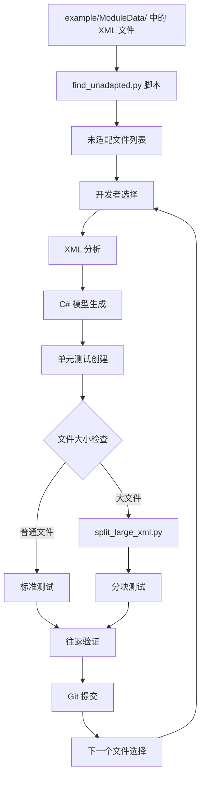

# 设计文档

## 概述

XML 适配系统被设计为一个系统性的、工作流驱动的方法，用于将 Bannerlord 的原生 XML 配置文件转换为具有全面验证的强类型 C# 模型。该系统遵循现有代码库中的既定模式，同时提供自动化工具和结构化流程以确保一致性、可靠性和可维护性。

核心架构围绕三个主要组件：自动发现、带序列化验证的模型生成，以及大数据集的性能优化。每个组件都设计为独立工作，同时为统一的适配工作流做出贡献。

## 架构

### 高级系统流程



### 组件架构

系统围绕四个主要架构层构建：

1. **发现层**：自动识别适配候选项
2. **模型层**：带 XML 序列化特性的 C# 类生成
3. **验证层**：全面的往返测试框架
4. **优化层**：大型 XML 文件的性能处理

## 组件和接口

### 发现组件

**目的**：自动识别需要适配的 XML 文件

**关键类**：
- `FileDiscoveryService`：协调发现过程
- `NamingConventionMapper`：处理 XML 文件名到 C# 类名的转换
- `ModelExistenceChecker`：验证对应的模型是否已存在

**接口**：
```csharp
public interface IFileDiscoveryService
{
    Task<List<UnadaptedFile>> FindUnadaptedFilesAsync();
    string ConvertToModelName(string xmlFileName);
    bool ModelExists(string modelName, string[] searchDirectories);
}
```

**实现细节**：
- 扫描 `example/ModuleData/` 目录中的 XML 文件
- 将 snake_case 文件名转换为 PascalCase 类名
- 搜索多个模型子目录（Data、Engine 等）
- 处理复数形式变化（例如，mpitem.xml → MpItems.cs）

### 模型生成组件

**目的**：从 XML 架构创建强类型的 C# 模型

**关键模式**：
- 根模型类遵循 XML 文件名约定
- 复杂层次结构的嵌套容器类
- 一致使用 System.Xml.Serialization 特性
- 可选属性的 ShouldSerialize 方法

**模型结构模板**：
```csharp
[XmlRoot("root_element")]
public class ModelName
{
    [XmlAttribute("attribute_name")]
    public string? AttributeProperty { get; set; }

    [XmlElement("child_element")]
    public ChildContainer? ChildElements { get; set; }

    public bool ShouldSerializeAttributeProperty() => !string.IsNullOrEmpty(AttributeProperty);
    public bool ShouldSerializeChildElements() => ChildElements != null;
}
```

**命名冲突解决**：
- 系统冲突通过更具体的名称解决（Action → ActionType）
- 用于消歧的一致后缀模式
- 按 XML 文件类别组织命名空间

### 验证组件

**目的**：通过全面的往返测试确保数据完整性

**核心测试模式**：
1. **反序列化**：XML → C# 对象
2. **验证**：验证对象属性匹配预期值
3. **序列化**：C# 对象 → XML
4. **比较**：使用 XNode.DeepEquals() 进行逻辑等价性比较

**测试类结构**：
```csharp
public class ModelNameXmlTests
{
    [Fact]
    public void ModelName_LoadAndSave_ShouldBeLogicallyIdentical()
    {
        // 反序列化阶段
        var model = DeserializeFromFile(xmlPath);
        
        // 验证阶段
        ValidateModelProperties(model);
        
        // 序列化阶段
        var serializedXml = SerializeToString(model);
        
        // 比较阶段
        AssertLogicalEquivalence(originalXml, serializedXml);
    }
}
```

**XML 规范化策略**：
- 移除 xmlns 命名空间以进行比较
- 规范化空元素（`<element></element>` vs `<element />`）
- 处理空白和格式差异
- 保留逻辑内容同时忽略表示差异

### 优化组件

**目的**：通过分块高效处理大型 XML 文件

**分块策略**：
- 大于 1MB 或超过 10,000 行的文件触发自动分割
- 可配置的块大小（默认：500 个元素）
- 跨块保留根元素属性
- 维护 XML 声明和编码

**分割文件测试模式**：
```csharp
[Theory]
[MemberData(nameof(GetChunkFiles))]
public void ModelName_ChunkLoadAndSave_ShouldBeLogicallyIdentical(string chunkFilePath)
{
    // 对每个块进行相同的往返验证
}

public static IEnumerable<object[]> GetChunkFiles()
{
    // 动态发现 TestSubsets 目录中的块文件
}
```

## 数据模型

### 核心数据结构

**UnadaptedFile**：
```csharp
public class UnadaptedFile
{
    public string FileName { get; set; }
    public string FullPath { get; set; }
    public long FileSize { get; set; }
    public string ExpectedModelName { get; set; }
    public AdaptationComplexity Complexity { get; set; }
}
```

**AdaptationResult**：
```csharp
public class AdaptationResult
{
    public string XmlFileName { get; set; }
    public string ModelClassName { get; set; }
    public string ModelFilePath { get; set; }
    public string TestFilePath { get; set; }
    public List<string> GeneratedFiles { get; set; }
    public bool RequiredSplitting { get; set; }
    public TimeSpan ProcessingTime { get; set; }
}
```

### XML 序列化模式

**属性映射**：
- XML 属性 → 带 [XmlAttribute] 的 C# 属性
- 可选属性 → 带 ShouldSerialize 方法的可空属性
- 类型转换通过带验证的字符串属性处理

**元素映射**：
- 简单元素 → 带 [XmlElement] 的直接属性
- 集合 → 带容器类的数组属性
- 嵌套结构 → 具有适当层次结构的独立模型类

**命名空间处理**：
- 移除默认命名空间以进行比较
- 不带 xmlns 声明的一致序列化
- 保留原始 XML 结构和语义

## 错误处理

### 发现阶段错误

**文件系统问题**：
- 缺失目录 → 带清晰错误消息的优雅降级
- 权限问题 → 带建议解决方案的详细日志记录
- 损坏的 XML 文件 → 带警告跳过，继续处理

**命名冲突**：
- 重复模型名称 → 自动后缀生成
- 保留关键字 → 预定义映射表
- 大小写敏感问题 → 一致的 PascalCase 转换

### 模型生成错误

**XML 解析问题**：
- 格式错误的 XML → 带行号的详细错误报告
- 不支持的结构 → 手动干预指导
- 编码问题 → 自动检测和转换

**序列化失败**：
- 缺失属性 → 序列化前的全面验证
- 类型转换错误 → 带验证的字符串回退
- 循环引用 → 检测和预防机制

### 测试阶段错误

**往返失败**：
- 数据丢失检测 → 详细差异报告
- 序列化格式差异 → 规范化策略
- 性能问题 → 自动分块触发

**文件管理**：
- 测试数据组织 → 自动清理和组织
- 磁盘空间管理 → 监控和清理程序
- 并发访问 → 文件锁定和重试机制

## 测试策略

### 单元测试方法

**测试类别**：
1. **发现测试**：验证文件识别和命名转换
2. **模型测试**：验证单个模型序列化/反序列化
3. **集成测试**：端到端工作流验证
4. **性能测试**：大文件处理和分块

**测试数据管理**：
- 原始 XML 文件复制到 TestData 目录
- 大文件分割到带组织子目录的 TestSubsets
- 临时测试文件的自动清理
- 所有测试工件的版本控制包含

### 验证方法论

**往返验证**：
- 逻辑等价性优于文本一致性
- XNode.DeepEquals() 作为主要比较方法
- 边缘情况的自定义规范化
- 全面的属性验证

**性能验证**：
- 大文件处理期间的内存使用监控
- 不同文件大小的处理时间基准
- 分块有效性测量
- 资源清理验证

### 持续集成

**自动化测试**：
- 提交前所有测试必须通过
- 性能回归检测
- 内存泄漏监控
- 跨平台兼容性验证

**质量门槛**：
- 100% 往返成功率要求
- 零数据丢失容忍度
- 性能基准维护
- 代码覆盖率阈值