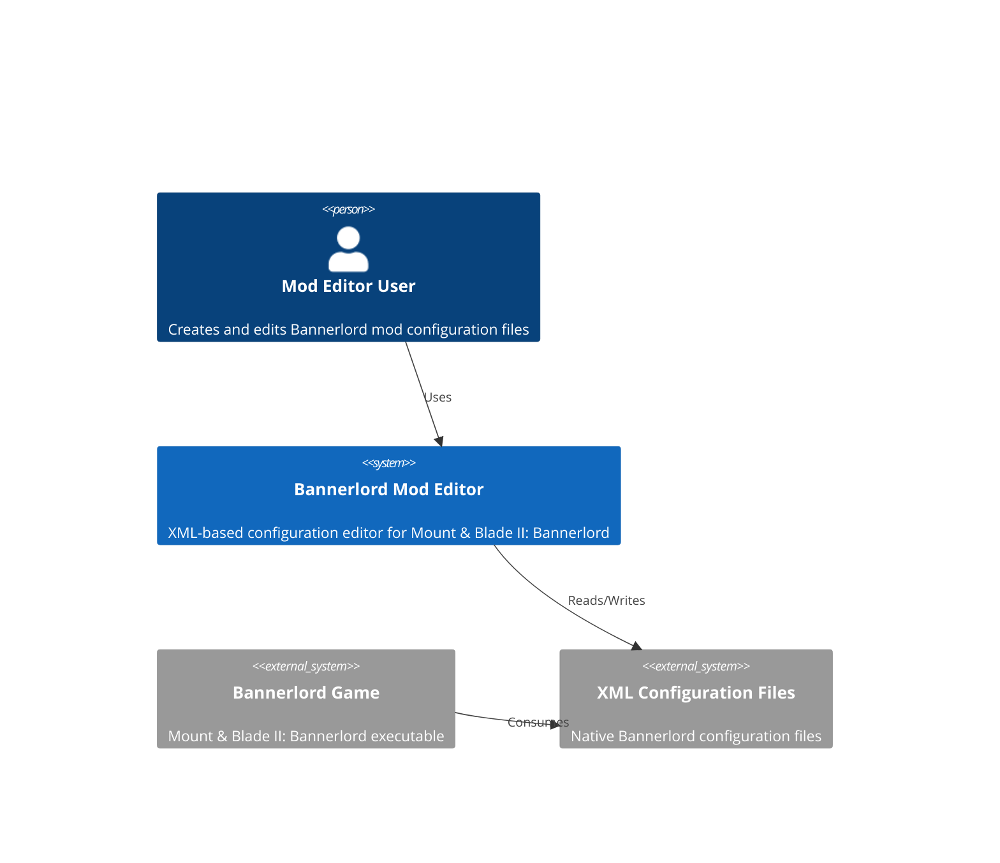
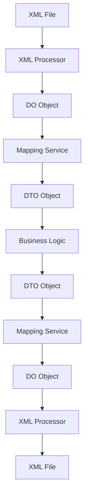

# System Architecture

## Executive Summary
This architecture document describes a DO/DTO layered architecture for the Bannerlord Mod Editor system, specifically designed to address XML serialization challenges including boolean value case sensitivity, type conversion consistency, and namespace preservation. The architecture separates concerns between Data Objects (DO) that handle raw XML string data representation and Data Transfer Objects (DTO) that provide strongly-typed business logic interfaces.

## Architecture Overview

### System Context


### Container Diagram
```mermaid
C4Container
    Container(ui, "UI Application", "Avalonia", "User interface for editing mod files")
    Container(editorCore, "Editor Core", ".NET 9", "Business logic and orchestration layer")
    Container_Do(doLayer, "DO Layer", ".NET 9", "Raw XML data representation preserving exact string values")
    Container_Do(dtoLayer, "DTO Layer", ".NET 9", "Strongly-typed business objects with validation")
    Container_Services(mapping, "Mapping Services", ".NET 9", "Bidirectional conversion between DO and DTO")
    Container(xmlProcessor, "XML Processor", ".NET 9", "Handles serialization/deserialization with namespace preservation")
    Container(fileSystem, "File System", "OS", "Physical storage of XML files")
    
    Rel(ui, editorCore, "Uses")
    Rel(editorCore, doLayer, "Manipulates")
    Rel(editorCore, dtoLayer, "Consumes")
    Rel(dtoLayer, mapping, "Converted via")
    Rel(doLayer, mapping, "Converted via")
    Rel(xmlProcessor, doLayer, "Creates/Consumes")
    Rel(xmlProcessor, fileSystem, "Reads/Writes")
```

## Technology Stack

### Frontend
- **Framework**: Avalonia UI 11.3
- **State Management**: CommunityToolkit.Mvvm 8.2
- **UI Library**: Fluent theme
- **Build Tool**: .NET SDK

### Backend  
- **Runtime**: .NET 9.0
- **Framework**: Core .NET libraries
- **XML Processing**: System.Xml.Serialization with custom extensions
- **Testing**: xUnit 2.5

### Infrastructure
- **Build System**: dotnet CLI
- **Package Management**: NuGet
- **CI/CD**: GitHub Actions
- **Testing**: xUnit with custom XML validation helpers

## Component Design

### DO (Data Object) Layer
**Purpose**: Represent raw XML data exactly as it exists in files, preserving exact string representations
**Technology**: .NET 9 with custom XML serialization attributes
**Interfaces**: 
- Input: Raw XML strings from files
- Output: String-preserving data objects
**Dependencies**: System.Xml.Serialization

### DTO (Data Transfer Object) Layer
**Purpose**: Provide strongly-typed, business-logic-friendly representations with validation
**Technology**: .NET 9 with data annotations
**Interfaces**: 
- Input: DO objects via mapping services
- Output: Validated business objects for UI/consumption
**Dependencies**: DO Layer, Mapping Services

### Mapping Services
**Purpose**: Provide bidirectional conversion between DO and DTO representations
**Technology**: Custom mapping logic with reflection
**Interfaces**: 
- Input: DO/DTO objects
- Output: Converted objects preserving data integrity
**Dependencies**: DO Layer, DTO Layer

### XML Processor
**Purpose**: Handle serialization/deserialization with namespace and formatting preservation
**Technology**: System.Xml with custom extensions
**Interfaces**: 
- Input: File paths, DO/DTO objects
- Output: XML strings, deserialized objects
**Dependencies**: DO Layer, System.Xml

## Data Architecture

### Data Flow


### Data Models

#### DO Layer Example (Raw XML Representation)
```csharp
[XmlRoot("Item")]
public class ItemDo
{
    [XmlAttribute("id")]
    public string Id { get; set; } = string.Empty;
    
    [XmlAttribute("multiplayer_item")]
    public string MultiplayerItem { get; set; } = string.Empty; // Preserves exact string like "true", "True", "1"
    
    [XmlAttribute("weight")]
    public string Weight { get; set; } = string.Empty; // Preserves exact string like "1.1", "1.100"
    
    [XmlElement("ItemComponent")]
    public ItemComponentDo? ItemComponent { get; set; }
}

public class ItemComponentDo
{
    [XmlElement("Armor")]
    public ArmorDo? Armor { get; set; }
}
```

#### DTO Layer Example (Strongly-Typed Business Object)
```csharp
public class ItemDto
{
    [Required]
    public string Id { get; set; } = string.Empty;
    
    public BooleanProperty MultiplayerItem { get; set; } = new BooleanProperty();
    
    public decimal Weight { get; set; }
    
    public ItemComponentDto? ItemComponent { get; set; }
}

public class ItemComponentDto
{
    public ArmorDto? Armor { get; set; }
}
```

## Security Architecture

### Authentication & Authorization
- Authentication method: Local file-based access
- Authorization model: File system permissions
- Token lifecycle: Session-based with application lifetime

### Security Measures
- [x] Input validation and sanitization
- [x] XML injection prevention
- [x] File path validation
- [ ] Rate limiting (not applicable for local desktop app)
- [ ] Secrets management (minimal for local app)

## Scalability Strategy

### Horizontal Scaling
- Load balancing approach: Not applicable (desktop application)
- Session management: In-memory application state
- Database replication: Not applicable (file-based storage)
- Caching strategy: In-memory object caching

### Performance Optimization
- File I/O optimization with async operations
- Object pooling for frequently used objects
- Lazy loading of large XML structures
- Memory-efficient XML processing

## Deployment Architecture

### Environments
- Development: Local developer machines
- Testing: CI/CD pipeline with unit tests
- Production: End-user desktop installations

### Deployment Strategy
- Application packaging with Velopack
- Single-file deployment
- Automatic updates via Velopack infrastructure
- Rollback procedures via Velopack

## Monitoring & Observability

### Metrics
- Application startup time
- XML processing performance
- Memory usage patterns
- Error rates and types

### Logging
- File-based logging with timestamped entries
- Error logging with stack traces
- Performance logging for XML operations
- Structured logging format

### Alerting
- Exception handling with user notifications
- Performance degradation alerts
- File operation failure notifications
- Validation error reporting

## Architectural Decisions (ADRs)

### ADR-001: DO/DTO Layered Architecture
**Status**: Accepted
**Context**: The Bannerlord Mod Editor needs to preserve exact XML string representations while providing strongly-typed interfaces for business logic. Existing XML serializers don't handle case-sensitive boolean values correctly, and there's a need to distinguish between missing attributes and empty values.
**Decision**: Implement a DO/DTO layered architecture where DOs preserve exact string representations and DTOs provide strongly-typed interfaces.
**Consequences**: 
- Positive: Exact XML preservation, proper boolean handling, clear separation of concerns
- Negative: Additional complexity in mapping layer, potential performance overhead
**Alternatives Considered**: 
- Using only DOs with string properties throughout - would complicate business logic
- Using only DTOs with custom serializers - wouldn't preserve exact XML representation

### ADR-002: Boolean Value Handling
**Status**: Accepted
**Context**: Bannerlord XML files contain boolean values in various formats (true, True, TRUE, 1, false, False, FALSE, 0) that must be preserved exactly when saving but normalized for comparison.
**Decision**: Create BooleanProperty wrapper class that preserves original string representation while providing normalized boolean value access.
**Consequences**: 
- Positive: Exact preservation of original values, case-insensitive parsing, consistent comparison logic
- Negative: Additional wrapper object overhead
**Alternatives Considered**: 
- Custom XmlSerializer with boolean conversion - complex and error-prone
- String properties with helper methods - would lose type safety

### ADR-003: Namespace Preservation Strategy
**Status**: Accepted
**Context**: Bannerlord XML files may contain namespace declarations that must be preserved during serialization to prevent game crashes.
**Decision**: Implement enhanced XML loader that extracts namespace declarations from original XML and applies them during serialization.
**Consequences**: 
- Positive: Namespace preservation without modification, backward compatibility
- Negative: Slight complexity in XML processing pipeline
**Alternatives Considered**: 
- Hard-coding namespace declarations - inflexible and error-prone
- Modifying DO models to include namespace attributes - breaks clean separation of concerns