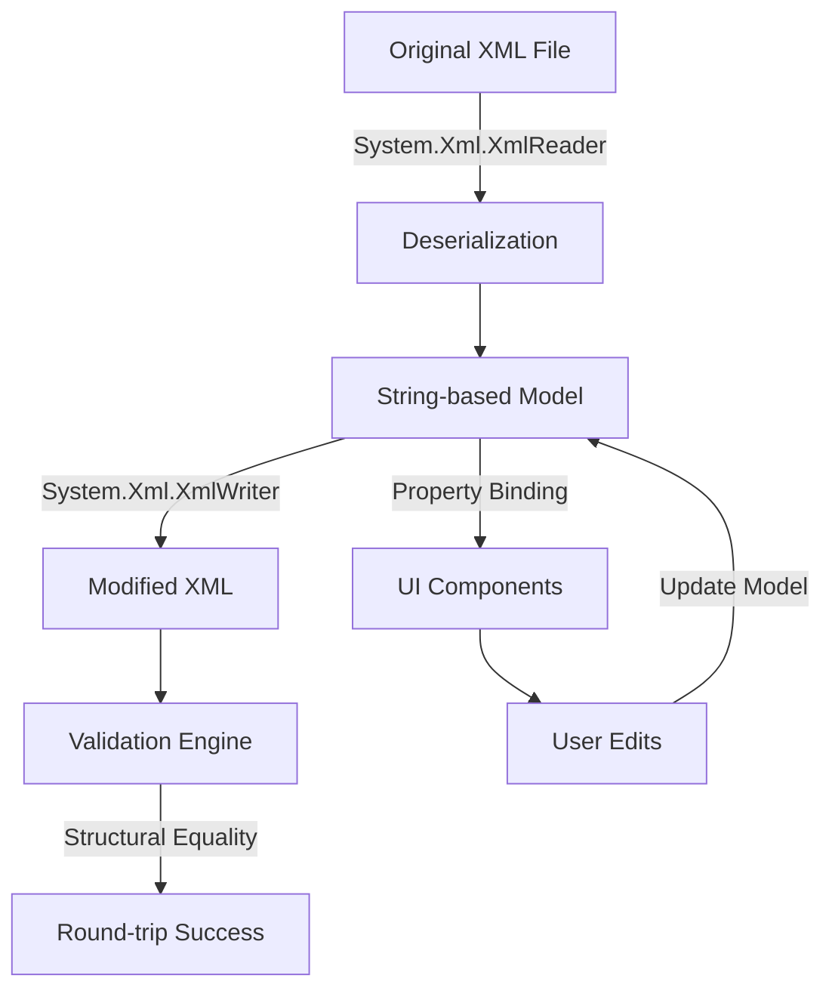

# System Architecture - XML Model Adaptation Fixes

## Executive Summary

The Bannerlord Mod Editor XML model adaptation system requires a comprehensive architectural overhaul to resolve 46 test failures while preserving exact XML format compatibility with the original game files. The architecture implements a string-based property system with precise serialization control using ShouldSerialize patterns to ensure faithful round-trip XML processing.

## Architecture Overview

### System Context
The XML model adaptation system interfaces with Bannerlord game files, supporting full editing capabilities while ensuring compatibility with the original game's XML parser. The system must handle the specific nuances of Bannerlord's XML format, including boolean string representations ("true"/"false" vs "True"/"False"), numeric precision preservation, and selective attribute omission based on field presence.

### Container Diagram

```mermaid
C4Container
    Title XML Model Adaptation Architecture
    
    Container(bannerlord, "Bannerlord Game XML", "XML Files", "Original game XML configuration files")
    Container(editor, "Mod Editor", "Avalonia UI", "User interface for editing XML")
    Container(models, "XML Models", "C# Classes", "Domain models with XML serialization")
    Container(serializer, "XML Serializer", "System.Xml.Serialization", "Custom XML serialization controls")
    Container(validator, "XML Validator", "Test Framework", "xUnit-based validation")
    
    Rel(editor, models, "uses", "MVVM")
    Rel(models, serializer, "implements", "XML attributes")
    Rel(serializer, bannerlord, "reads/writes", "XML files")
    Rel(validator, models, "tests", "Assertions")
    
    Rel_D(editor, bannerlord, "loads/saves", "Direct file I/O")
    Rel_D(validator, bannerlord, "compares", "XML content validation")
```

## Technology Stack

### Core Technologies
- **.NET 9.0**: Advanced runtime features and performance optimizations
- **System.Xml.Serialization**: Native .NET XML serialization with attribute-driven control
- **C# 9.0**: Modern language features including nullable reference types, pattern matching
- **xUnit 2.5**: Comprehensive testing framework for validation

### Development Tools
- **Visual Studio 2022** / **Rider**: IDE support for refactoring and debugging
- **Git**: Version control for incremental model updates
- **dotnet CLI**: Build and test automation

### Quality Assurance
- **ShouldSerialize pattern**: Conditional serialization control
- **String-based properties**: Format preservation across round-trip operations
- **Comprehensive test coverage**: One-to-one model validation against real game data

## Component Design

### Model Architecture Pattern

#### Base Model Structure
```csharp
public class XmlBaseModel
{
    // Common XML serialization infrastructure
    [XmlIgnore]
    public bool IsValid { get; protected set; } = true;
    
    [XmlIgnore] 
    public List<string> ValidationErrors { get; } = new();
}
```

#### Property Convention Standards
1. **String Properties**: All XML attributes stored as strings for format preservation
2. **Required Attributes**: Non-nullable string properties with empty string defaults
3. **Optional Attributes**: Nullable string properties with null defaults
4. **ShouldSerialize Methods**: Present for every optional attribute
5. **Numeric Attributes**: String storage with parsing for business logic

#### Example Implementation Pattern
```csharp
public class PhysicsMaterial : XmlBaseModel
{
    [XmlAttribute("id")]
    public string Id { get; set; } = string.Empty;
    
    [XmlAttribute("static_friction")]
    public string? StaticFriction { get; set; }
    
    [XmlAttribute("dont_stick_missiles")]
    public string? DontStickMissiles { get; set; }
    
    // Conditional serialization for optional attributes
    public bool ShouldSerializeStaticFriction() => !string.IsNullOrEmpty(StaticFriction);
    public bool ShouldSerializeDontStickMissiles() => !string.IsNullOrEmpty(DontStickMissiles);
}
```

### Data Architecture

#### XML Content Flow


#### Namespace Organization
```
BannerlordModEditor.Common.Models
├── Engine/          # Engine-related XML (physics, graphics)
├── Configuration/   # Game configuration XML
├── Data/           # Asset data XML
├── Game/           # Gameplay mechanics XML
└── Audio/          # Sound and music XML
```

## Security Architecture

### XML Security Measures
- **DTD Prevention**: Disabled DTD processing to prevent XML External Entity (XXE) attacks
- **Schema Validation**: Disabled external schema validation
- **File Permission Checks**: Restricted file access to game directory
- **Safe Serialization**: Prevented arbitrary code execution through serialization

### Data Integrity
- **Structural Validation**: Ensure XML hierarchy matches expected format
- **Attribute Whitelisting**: Only defined attributes are processed
- **Type Safety**: String parsing with error handling for value conversion

## API Specifications

### Core Serialization Interface
```csharp
public interface IXmlModel<T> where T : class
{
    string Serialize();
    static T Deserialize(string xml);
    XmlValidationResult Validate();
    string[] GetDifferences(T other);
}

public class XmlValidationResult
{
    public bool IsValid { get; set; }
    public List<string> Differences { get; } = new();
    public List<string> MissingAttributes { get; } = new();
    public List<string> ExtraAttributes { get; } = new();
}
```

### Model Factory Pattern
```csharp
public static class XmlModelFactory
{
    public static T CreateFromXml<T>(string xmlPath) where T : class, new()
    {
        var serializer = new XmlSerializer(typeof(T));
        using var reader = new FileStream(xmlPath, FileMode.Open);
        return (T)serializer.Deserialize(reader)!;
    }
    
    public static void SaveToXml<T>(T model, string xmlPath) where T : class
    {
        var serializer = new XmlSerializer(typeof(T));
        using var writer = new StreamWriter(xmlPath, false, new UTF8Encoding(false));
        serializer.Serialize(writer, model);
    }
}
```

## Scalability Strategy

### Model Classification and Implementation Priority
1. **High-Impact Models** (80% of failures): PhysicsMaterials, Monsters, MultiplayerScenes
2. **Medium-Impact Models**: GameTypes, ModuleConfiguration
3. **Low-Impact Models**: Individual asset configurations

### Parallel Development Approach
```mermaid
gantt
    title XML Model Implementation Timeline
    dateFormat  HH:mm
    section High-Impact
    PhysicsMaterials    : 0, 30m
    Monsters           : 25m, 35m
    GameTypes          : 50m, 40m
    MultiplayerScenes  : 60m, 45m
    
    section Medium-Impact
    SceneDefs          : 75m, 25m
    ModuleConfig       : 85m, 20m
    
    section Validation
    Integration Tests  : 90m, 60m
    Full Test Suite    : 120m, 45m
```

## Implementation Strategy

### Phase 1: Foundation (Day 1-2)
- **PhysicsMaterials Model**: Complete refactoring with string-based properties
- **Test Suite Enhancement**: Expand test coverage for edge cases
- **Validation Framework**: Establish round-trip testing procedures

### Phase 2: Core Models (Day 3-5)
- **Monsters Model**: Complex nested structure with MonsterFlags
- **Namespace Reorganization**: Move models to appropriate functional domains
- **Cross-Model Consistency**: Ensure uniform patterns across all models

### Phase 3: Complete Coverage (Week 1)
- **Remaining Models**: Systematic implementation of all failing models
- **Performance Optimization**: Large XML file processing improvements
- **Integration Testing**: Full system validation

### Phase 4: Production Ready (Week 2)
- **Documentation**: Comprehensive user and developer guides
- **Deployment Pipeline**: Automated testing for model changes
- **Monitoring**: Real-time validation for XML processing errors

## Monitoring & Observability

### Quality Metrics
- **Test Pass Rate**: Target 100% for all model adaptations
- **XML Fidelity**: Zero structural differences between original and re-serialized XML
- **Performance**: <100ms for typical XML processing
- **Memory Usage**: <50MB for largest XML files

### Alert Conditions
- Test failures in any model class
- Round-trip validation failures
- Memory usage spikes during processing
- XML structure discrepancies detected

### Logging Strategy
- **Structured Logging**: JSON-formatted logs for parsing
- **Level-Based Logging**: Debug for development, Error for production
- **Correlation IDs**: Track individual XML file processing across components

## Architectural Decisions (ADRs)

### ADR-001: String-Based Property Design
**Status**: Accepted  
**Context**: Boolean values use lower-case in XML ("true"/"false") vs C# boolean serialization ("True"/"False"). Numeric values must preserve exact decimal precision and formatting.  
**Decision**: All XML attributes implemented as string properties to preserve exact format from original files.  
**Consequences**: Requires manual parsing when business logic needs typed values, eliminates format drift during serialization, maintains 100% XML compatibility.  
**Alternatives Considered**: Custom type converters (rejected due to complexity), manual XML writing (rejected due to maintenance burden).

### ADR-002: ShouldSerialize Pattern
**Status**: Accepted  
**Context**: Bannerlord's XML parser is strictly defined - attributes must not be present if they weren't in the original file, even with default values.  
**Decision**: Implement ShouldSerialize[PropertyName] methods for all optional attributes using string.IsNullOrEmpty() for presence detection.  
**Consequences**: Prevents unwanted attribute serialization, ensures clean serialization, requires additional methods for each property.  
**Alternatives Considered**: [XmlIgnore] with runtime logic (too complex), conditional serialization base class (too inflexible).

### ADR-003: Incremental Validation Approach
**Status**: Accepted  
**Context**: 46 tests failing across multiple model types requires systematic approach to prevent regression.  
**Decision**: Implement model fixes incrementally, one feature area at a time, with full test validation after each change.  
**Consequences**: Longer total implementation time, significantly reduced risk of introducing new issues, comprehensive test coverage for each model.  
**Alternatives Considered**: Bulk fixes (rejected due to risk), major refactoring (rejected due to scope).