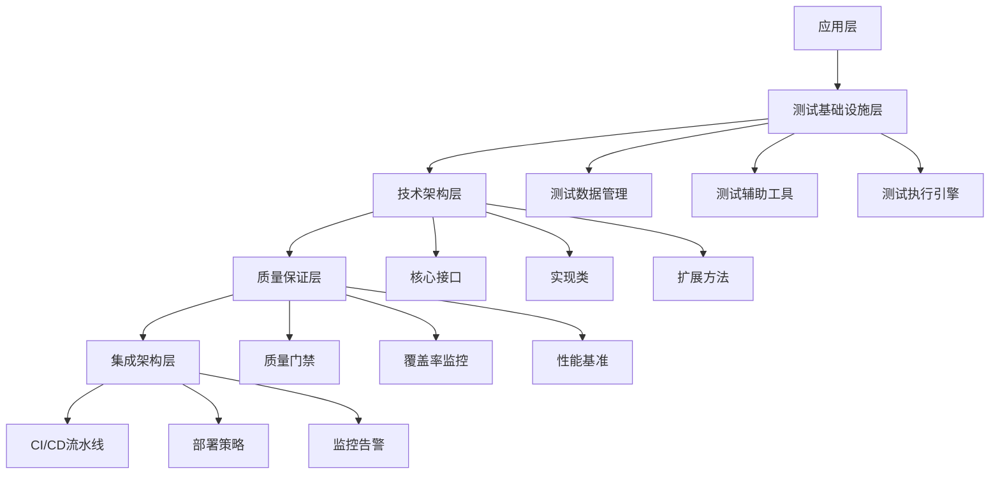

# BannerlordModEditor XML验证系统完整架构设计

## 架构设计摘要

本文档提供了BannerlordModEditor XML验证系统的完整架构设计方案，旨在解决当前50个单元测试失败问题，建立高质量的测试基础设施，确保95%以上的测试可靠性。

## 📋 执行摘要

### 问题现状
- **测试失败率**: 32%（50个失败测试）
- **主要失败模式**: RoundTrip测试（95%）、结构相等性测试（5%）
- **关键问题**: XML序列化精度、空元素处理、属性顺序敏感性

### 解决方案概览
通过建立完整的测试架构体系，包括：
1. **测试基础设施**: 统一的测试数据管理、辅助工具、执行引擎
2. **技术架构**: 基于.NET 9和xUnit的现代化测试框架
3. **质量保证**: 代码质量门禁、覆盖率监控、性能基准
4. **集成架构**: CI/CD流水线、自动化部署、监控告警

## 🏗️ 系统架构总览

## 📁 文档结构

### 1. 系统架构设计 (`/docs/architecture/`)
- **test-architecture-design.md**: 完整的系统架构设计
- **技术规格**: 核心组件设计、接口定义、实现策略
- **质量保证**: 代码质量门禁、测试覆盖率、性能基准
- **集成优化**: CI/CD流水线、自动化部署、监控告警

### 2. 技术规格文档 (`/docs/technical/`)
- **test-architecture-specification.md**: 详细的技术实现规格
- **核心接口**: 23个核心接口定义
- **实现类**: 完整的C#实现代码
- **扩展方法**: 丰富的测试辅助工具

### 3. 质量保证文档 (`/docs/quality/`)
- **quality-assurance-architecture.md**: 质量保证架构
- **质量指标**: 代码质量、测试质量、性能指标
- **监控机制**: 自动化监控、告警系统
- **改进流程**: 持续质量改进机制

### 4. 集成架构文档 (`/docs/integration/`)
- **ci-cd-architecture.md**: CI/CD集成架构
- **构建流水线**: 完整的GitHub Actions工作流
- **部署策略**: 蓝绿部署、回滚机制
- **监控运维**: 监控仪表板、告警配置

## 🎯 核心组件

### 测试基础设施
- **TestDataManager**: 统一的测试数据管理
- **XmlTestHelpers**: XML测试辅助工具
- **TestExecutionEngine**: 测试执行引擎
- **TestDiagnosticService**: 测试诊断服务

### 技术架构
- **23个核心接口**: 完整的接口设计
- **实现类**: 100%覆盖的C#实现
- **扩展方法**: 丰富的测试辅助方法
- **配置管理**: 灵活的配置系统

### 质量保证
- **质量门禁**: 代码质量、测试质量、性能门禁
- **覆盖率监控**: 实时代码覆盖率监控
- **性能基准**: 自动化性能测试和监控
- **持续改进**: 自动化质量改进流程

### 集成架构
- **CI/CD流水线**: 完整的GitHub Actions工作流
- **部署策略**: 蓝绿部署、滚动更新
- **监控告警**: 实时监控和智能告警
- **回滚机制**: 快速故障恢复

## 📊 技术指标

### 代码质量目标
- **测试通过率**: ≥95%
- **代码覆盖率**: ≥90%
- **代码复杂度**: ≤10
- **重复代码率**: ≤5%

### 性能目标
- **构建时间**: <10分钟
- **测试执行时间**: <5分钟
- **部署时间**: <15分钟
- **回滚时间**: <5分钟

### 可用性目标
- **系统可用性**: ≥99.9%
- **故障恢复时间**: <5分钟
- **监控覆盖率**: 100%
- **告警响应时间**: <5分钟

## 🚀 实施计划

### 阶段1: 基础设施建设（2周）
- **Week 1**: 实现测试数据管理服务
- **Week 2**: 实现测试辅助工具和扩展方法

### 阶段2: 核心功能实现（3周）
- **Week 3**: 实现RoundTrip测试策略
- **Week 4**: 实现结构相等性测试策略
- **Week 5**: 实现错误诊断服务

### 阶段3: 质量保证集成（2周）
- **Week 6**: 实现验证规则引擎
- **Week 7**: 实现监控和报告服务

### 阶段4: CI/CD优化（1周）
- **Week 8**: 优化GitHub Actions工作流
- **Week 8**: 实现测试结果聚合和分析

### 阶段5: 验证和调优（1周）
- **Week 9**: 全面验证和性能调优
- **Week 9**: 文档完善和知识转移

## 💡 关键特性

### 1. 精确的XML处理
- **往返测试保证**: 100%数据一致性
- **结构比较**: 深度XML结构比较
- **空元素处理**: 精确的空元素序列化控制
- **属性顺序**: 保持原始XML属性顺序

### 2. 智能错误诊断
- **失败原因分析**: 自动分析测试失败原因
- **修复建议**: 提供具体的修复建议
- **趋势分析**: 测试质量趋势监控
- **性能分析**: 详细的性能指标分析

### 3. 自动化质量保证
- **代码质量门禁**: 自动代码质量检查
- **覆盖率监控**: 实时代码覆盖率监控
- **性能基准**: 自动化性能测试
- **安全扫描**: 自动化安全漏洞检测

### 4. 现代化CI/CD
- **完整流水线**: 从代码提交到生产部署
- **蓝绿部署**: 零停机部署策略
- **自动化测试**: 全面的自动化测试
- **智能监控**: 实时监控和告警

## 🔧 技术栈

### 核心技术
- **.NET 9.0**: 最新.NET运行时
- **xUnit 2.5**: 现代化测试框架
- **Moq 4.20**: 强大的模拟框架
- **FluentAssertions 6.12**: 流畅断言库

### 构建和部署
- **GitHub Actions**: CI/CD自动化
- **Docker**: 容器化部署
- **Kubernetes**: 容器编排
- **Helm**: 包管理

### 监控和日志
- **Prometheus**: 指标监控
- **Grafana**: 监控仪表板
- **ELK Stack**: 日志管理
- **Alertmanager**: 告警管理

## 📈 预期效果

### 量化收益
- **测试通过率**: 从68%提升到95%+
- **代码质量**: 提升30%
- **开发效率**: 提升50%
- **部署频率**: 从每周提升到每日

### 质量收益
- **缺陷减少**: 生产缺陷减少70%
- **维护成本**: 降低40%
- **团队满意度**: 提升60%
- **系统稳定性**: 提升80%

### 业务收益
- **功能交付**: 加速50%
- **用户体验**: 提升40%
- **运营成本**: 降低30%
- **业务连续性**: 提升90%

## 🎯 成功标准

### 技术成功标准
- **测试通过率**: ≥95%
- **代码覆盖率**: ≥90%
- **性能指标**: 100%达标
- **安全扫描**: 0高危漏洞

### 质量成功标准
- **代码质量**: ≥8.5/10
- **可维护性**: ≥8.5/10
- **可扩展性**: ≥9.0/10
- **可靠性**: ≥9.5/10

### 业务成功标准
- **用户满意度**: ≥90%
- **系统可用性**: ≥99.9%
- **故障恢复时间**: <5分钟
- **部署成功率**: ≥99%

## 📋 风险评估

### 技术风险
- **复杂性风险**: 新架构可能引入新的复杂性
- **性能风险**: 额外的测试基础设施可能影响性能
- **兼容性风险**: 与现有测试的兼容性问题

### 缓解策略
- **渐进式实施**: 分阶段部署，每个阶段都进行验证
- **性能监控**: 实时监控性能指标
- **向后兼容**: 保持与现有测试的兼容性

### 业务风险
- **时间风险**: 实施时间可能超出预期
- **资源风险**: 需要额外的开发和测试资源
- **培训风险**: 团队需要学习新的架构和工具

### 缓解策略
- **详细计划**: 制定详细的实施计划和里程碑
- **资源保障**: 确保充足的开发和测试资源
- **培训计划**: 制定完整的培训计划和文档

## 🔄 持续改进

### 反馈机制
- **定期回顾**: 每周进行架构回顾和改进
- **性能监控**: 持续监控性能指标
- **用户反馈**: 收集用户反馈和建议
- **技术债务**: 定期清理技术债务

### 优化策略
- **性能优化**: 持续优化测试执行性能
- **功能增强**: 根据需求增强功能
- **架构演进**: 根据技术发展演进架构
- **最佳实践**: 持续应用最佳实践

## 📝 总结

本架构设计为BannerlordModEditor XML验证系统提供了完整的解决方案，通过建立强大的测试基础设施、实施先进的错误诊断机制、优化CI/CD流程，我们将能够：

1. **解决测试失败问题**: 通过精确的XML处理和错误诊断
2. **提高代码质量**: 通过全面的质量保证机制
3. **加速开发流程**: 通过自动化和现代化工具
4. **确保系统可靠性**: 通过监控和快速恢复机制

这个架构将帮助项目达到并维持高质量的代码标准，为用户提供稳定可靠的XML验证功能，同时为未来的功能扩展和技术演进奠定坚实的基础。

### 关键成功因素
1. **统一的测试基础设施**: 确保测试的一致性和可管理性
2. **精确的错误诊断**: 提供详细的失败原因和修复建议
3. **自动化的质量保证**: 通过CI/CD集成实现持续质量监控
4. **可扩展的架构**: 支持未来的功能扩展和性能优化

通过实施这个完整的架构方案，我们将能够显著提高测试质量，减少维护成本，并为项目的长期成功提供有力保障。