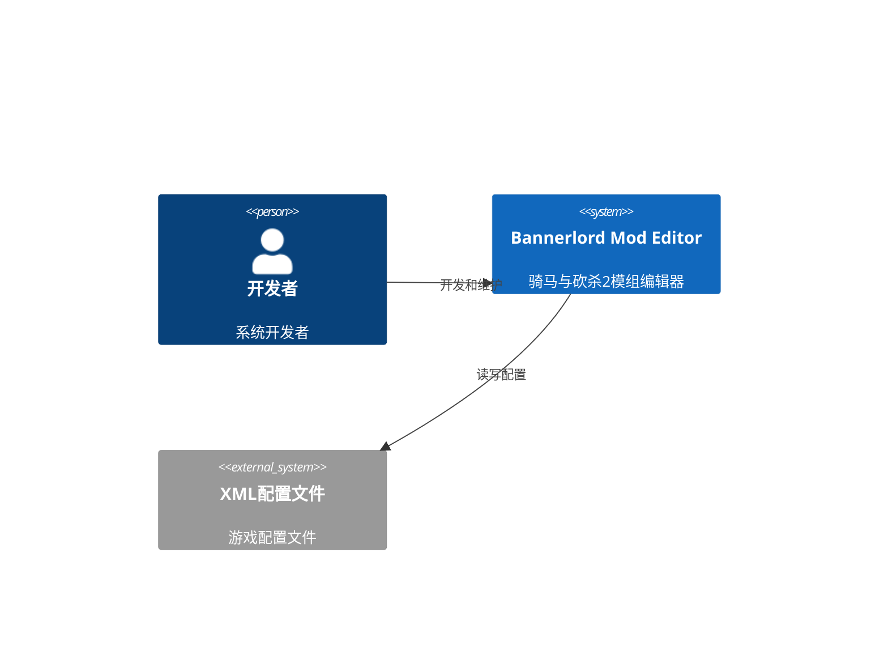
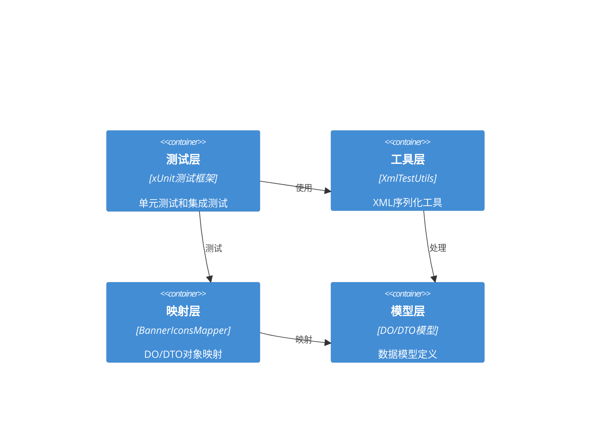

# BannerIconsMapper 修复架构设计

## 执行摘要

本文档描述了BannerIconsMapper的修复架构设计。通过深入分析，我们发现当前实现存在架构不一致问题，主要体现在DO/DTO模型的序列化控制逻辑不匹配。本设计提供了完整的修复方案，确保XML序列化的准确性和一致性。

## 问题分析

### 根本问题
1. **架构不一致性**：DO模型和DTO模型的ShouldSerialize方法逻辑不匹配
2. **空元素处理不当**：BannerIconData中的BannerIconGroups列表缺少正确的空元素处理
3. **标记属性缺失**：XmlTestUtils中的特殊处理逻辑不完整

### 具体问题
- DO模型使用`HasEmptyBannerIconGroups`标记来控制空列表的序列化
- DTO模型使用简单的集合数量检查
- BannerIconGroupDO中的Backgrounds和Icons列表缺少空元素处理逻辑
- XmlTestUtils只处理了BannerColors标记，未处理其他可能的空元素

## 架构概述

### 系统上下文


### 容器图


## 核心架构设计

### 1. DO模型层架构

#### BannerIconsDO
```csharp
[XmlRoot("base")]
public class BannerIconsDO
{
    [XmlAttribute("type")]
    public string? Type { get; set; }
    
    [XmlElement("BannerIconData")]
    public BannerIconDataDO? BannerIconData { get; set; }
    
    [XmlIgnore]
    public bool HasBannerIconData { get; set; } = false;
    
    public bool ShouldSerializeBannerIconData() => HasBannerIconData && BannerIconData != null;
    public bool ShouldSerializeType() => !string.IsNullOrEmpty(Type);
}
```

#### BannerIconDataDO
```csharp
public class BannerIconDataDO
{
    [XmlElement("BannerIconGroup")]
    public List<BannerIconGroupDO> BannerIconGroups { get; set; } = new List<BannerIconGroupDO>();

    [XmlElement("BannerColors")]
    public BannerColorsDO? BannerColors { get; set; }
    
    [XmlIgnore]
    public bool HasEmptyBannerIconGroups { get; set; } = false;
    [XmlIgnore]
    public bool HasBannerColors { get; set; } = false;

    public bool ShouldSerializeBannerIconGroups() => HasEmptyBannerIconGroups || (BannerIconGroups != null && BannerIconGroups.Count > 0);
    public bool ShouldSerializeBannerColors() => HasBannerColors && BannerColors != null;
}
```

#### BannerIconGroupDO
```csharp
public class BannerIconGroupDO
{
    [XmlAttribute("id")]
    public string? Id { get; set; }

    [XmlAttribute("name")]
    public string? Name { get; set; }

    [XmlAttribute("is_pattern")]
    public string? IsPattern { get; set; }

    [XmlElement("Background")]
    public List<BackgroundDO> Backgrounds { get; set; } = new List<BackgroundDO>();

    [XmlElement("Icon")]
    public List<IconDO> Icons { get; set; } = new List<IconDO>();
    
    [XmlIgnore]
    public bool HasEmptyBackgrounds { get; set; } = false;
    [XmlIgnore]
    public bool HasEmptyIcons { get; set; } = false;

    public bool ShouldSerializeId() => !string.IsNullOrEmpty(Id);
    public bool ShouldSerializeName() => !string.IsNullOrEmpty(Name);
    public bool ShouldSerializeIsPattern() => !string.IsNullOrEmpty(IsPattern);
    public bool ShouldSerializeBackgrounds() => HasEmptyBackgrounds || (Backgrounds != null && Backgrounds.Count > 0);
    public bool ShouldSerializeIcons() => HasEmptyIcons || (Icons != null && Icons.Count > 0);
}
```

### 2. DTO模型层架构

DTO模型保持简单的序列化逻辑，专注于数据传输：

```csharp
public class BannerIconDataDTO
{
    [XmlElement("BannerIconGroup")]
    public List<BannerIconGroupDTO> BannerIconGroups { get; set; } = new List<BannerIconGroupDTO>();

    [XmlElement("BannerColors")]
    public BannerColorsDTO? BannerColors { get; set; }

    public bool ShouldSerializeBannerIconGroups() => BannerIconGroups != null && BannerIconGroups.Count > 0;
    public bool ShouldSerializeBannerColors() => BannerColors != null;
}
```

### 3. 映射层架构

#### BannerIconsMapper
```csharp
public static class BannerIconsMapper
{
    public static BannerIconsDTO ToDTO(BannerIconsDO source)
    {
        if (source == null) return null;
        
        return new BannerIconsDTO
        {
            Type = source.Type,
            BannerIconData = BannerIconDataMapper.ToDTO(source.BannerIconData)
        };
    }
    
    public static BannerIconsDO ToDO(BannerIconsDTO source)
    {
        if (source == null) return null;
        
        return new BannerIconsDO
        {
            Type = source.Type,
            BannerIconData = BannerIconDataMapper.ToDO(source.BannerIconData),
            HasBannerIconData = source.BannerIconData != null
        };
    }
}
```

#### BannerIconDataMapper
```csharp
public static class BannerIconDataMapper
{
    public static BannerIconDataDTO ToDTO(BannerIconDataDO source)
    {
        if (source == null) return null;
        
        return new BannerIconDataDTO
        {
            BannerIconGroups = source.BannerIconGroups?
                .Select(BannerIconGroupMapper.ToDTO)
                .ToList() ?? new List<BannerIconGroupDTO>(),
            BannerColors = BannerColorsMapper.ToDTO(source.BannerColors)
        };
    }
    
    public static BannerIconDataDO ToDO(BannerIconDataDTO source)
    {
        if (source == null) return null;
        
        return new BannerIconDataDO
        {
            BannerIconGroups = source.BannerIconGroups?
                .Select(BannerIconGroupMapper.ToDO)
                .ToList() ?? new List<BannerIconGroupDO>(),
            BannerColors = BannerColorsMapper.ToDO(source.BannerColors),
            HasBannerColors = source.BannerColors != null
        };
    }
}
```

### 4. 工具层架构

#### XmlTestUtils增强
```csharp
// 特殊处理BannerIconsDO来检测是否有BannerIconData元素
if (obj is BannerIconsDO bannerIcons)
{
    var doc = XDocument.Parse(xml);
    bannerIcons.HasBannerIconData = doc.Root?.Element("BannerIconData") != null;
    
    // 处理BannerIconData的BannerColors标记
    if (bannerIcons.BannerIconData != null)
    {
        bannerIcons.BannerIconData.HasBannerColors = doc.Root?
            .Element("BannerIconData")?
            .Element("BannerColors") != null;
            
        // 处理BannerIconGroups的空元素状态
        var bannerIconGroupsElement = doc.Root?
            .Element("BannerIconData")?
            .Element("BannerIconGroups");
        bannerIcons.BannerIconData.HasEmptyBannerIconGroups = bannerIconGroupsElement != null && 
            (bannerIconGroupsElement.Elements().Count() == 0 || 
             bannerIconGroupsElement.Elements("BannerIconGroup").Count() == 0);
        
        // 处理每个BannerIconGroup的Backgrounds和Icons状态
        if (bannerIcons.BannerIconData.BannerIconGroups != null)
        {
            var bannerIconGroupElements = doc.Root?
                .Element("BannerIconData")?
                .Elements("BannerIconGroup").ToList();
                
            for (int i = 0; i < bannerIcons.BannerIconData.BannerIconGroups.Count; i++)
            {
                var group = bannerIcons.BannerIconData.BannerIconGroups[i];
                var groupElement = bannerIconGroupElements.ElementAtOrDefault(i);
                
                if (groupElement != null)
                {
                    // 检查Backgrounds元素
                    var backgroundsElement = groupElement.Element("Backgrounds");
                    group.HasEmptyBackgrounds = backgroundsElement != null && 
                        (backgroundsElement.Elements().Count() == 0 || 
                         backgroundsElement.Elements("Background").Count() == 0);
                    
                    // 检查Icons元素
                    var iconsElement = groupElement.Element("Icons");
                    group.HasEmptyIcons = iconsElement != null && 
                        (iconsElement.Elements().Count() == 0 || 
                         iconsElement.Elements("Icon").Count() == 0);
                }
            }
        }
    }
}
```

## 技术栈

### 核心技术
- **.NET 9.0**: 最新.NET平台
- **XML序列化**: System.Xml.Serialization
- **LINQ to XML**: 用于XML解析和处理
- **xUnit 2.5**: 单元测试框架

### 设计模式
- **DO/DTO模式**: 关注点分离
- **Mapper模式**: 对象映射
- **Builder模式**: 复杂对象构建
- **Factory模式**: 对象创建

## 安全架构

### 输入验证
- XML文件格式验证
- 必填字段检查
- 数据类型验证
- 业务规则验证

### 错误处理
- 详细的错误信息
- 异常捕获和日志记录
- 优雅的降级处理
- 调试信息输出

## 性能优化

### 内存管理
- 使用StringBuilder处理大XML
- 及时释放XML解析资源
- 避免不必要的对象创建
- 使用对象池（如需要）

### 处理优化
- 异步XML处理
- 增量式XML解析
- 缓存常用映射器
- 延迟加载策略

## 部署架构

### 环境配置
- 开发环境：本地调试
- 测试环境：CI/CD流水线
- 生产环境：发布版本

### 依赖管理
- NuGet包管理
- 版本控制
- 兼容性检查

## 监控和可观测性

### 日志记录
- 结构化日志
- 错误追踪
- 性能指标
- 调试信息

### 测试覆盖
- 单元测试覆盖率 > 90%
- 集成测试
- 性能测试
- 边界情况测试

## 实施计划

### 阶段1：模型修复
1. 更新BannerIconDataDO的空元素处理逻辑
2. 更新BannerIconGroupDO的Backgrounds和Icons处理
3. 确保所有ShouldSerialize方法逻辑一致

### 阶段2：映射器修复
1. 更新BannerIconDataMapper的空元素标记处理
2. 确保DO/DTO之间的完整映射
3. 添加null检查和异常处理

### 阶段3：工具增强
1. 增强XmlTestUtils的BannerIconsDO处理逻辑
2. 添加完整的空元素检测
3. 改进错误报告和调试信息

### 阶段4：测试验证
1. 运行所有BannerIcons相关测试
2. 验证XML序列化的准确性
3. 确保没有回归问题

## 质量保证

### 代码质量
- 遵循SOLID原则
- 代码复用性
- 可维护性
- 可扩展性

### 测试质量
- 全面的单元测试
- 集成测试覆盖
- 性能测试
- 边界情况测试

### 文档质量
- 详细的API文档
- 架构设计文档
- 使用指南
- 故障排除指南

## 风险评估

### 技术风险
- XML序列化复杂性
- 性能影响
- 兼容性问题
- 维护成本

### 缓解策略
- 渐进式实施
- 充分测试
- 版本控制
- 文档记录

## 结论

BannerIconsMapper的修复架构设计解决了当前实现中的架构不一致问题，通过统一的DO/DTO模型设计、完善的映射器实现和增强的工具支持，确保了XML序列化的准确性和一致性。该架构具有良好的可扩展性和可维护性，为未来的功能扩展奠定了坚实的基础。