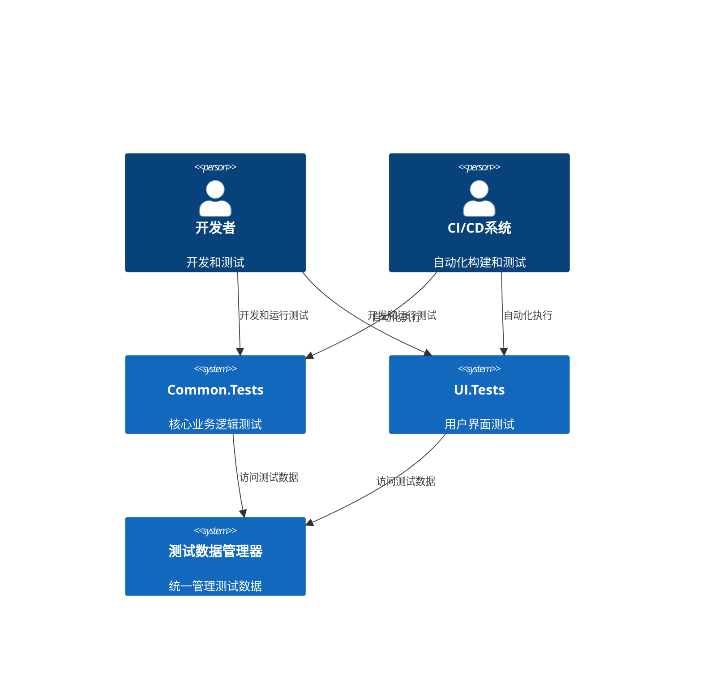
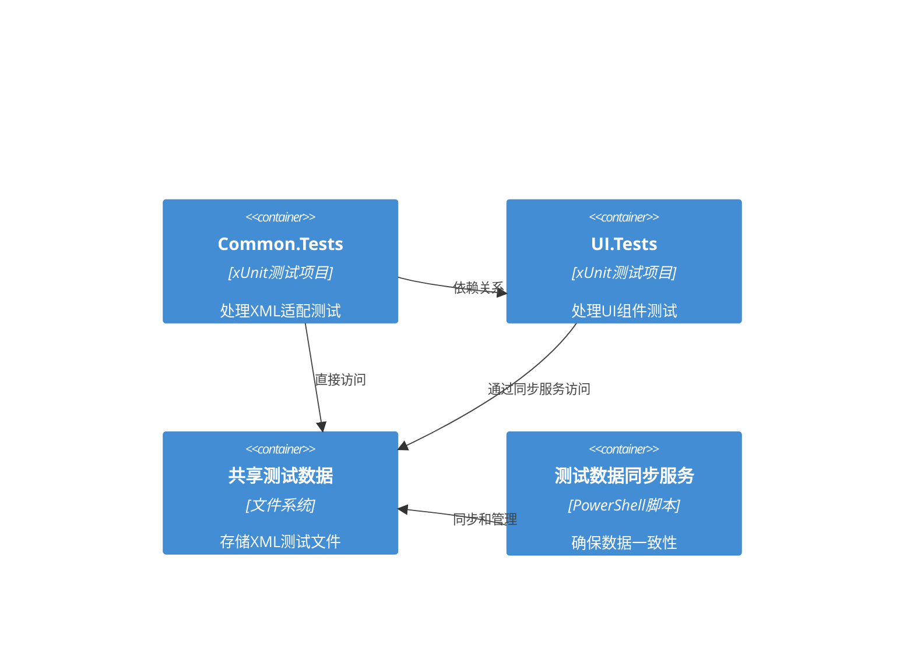
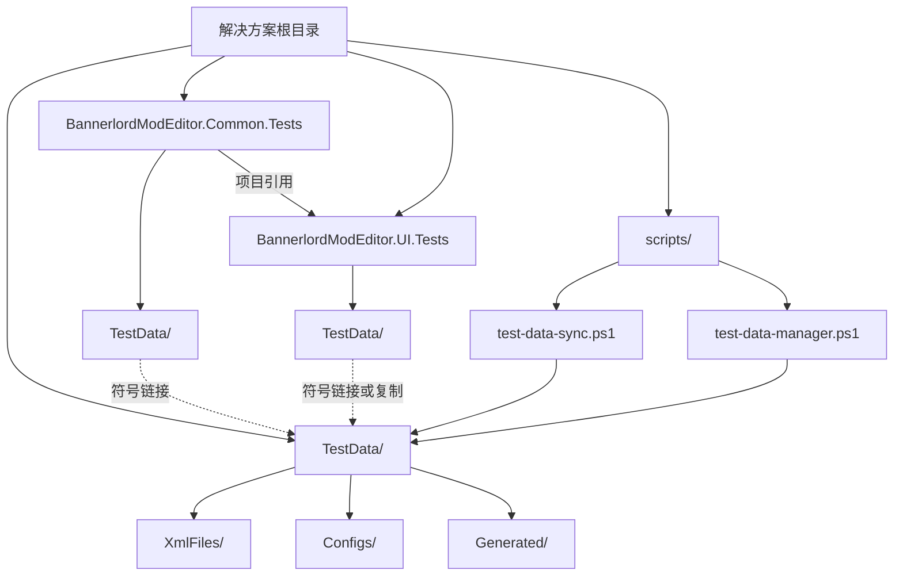

# 系统架构设计文档

## 执行概要

本文档详细说明了修复GitHub Actions UI测试失败问题的系统架构设计。核心问题在于UI.Tests项目缺少必要的测试数据文件，导致测试无法正常运行。架构设计着重解决测试数据管理、项目依赖关系和CI/CD流程优化。

## 架构概述

### 系统上下文


### 容器架构


## 测试数据管理架构

### 核心问题分析
1. **数据缺失**: UI.Tests项目缺少TestData目录和相关XML文件
2. **数据不一致**: 两个测试项目的测试数据可能存在版本差异
3. **同步问题**: 缺乏自动化的数据同步机制
4. **维护困难**: 测试数据分散在多个位置

### 解决方案设计

#### 1. 统一测试数据存储结构
```
解决方案根目录/
├── TestData/                           # 统一测试数据存储
│   ├── XmlFiles/                      # XML源文件
│   │   ├── action_types.xml
│   │   ├── combat_parameters.xml
│   │   └── ... (所有XML文件)
│   ├── Configs/                        # 测试配置文件
│   │   ├── test-data-mapping.json      # 数据映射配置
│   │   └── test-settings.json         # 测试设置
│   └── Generated/                      # 生成的测试数据
│       ├── ui-test-data.xml           # UI专用测试数据
│       └── common-test-data.xml       # Common专用测试数据
├── BannerlordModEditor.Common.Tests/
│   └── TestData/                      # 符号链接到 ../TestData
├── BannerlordModEditor.UI.Tests/
│   └── TestData/                      # 符号链接或复制到 ../TestData
└── scripts/
    ├── test-data-sync.ps1              # 测试数据同步脚本
    └── test-data-manager.ps1           # 测试数据管理脚本
```

#### 2. 项目依赖关系图


#### 3. 数据同步机制
```mermaid
sequenceDiagram
    participant Dev as 开发者
    participant Sync as 同步脚本
    TestData as 统一测试数据
    UITests as UI.Tests
    CommonTests as Common.Tests
    
    Dev->>Sync: 运行同步脚本
    Sync->>TestData: 检查数据完整性
    TestData-->>Sync: 返回数据状态
    Sync->>TestData: 验证XML文件结构
    TestData-->>Sync: 返回验证结果
    Sync->>UITests: 创建/更新TestData目录
    Sync->>CommonTests: 更新符号链接
    Sync-->>Dev: 同步完成报告
```

## CI/CD流程优化方案

### 当前流程问题
1. **数据依赖**: UI测试依赖测试数据，但数据未在CI中正确设置
2. **构建顺序**: 构建顺序可能导致数据不可用
3. **错误处理**: 缺乏详细的错误诊断信息
4. **并行执行**: 多个测试并行时可能产生数据竞争

### 优化后的CI/CD流程

#### 1. 构建前准备阶段
```yaml
# 在所有测试执行之前
steps:
  - name: 检出代码
    uses: actions/checkout@v4
    
  - name: 设置 .NET
    uses: actions/setup-dotnet@v4
    with:
      dotnet-version: ${{ env.DOTNET_VERSION }}
  
  - name: 恢复依赖
    run: dotnet restore
    
  - name: 同步测试数据
    run: scripts/test-data-sync.ps1 -Verify -CreateLinks
    
  - name: 验证测试数据
    run: scripts/test-data-manager.ps1 -ValidateAll
```

#### 2. 分阶段测试执行
```yaml
jobs:
  # 1. 数据准备和验证
  test-data-setup:
    runs-on: ubuntu-latest
    steps:
      - name: 同步测试数据
        run: scripts/test-data-sync.ps1 -CI -Verify
        
      - name: 验证数据完整性
        run: scripts/test-data-manager.ps1 -Validate
        
      - name: 上传测试数据
        uses: actions/upload-artifact@v4
        with:
          name: test-data
          path: TestData/
  
  # 2. Common.Tests执行
  common-tests:
    runs-on: ubuntu-latest
    needs: test-data-setup
    steps:
      - name: 下载测试数据
        uses: actions/download-artifact@v4
        with:
          name: test-data
          path: TestData/
          
      - name: 运行Common.Tests
        run: dotnet test BannerlordModEditor.Common.Tests
  
  # 3. UI.Tests执行
  ui-tests:
    runs-on: ubuntu-latest
    needs: test-data-setup
    steps:
      - name: 下载测试数据
        uses: actions/download-artifact@v4
        with:
          name: test-data
          path: TestData/
          
      - name: 运行UI.Tests
        run: dotnet test BannerlordModEditor.UI.Tests
```

#### 3. 错误处理和诊断
```yaml
- name: 运行UI测试（带详细诊断）
  env:
    DOTNET_CLI_TEST_TIMEOUT: 120
    TEST_DATA_VERBOSE: true
  run: |
    # 诊断测试数据状态
    scripts/test-data-manager.ps1 -Diagnose
    
    # 运行测试并捕获详细日志
    dotnet test BannerlordModEditor.UI.Tests \
      --configuration Release \
      --verbosity diagnostic \
      --logger "trx;LogFileName=ui_tests_detailed.trx" \
      --results-directory TestResults || echo "UI测试失败，开始诊断"
    
    # 收集诊断信息
    if [ $? -ne 0 ]; then
      echo "开始诊断UI测试失败..."
      ls -la TestData/
      find TestData/ -name "*.xml" | head -10
      echo "测试数据诊断完成"
    fi
```

## 文件同步机制

### 1. 符号链接策略
```powershell
# Windows符号链接创建
function Create-SymbolicLink {
    param(
        [string]$Source,
        [string]$Target
    )
    
    if (-not (Test-Path $Source)) {
        throw "源路径不存在: $Source"
    }
    
    if (Test-Path $Target) {
        Remove-Item $Target -Force -Recurse
    }
    
    New-Item -ItemType SymbolicLink -Path $Target -Target $Source
}

# Linux/Mac符号链接创建
function Create-SymbolicLink-Linux {
    param(
        [string]$Source,
        [string]$Target
    )
    
    if (-not (Test-Path $Source)) {
        throw "源路径不存在: $Source"
    }
    
    if (Test-Path $Target) {
        Remove-Item $Target -Force -Recurse
    }
    
    ln -s $Source $Target
}
```

### 2. 数据验证机制
```powershell
function Validate-TestData {
    param(
        [string]$TestDataPath
    )
    
    $requiredFiles = @(
        "action_types.xml",
        "combat_parameters.xml",
        "attributes.xml",
        "banner_icons.xml"
    )
    
    $missingFiles = @()
    foreach ($file in $requiredFiles) {
        $filePath = Join-Path $TestDataPath $file
        if (-not (Test-Path $filePath)) {
            $missingFiles += $file
        }
    }
    
    if ($missingFiles.Count -gt 0) {
        throw "缺少必需的测试文件: $($missingFiles -join ', ')"
    }
    
    return $true
}
```

### 3. 跨平台兼容性处理
```powershell
function Sync-TestData {
    param(
        [string]$SourcePath,
        [string]$TargetPath,
        [switch]$Force,
        [switch]$Verify
    )
    
    # 跨平台路径处理
    $sourcePath = $SourcePath.Replace('\', '/')
    $targetPath = $TargetPath.Replace('\', '/')
    
    # 检查源路径是否存在
    if (-not (Test-Path $sourcePath)) {
        throw "源路径不存在: $sourcePath"
    }
    
    # 创建目标目录
    if (-not (Test-Path $targetPath)) {
        New-Item -ItemType Directory -Path $targetPath -Force
    }
    
    # 复制文件（跨平台）
    Copy-Item -Path "$sourcePath/*" -Destination $targetPath -Recurse -Force:$Force
    
    # 验证文件
    if ($Verify) {
        Validate-TestData -TestDataPath $targetPath
    }
}
```

## API规范

### 1. 测试数据访问接口

#### 1.1 ITestDataRepository 接口
```csharp
public interface ITestDataRepository
{
    /// <summary>
    /// 获取指定路径的测试数据文件
    /// </summary>
    /// <param name="relativePath">相对于TestData目录的路径</param>
    /// <returns>文件内容字符串</returns>
    Task<string> GetTestDataAsync(string relativePath);
    
    /// <summary>
    /// 获取指定路径的测试数据流
    /// </summary>
    /// <param name="relativePath">相对于TestData目录的路径</param>
    /// <returns>文件流</returns>
    Task<Stream> GetTestDataStreamAsync(string relativePath);
    
    /// <summary>
    /// 验证测试数据文件是否存在
    /// </summary>
    /// <param name="relativePath">相对于TestData目录的路径</param>
    /// <returns>文件是否存在</returns>
    bool TestDataExists(string relativePath);
    
    /// <summary>
    /// 获取所有测试数据文件列表
    /// </summary>
    /// <returns>文件路径列表</returns>
    Task<List<string>> GetAllTestDataFilesAsync();
    
    /// <summary>
    /// 获取测试数据目录路径
    /// </summary>
    /// <returns>测试数据目录路径</returns>
    string GetTestDataPath();
}
```

#### 1.2 ITestDataManager 接口
```csharp
public interface ITestDataManager
{
    /// <summary>
    /// 验证测试数据完整性
    /// </summary>
    /// <returns>验证结果</returns>
    Task<TestDataValidationResult> ValidateTestDataAsync();
    
    /// <summary>
    /// 同步测试数据到指定项目
    /// </summary>
    /// <param name="targetProjectPath">目标项目路径</param>
    /// <returns>同步结果</returns>
    Task<TestDataSyncResult> SyncTestDataAsync(string targetProjectPath);
    
    /// <summary>
    /// 生成测试数据报告
    /// </summary>
    /// <returns>测试数据报告</returns>
    Task<TestDataReport> GenerateReportAsync();
    
    /// <summary>
    /// 清理过期的测试数据
    /// </summary>
    /// <returns>清理结果</returns>
    Task<TestDataCleanupResult> CleanupTestDataAsync();
}
```

### 2. 配置管理接口

#### 2.1 ITestConfigurationProvider 接口
```csharp
public interface ITestConfigurationProvider
{
    /// <summary>
    /// 获取测试配置
    /// </summary>
    /// <returns>测试配置</returns>
    TestConfiguration GetConfiguration();
    
    /// <summary>
    /// 更新测试配置
    /// </summary>
    /// <param name="configuration">新的测试配置</param>
    /// <returns>更新是否成功</returns>
    Task<bool> UpdateConfigurationAsync(TestConfiguration configuration);
    
    /// <summary>
    /// 重置测试配置到默认值
    /// </summary>
    /// <returns>重置是否成功</returns>
    Task<bool> ResetConfigurationAsync();
}
```

#### 2.2 配置数据模型
```csharp
public class TestConfiguration
{
    /// <summary>
    /// 测试数据目录路径
    /// </summary>
    public string TestDataPath { get; set; } = "TestData";
    
    /// <summary>
    /// 是否启用符号链接
    /// </summary>
    public bool UseSymbolicLinks { get; set; } = true;
    
    /// <summary>
    /// 需要同步的文件模式
    /// </summary>
    public string[] SyncPatterns { get; set; } = 
    {
        "*.xml",
        "*.json",
        "*.txt"
    };
    
    /// <summary>
    /// 需要排除的文件模式
    /// </summary>
    public string[] ExcludePatterns { get; set; } = 
    {
        "*.tmp",
        "*.log"
    };
    
    /// <summary>
    /// 验证设置
    /// </summary>
    public ValidationSettings Validation { get; set; } = new ValidationSettings();
    
    /// <summary>
    /// 同步设置
    /// </summary>
    public SyncSettings Sync { get; set; } = new SyncSettings();
}

public class ValidationSettings
{
    /// <summary>
    /// 是否启用严格验证
    /// </summary>
    public bool StrictValidation { get; set; } = true;
    
    /// <summary>
    /// 必需的文件列表
    /// </summary>
    public string[] RequiredFiles { get; set; } = 
    {
        "action_types.xml",
        "combat_parameters.xml",
        "attributes.xml"
    };
    
    /// <summary>
    /// 文件大小限制（字节）
    /// </summary>
    public long MaxFileSize { get; set; } = 10 * 1024 * 1024; // 10MB
}

public class SyncSettings
{
    /// <summary>
    /// 是否启用自动同步
    /// </summary>
    public bool AutoSync { get; set; } = true;
    
    /// <summary>
    /// 同步间隔（秒）
    /// </summary>
    public int SyncInterval { get; set; } = 300; // 5分钟
    
    /// <summary>
    /// 同步重试次数
    /// </summary>
    public int MaxRetryAttempts { get; set; } = 3;
}
```

### 3. 验证服务接口

#### 3.1 ITestDataValidator 接口
```csharp
public interface ITestDataValidator
{
    /// <summary>
    /// 验证XML文件结构
    /// </summary>
    /// <param name="xmlContent">XML内容</param>
    /// <param name="expectedSchema">期望的架构</param>
    /// <returns>验证结果</returns>
    Task<ValidationResult> ValidateXmlAsync(string xmlContent, string expectedSchema);
    
    /// <summary>
    /// 验证文件完整性
    /// </summary>
    /// <param name="filePath">文件路径</param>
    /// <returns>验证结果</returns>
    Task<ValidationResult> ValidateFileIntegrityAsync(string filePath);
    
    /// <summary>
    /// 验证测试数据目录结构
    /// </summary>
    /// <param name="directoryPath">目录路径</param>
    /// <returns>验证结果</returns>
    Task<ValidationResult> ValidateDirectoryStructureAsync(string directoryPath);
    
    /// <summary>
    /// 批量验证测试数据
    /// </summary>
    /// <param name="testDataPath">测试数据路径</param>
    /// <returns>批量验证结果</returns>
    Task<BatchValidationResult> ValidateAllTestDataAsync(string testDataPath);
}
```

#### 3.2 验证结果模型
```csharp
public class ValidationResult
{
    /// <summary>
    /// 验证是否成功
    /// </summary>
    public bool IsValid { get; set; }
    
    /// <summary>
    /// 错误信息列表
    /// </summary>
    public List<string> Errors { get; set; } = new List<string>();
    
    /// <summary>
    /// 警告信息列表
    /// </summary>
    public List<string> Warnings { get; set; } = new List<string>();
    
    /// <summary>
    /// 验证时间
    /// </summary>
    public DateTime ValidationTime { get; set; } = DateTime.UtcNow;
    
    /// <summary>
    /// 验证详情
    /// </summary>
    public Dictionary<string, object> Details { get; set; } = new Dictionary<string, object>();
}

public class BatchValidationResult
{
    /// <summary>
    /// 总体验证结果
    /// </summary>
    public bool OverallSuccess { get; set; }
    
    /// <summary>
    /// 各文件验证结果
    /// </summary>
    public Dictionary<string, ValidationResult> FileResults { get; set; } = new Dictionary<string, ValidationResult>();
    
    /// <summary>
    /// 统计信息
    /// </summary>
    public ValidationStatistics Statistics { get; set; } = new ValidationStatistics();
}

public class ValidationStatistics
{
    /// <summary>
    /// 总文件数
    /// </summary>
    public int TotalFiles { get; set; }
    
    /// <summary>
    /// 成功文件数
    /// </summary>
    public int SuccessFiles { get; set; }
    
    /// <summary>
    /// 失败文件数
    /// </summary>
    public int FailedFiles { get; set; }
    
    /// <summary>
    /// 警告文件数
    /// </summary>
    public int WarningFiles { get; set; }
    
    /// <summary>
    /// 成功率
    /// </summary>
    public double SuccessRate => TotalFiles > 0 ? (double)SuccessFiles / TotalFiles : 0;
}
```

## 实施计划

### 第一阶段：基础架构
1. **创建统一的TestData目录结构**
2. **实现基础的数据同步脚本**
3. **更新项目文件配置**

### 第二阶段：自动化
1. **实现CI/CD流程集成**
2. **添加数据验证机制**
3. **实现错误处理和诊断**

### 第三阶段：优化
1. **性能优化**
2. **监控和报告**
3. **文档完善**

## 监控和维护

### 1. 监控指标
- 测试数据同步成功率
- 测试执行成功率
- 数据完整性状态
- 错误率和恢复时间

### 2. 维护策略
- 定期数据备份
- 自动化健康检查
- 版本控制和回滚机制
- 持续的性能监控

## 总结

本架构设计提供了一个完整的解决方案来修复GitHub Actions UI测试失败问题。通过统一测试数据管理、优化CI/CD流程和实现自动化同步机制，可以确保测试数据的可用性和一致性，从而解决UI测试失败的根本问题。

架构的核心优势：
1. **统一管理**: 所有测试数据集中存储，便于维护
2. **自动化**: 通过脚本和CI/CD集成实现自动化同步
3. **跨平台**: 支持Windows、Linux和MacOS
4. **可扩展**: 易于添加新的测试数据类型和验证规则
5. **可靠性**: 包含完整的验证和错误处理机制

通过实施此架构，可以显著提高测试的可靠性和开发效率。