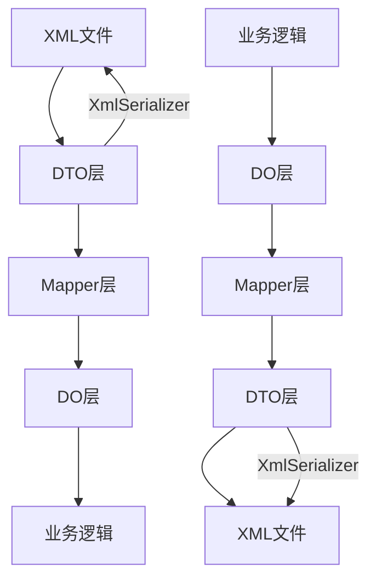
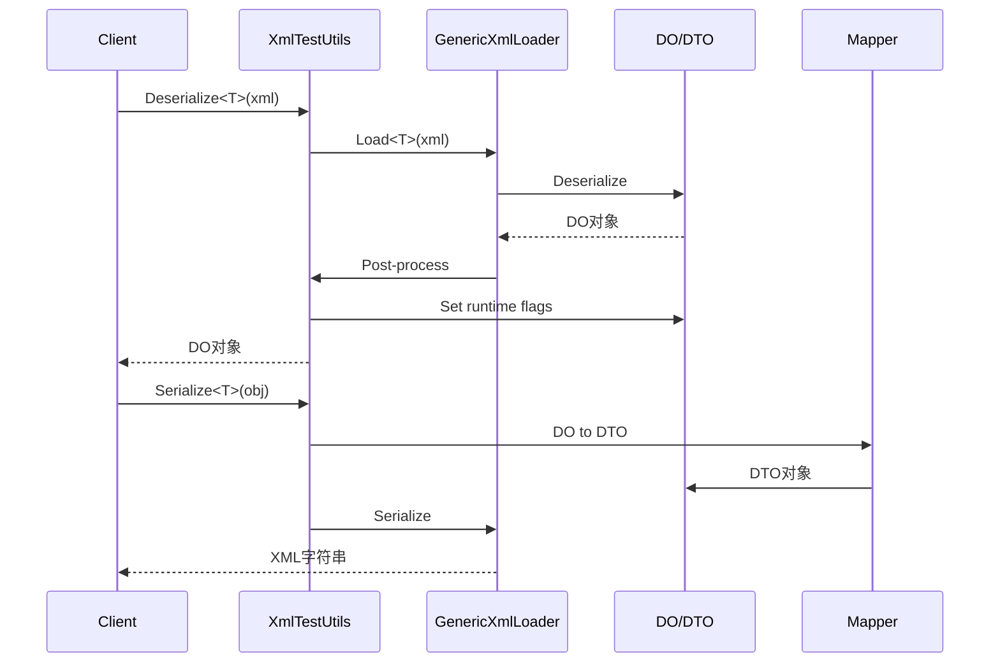
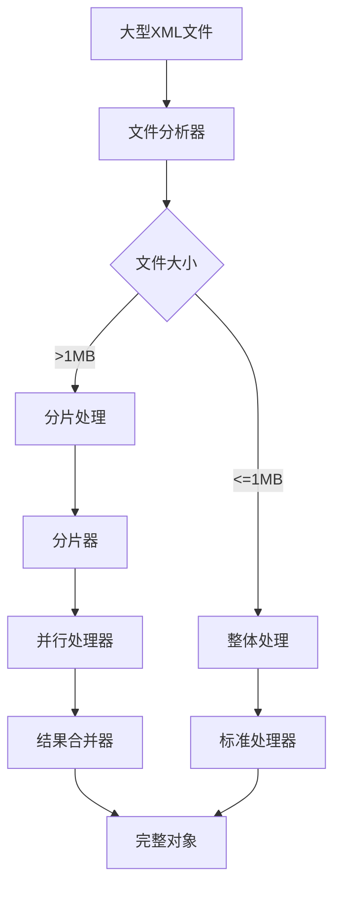
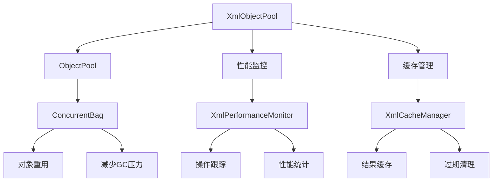
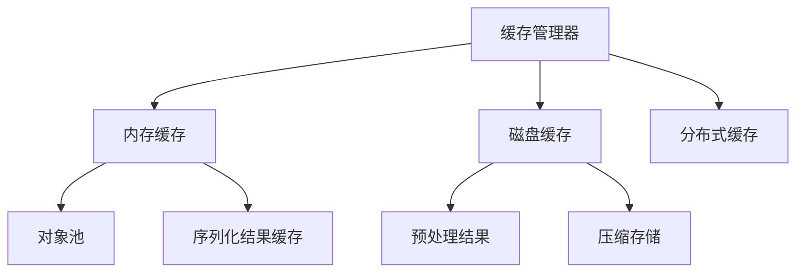
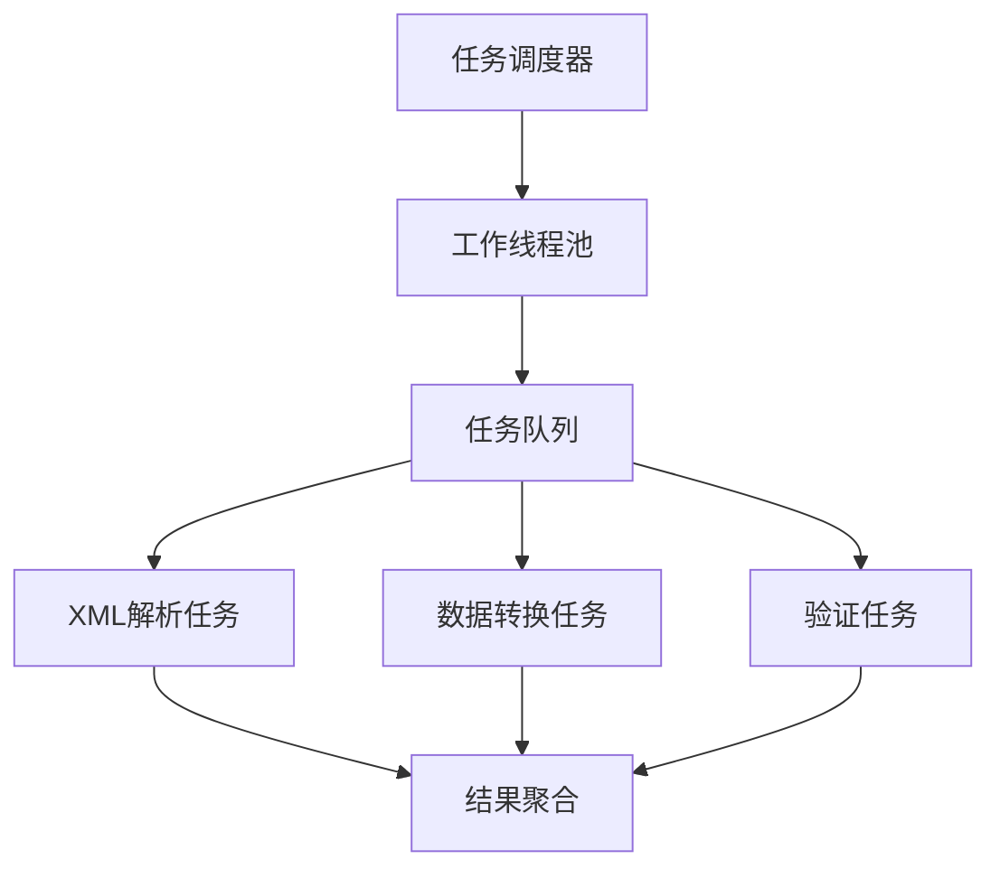
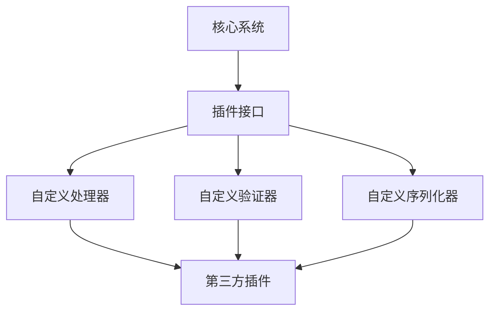
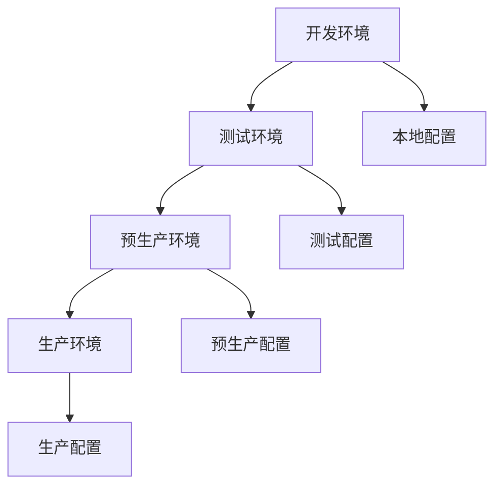

# BannerlordModEditor XML适配系统架构设计

## 执行摘要

本文档描述了骑马与砍杀2（Bannerlord）Mod编辑器的XML适配系统架构。该系统采用DO/DTO架构模式，实现了复杂的XML配置文件与C#强类型模型之间的双向转换，解决了大型XML文件处理、空元素序列化和性能优化等关键问题。

## 系统概述

### 系统目标
1. **精确XML适配**：实现骑砍2各种XML配置文件的完整序列化/反序列化
2. **类型安全**：提供强类型模型，避免运行时错误
3. **性能优化**：支持大型XML文件的高效处理
4. **可维护性**：采用模块化设计，便于扩展和维护
5. **向后兼容**：保持现有代码的兼容性

### 核心挑战
- 大型XML文件（如mpclassdivisions.xml、terrain_materials.xml）的处理
- 复杂嵌套结构的序列化控制
- 空元素的精确处理
- 命名冲突和特殊字符处理
- 性能和内存使用优化

## 架构模式

### DO/DTO架构模式



#### 模式优势
- **关注点分离**：业务逻辑与XML序列化逻辑分离
- **精确控制**：通过ShouldSerialize方法精确控制序列化行为
- **易于测试**：各层可以独立测试
- **性能优化**：DTO层专门针对序列化优化
- **扩展性**：新功能可以轻松添加到对应层

#### 核心组件

1. **DO层（Domain Object）**
   - 包含业务逻辑和验证规则
   - 使用ShouldSerialize方法控制序列化
   - 包含运行时标记属性（如HasEmptyXXX）
   - 位于`BannerlordModEditor.Common.Models.DO`

2. **DTO层（Data Transfer Object）**
   - 纯数据结构，专用于序列化
   - 与DO层结构对应但不包含业务逻辑
   - 位于`BannerlordModEditor.Common.Models.DTO`

3. **Mapper层**
   - 负责DO和DTO之间的双向转换
   - 处理null检查和类型转换
   - 位于`BannerlordModEditor.Common.Mappers`

## 详细架构设计

### 1. 数据层架构

#### 命名空间组织
```
BannerlordModEditor.Common.Models.DO/
├── Audio/           # 音频相关配置
├── Engine/          # 游戏引擎参数
├── Configuration/   # 游戏配置
├── Data/           # 数据定义
├── Game/           # 游戏机制
├── Multiplayer/    # 多人游戏
└── Layouts/        # UI布局配置
```

#### 模型基类设计
```csharp
public abstract class BaseXmlDO
{
    // 公共的XML序列化控制方法
    protected bool ShouldSerializeString(string value) => !string.IsNullOrEmpty(value);
    protected bool ShouldSerializeList<T>(List<T> list) => list != null && list.Count > 0;
    protected bool ShouldSerializeObject(object obj) => obj != null;
}

public abstract class BaseXmlDTO
{
    // DTO基类，包含公共属性
}
```

### 2. XML处理架构

#### 核心处理流程


#### 特殊处理机制
- **空元素检测**：使用XDocument分析原始XML结构
- **运行时标记**：设置HasEmptyXXX标记控制序列化
- **命名空间处理**：移除多余的命名空间声明
- **属性顺序保持**：使用XmlAttribute保持顺序

### 3. 大型文件处理架构

#### 分片处理架构


#### 性能优化策略
1. **流式处理**：使用XmlReader处理超大文件
2. **延迟加载**：按需加载XML节点
3. **内存池**：重用对象减少GC压力
4. **并行处理**：多线程处理独立节点
5. **缓存机制**：缓存频繁访问的数据

### 4. 内存管理架构

#### 对象池管理


#### 内存优化策略
- **对象池**：重用频繁创建的对象
- **延迟加载**：按需加载大型子节点
- **流式处理**：避免一次性加载整个文件
- **内存监控**：实时监控内存使用情况

## 关键XML文件架构设计

### 1. MPClassDivisions.xml

#### 复杂度分析
- **文件大小**：~2MB，大型XML文件
- **结构复杂度**：多层嵌套，包含Perks、Effects等复杂结构
- **特殊处理**：需要处理游戏模式、效果类型等复杂逻辑

#### 架构设计
```csharp
[XmlRoot("MPClassDivisions")]
public class MPClassDivisionsDO
{
    [XmlElement("MPClassDivision")]
    public List<MPClassDivisionDO> ClassDivisions { get; set; } = new List<MPClassDivisionDO>();
    
    // 性能优化：分片处理标记
    [XmlIgnore]
    public bool IsLargeFile { get; set; } = false;
    
    [XmlIgnore]
    public int ProcessedChunks { get; set; } = 0;
    
    // 业务逻辑：按文化分类
    [XmlIgnore]
    public Dictionary<string, List<MPClassDivisionDO>> ClassDivisionsByCulture { get; set; } = new Dictionary<string, List<MPClassDivisionDO>>();
    
    // 业务逻辑：按游戏模式分类
    [XmlIgnore]
    public Dictionary<string, List<MPClassDivisionDO>> ClassDivisionsByGameMode { get; set; } = new Dictionary<string, List<MPClassDivisionDO>>();
}
```

#### 分片处理策略
```csharp
public class MPClassDivisionsProcessor
{
    public async Task<MPClassDivisionsDO> ProcessLargeFileAsync(string filePath)
    {
        // 1. 分析文件结构
        var fileInfo = new FileInfo(filePath);
        if (fileInfo.Length > 1024 * 1024) // 1MB
        {
            return await ProcessInChunksAsync(filePath);
        }
        else
        {
            return await ProcessWholeFileAsync(filePath);
        }
    }
    
    private async Task<MPClassDivisionsDO> ProcessInChunksAsync(string filePath)
    {
        // 使用XmlReader进行流式处理
        // 并行处理独立的MPClassDivision节点
        // 合并结果
    }
}
```

### 2. TerrainMaterials.xml

#### 复杂度分析
- **结构特点**：包含多层纹理、材质属性
- **数据密集**：大量材质参数和纹理引用
- **图形相关**：需要处理图形渲染相关属性

#### 架构设计
```csharp
[XmlRoot("terrain_materials")]
public class TerrainMaterialsDO
{
    [XmlElement("terrain_material")]
    public List<TerrainMaterialDO> Materials { get; set; } = new List<TerrainMaterialDO>();
}

public class TerrainMaterialDO
{
    [XmlAttribute("name")]
    public string Name { get; set; } = string.Empty;
    
    [XmlAttribute("physics_material")]
    public string PhysicsMaterial { get; set; } = string.Empty;
    
    [XmlElement("textures")]
    public TexturesDO Textures { get; set; } = new TexturesDO();
    
    [XmlElement("layer_flags")]
    public LayerFlagsDO LayerFlags { get; set; } = new LayerFlagsDO();
    
    // 业务逻辑方法
    public bool IsFloraMaterial() => IsFloraLayer == "true";
    public bool IsMeshBlendMaterial() => IsMeshBlendLayer == "true";
    public bool HasDetailMaps() => BigDetailMapMode != "0";
}
```

### 3. Layouts文件系统

#### 架构特点
- **元数据驱动**：使用Layouts文件定义UI结构
- **动态生成**：基于配置动态生成编辑器界面
- **高度可配置**：支持列定义、插入定义、上下文菜单等

#### 架构设计
```csharp
[XmlRoot("base")]
public class LayoutsBaseDO
{
    [XmlAttribute("type")]
    public string Type { get; set; } = "string";
    
    [XmlElement("layouts")]
    public LayoutsContainerDO Layouts { get; set; } = new LayoutsContainerDO();
    
    // 业务逻辑：布局缓存和索引
    [XmlIgnore]
    public Dictionary<string, LayoutDO> LayoutsByClass { get; set; } = new Dictionary<string, LayoutDO>();
    
    [XmlIgnore]
    public Dictionary<string, LayoutDO> LayoutsByXmlTag { get; set; } = new Dictionary<string, LayoutDO>();
    
    // 生成UI配置
    public UIConfiguration GenerateUIConfiguration()
    {
        var config = new UIConfiguration
        {
            Type = Type,
            Layouts = new List<UILayout>()
        };
        
        // 转换逻辑
        return config;
    }
}
```

## 性能优化架构

### 1. 缓存策略


### 2. 并行处理架构


### 3. 内存优化
- **对象池**：重用频繁创建的对象
- **延迟加载**：按需加载大型子节点
- **流式处理**：避免一次性加载整个文件
- **内存监控**：实时监控内存使用情况

## 安全架构

### 1. 输入验证
- **XML安全检查**：防止XXE攻击
- **数据类型验证**：确保数据类型正确
- **业务规则验证**：验证业务逻辑约束

### 2. 输出安全
- **XML编码**：正确处理特殊字符
- **敏感数据过滤**：过滤敏感信息
- **访问控制**：基于角色的访问控制

## 扩展性设计

### 1. 插件架构


### 2. 配置驱动
- **外部配置**：通过配置文件驱动行为
- **动态加载**：运行时加载新的适配器
- **热更新**：支持运行时更新配置

## 部署架构

### 1. 环境配置


### 2. 监控和日志
- **性能监控**：实时监控系统性能
- **错误追踪**：完整的错误日志和追踪
- **用户行为分析**：分析用户使用模式

## 技术债务和改进计划

### 1. 当前技术债务
- **特殊处理逻辑过多**：XmlTestUtils中包含大量特殊处理代码
- **重复代码**：Mapper层存在大量重复的映射代码
- **测试覆盖不足**：某些边界情况测试覆盖不够

### 2. 改进计划
- **代码生成**：自动生成DO/DTO模型和Mapper
- **通用化处理**：减少特殊处理逻辑
- **性能优化**：进一步优化大型文件处理性能
- **测试自动化**：提高测试覆盖率和自动化程度

## 结论

DO/DTO架构模式在BannerlordModEditor项目中的成功应用证明了这种架构模式在处理复杂XML序列化问题时的有效性。通过关注点分离和精确控制，我们能够解决各种序列化测试失败的问题，同时保持代码的可维护性和可扩展性。

该架构不仅适用于当前项目，也可以作为其他类似项目的参考模板。关键在于理解业务需求与数据表示之间的区别，并通过适当的架构设计来实现两者的分离。

未来，我们将继续优化架构，提高性能，增强扩展性，为骑马与砍杀2Mod开发社区提供更好的工具支持。