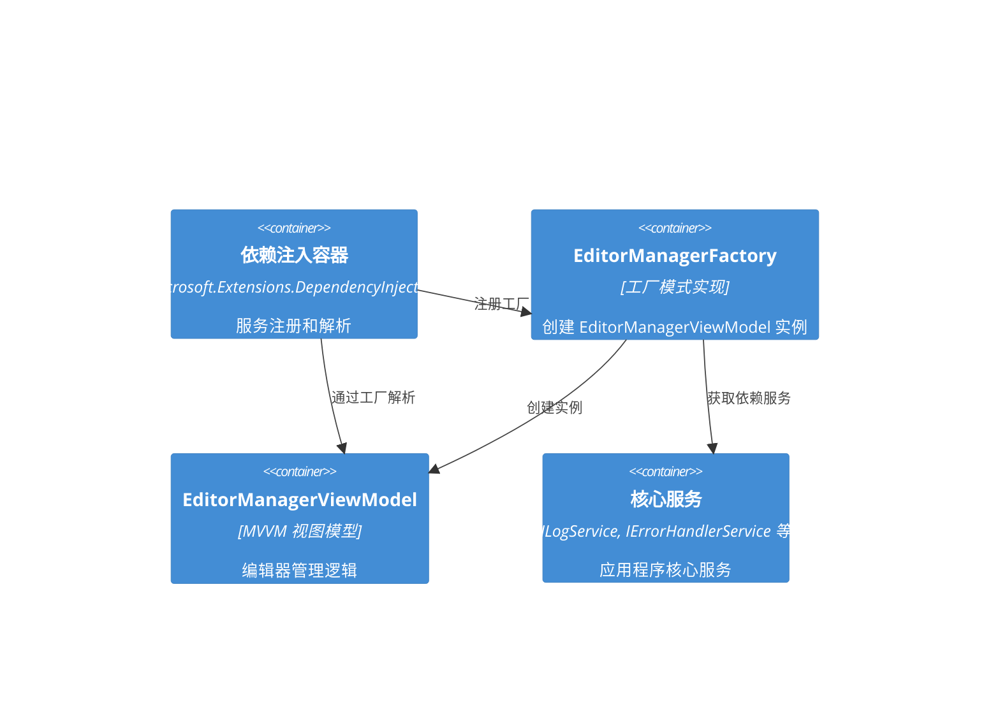

# EditorManagerViewModel 依赖注入歧义问题架构解决方案

## 执行摘要

本文档描述了为解决 BannerlordModEditor 项目中 EditorManagerViewModel 依赖注入歧义问题而设计的系统架构方案。该问题源于 EditorManagerViewModel 存在多个构造函数，导致依赖注入容器无法正确解析。

## 问题分析

### 当前问题
EditorManagerViewModel 存在两个构造函数，导致依赖注入歧义：

1. **Options 模式构造函数**（推荐）：
   ```csharp
   public EditorManagerViewModel(EditorManagerOptions? options = null)
   ```

2. **传统依赖注入构造函数**（已标记为 Obsolete）：
   ```csharp
   public EditorManagerViewModel(
       IEditorFactory? editorFactory = null,
       ILogService? logService = null,
       IErrorHandlerService? errorHandlerService = null,
       IValidationService? validationService = null,
       IServiceProvider? serviceProvider = null)
   ```

### 根本原因
- 依赖注入容器无法确定使用哪个构造函数
- 多个构造函数都有默认参数值，增加了歧义性
- 当前注册方式 `services.AddTransient<EditorManagerViewModel>()` 没有提供足够的解析信息

## 架构解决方案

### 核心设计原则
1. **单一职责原则**：每个组件都有明确的职责
2. **依赖倒置原则**：依赖抽象而非具体实现
3. **接口隔离原则**：接口保持最小化和专注
4. **开闭原则**：对扩展开放，对修改关闭

### 解决方案架构



### 组件设计

#### 1. EditorManagerFactory（工厂类）

**职责**：
- 封装 EditorManagerViewModel 的创建逻辑
- 解决依赖注入歧义问题
- 提供统一的创建接口
- 支持不同的创建策略

**接口设计**：
```csharp
public interface IEditorManagerFactory
{
    /// <summary>
    /// 创建 EditorManagerViewModel 实例（使用 Options 模式）
    /// </summary>
    EditorManagerViewModel CreateEditorManager(EditorManagerOptions? options = null);
    
    /// <summary>
    /// 创建 EditorManagerViewModel 实例（使用依赖注入）
    /// </summary>
    EditorManagerViewModel CreateEditorManagerFromServices(
        IEditorFactory? editorFactory = null,
        ILogService? logService = null,
        IErrorHandlerService? errorHandlerService = null,
        IValidationService? validationService = null,
        IServiceProvider? serviceProvider = null);
    
    /// <summary>
    /// 创建默认配置的 EditorManagerViewModel
    /// </summary>
    EditorManagerViewModel CreateDefaultEditorManager();
}
```

#### 2. 改进的 EditorManagerViewModel

**职责**：
- 管理编辑器分类和实例
- 处理编辑器选择和切换
- 协调各种服务组件

**构造函数设计**：
```csharp
// 主要构造函数（推荐使用）
public EditorManagerViewModel(EditorManagerOptions options)

// 内部构造函数（供工厂使用）
internal EditorManagerViewModel(
    IEditorFactory editorFactory,
    ILogService logService,
    IErrorHandlerService errorHandlerService,
    IValidationService validationService,
    IServiceProvider serviceProvider)
```

#### 3. 服务注册配置

**依赖注入配置**：
```csharp
// 注册工厂
services.AddSingleton<IEditorManagerFactory, EditorManagerFactory>();

// 注册 EditorManagerViewModel（通过工厂）
services.AddTransient<EditorManagerViewModel>(sp => 
    sp.GetRequiredService<IEditorManagerFactory>().CreateEditorManager());

// 可选：注册多个实例
services.AddTransient<EditorManagerViewModel>(sp => 
    sp.GetRequiredService<IEditorManagerFactory>().CreateDefaultEditorManager());
```

## 详细实现设计

### 1. EditorManagerFactory 实现

```csharp
public class EditorManagerFactory : IEditorManagerFactory
{
    private readonly IServiceProvider _serviceProvider;
    private readonly ILogger<EditorManagerFactory> _logger;

    public EditorManagerFactory(
        IServiceProvider serviceProvider,
        ILogger<EditorManagerFactory> logger)
    {
        _serviceProvider = serviceProvider ?? throw new ArgumentNullException(nameof(serviceProvider));
        _logger = logger ?? throw new ArgumentNullException(nameof(logger));
    }

    public EditorManagerViewModel CreateEditorManager(EditorManagerOptions? options = null)
    {
        try
        {
            var effectiveOptions = options ?? CreateDefaultOptions();
            return new EditorManagerViewModel(effectiveOptions);
        }
        catch (Exception ex)
        {
            _logger.LogError(ex, "Failed to create EditorManagerViewModel with options");
            throw new EditorManagerCreationException("Failed to create EditorManagerViewModel", ex);
        }
    }

    public EditorManagerViewModel CreateEditorManagerFromServices(
        IEditorFactory? editorFactory = null,
        ILogService? logService = null,
        IErrorHandlerService? errorHandlerService = null,
        IValidationService? validationService = null,
        IServiceProvider? serviceProvider = null)
    {
        try
        {
            var effectiveServiceProvider = serviceProvider ?? _serviceProvider;
            var effectiveOptions = new EditorManagerOptions
            {
                EditorFactory = editorFactory ?? effectiveServiceProvider.GetService<IEditorFactory>(),
                LogService = logService ?? effectiveServiceProvider.GetService<ILogService>(),
                ErrorHandlerService = errorHandlerService ?? effectiveServiceProvider.GetService<IErrorHandlerService>(),
                ValidationService = validationService ?? effectiveServiceProvider.GetService<IValidationService>(),
                ServiceProvider = effectiveServiceProvider
            };

            return new EditorManagerViewModel(effectiveOptions);
        }
        catch (Exception ex)
        {
            _logger.LogError(ex, "Failed to create EditorManagerViewModel from services");
            throw new EditorManagerCreationException("Failed to create EditorManagerViewModel from services", ex);
        }
    }

    public EditorManagerViewModel CreateDefaultEditorManager()
    {
        return CreateEditorManager(EditorManagerOptions.Default);
    }

    private EditorManagerOptions CreateDefaultOptions()
    {
        return EditorManagerOptions.ForDependencyInjection(_serviceProvider);
    }
}
```

### 2. EditorManagerViewModel 重构

```csharp
public partial class EditorManagerViewModel : ViewModelBase
{
    // 私有字段（保持现有设计）
    private readonly IEditorFactory? _editorFactory;
    private readonly ILogService _logService;
    private readonly IErrorHandlerService _errorHandlerService;
    private readonly IValidationService _validationService;
    private readonly IServiceProvider? _serviceProvider;

    /// <summary>
    /// 主要构造函数（推荐使用）
    /// </summary>
    public EditorManagerViewModel(EditorManagerOptions options)
    {
        if (options == null)
            throw new ArgumentNullException(nameof(options));

        _editorFactory = options.EditorFactory;
        _logService = options.LogService ?? new LogService();
        _errorHandlerService = options.ErrorHandlerService ?? new ErrorHandlerService();
        _validationService = options.ValidationService ?? new ValidationService();
        _serviceProvider = options.ServiceProvider;

        LoadEditors();
    }

    /// <summary>
    /// 内部构造函数（供工厂使用）
    /// </summary>
    internal EditorManagerViewModel(
        IEditorFactory editorFactory,
        ILogService logService,
        IErrorHandlerService errorHandlerService,
        IValidationService validationService,
        IServiceProvider serviceProvider)
    {
        _editorFactory = editorFactory ?? throw new ArgumentNullException(nameof(editorFactory));
        _logService = logService ?? throw new ArgumentNullException(nameof(logService));
        _errorHandlerService = errorHandlerService ?? throw new ArgumentNullException(nameof(errorHandlerService));
        _validationService = validationService ?? throw new ArgumentNullException(nameof(validationService));
        _serviceProvider = serviceProvider ?? throw new ArgumentNullException(nameof(serviceProvider));

        LoadEditors();
    }

    // 保持现有的其他方法和属性...
}
```

### 3. 扩展的 EditorManagerOptions

```csharp
public class EditorManagerOptions
{
    // 现有属性...
    
    /// <summary>
    /// 创建用于测试的选项
    /// </summary>
    public static EditorManagerOptions CreateForTesting(
        IEditorFactory? editorFactory = null,
        ILogService? logService = null,
        IErrorHandlerService? errorHandlerService = null,
        IValidationService? validationService = null)
    {
        return new EditorManagerOptions
        {
            EditorFactory = editorFactory,
            LogService = logService ?? new MockLogService(),
            ErrorHandlerService = errorHandlerService ?? new MockErrorHandlerService(),
            ValidationService = validationService ?? new MockValidationService()
        };
    }

    /// <summary>
    /// 验证选项配置
    /// </summary>
    public void Validate()
    {
        if (LogService == null)
            throw new InvalidOperationException("LogService is required");
        
        if (ErrorHandlerService == null)
            throw new InvalidOperationException("ErrorHandlerService is required");
        
        if (ValidationService == null)
            throw new InvalidOperationException("ValidationService is required");
    }
}
```

## 依赖注入配置策略

### 1. 主要配置方式

```csharp
public static class ServiceCollectionExtensions
{
    /// <summary>
    /// 注册 EditorManager 相关服务（推荐方式）
    /// </summary>
    public static IServiceCollection AddEditorManagerServices(this IServiceCollection services)
    {
        // 注册工厂
        services.AddSingleton<IEditorManagerFactory, EditorManagerFactory>();
        
        // 注册 EditorManagerViewModel（通过工厂）
        services.AddTransient<EditorManagerViewModel>(sp => 
            sp.GetRequiredService<IEditorManagerFactory>().CreateEditorManager());
        
        return services;
    }

    /// <summary>
    /// 注册 EditorManager 相关服务（带自定义配置）
    /// </summary>
    public static IServiceCollection AddEditorManagerServices(
        this IServiceCollection services,
        Action<EditorManagerOptions> configureOptions)
    {
        // 配置选项
        var options = new EditorManagerOptions();
        configureOptions(options);
        
        // 注册配置的选项
        services.AddSingleton(options);
        
        // 注册工厂
        services.AddSingleton<IEditorManagerFactory, EditorManagerFactory>();
        
        // 注册 EditorManagerViewModel（使用配置的选项）
        services.AddTransient<EditorManagerViewModel>(sp => 
            sp.GetRequiredService<IEditorManagerFactory>().CreateEditorManager(
                sp.GetRequiredService<EditorManagerOptions>()));
        
        return services;
    }
}
```

### 2. 在 App.axaml.cs 中的使用

```csharp
private IServiceCollection ConfigureServices()
{
    var services = new ServiceCollection();
    
    // 注册基础服务
    services.AddSingleton<IEditorFactory, UnifiedEditorFactory>();
    services.AddSingleton<ILogService, LogService>();
    services.AddSingleton<IErrorHandlerService, ErrorHandlerService>();
    services.AddSingleton<IValidationService, ValidationService>();
    
    // 注册 EditorManager 服务（使用新的工厂模式）
    services.AddEditorManagerServices();
    
    // 注册其他服务...
    
    return services;
}
```

## 错误处理和日志记录

### 1. 自定义异常

```csharp
public class EditorManagerCreationException : Exception
{
    public EditorManagerCreationException(string message) : base(message)
    {
    }

    public EditorManagerCreationException(string message, Exception innerException) 
        : base(message, innerException)
    {
    }
}
```

### 2. 日志记录策略

```csharp
public class EditorManagerFactory : IEditorManagerFactory
{
    private readonly ILogger<EditorManagerFactory> _logger;

    public EditorManagerViewModel CreateEditorManager(EditorManagerOptions? options = null)
    {
        _logger.LogDebug("Creating EditorManagerViewModel with options");
        
        try
        {
            var result = new EditorManagerViewModel(options ?? CreateDefaultOptions());
            _logger.LogInformation("Successfully created EditorManagerViewModel");
            return result;
        }
        catch (Exception ex)
        {
            _logger.LogError(ex, "Failed to create EditorManagerViewModel");
            throw;
        }
    }
}
```

## 性能考虑

### 1. 生命周期管理
- **工厂**：Singleton（单例，无状态）
- **EditorManagerViewModel**：Transient（瞬态，每个请求创建新实例）
- **核心服务**：Singleton（单例，共享实例）

### 2. 内存优化
- 延迟初始化非必要服务
- 使用弱引用缓存大型对象
- 及时释放资源

### 3. 并发处理
- 工厂方法线程安全
- 服务注册无竞争条件
- 支持并行创建多个实例

## 测试策略

### 1. 单元测试

```csharp
[TestClass]
public class EditorManagerFactoryTests
{
    [TestMethod]
    public void CreateEditorManager_WithValidOptions_ReturnsInstance()
    {
        // Arrange
        var serviceProvider = new Mock<IServiceProvider>();
        var logger = new Mock<ILogger<EditorManagerFactory>>();
        var factory = new EditorManagerFactory(serviceProvider.Object, logger.Object);
        var options = new EditorManagerOptions();
        
        // Act
        var result = factory.CreateEditorManager(options);
        
        // Assert
        Assert.IsNotNull(result);
    }
}
```

### 2. 集成测试

```csharp
[TestClass]
public class EditorManagerIntegrationTests
{
    [TestMethod]
    public void EditorManagerViewModel_WithDependencyInjection_WorksCorrectly()
    {
        // Arrange
        var services = new ServiceCollection();
        services.AddEditorManagerServices();
        var serviceProvider = services.BuildServiceProvider();
        
        // Act
        var editorManager = serviceProvider.GetRequiredService<EditorManagerViewModel>();
        
        // Assert
        Assert.IsNotNull(editorManager);
        Assert.IsNotNull(editorManager.Categories);
    }
}
```

## 迁移策略

### 1. 渐进式迁移
1. 保持现有构造函数（标记为 Obsolete）
2. 引入工厂模式
3. 逐步迁移现有代码
4. 最终移除废弃的构造函数

### 2. 向后兼容性
- 保持现有公共 API 不变
- 提供迁移指南
- 支持新旧两种创建方式

### 3. 版本控制
- 主版本号更新：重大架构变更
- 次版本号更新：新功能添加
- 修订版本号更新：错误修复

## 监控和诊断

### 1. 性能监控
- 创建时间监控
- 内存使用监控
- 异常率监控

### 2. 健康检查
```csharp
public class EditorManagerHealthCheck : IHealthCheck
{
    public Task<HealthCheckResult> CheckHealthAsync(
        HealthCheckContext context, 
        CancellationToken cancellationToken = default)
    {
        try
        {
            // 检查工厂是否可以正常创建实例
            var canCreate = true; // 实现检查逻辑
            
            return Task.FromResult(canCreate 
                ? HealthCheckResult.Healthy("EditorManager factory is working correctly")
                : HealthCheckResult.Unhealthy("EditorManager factory is not working correctly"));
        }
        catch (Exception ex)
        {
            return Task.FromResult(HealthCheckResult.Unhealthy("EditorManager health check failed", ex));
        }
    }
}
```

## 结论

这个架构解决方案通过引入工厂模式，成功解决了 EditorManagerViewModel 的依赖注入歧义问题。该方案具有以下优势：

1. **消除歧义**：通过工厂提供明确的创建路径
2. **保持兼容**：支持现有代码的渐进式迁移
3. **提高可维护性**：清晰的职责分离和接口设计
4. **增强可测试性**：便于单元测试和集成测试
5. **支持扩展**：为未来的功能扩展提供了良好的基础

该方案遵循了 SOLID 原则和 .NET 依赖注入最佳实践，为项目的长期发展奠定了坚实的基础。