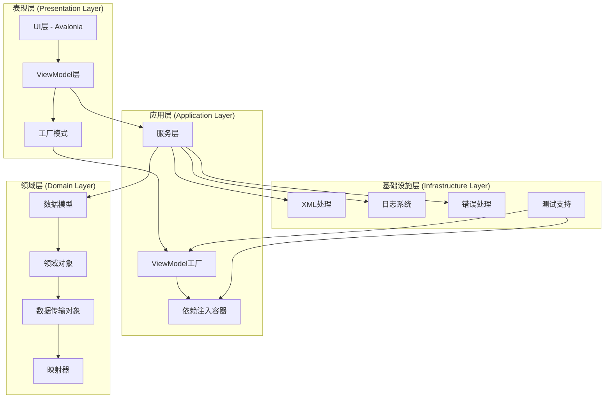

# Bannerlord Mod Editor 修复架构设计

## 执行摘要

本文档提供了一个完整的架构修复方案，旨在解决Bannerlord Mod Editor项目中存在的依赖注入配置不一致、ViewModel工厂模式问题、数据模型兼容性以及跨平台兼容性等关键问题。该架构设计采用分层架构模式，确保系统的可维护性、可扩展性和稳定性。

## 系统架构设计

### 1. 架构概览



### 2. 核心架构原则

#### 2.1 依赖倒置原则 (DIP)
- 高层模块不依赖低层模块，两者都依赖抽象
- 抽象不依赖细节，细节依赖抽象
- 使用接口定义服务契约

#### 2.2 单一职责原则 (SRP)
- 每个类只有一个改变的理由
- 服务层、数据层、表现层职责分离

#### 2.3 开放封闭原则 (OCP)
- 对扩展开放，对修改封闭
- 使用工厂模式和依赖注入实现扩展性

#### 2.4 接口隔离原则 (ISP)
- 使用多个专门的接口而不是单一通用接口
- 客户端不应该依赖不需要的接口

## 技术架构

### 1. 依赖注入配置策略

#### 1.1 统一的服务注册模式

```csharp
// 服务注册扩展方法
public static class ServiceCollectionExtensions
{
    public static IServiceCollection AddBannerlordServices(this IServiceCollection services)
    {
        // 核心服务
        services.AddSingleton<ILogService, LogService>();
        services.AddSingleton<IErrorHandlerService, ErrorHandlerService>();
        services.AddSingleton<IValidationService, ValidationService>();
        services.AddSingleton<IDataBindingService, DataBindingService>();
        
        // 工厂服务
        services.AddSingleton<IEditorFactory, UnifiedEditorFactory>();
        services.AddSingleton<IViewModelFactory, ViewModelFactory>();
        
        // Common层服务
        services.AddTransient<IFileDiscoveryService, FileDiscoveryService>();
        
        // 编辑器服务
        services.RegisterEditorServices();
        
        return services;
    }
    
    public static IServiceCollection RegisterEditorServices(this IServiceCollection services)
    {
        // 动态注册所有编辑器
        var editorTypes = Assembly.GetExecutingAssembly()
            .GetTypes()
            .Where(t => t.IsClass && !t.IsAbstract && t.Name.EndsWith("ViewModel"))
            .ToList();
            
        foreach (var editorType in editorTypes)
        {
            services.AddTransient(editorType);
        }
        
        return services;
    }
}
```

#### 1.2 生命周期管理

```csharp
// 服务生命周期配置
public class ServiceLifetimeConfig
{
    public static void Configure lifetimes(IServiceCollection services)
    {
        // 单例服务 - 应用程序生命周期
        services.AddSingleton<ILogService, LogService>();
        services.AddSingleton<IErrorHandlerService, ErrorHandlerService>();
        services.AddSingleton<IEditorFactory, UnifiedEditorFactory>();
        
        // 作用域服务 - 请求生命周期
        services.AddScoped<IValidationService, ValidationService>();
        services.AddScoped<IDataBindingService, DataBindingService>();
        
        // 瞬态服务 - 每次请求创建新实例
        services.AddTransient<IFileDiscoveryService, FileDiscoveryService>();
        services.AddTransient<BaseEditorViewModel>();
    }
}
```

### 2. ViewModel工厂模式改进

#### 2.1 统一的ViewModel工厂接口

```csharp
public interface IViewModelFactory
{
    // 创建ViewModel的通用方法
    TViewModel CreateViewModel<TViewModel>(params object[] parameters) 
        where TViewModel : ViewModelBase;
    
    // 创建带服务的ViewModel
    TViewModel CreateViewModelWithServices<TViewModel>(IServiceProvider serviceProvider) 
        where TViewModel : ViewModelBase;
    
    // 创建编辑器ViewModel
    TEditorViewModel CreateEditorViewModel<TEditorViewModel, TData, TItem>(
        string xmlFileName, 
        string editorName)
        where TEditorViewModel : BaseEditorViewModel<TData, TItem>
        where TData : class, new()
        where TItem : class, new();
    
    // 注册ViewModel类型
    void RegisterViewModel<TViewModel>(string key) 
        where TViewModel : ViewModelBase;
    
    // 获取所有注册的ViewModel类型
    IEnumerable<string> GetRegisteredViewModelTypes();
}
```

#### 2.2 ViewModel工厂实现

```csharp
public class ViewModelFactory : IViewModelFactory
{
    private readonly IServiceProvider _serviceProvider;
    private readonly Dictionary<string, Type> _viewModelTypes = new();
    private readonly ILogService _logService;
    private readonly IErrorHandlerService _errorHandlerService;

    public ViewModelFactory(
        IServiceProvider serviceProvider,
        ILogService logService,
        IErrorHandlerService errorHandlerService)
    {
        _serviceProvider = serviceProvider;
        _logService = logService;
        _errorHandlerService = errorHandlerService;
        
        RegisterViewModelsByReflection();
    }

    public TViewModel CreateViewModel<TViewModel>(params object[] parameters)
        where TViewModel : ViewModelBase
    {
        try
        {
            // 尝试通过服务提供器创建
            var viewModel = _serviceProvider.GetService<TViewModel>();
            if (viewModel != null)
            {
                return viewModel;
            }
            
            // 如果失败，尝试通过反射创建
            return (TViewModel)Activator.CreateInstance(typeof(TViewModel), parameters);
        }
        catch (Exception ex)
        {
            _errorHandlerService.HandleError(ex, $"Failed to create ViewModel: {typeof(TViewModel).Name}");
            throw;
        }
    }

    public TEditorViewModel CreateEditorViewModel<TEditorViewModel, TData, TItem>(
        string xmlFileName, 
        string editorName)
        where TEditorViewModel : BaseEditorViewModel<TData, TItem>
        where TData : class, new()
        where TItem : class, new()
    {
        try
        {
            // 获取必要的服务
            var errorHandler = _serviceProvider.GetService<IErrorHandlerService>();
            var logService = _serviceProvider.GetService<ILogService>();
            
            // 创建ViewModel实例
            var viewModel = (TEditorViewModel)Activator.CreateInstance(
                typeof(TEditorViewModel), 
                xmlFileName, 
                editorName,
                errorHandler,
                logService);
            
            return viewModel;
        }
        catch (Exception ex)
        {
            _errorHandlerService.HandleError(ex, $"Failed to create EditorViewModel: {typeof(TEditorViewModel).Name}");
            throw;
        }
    }

    private void RegisterViewModelsByReflection()
    {
        try
        {
            var viewModelAssembly = Assembly.GetExecutingAssembly();
            var viewModelTypes = viewModelAssembly.GetTypes()
                .Where(t => t.IsClass && !t.IsAbstract && typeof(ViewModelBase).IsAssignableFrom(t))
                .Where(t => t.GetCustomAttribute<ViewModelAttribute>() != null);

            foreach (var viewModelType in viewModelTypes)
            {
                var attribute = viewModelType.GetCustomAttribute<ViewModelAttribute>();
                if (attribute != null)
                {
                    _viewModelTypes[attribute.Key] = viewModelType;
                }
            }
        }
        catch (Exception ex)
        {
            _logService.LogException(ex, "Failed to register ViewModels by reflection");
        }
    }
}
```

### 3. 服务层架构优化

#### 3.1 服务接口统一化

```csharp
// 核心服务接口
public interface ICoreService
{
    Task InitializeAsync();
    Task ShutdownAsync();
    bool IsInitialized { get; }
}

// 日志服务接口
public interface ILogService : ICoreService
{
    void LogInfo(string message, string category = "General");
    void LogWarning(string message, string category = "General");
    void LogError(string message, string category = "General");
    void LogException(Exception exception, string context = "");
    Task<IEnumerable<LogEntry>> GetLogsAsync(DateTime? startTime = null, DateTime? endTime = null);
}

// 错误处理服务接口
public interface IErrorHandlerService : ICoreService
{
    Task<ErrorResult> HandleExceptionAsync(Exception exception, string context = "");
    void HandleError(Exception exception, string context = "");
    void ShowErrorMessage(string message, string title = "错误", ErrorSeverity severity = ErrorSeverity.Error);
    void ShowWarningMessage(string message, string title = "警告");
    void ShowInfoMessage(string message, string title = "信息");
    IEnumerable<ErrorLogEntry> GetErrorHistory();
}

// 验证服务接口
public interface IValidationService : ICoreService
{
    Task<ValidationResult> ValidateAsync(object entity);
    Task<ValidationResult> ValidatePropertyAsync(object entity, string propertyName);
    IObservable<bool> GetValidationObservable(object entity, string propertyName);
}

// 数据绑定服务接口
public interface IDataBindingService : ICoreService
{
    Task<bool> BindAsync(object source, string sourceProperty, object target, string targetProperty);
    Task<bool> UnbindAsync(object source, string sourceProperty, object target, string targetProperty);
    IObservable<object> CreatePropertyObservable(object source, string propertyName);
}
```

#### 3.2 服务实现模式

```csharp
public abstract class BaseService : ICoreService
{
    protected readonly ILogService LogService;
    protected readonly IErrorHandlerService ErrorHandlerService;
    
    public bool IsInitialized { get; protected set; }
    
    protected BaseService(ILogService logService, IErrorHandlerService errorHandlerService)
    {
        LogService = logService;
        ErrorHandlerService = errorHandlerService;
    }
    
    public virtual async Task InitializeAsync()
    {
        try
        {
            await OnInitializeAsync();
            IsInitialized = true;
            LogService.LogInfo($"{GetType().Name} initialized successfully", "Service");
        }
        catch (Exception ex)
        {
            await ErrorHandlerService.HandleExceptionAsync(ex, $"Failed to initialize {GetType().Name}");
            throw;
        }
    }
    
    public virtual async Task ShutdownAsync()
    {
        try
        {
            await OnShutdownAsync();
            IsInitialized = false;
            LogService.LogInfo($"{GetType().Name} shutdown successfully", "Service");
        }
        catch (Exception ex)
        {
            await ErrorHandlerService.HandleExceptionAsync(ex, $"Failed to shutdown {GetType().Name}");
            throw;
        }
    }
    
    protected virtual Task OnInitializeAsync() => Task.CompletedTask;
    protected virtual Task OnShutdownAsync() => Task.CompletedTask;
}

public class LogService : BaseService, ILogService
{
    private readonly ConcurrentQueue<LogEntry> _logEntries = new();
    private readonly object _lock = new();
    
    public LogService(IErrorHandlerService errorHandlerService) 
        : base(new LogService(errorHandlerService), errorHandlerService)
    {
    }
    
    public void LogInfo(string message, string category = "General")
    {
        var entry = new LogEntry
        {
            Timestamp = DateTime.UtcNow,
            Level = LogLevel.Info,
            Message = message,
            Category = category
        };
        
        lock (_lock)
        {
            _logEntries.Enqueue(entry);
        }
        
        Console.WriteLine($"[INFO] {category}: {message}");
    }
    
    // ... 其他方法实现
}
```

## 数据流架构

### 1. 数据模型统一策略

#### 1.1 DO/DTO架构模式

```csharp
// 领域对象基类
public abstract class DomainObject
{
    public Guid Id { get; set; } = Guid.NewGuid();
    public DateTime CreatedAt { get; set; } = DateTime.UtcNow;
    public DateTime UpdatedAt { get; set; } = DateTime.UtcNow;
}

// 数据传输对象基类
public abstract class DataTransferObject
{
    public Guid Id { get; set; }
    public DateTime CreatedAt { get; set; }
    public DateTime UpdatedAt { get; set; }
}

// 映射器基类
public abstract class BaseMapper<TDomain, TDto>
    where TDomain : DomainObject
    where TDto : DataTransferObject
{
    public abstract TDto ToDto(TDomain domain);
    public abstract TDomain ToDomain(TDto dto);
    
    public virtual IEnumerable<TDto> ToDto(IEnumerable<TDomain> domains)
    {
        return domains.Select(ToDto);
    }
    
    public virtual IEnumerable<TDomain> ToDomain(IEnumerable<TDto> dtos)
    {
        return dtos.Select(ToDomain);
    }
}
```

#### 1.2 XML序列化统一接口

```csharp
public interface IXmlSerializer<T>
{
    Task<T> DeserializeAsync(string xmlContent);
    Task<T> DeserializeFromFileAsync(string filePath);
    Task<string> SerializeAsync(T obj);
    Task SerializeToFileAsync(T obj, string filePath);
    Task<bool> ValidateAsync(string xmlContent);
}

public abstract class BaseXmlSerializer<T> : IXmlSerializer<T>
{
    protected readonly ILogService LogService;
    protected readonly IErrorHandlerService ErrorHandlerService;
    
    protected BaseXmlSerializer(ILogService logService, IErrorHandlerService errorHandlerService)
    {
        LogService = logService;
        ErrorHandlerService = errorHandlerService;
    }
    
    public virtual async Task<T> DeserializeAsync(string xmlContent)
    {
        try
        {
            LogService.LogInfo($"Deserializing {typeof(T).Name} from XML", "XmlSerializer");
            
            var serializer = new XmlSerializer(typeof(T));
            using var reader = new StringReader(xmlContent);
            var result = (T)serializer.Deserialize(reader);
            
            LogService.LogInfo($"Successfully deserialized {typeof(T).Name}", "XmlSerializer");
            return result;
        }
        catch (Exception ex)
        {
            await ErrorHandlerService.HandleExceptionAsync(ex, $"Failed to deserialize {typeof(T).Name}");
            throw;
        }
    }
    
    public virtual async Task<T> DeserializeFromFileAsync(string filePath)
    {
        try
        {
            var xmlContent = await File.ReadAllTextAsync(filePath);
            return await DeserializeAsync(xmlContent);
        }
        catch (Exception ex)
        {
            await ErrorHandlerService.HandleExceptionAsync(ex, $"Failed to deserialize {typeof(T).Name} from file: {filePath}");
            throw;
        }
    }
    
    public virtual async Task<string> SerializeAsync(T obj)
    {
        try
        {
            LogService.LogInfo($"Serializing {typeof(T).Name} to XML", "XmlSerializer");
            
            var serializer = new XmlSerializer(typeof(T));
            using var writer = new StringWriter();
            serializer.Serialize(writer, obj);
            var result = writer.ToString();
            
            LogService.LogInfo($"Successfully serialized {typeof(T).Name}", "XmlSerializer");
            return result;
        }
        catch (Exception ex)
        {
            await ErrorHandlerService.HandleExceptionAsync(ex, $"Failed to serialize {typeof(T).Name}");
            throw;
        }
    }
    
    public virtual async Task SerializeToFileAsync(T obj, string filePath)
    {
        try
        {
            var xmlContent = await SerializeAsync(obj);
            await File.WriteAllTextAsync(filePath, xmlContent);
        }
        catch (Exception ex)
        {
            await ErrorHandlerService.HandleExceptionAsync(ex, $"Failed to serialize {typeof(T).Name} to file: {filePath}");
            throw;
        }
    }
    
    public virtual async Task<bool> ValidateAsync(string xmlContent)
    {
        try
        {
            var xmlDoc = new XmlDocument();
            xmlDoc.LoadXml(xmlContent);
            return true;
        }
        catch (Exception ex)
        {
            await ErrorHandlerService.HandleExceptionAsync(ex, "XML validation failed");
            return false;
        }
    }
}
```

### 2. 数据流管理

```csharp
public interface IDataFlowManager
{
    Task<TData> LoadDataAsync<TData>(string filePath) where TData : class;
    Task SaveDataAsync<TData>(TData data, string filePath) where TData : class;
    Task<IEnumerable<TItem>> ProcessDataAsync<TData, TItem>(TData data, Func<TData, IEnumerable<TItem>> processor);
    Task<TData> CreateDataAsync<TData, TItem>(IEnumerable<TItem> items, Func<IEnumerable<TItem>, TData> creator);
}

public class DataFlowManager : IDataFlowManager
{
    private readonly IXmlSerializerFactory _serializerFactory;
    private readonly ILogService _logService;
    private readonly IErrorHandlerService _errorHandlerService;
    
    public DataFlowManager(
        IXmlSerializerFactory serializerFactory,
        ILogService logService,
        IErrorHandlerService errorHandlerService)
    {
        _serializerFactory = serializerFactory;
        _logService = logService;
        _errorHandlerService = errorHandlerService;
    }
    
    public async Task<TData> LoadDataAsync<TData>(string filePath) where TData : class
    {
        try
        {
            _logService.LogInfo($"Loading data from {filePath}", "DataFlow");
            
            var serializer = _serializerFactory.GetSerializer<TData>();
            var data = await serializer.DeserializeFromFileAsync(filePath);
            
            _logService.LogInfo($"Successfully loaded data from {filePath}", "DataFlow");
            return data;
        }
        catch (Exception ex)
        {
            await _errorHandlerService.HandleExceptionAsync(ex, $"Failed to load data from {filePath}");
            throw;
        }
    }
    
    public async Task SaveDataAsync<TData>(TData data, string filePath) where TData : class
    {
        try
        {
            _logService.LogInfo($"Saving data to {filePath}", "DataFlow");
            
            var serializer = _serializerFactory.GetSerializer<TData>();
            await serializer.SerializeToFileAsync(data, filePath);
            
            _logService.LogInfo($"Successfully saved data to {filePath}", "DataFlow");
        }
        catch (Exception ex)
        {
            await _errorHandlerService.HandleExceptionAsync(ex, $"Failed to save data to {filePath}");
            throw;
        }
    }
    
    public async Task<IEnumerable<TItem>> ProcessDataAsync<TData, TItem>(TData data, Func<TData, IEnumerable<TItem>> processor)
    {
        try
        {
            _logService.LogInfo($"Processing data of type {typeof(TData).Name}", "DataFlow");
            
            var items = processor(data);
            
            _logService.LogInfo($"Successfully processed {items.Count()} items", "DataFlow");
            return items;
        }
        catch (Exception ex)
        {
            await _errorHandlerService.HandleExceptionAsync(ex, $"Failed to process data of type {typeof(TData).Name}");
            throw;
        }
    }
    
    public async Task<TData> CreateDataAsync<TData, TItem>(IEnumerable<TItem> items, Func<IEnumerable<TItem>, TData> creator)
    {
        try
        {
            _logService.LogInfo($"Creating data of type {typeof(TData).Name}", "DataFlow");
            
            var data = creator(items);
            
            _logService.LogInfo($"Successfully created data of type {typeof(TData).Name}", "DataFlow");
            return data;
        }
        catch (Exception ex)
        {
            await _errorHandlerService.HandleExceptionAsync(ex, $"Failed to create data of type {typeof(TData).Name}");
            throw;
        }
    }
}
```

## 测试架构

### 1. 单元测试架构

#### 1.1 测试基础设置

```csharp
// 测试服务提供器
public static class TestServiceProvider
{
    private static IServiceProvider _serviceProvider;
    
    public static IServiceProvider GetServiceProvider()
    {
        if (_serviceProvider == null)
        {
            var services = new ServiceCollection();
            
            // 注册测试服务
            services.AddSingleton<ILogService, MockLogService>();
            services.AddSingleton<IErrorHandlerService, MockErrorHandlerService>();
            services.AddSingleton<IValidationService, MockValidationService>();
            services.AddSingleton<IDataBindingService, MockDataBindingService>();
            services.AddSingleton<IEditorFactory, MockEditorFactory>();
            services.AddSingleton<IViewModelFactory, MockViewModelFactory>();
            
            // 注册实际的服务（用于集成测试）
            services.AddTransient<IFileDiscoveryService, FileDiscoveryService>();
            
            _serviceProvider = services.BuildServiceProvider();
        }
        
        return _serviceProvider;
    }
    
    public static void Reset()
    {
        _serviceProvider = null;
    }
}

// 测试基类
public abstract class TestBase
{
    protected IServiceProvider ServiceProvider { get; }
    protected ILogService LogService { get; }
    protected IErrorHandlerService ErrorHandlerService { get; }
    protected IValidationService ValidationService { get; }
    protected IDataBindingService DataBindingService { get; }
    protected IEditorFactory EditorFactory { get; }
    protected IViewModelFactory ViewModelFactory { get; }
    
    protected TestBase()
    {
        ServiceProvider = TestServiceProvider.GetServiceProvider();
        LogService = ServiceProvider.GetRequiredService<ILogService>();
        ErrorHandlerService = ServiceProvider.GetRequiredService<IErrorHandlerService>();
        ValidationService = ServiceProvider.GetRequiredService<IValidationService>();
        DataBindingService = ServiceProvider.GetRequiredService<IDataBindingService>();
        EditorFactory = ServiceProvider.GetRequiredService<IEditorFactory>();
        ViewModelFactory = ServiceProvider.GetRequiredService<IViewModelFactory>();
    }
    
    [TearDown]
    public virtual void TearDown()
    {
        // 清理测试状态
    }
}
```

#### 1.2 ViewModel测试架构

```csharp
public abstract class ViewModelTestBase : TestBase
{
    protected TViewModel CreateViewModel<TViewModel>(params object[] parameters)
        where TViewModel : ViewModelBase
    {
        return ViewModelFactory.CreateViewModel<TViewModel>(parameters);
    }
    
    protected TEditorViewModel CreateEditorViewModel<TEditorViewModel, TData, TItem>(
        string xmlFileName, 
        string editorName)
        where TEditorViewModel : BaseEditorViewModel<TData, TItem>
        where TData : class, new()
        where TItem : class, new()
    {
        return ViewModelFactory.CreateEditorViewModel<TEditorViewModel, TData, TItem>(xmlFileName, editorName);
    }
    
    protected async Task<TViewModel> CreateAndInitializeViewModelAsync<TViewModel>()
        where TViewModel : ViewModelBase
    {
        var viewModel = CreateViewModel<TViewModel>();
        
        // 如果有初始化方法，调用它
        if (viewModel is IInitializable initializable)
        {
            await initializable.InitializeAsync();
        }
        
        return viewModel;
    }
}

// 具体测试示例
[TestFixture]
public class AttributeEditorViewModelTests : ViewModelTestBase
{
    [Test]
    public void Constructor_WithValidParameters_ShouldCreateInstance()
    {
        // Arrange
        var xmlFileName = "attributes.xml";
        var editorName = "Attribute Editor";
        
        // Act
        var viewModel = CreateEditorViewModel<AttributeEditorViewModel, AttributeData, Attribute>(
            xmlFileName, editorName);
        
        // Assert
        Assert.That(viewModel, Is.Not.Null);
        Assert.That(viewModel.XmlFileName, Is.EqualTo(xmlFileName));
        Assert.That(viewModel.EditorName, Is.EqualTo(editorName));
    }
    
    [Test]
    public async Task LoadFileAsync_WithValidFile_ShouldLoadData()
    {
        // Arrange
        var viewModel = CreateEditorViewModel<AttributeEditorViewModel, AttributeData, Attribute>(
            "attributes.xml", "Attribute Editor");
        
        // Act
        await viewModel.LoadFileAsync();
        
        // Assert
        Assert.That(viewModel.Items, Is.Not.Empty);
        Assert.That(viewModel.HasUnsavedChanges, Is.False);
    }
}
```

### 2. 集成测试架构

```csharp
public abstract class IntegrationTestBase : TestBase
{
    protected IDataFlowManager DataFlowManager { get; }
    protected IXmlSerializerFactory SerializerFactory { get; }
    
    protected IntegrationTestBase()
    {
        DataFlowManager = ServiceProvider.GetRequiredService<IDataFlowManager>();
        SerializerFactory = ServiceProvider.GetRequiredService<IXmlSerializerFactory>();
    }
    
    protected async Task<TData> LoadTestDataAsync<TData>(string fileName) where TData : class
    {
        var testDataPath = Path.Combine("TestData", fileName);
        return await DataFlowManager.LoadDataAsync<TData>(testDataPath);
    }
    
    protected async Task<string> SaveTestDataAsync<TData>(TData data, string fileName) where TData : class
    {
        var testDataPath = Path.Combine("TestData", fileName);
        await DataFlowManager.SaveDataAsync(data, testDataPath);
        return testDataPath;
    }
}

[TestFixture]
public class EditorIntegrationTests : IntegrationTestBase
{
    [Test]
    public async Task LoadAndSaveData_ShouldPreserveDataIntegrity()
    {
        // Arrange
        var originalData = await LoadTestDataAsync<AttributeData>("attributes.xml");
        
        // Act
        await SaveTestDataAsync(originalData, "attributes_test.xml");
        var loadedData = await LoadTestDataAsync<AttributeData>("attributes_test.xml");
        
        // Assert
        Assert.That(loadedData, Is.Not.Null);
        Assert.That(loadedData.Attributes.Count, Is.EqualTo(originalData.Attributes.Count));
        
        // 验证数据完整性
        for (int i = 0; i < originalData.Attributes.Count; i++)
        {
            Assert.That(loadedData.Attributes[i].Id, Is.EqualTo(originalData.Attributes[i].Id));
            Assert.That(loadedData.Attributes[i].Name, Is.EqualTo(originalData.Attributes[i].Name));
        }
    }
}
```

### 3. 跨平台测试策略

```csharp
[TestFixture]
[Platform("Win")]
public class WindowsIntegrationTests : IntegrationTestBase
{
    [Test]
    public async Task WindowsPathHandling_ShouldWorkCorrectly()
    {
        // Windows特定的路径测试
        var windowsPath = @"C:\TestData\attributes.xml";
        var result = await DataFlowManager.LoadDataAsync<AttributeData>(windowsPath);
        
        Assert.That(result, Is.Not.Null);
    }
}

[TestFixture]
[Platform("Linux")]
public class LinuxIntegrationTests : IntegrationTestBase
{
    [Test]
    public async Task LinuxPathHandling_ShouldWorkCorrectly()
    {
        // Linux特定的路径测试
        var linuxPath = "/tmp/testdata/attributes.xml";
        var result = await DataFlowManager.LoadDataAsync<AttributeData>(linuxPath);
        
        Assert.That(result, Is.Not.Null);
    }
}

[TestFixture]
[Platform("Mac")]
public class MacIntegrationTests : IntegrationTestBase
{
    [Test]
    public async Task MacPathHandling_ShouldWorkCorrectly()
    {
        // Mac特定的路径测试
        var macPath = "/Users/test/testdata/attributes.xml";
        var result = await DataFlowManager.LoadDataAsync<AttributeData>(macPath);
        
        Assert.That(result, Is.Not.Null);
    }
}
```

## 部署架构

### 1. GitHub Actions优化配置

```yaml
# .github/workflows/ci.yml
name: CI/CD Pipeline

on:
  push:
    branches: [ main, develop, feature/* ]
  pull_request:
    branches: [ main, develop ]

jobs:
  test:
    runs-on: ${{ matrix.os }}
    strategy:
      matrix:
        os: [ubuntu-latest, windows-latest, macos-latest]
        dotnet-version: [9.0.x]
        
    steps:
    - uses: actions/checkout@v4
    
    - name: Setup .NET
      uses: actions/setup-dotnet@v4
      with:
        dotnet-version: ${{ matrix.dotnet-version }}
        
    - name: Restore dependencies
      run: dotnet restore
      
    - name: Build
      run: dotnet build --no-restore
      
    - name: Run unit tests
      run: dotnet test BannerlordModEditor.Common.Tests --no-build --verbosity normal
      
    - name: Run UI tests
      run: dotnet test BannerlordModEditor.UI.Tests --no-build --verbosity normal
      
    - name: Run integration tests
      run: dotnet test BannerlordModEditor.IntegrationTests --no-build --verbosity normal
      
    - name: Generate coverage report
      run: |
        dotnet test --collect:"XPlat Code Coverage"
        dotnet reportgenerator -reports:coverage.xml -targetdir:coverage-report
        
    - name: Upload coverage reports
      uses: codecov/codecov-action@v3
      with:
        file: ./coverage.xml

  build:
    needs: test
    runs-on: ${{ matrix.os }}
    strategy:
      matrix:
        os: [ubuntu-latest, windows-latest, macos-latest]
        
    steps:
    - uses: actions/checkout@v4
    
    - name: Setup .NET
      uses: actions/setup-dotnet@v4
      with:
        dotnet-version: 9.0.x
        
    - name: Restore dependencies
      run: dotnet restore
      
    - name: Build
      run: dotnet build --configuration Release
      
    - name: Publish
      run: dotnet publish --configuration Release --output ./publish
      
    - name: Upload artifacts
      uses: actions/upload-artifact@v3
      with:
        name: ${{ matrix.os }}-build
        path: ./publish
```

### 2. 环境配置管理

```csharp
public class ConfigurationService
{
    private readonly IConfiguration _configuration;
    private readonly ILogService _logService;
    
    public ConfigurationService(IConfiguration configuration, ILogService logService)
    {
        _configuration = configuration;
        _logService = logService;
    }
    
    public T GetSetting<T>(string key, T defaultValue = default)
    {
        try
        {
            return _configuration.GetValue(key, defaultValue);
        }
        catch (Exception ex)
        {
            _logService.LogWarning($"Failed to get setting {key}: {ex.Message}", "Configuration");
            return defaultValue;
        }
    }
    
    public string GetConnectionString(string name)
    {
        return _configuration.GetConnectionString(name);
    }
    
    public IEnumerable<string> GetSupportedPlatforms()
    {
        return _configuration.GetSection("SupportedPlatforms").Get<string[]>();
    }
}

// appsettings.json
{
  "Logging": {
    "LogLevel": {
      "Default": "Information",
      "Microsoft": "Warning",
      "Microsoft.Hosting.Lifetime": "Information"
    }
  },
  "SupportedPlatforms": [ "Windows", "Linux", "MacOS" ],
  "TestDataPath": "TestData",
  "EnableDiagnostics": true,
  "MaxLogFileSize": "10MB",
  "LogRetentionDays": 30
}
```

### 3. 错误监控和报告

```csharp
public class DiagnosticsService : BaseService
{
    private readonly ConfigurationService _configurationService;
    private readonly ConcurrentQueue<DiagnosticEvent> _diagnosticEvents = new();
    
    public DiagnosticsService(
        ConfigurationService configurationService,
        ILogService logService,
        IErrorHandlerService errorHandlerService) 
        : base(logService, errorHandlerService)
    {
        _configurationService = configurationService;
    }
    
    public async Task RecordEventAsync(DiagnosticEvent diagnosticEvent)
    {
        try
        {
            _diagnosticEvents.Enqueue(diagnosticEvent);
            
            // 如果启用诊断，记录到日志
            if (_configurationService.GetSetting("EnableDiagnostics", false))
            {
                LogService.LogInfo($"Diagnostic event: {diagnosticEvent.EventType} - {diagnosticEvent.Message}", "Diagnostics");
            }
            
            // 如果事件严重，立即处理
            if (diagnosticEvent.Severity >= DiagnosticSeverity.Error)
            {
                await ProcessCriticalEventAsync(diagnosticEvent);
            }
        }
        catch (Exception ex)
        {
            await ErrorHandlerService.HandleExceptionAsync(ex, "Failed to record diagnostic event");
        }
    }
    
    public async Task<IEnumerable<DiagnosticEvent>> GetEventsAsync(DateTime? startTime = null, DateTime? endTime = null)
    {
        var events = _diagnosticEvents.Where(e => 
            (!startTime.HasValue || e.Timestamp >= startTime.Value) &&
            (!endTime.HasValue || e.Timestamp <= endTime.Value));
        
        return await Task.FromResult(events.ToList());
    }
    
    public async Task<DiagnosticReport> GenerateReportAsync()
    {
        try
        {
            var events = await GetEventsAsync();
            
            var report = new DiagnosticReport
            {
                GeneratedAt = DateTime.UtcNow,
                TotalEvents = events.Count(),
                EventsByType = events.GroupBy(e => e.EventType).ToDictionary(g => g.Key, g => g.Count()),
                EventsBySeverity = events.GroupBy(e => e.Severity).ToDictionary(g => g.Key, g => g.Count()),
                RecentErrors = events.Where(e => e.Severity >= DiagnosticSeverity.Error).Take(10).ToList()
            };
            
            return report;
        }
        catch (Exception ex)
        {
            await ErrorHandlerService.HandleExceptionAsync(ex, "Failed to generate diagnostic report");
            throw;
        }
    }
    
    private async Task ProcessCriticalEventAsync(DiagnosticEvent diagnosticEvent)
    {
        try
        {
            // 处理严重事件，如发送通知、记录到外部系统等
            LogService.LogError($"Critical diagnostic event: {diagnosticEvent.EventType} - {diagnosticEvent.Message}", "Diagnostics");
            
            // 可以扩展为发送邮件、Slack通知等
        }
        catch (Exception ex)
        {
            await ErrorHandlerService.HandleExceptionAsync(ex, "Failed to process critical diagnostic event");
        }
    }
}
```

## 关键组件接口定义

### 1. 核心接口

```csharp
// 应用程序生命周期接口
public interface IApplicationLifecycle
{
    Task StartupAsync();
    Task ShutdownAsync();
    bool IsRunning { get; }
    ApplicationState State { get; }
}

// 服务管理器接口
public interface IServiceManager
{
    Task InitializeServicesAsync();
    Task ShutdownServicesAsync();
    T GetService<T>() where T : class;
    IEnumerable<object> GetServices(Type serviceType);
}

// 插件系统接口
public interface IPluginManager
{
    Task LoadPluginsAsync(string pluginDirectory);
    Task UnloadPluginsAsync();
    IEnumerable<IPlugin> GetLoadedPlugins();
    Task<T> GetPluginAsync<T>(string pluginName) where T : IPlugin;
}

// 插件接口
public interface IPlugin
{
    string Name { get; }
    string Version { get; }
    string Description { get; }
    Task InitializeAsync(IServiceProvider serviceProvider);
    Task ExecuteAsync();
    Task ShutdownAsync();
}
```

### 2. 数据处理接口

```csharp
// 文件发现服务接口
public interface IFileDiscoveryService
{
    Task<IEnumerable<string>> DiscoverFilesAsync(string directory, string searchPattern);
    Task<FileDiscoveryResult> AnalyzeFileAsync(string filePath);
    Task<IEnumerable<FileAdaptationStatus>> GetAdaptationStatusAsync();
    Task<bool> IsFileAdaptedAsync(string filePath);
}

// XML适配服务接口
public interface IXmlAdaptationService
{
    Task<AdaptationResult> AdaptFileAsync(string filePath);
    Task<AdaptationResult> AdaptDirectoryAsync(string directory);
    Task<IEnumerable<AdaptationResult>> GetAdaptationHistoryAsync();
    Task<bool> RollbackAdaptationAsync(string filePath);
}

// 数据验证服务接口
public interface IDataValidationService
{
    Task<ValidationResult> ValidateXmlFileAsync(string filePath);
    Task<ValidationResult> ValidateDataModelAsync(object dataModel);
    Task<IEnumerable<ValidationIssue>> GetValidationIssuesAsync();
    Task<bool> FixValidationIssuesAsync(IEnumerable<ValidationIssue> issues);
}
```

### 3. 用户界面接口

```csharp
// 视图工厂接口
public interface IViewFactory
{
    TView CreateView<TView>() where TView : Control;
    TView CreateView<TView>(object dataContext) where TView : Control;
    Task<TView> CreateViewAsync<TView>(object dataContext) where TView : Control;
}

// 主题服务接口
public interface IThemeService
{
    Task SetThemeAsync(string themeName);
    Task<string> GetCurrentThemeAsync();
    Task<IEnumerable<string>> GetAvailableThemesAsync();
    Task ApplyThemeAsync(Control target);
}

// 对话框服务接口
public interface IDialogService
{
    Task<bool> ShowConfirmDialogAsync(string title, string message);
    Task<string> ShowInputDialogAsync(string title, string message, string defaultValue = "");
    Task<string> ShowOpenFileDialogAsync(string title, string filter);
    Task<string> ShowSaveFileDialogAsync(string title, string filter, string defaultFileName = "");
    Task ShowMessageDialogAsync(string title, string message, DialogType dialogType = DialogType.Information);
}
```

## 实施建议

### 1. 实施优先级

#### 阶段1：核心基础设施 (高优先级)
1. **依赖注入容器重构**
   - 统一服务注册模式
   - 实现服务生命周期管理
   - 创建测试友好的服务提供器

2. **ViewModel工厂模式重构**
   - 实现统一的ViewModel工厂接口
   - 重构现有编辑器ViewModel
   - 创建Mock工厂用于测试

3. **服务层架构优化**
   - 统一服务接口设计
   - 实现基础服务类
   - 添加错误处理和日志记录

#### 阶段2：数据层重构 (中优先级)
1. **DO/DTO模式实施**
   - 识别需要转换的数据模型
   - 创建领域对象和数据传输对象
   - 实现对象映射器

2. **XML序列化统一**
   - 创建统一的XML序列化接口
   - 实现基础序列化器
   - 添加数据验证功能

3. **数据流管理**
   - 实现数据流管理器
   - 创建数据管道
   - 添加错误恢复机制

#### 阶段3：测试架构完善 (中优先级)
1. **单元测试架构**
   - 创建测试基础设置
   - 实现ViewModel测试框架
   - 添加服务测试

2. **集成测试架构**
   - 创建集成测试基类
   - 实现端到端测试
   - 添加跨平台测试

3. **性能测试**
   - 创建性能测试框架
   - 实现负载测试
   - 添加内存泄漏检测

#### 阶段4：部署和监控 (低优先级)
1. **CI/CD优化**
   - 完善GitHub Actions配置
   - 添加自动化测试
   - 实现自动部署

2. **监控和诊断**
   - 实现诊断服务
   - 添加性能监控
   - 创建错误报告系统

### 2. 风险缓解

#### 风险1：现有代码兼容性
- **问题**：新架构可能与现有代码不兼容
- **缓解**：采用渐进式重构，保持向后兼容性
- **测试**：创建回归测试确保功能不变

#### 风险2：性能影响
- **问题**：新架构可能影响应用程序性能
- **缓解**：进行性能测试，优化关键路径
- **监控**：添加性能监控和报警

#### 风险3：学习曲线
- **问题**：团队可能需要时间学习新架构
- **缓解**：提供详细的文档和培训
- **支持**：创建示例和最佳实践指南

### 3. 成功指标

#### 技术指标
- **代码覆盖率**：单元测试覆盖率 > 80%
- **构建时间**：CI/CD构建时间 < 10分钟
- **启动时间**：应用程序启动时间 < 5秒
- **内存使用**：内存使用量 < 100MB

#### 业务指标
- **用户满意度**：用户满意度评分 > 4.5/5
- **错误率**：生产环境错误率 < 1%
- **功能完整性**：所有核心功能正常工作
- **性能指标**：响应时间 < 200ms

#### 维护指标
- **代码质量**：代码质量评分 > 8/10
- **技术债务**：技术债务评分 > 7/10
- **文档完整性**：API文档覆盖率 > 90%
- **团队生产力**：开发效率提升 > 20%

## 结论

本架构设计提供了一个全面的解决方案，解决了Bannerlord Mod Editor项目中的关键问题。通过采用分层架构、依赖注入、工厂模式和DO/DTO架构模式，我们可以构建一个可维护、可扩展和稳定的系统。

该架构设计不仅解决了当前的问题，还为未来的扩展和优化提供了良好的基础。通过分阶段实施，我们可以确保系统的稳定性和团队的适应性。

### 关键优势

1. **可维护性**：清晰的分层架构和依赖注入使代码更易于维护
2. **可扩展性**：工厂模式和插件系统支持功能扩展
3. **可测试性**：依赖注入和Mock支持使代码更易于测试
4. **跨平台性**：统一的接口和抽象支持跨平台部署
5. **错误处理**：完善的错误处理和恢复机制提高系统稳定性

### 下一步行动

1. **评审和批准**：与团队评审架构设计，获得批准
2. **详细规划**：制定详细的实施计划和时间表
3. **团队培训**：培训团队了解新架构和最佳实践
4. **开始实施**：按照优先级开始实施架构重构
5. **监控和调整**：监控实施过程，根据反馈进行调整

通过这个架构设计，我们可以确保Bannerlord ModEditor项目能够长期稳定地发展，并为用户提供更好的体验。