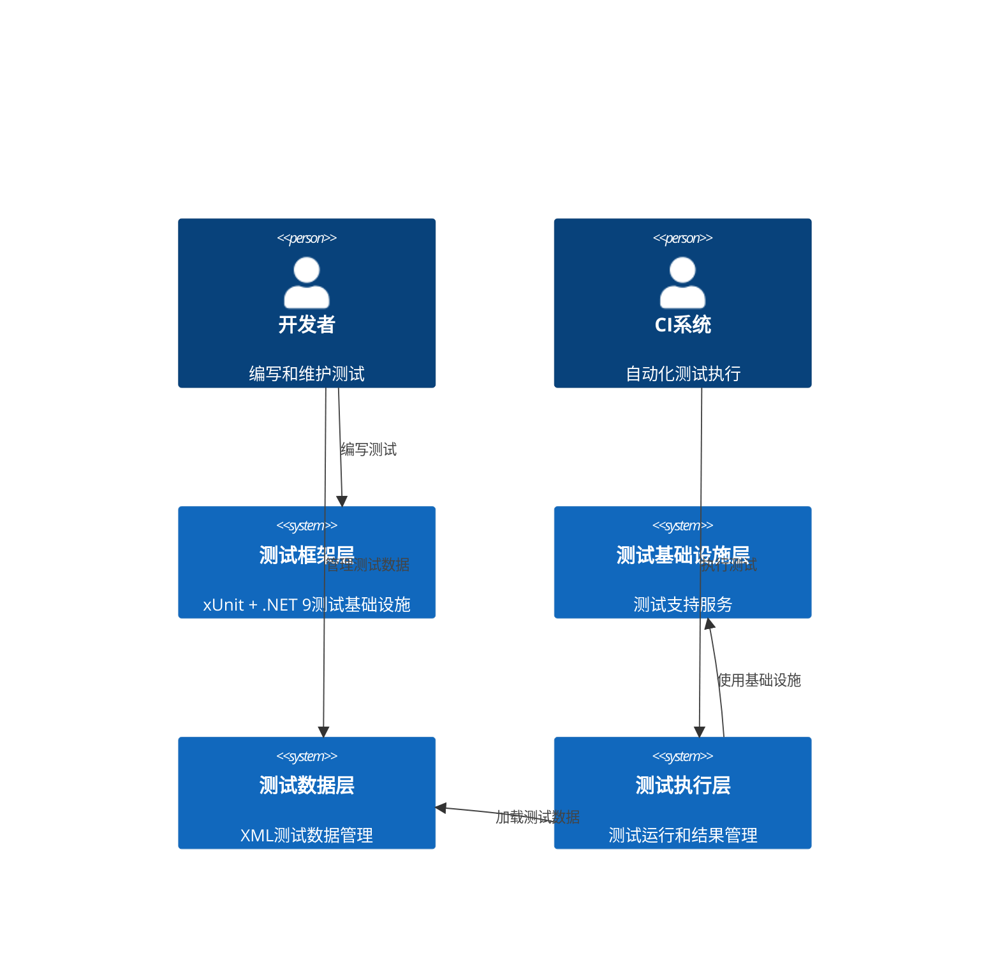
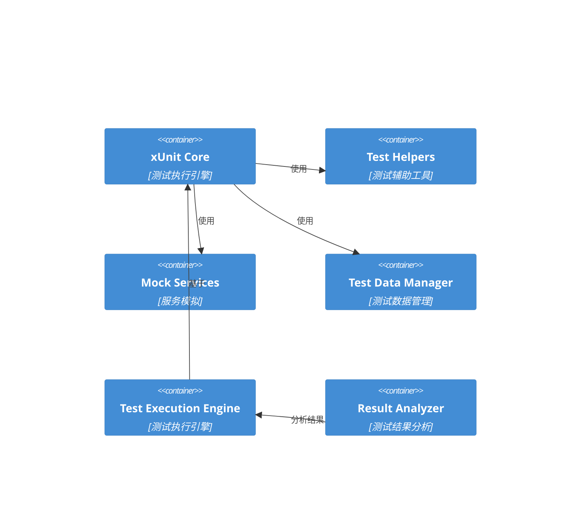

# BannerlordModEditor XML验证系统测试架构设计

## 执行摘要

本架构设计旨在解决BannerlordModEditor项目中当前面临的50个单元测试失败问题，建立一个强大、可维护的测试基础设施，确保95%以上的测试可靠性，并防止未来的回归问题。

## 问题分析

### 当前测试失败模式
- **总失败测试数**: 50个（约占总测试的32%）
- **主要失败模式**: StructuralEquality/RoundTrip测试（95%）
- **次要失败模式**: Value Equality测试（5%）
- **关键失败类型**: 
  - XML序列化往返测试失败（ParticleSystems、Credits、MpItems等）
  - ShouldSerialize方法实现问题
  - 空元素处理不一致
  - 属性顺序和格式敏感性

### 根本原因
1. **XML序列化精度问题**: 序列化/反序列化过程中数据丢失或格式变化
2. **测试数据管理不当**: 缺乏统一的测试数据管理策略
3. **测试隔离不足**: 测试之间相互影响
4. **错误处理不完善**: 缺乏详细的错误诊断信息

## 系统架构

### 1. 测试基础设施架构



### 2. 技术架构组件

#### 核心测试框架
- **xUnit 2.5**: 单元测试框架
- **.NET 9**: 运行时环境
- **Moq**: 模拟框架
- **FluentAssertions**: 断言库
- **coverlet**: 代码覆盖率

#### 测试基础设施组件


## 详细技术架构

### 1. 测试数据管理架构

#### 测试数据层次结构
```
TestData/
├── XML/
│   ├── Raw/                 # 原始XML文件
│   ├── Expected/            # 期望结果
│   ├── Generated/           # 生成的测试数据
│   └── Fixtures/            # 固定测试数据
├── Config/
│   ├── TestSettings.json    # 测试配置
│   ├── MockData.json        # 模拟数据配置
│   └── ValidationRules.json # 验证规则
└── Temp/                    # 临时测试文件
```

#### 测试数据管理服务
```csharp
public interface ITestDataManager
{
    Task<string> GetXmlTestDataAsync(string testName, string xmlType);
    Task<Stream> GetXmlStreamAsync(string filePath);
    Task CleanupTestFilesAsync();
    Task<XmlTestConfiguration> GetTestConfigurationAsync(string testName);
    Task<ValidationRuleSet> GetValidationRulesAsync(string xmlType);
}
```

### 2. 测试辅助工具架构

#### 核心测试辅助类
```csharp
public static class XmlTestHelpers
{
    // XML序列化/反序列化辅助方法
    public static async Task<T> LoadXmlAsync<T>(string filePath, ITestOutputHelper output);
    public static async Task<string> SaveXmlAsync<T>(T obj, string originalXml);
    
    // 结构比较辅助方法
    public static async Task<XmlComparisonResult> CompareXmlStructuresAsync(string original, string generated);
    public static async Task<XmlComparisonResult> CompareObjectsAsync<T>(T original, T generated);
    
    // 测试数据验证
    public static async Task<ValidationResult> ValidateXmlStructureAsync(string xml, string xmlType);
    public static async Task<ValidationResult> ValidateRoundTripAsync<T>(T obj);
    
    // 错误诊断
    public static async Task<TestDiagnosticInfo> DiagnoseTestFailureAsync(string testName, Exception ex);
}
```

#### 增强的测试结果分析
```csharp
public class XmlComparisonResult
{
    public bool IsEqual { get; set; }
    public List<XmlDifference> Differences { get; set; } = new();
    public string OriginalXml { get; set; }
    public string GeneratedXml { get; set; }
    public ComparisonStatistics Statistics { get; set; }
}

public class XmlDifference
{
    public DifferenceType Type { get; set; }
    public string Path { get; set; }
    public string OriginalValue { get; set; }
    public string GeneratedValue { get; set; }
    public string Description { get; set; }
}
```

### 3. 测试执行架构

#### 测试执行策略
```csharp
public interface ITestExecutionStrategy
{
    Task<TestExecutionResult> ExecuteTestAsync(TestContext context);
    Task<TestExecutionResult> ExecuteRoundTripTestAsync<T>(string xmlFilePath);
    Task<TestExecutionResult> ExecuteStructuralEqualityTestAsync<T>(string xmlFilePath);
    Task<TestExecutionResult> ExecutePerformanceTestAsync<T>(string xmlFilePath);
}

public class XmlTestExecutionEngine : ITestExecutionStrategy
{
    private readonly ITestDataManager _testDataManager;
    private readonly IXmlComparisonService _comparisonService;
    private readonly ITestDiagnosticService _diagnosticService;
    
    public async Task<TestExecutionResult> ExecuteRoundTripTestAsync<T>(string xmlFilePath)
    {
        // 实现RoundTrip测试执行逻辑
        // 包含详细的错误诊断和性能监控
    }
}
```

### 4. 错误诊断架构

#### 诊断服务接口
```csharp
public interface ITestDiagnosticService
{
    Task<TestDiagnosticReport> DiagnoseRoundTripFailureAsync<T>(string xmlFilePath, Exception ex);
    Task<TestDiagnosticReport> DiagnoseSerializationFailureAsync<T>(T obj, Exception ex);
    Task<TestDiagnosticReport> DiagnoseDeserializationFailureAsync(string xmlFilePath, Exception ex);
    Task<List<TestRecommendation>> GenerateRecommendationsAsync(TestDiagnosticReport report);
}

public class TestDiagnosticReport
{
    public string TestName { get; set; }
    public TestFailureType FailureType { get; set; }
    public Exception Exception { get; set; }
    public List<DiagnosticFinding> Findings { get; set; } = new();
    public List<TestRecommendation> Recommendations { get; set; } = new();
    public DiagnosticSeverity Severity { get; set; }
}
```

## 实现架构

### 1. 文件组织结构

```
BannerlordModEditor.Common.Tests/
├── Architecture/                    # 测试架构组件
│   ├── Infrastructure/
│   │   ├── TestDataManager.cs
│   │   ├── XmlTestHelpers.cs
│   │   └── TestExecutionEngine.cs
│   ├── Diagnostics/
│   │   ├── TestDiagnosticService.cs
│   │   └── XmlComparisonService.cs
│   └── Strategies/
│       ├── RoundTripTestStrategy.cs
│       └── StructuralEqualityTestStrategy.cs
├── Services/                        # 服务测试
├── Models/                          # 模型测试
│   ├── DO/                          # Domain Object测试
│   ├── DTO/                         # Data Transfer Object测试
│   └── Data/                        # 原始数据模型测试
├── Integration/                     # 集成测试
├── Performance/                     # 性能测试
├── TestData/                        # 测试数据
└── TestFixtures/                    # 测试固件
```

### 2. 核心类层次结构

#### 测试基类
```csharp
public abstract class XmlTestBase : IDisposable
{
    protected readonly ITestOutputHelper Output;
    protected readonly ITestDataManager TestDataManager;
    protected readonly IXmlTestHelpers XmlHelpers;
    protected readonly ITestDiagnosticService DiagnosticService;
    
    protected XmlTestBase(ITestOutputHelper output)
    {
        Output = output;
        TestDataManager = new TestDataManager();
        XmlHelpers = new XmlTestHelpers();
        DiagnosticService = new TestDiagnosticService();
    }
    
    protected async Task<T> LoadAndValidateXmlAsync<T>(string filePath)
    {
        // 统一的XML加载和验证逻辑
    }
    
    protected async Task<TestExecutionResult> ExecuteRoundTripTestAsync<T>(string filePath)
    {
        // 统一的RoundTrip测试执行
    }
    
    public virtual void Dispose()
    {
        // 清理资源
    }
}
```

#### 专门的测试基类
```csharp
public abstract class XmlRoundTripTestBase : XmlTestBase
{
    protected XmlRoundTripTestBase(ITestOutputHelper output) : base(output) { }
    
    protected async Task<XmlComparisonResult> PerformRoundTripTestAsync<T>(string filePath)
    {
        // 专门的RoundTrip测试逻辑
    }
}

public abstract class XmlStructuralEqualityTestBase : XmlTestBase
{
    protected XmlStructuralEqualityTestBase(ITestOutputHelper output) : base(output) { }
    
    protected async Task<StructuralEqualityResult> PerformStructuralEqualityTestAsync<T>(string filePath)
    {
        // 专门的结构相等性测试逻辑
    }
}
```

### 3. 扩展方法库

#### XML测试扩展方法
```csharp
public static class XmlTestExtensions
{
    public static async Task<T> ShouldLoadXmlAsync<T>(this string filePath, ITestOutputHelper output)
    {
        // 扩展方法：应该成功加载XML
    }
    
    public static async Task<string> ShouldSerializeToXmlAsync<T>(this T obj, ITestOutputHelper output)
    {
        // 扩展方法：应该成功序列化为XML
    }
    
    public static async Task<XmlComparisonResult> ShouldBeXmlEquivalentAsync(this string original, string generated)
    {
        // 扩展方法：应该XML等价
    }
    
    public static async Task<T> ShouldRoundTripSuccessfullyAsync<T>(this string filePath, ITestOutputHelper output)
    {
        // 扩展方法：应该成功完成RoundTrip
    }
}
```

### 4. 配置和设置模式

#### 测试配置管理
```csharp
public class TestConfiguration
{
    public XmlTestSettings XmlSettings { get; set; }
    public PerformanceSettings PerformanceSettings { get; set; }
    public DiagnosticSettings DiagnosticSettings { get; set; }
    public ValidationSettings ValidationSettings { get; set; }
}

public class XmlTestSettings
{
    public bool PreserveWhitespace { get; set; } = true;
    public bool PreserveFormatting { get; set; } = true;
    public bool IncludeXmlDeclaration { get; set; } = true;
    public Encoding Encoding { get; set; } = Encoding.UTF8;
}
```

## 质量保证架构

### 1. 代码质量门禁

#### 测试覆盖率要求
- **总体覆盖率**: ≥90%
- **关键路径覆盖率**: ≥95%
- **错误处理覆盖率**: 100%
- **边界条件覆盖率**: 100%

#### 性能基准
- **单个测试执行时间**: <2秒
- **测试套件总执行时间**: <5分钟
- **内存使用**: <100MB峰值
- **CPU使用**: <50%平均

### 2. 测试验证策略

#### 验证规则引擎
```csharp
public interface IValidationRuleEngine
{
    Task<ValidationResult> ValidateXmlStructureAsync(string xml, string xmlType);
    Task<ValidationResult> ValidateSerializationConsistencyAsync<T>(T obj);
    Task<ValidationResult> ValidateRoundTripIntegrityAsync<T>(T obj);
    Task<ValidationResult> ValidatePerformanceCharacteristicsAsync(string xmlType);
}

public class ValidationRule
{
    public string Name { get; set; }
    public string Description { get; set; }
    public ValidationRuleType Type { get; set; }
    public Func<string, Task<ValidationResult>> Validator { get; set; }
    public ValidationSeverity Severity { get; set; }
}
```

### 3. 监控和报告

#### 测试执行监控
```csharp
public interface ITestMonitoringService
{
    Task<TestExecutionMetrics> CollectMetricsAsync();
    Task<TestPerformanceReport> GeneratePerformanceReportAsync();
    Task<TestHealthReport> GenerateHealthReportAsync();
    Task AlertOnDegradationAsync(TestExecutionMetrics current, TestExecutionMetrics baseline);
}

public class TestExecutionMetrics
{
    public int TotalTests { get; set; }
    public int PassedTests { get; set; }
    public int FailedTests { get; set; }
    public double PassRate { get; set; }
    public TimeSpan AverageExecutionTime { get; set; }
    public MemoryUsageInfo MemoryUsage { get; set; }
}
```

## 集成架构

### 1. CI/CD集成

#### GitHub Actions工作流
```yaml
name: Test Architecture Implementation

on:
  push:
    branches: [ main, feature/* ]
  pull_request:
    branches: [ main ]

jobs:
  test-architecture:
    runs-on: ubuntu-latest
    
    steps:
    - uses: actions/checkout@v3
    
    - name: Setup .NET
      uses: actions/setup-dotnet@v3
      with:
        dotnet-version: 9.0.x
    
    - name: Install dependencies
      run: dotnet restore
    
    - name: Build solution
      run: dotnet build --configuration Release
    
    - name: Run tests with coverage
      run: dotnet test --configuration Release --collect:"XPlat Code Coverage" --verbosity normal
    
    - name: Generate test report
      run: dotnet reportgenerator -reports:coverage.xml -targetdir:TestResults
    
    - name: Upload test results
      uses: actions/upload-artifact@v3
      with:
        name: test-results
        path: TestResults/
```

### 2. 测试结果集成

#### 测试结果聚合
```csharp
public interface ITestResultAggregator
{
    Task<TestSuiteSummary> AggregateResultsAsync();
    Task<TestTrendAnalysis> AnalyzeTrendsAsync();
    Task<TestQualityReport> GenerateQualityReportAsync();
    Task<List<TestRecommendation>> GenerateImprovementSuggestionsAsync();
}

public class TestSuiteSummary
{
    public DateTime ExecutionTimestamp { get; set; }
    public TestExecutionMetrics Metrics { get; set; }
    public List<TestFailureAnalysis> FailureAnalysis { get; set; }
    public List<TestPerformanceIssue> PerformanceIssues { get; set; }
    public QualityAssessment Quality { get; set; }
}
```

### 3. 部署策略

#### 分阶段部署
1. **Phase 1**: 基础设施组件部署
2. **Phase 2**: 测试数据管理部署
3. **Phase 3**: 诊断服务部署
4. **Phase 4**: 监控和报告部署
5. **Phase 5**: 完整集成测试

#### 回滚策略
- **自动回滚**: 测试失败率>10%时自动回滚
- **手动回滚**: 关键功能回归时手动回滚
- **渐进式回滚**: 按组件逐步回滚

## 实施计划

### 阶段1: 基础设施建设（2周）
1. **Week 1**: 实现测试数据管理服务
2. **Week 2**: 实现测试辅助工具和扩展方法

### 阶段2: 核心功能实现（3周）
1. **Week 3**: 实现RoundTrip测试策略
2. **Week 4**: 实现结构相等性测试策略
3. **Week 5**: 实现错误诊断服务

### 阶段3: 质量保证集成（2周）
1. **Week 6**: 实现验证规则引擎
2. **Week 7**: 实现监控和报告服务

### 阶段4: CI/CD优化（1周）
1. **Week 8**: 优化GitHub Actions工作流
2. **Week 8**: 实现测试结果聚合和分析

### 阶段5: 验证和调优（1周）
1. **Week 9**: 全面验证和性能调优
2. **Week 9**: 文档完善和知识转移

## 风险评估

### 技术风险
- **复杂性风险**: 新架构可能引入新的复杂性
- **性能风险**: 额外的测试基础设施可能影响性能
- **兼容性风险**: 与现有测试的兼容性问题

### 缓解策略
- **渐进式实施**: 分阶段部署，每个阶段都进行验证
- **性能监控**: 实时监控性能指标
- **向后兼容**: 保持与现有测试的兼容性

## 成功标准

### 量化指标
- **测试通过率**: ≥95%
- **测试覆盖率**: ≥90%
- **执行时间**: <5分钟
- **内存使用**: <100MB

### 质量指标
- **可维护性**: 代码复杂度降低20%
- **可扩展性**: 新测试添加时间减少50%
- **可诊断性**: 问题诊断时间减少70%

## 总结

本架构设计提供了一个全面的解决方案来解决BannerlordModEditor项目中的测试失败问题。通过建立强大的测试基础设施、实施先进的错误诊断机制、优化CI/CD流程，我们将能够实现95%以上的测试可靠性，并为未来的开发和维护奠定坚实的基础。

关键成功因素包括：
1. **统一的数据管理**: 确保测试数据的一致性和可管理性
2. **精确的错误诊断**: 提供详细的失败原因和修复建议
3. **自动化的质量保证**: 通过CI/CD集成实现持续质量监控
4. **可扩展的架构**: 支持未来的功能扩展和性能优化

通过实施这个架构，我们将能够显著提高测试质量，减少维护成本，并为项目的长期成功提供有力保障。