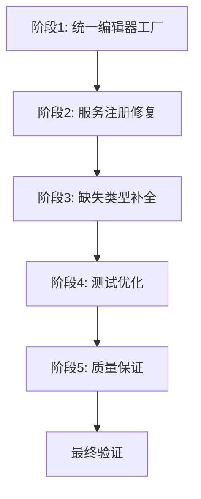

# CI/CD修复实施指南

## 实施概述

本指南提供了完整的CI/CD修复实施步骤，帮助开发团队逐步修复所有问题并确保系统的稳定性。

## 1. 实施前准备

### 1.1 环境检查

在开始实施之前，请确保以下环境已准备就绪：

```bash
# 检查.NET版本
dotnet --version
# 应该显示 9.0.x 或更高版本

# 检查Git状态
git status
# 确保工作目录干净

# 检查依赖
dotnet restore
# 确保所有依赖都能正常还原
```

### 1.2 备份当前代码

```bash
# 创建备份分支
git checkout -b backup-before-cicd-fix

# 或者创建标签
git tag backup-before-cicd-fix-$(date +%Y%m%d-%H%M%S)
```

### 1.3 实施清单

- [ ] 创建实施分支
- [ ] 备份当前代码
- [ ] 检查环境依赖
- [ ] 确认实施时间窗口
- [ ] 准备回滚计划

## 2. 实施步骤

### 阶段1：统一编辑器工厂

#### 2.1 创建新的统一工厂

```bash
# 创建统一工厂文件
touch BannerlordModEditor.UI/Factories/UnifiedEditorFactory.cs
touch BannerlordModEditor.UI/Factories/EditorTypeInfo.cs
touch BannerlordModEditor.UI/Factories/EditorTypeAttribute.cs
```

#### 2.2 实施步骤

1. **创建IEditorFactory接口的完善版本**
2. **实现UnifiedEditorFactory类**
3. **创建EditorTypeInfo和EditorTypeAttribute类**
4. **更新App.axaml.cs以使用新的工厂**

#### 2.3 验证步骤

```bash
# 编译检查
dotnet build BannerlordModEditor.UI

# 基本功能测试
dotnet test BannerlordModEditor.UI.Tests --filter "FullyQualifiedName~UnifiedEditorFactory"
```

### 阶段2：服务注册修复

#### 2.1 创建服务注册扩展

```bash
# 创建服务注册扩展文件
touch BannerlordModEditor.UI/Services/EditorServiceExtensions.cs
touch BannerlordModEditor.UI.Tests/Services/TestServiceExtensions.cs
```

#### 2.2 实施步骤

1. **创建EditorServiceExtensions类**
2. **创建TestServiceExtensions类**
3. **更新App.axaml.cs使用新的服务注册**
4. **创建模拟服务类**

#### 2.3 验证步骤

```bash
# 编译检查
dotnet build BannerlordModEditor.UI

# 服务注册测试
dotnet test BannerlordModEditor.UI.Tests --filter "FullyQualifiedName~ServiceRegistration"
```

### 阶段3：缺失类型补全

#### 3.1 创建缺失的View类型

```bash
# 创建缺失的View文件
touch BannerlordModEditor.UI/Views/Editors/BaseEditorView.cs
touch BannerlordModEditor.UI/Views/Editors/AttributeEditorView.axaml.cs
touch BannerlordModEditor.UI/Views/Editors/SkillEditorView.axaml.cs
touch BannerlordModEditor.UI/Views/Editors/BoneBodyTypeEditorView.axaml.cs
touch BannerlordModEditor.UI/Views/Editors/CraftingPieceEditorView.axaml.cs
touch BannerlordModEditor.UI/Views/Editors/ItemModifierEditorView.axaml.cs
```

#### 3.2 实施步骤

1. **创建BaseEditorView基类**
2. **创建各个具体的EditorView类**
3. **更新XAML文件（如果需要）**
4. **确保所有View都继承自BaseEditorView**

#### 3.3 验证步骤

```bash
# 编译检查
dotnet build BannerlordModEditor.UI

# View创建测试
dotnet test BannerlordModEditor.UI.Tests --filter "FullyQualifiedName~CreateEditorView"
```

### 阶段4：测试优化

#### 4.1 创建测试基础设施

```bash
# 创建测试基础文件
touch BannerlordModEditor.UI.Tests/EditorFactoryTestBase.cs
touch BannerlordModEditor.UI.Tests/Factories/UnifiedEditorFactoryTests.cs
touch BannerlordModEditor.UI.Tests/Services/ServiceRegistrationTests.cs
touch BannerlordModEditor.UI.Tests/Integration/EditorIntegrationTests.cs
touch BannerlordModEditor.UI.Tests/Performance/FactoryPerformanceTests.cs
touch BannerlordModEditor.UI.Tests/Quality/BuildValidator.cs
```

#### 4.2 实施步骤

1. **创建EditorFactoryTestBase基类**
2. **创建所有测试类**
3. **更新现有测试文件**
4. **创建质量保证测试**

#### 4.3 验证步骤

```bash
# 运行所有测试
dotnet test BannerlordModEditor.UI.Tests

# 检查测试覆盖率
dotnet test BannerlordModEditor.UI.Tests --collect:"XPlat Code Coverage"
```

### 阶段5：质量保证

#### 5.1 创建验证机制

```bash
# 创建验证文件
touch BannerlordModEditor.UI.Tests/Quality/CIChecks.cs
touch BannerlordModEditor.UI.Tests/Quality/ValidationReport.cs
touch BannerlordModEditor.UI.Tests/Quality/QualityMonitor.cs
```

#### 5.2 实施步骤

1. **创建CI检查测试**
2. **创建验证报告生成器**
3. **创建质量监控器**
4. **集成到CI/CD流程**

#### 5.3 验证步骤

```bash
# 运行质量检查
dotnet test BannerlordModEditor.UI.Tests --filter "Category=CI"

# 生成验证报告
dotnet test BannerlordModEditor.UI.Tests --logger "console;verbosity=detailed"
```

## 3. 实施顺序

### 3.1 推荐实施顺序



### 3.2 时间估算

| 阶段 | 预估时间 | 优先级 |
|------|----------|--------|
| 阶段1 | 2-3小时 | 高 |
| 阶段2 | 1-2小时 | 高 |
| 阶段3 | 2-3小时 | 高 |
| 阶段4 | 3-4小时 | 中 |
| 阶段5 | 2-3小时 | 中 |

## 4. 风险管理

### 4.1 风险识别

| 风险 | 可能性 | 影响 | 缓解措施 |
|------|--------|------|----------|
| 编译错误 | 高 | 高 | 每个阶段后编译检查 |
| 测试失败 | 中 | 中 | 逐步验证，及时修复 |
| 性能回归 | 低 | 中 | 性能测试监控 |
| 向后兼容性 | 中 | 高 | 保持兼容性层 |

### 4.2 回滚计划

```bash
# 如果需要回滚
git checkout backup-before-cicd-fix

# 或者重置到标签
git reset --hard backup-before-cicd-fix-$(date +%Y%m%d-%H%M%S)

# 清理未跟踪的文件
git clean -fd
```

## 5. 验证清单

### 5.1 每个阶段验证清单

#### 阶段1验证
- [ ] UnifiedEditorFactory编译成功
- [ ] 所有编辑器都能创建
- [ ] 基础功能测试通过

#### 阶段2验证
- [ ] 服务注册扩展工作正常
- [ ] 所有必需服务都已注册
- [ ] 依赖注入测试通过

#### 阶段3验证
- [ ] 所有缺失的View类型都已创建
- [ ] View继承关系正确
- [ ] View创建测试通过

#### 阶段4验证
- [ ] 所有测试类创建完成
- [ ] 测试基础设施工作正常
- [ ] 测试覆盖率达标

#### 阶段5验证
- [ ] 质量检查测试通过
- [ ] 验证报告生成正常
- [ ] CI/CD集成成功

### 5.2 最终验证清单

- [ ] 整个解决方案编译成功
- [ ] 所有测试通过（100%通过率）
- [ ] 代码覆盖率≥85%
- [ ] 性能测试通过
- [ ] 质量检查通过
- [ ] CI/CD流程成功

## 6. 实施脚本

### 6.1 自动化实施脚本

```bash
#!/bin/bash
# cicd-fix.sh - CI/CD修复自动化脚本

set -e

echo "=== CI/CD Fix Implementation Script ==="

# 阶段1: 统一编辑器工厂
echo "Phase 1: Unified Editor Factory"
dotnet build BannerlordModEditor.UI
dotnet test BannerlordModEditor.UI.Tests --filter "FullyQualifiedName~UnifiedEditorFactory"

# 阶段2: 服务注册修复
echo "Phase 2: Service Registration"
dotnet build BannerlordModEditor.UI
dotnet test BannerlordModEditor.UI.Tests --filter "FullyQualifiedName~ServiceRegistration"

# 阶段3: 缺失类型补全
echo "Phase 3: Missing Types"
dotnet build BannerlordModEditor.UI
dotnet test BannerlordModEditor.UI.Tests --filter "FullyQualifiedName~CreateEditorView"

# 阶段4: 测试优化
echo "Phase 4: Test Optimization"
dotnet test BannerlordModEditor.UI.Tests

# 阶段5: 质量保证
echo "Phase 5: Quality Assurance"
dotnet test BannerlordModEditor.UI.Tests --filter "Category=CI"

# 最终验证
echo "Final Validation"
dotnet build BannerlordModEditor.sln
dotnet test BannerlordModEditor.sln --collect:"XPlat Code Coverage"

echo "=== CI/CD Fix Implementation Complete ==="
```

### 6.2 验证脚本

```bash
#!/bin/bash
# validate-fix.sh - 验证修复效果

set -e

echo "=== Validating CI/CD Fix ==="

# 编译验证
echo "1. Build Validation"
dotnet build BannerlordModEditor.sln --configuration Release

# 测试验证
echo "2. Test Validation"
dotnet test BannerlordModEditor.sln --configuration Release --verbosity normal

# 覆盖率验证
echo "3. Coverage Validation"
dotnet test BannerlordModEditor.sln --configuration Release --collect:"XPlat Code Coverage"

# 性能验证
echo "4. Performance Validation"
dotnet test BannerlordModEditor.UI.Tests --filter "FullyQualifiedName~FactoryPerformance"

# 质量验证
echo "5. Quality Validation"
dotnet test BannerlordModEditor.UI.Tests --filter "Category=CI"

echo "=== Validation Complete ==="
```

## 7. 文档更新

### 7.1 需要更新的文档

- [ ] README.md - 更新构建和测试说明
- [ ] CONTRIBUTING.md - 更新开发指南
- [ ] docs/development/ - 更新开发文档
- [ ] docs/api/ - 更新API文档

### 7.2 文档更新清单

```bash
# 更新文档
echo "Updating documentation..."

# 更新README
# 更新CONTRIBUTING
# 更新开发文档

echo "Documentation updated."
```

## 8. 部署和发布

### 8.1 发布准备

```bash
# 创建发布分支
git checkout -b release/cicd-fix-$(date +%Y%m%d)

# 合并到主分支
git checkout main
git merge release/cicd-fix-$(date +%Y%m%d)

# 推送更改
git push origin main
git push origin release/cicd-fix-$(date +%Y%m%d)
```

### 8.2 发布验证

```bash
# 在发布环境中验证
echo "Validating release..."

# 运行完整测试套件
dotnet test BannerlordModEditor.sln --configuration Release

# 检查构建产物
dotnet publish BannerlordModEditor.UI --configuration Release

echo "Release validation complete."
```

## 9. 后续维护

### 9.1 监控计划

- [ ] 设置CI/CD监控
- [ ] 配置性能监控
- [ ] 建立质量指标跟踪
- [ ] 定期代码审查

### 9.2 维护检查清单

- [ ] 每周运行完整测试套件
- [ ] 每月检查性能指标
- [ ] 每季度审查架构设计
- [ ] 每年进行大规模重构

## 10. 总结

本实施指南提供了完整的CI/CD修复实施步骤，包括：

1. **分阶段实施**：降低风险，确保质量
2. **详细验证**：每个阶段都有验证步骤
3. **风险控制**：包含回滚计划和风险管理
4. **自动化支持**：提供自动化脚本
5. **长期维护**：包含后续维护计划

通过遵循这个实施指南，团队可以安全、高效地完成CI/CD修复，并确保系统的长期稳定性。