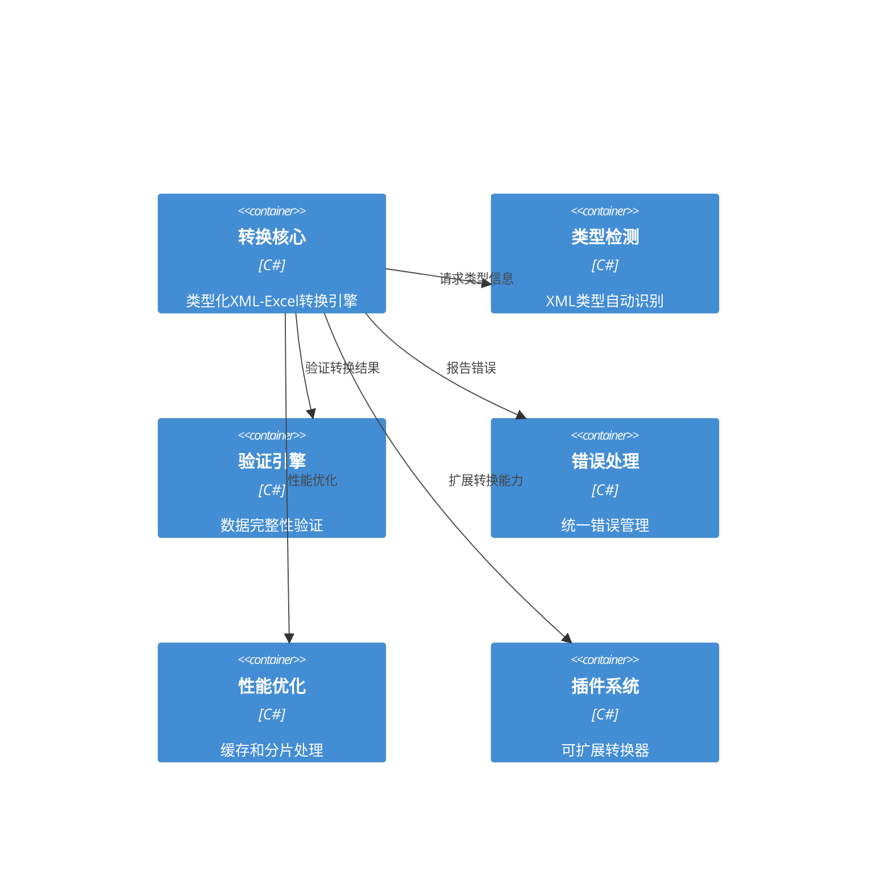

# XML-Excel互转适配系统架构设计

## 执行摘要

本文档详细描述了Bannerlord模组编辑器的XML-Excel互转适配系统架构。该系统基于现有的DO/DTO架构模式，扩展了FormatConversionService以支持更多XML类型，提供了类型化的转换器架构、智能类型检测、完善的错误处理机制和优化的性能方案。

## 架构概述

### 系统目标
- **类型化转换**: 基于DO/DTO架构的强类型XML-Excel转换
- **智能检测**: 自动识别XML类型并选择合适的转换策略
- **高性能**: 支持大文件分片处理和异步操作
- **用户友好**: 完善的错误处理和进度反馈
- **可扩展**: 插件化架构支持新的XML类型

### 系统边界
```mermaid
C4Context
    User(user, "用户", "模组开发者")
    System(xml_excel_system, "XML-Excel互转适配系统", "处理XML和Excel文件转换")
    System_Ext(common_layer, "Common层", "DO/DTO模型和XML处理")
    System_Ext(tui_layer, "TUI层", "用户界面和命令行接口")
    System_Ext(file_system, "文件系统", "XML和Excel文件存储")
    
    Rel(user, xml_excel_system, "使用转换功能")
    Rel(xml_excel_system, common_layer, "使用DO模型和XML服务")
    Rel(xml_excel_system, tui_layer, "提供转换接口")
    Rel(xml_excel_system, file_system, "读取和写入文件")
```

### 核心架构组件


## 核心架构设计

### 1. 类型化转换器架构

#### 1.1 转换器层次结构
```csharp
// 基础转换器接口
public interface IXmlExcelConverter
{
    Task<ConversionResult> XmlToExcelAsync(string xmlPath, string excelPath, ConversionOptions options);
    Task<ConversionResult> ExcelToXmlAsync(string excelPath, string xmlPath, ConversionOptions options);
    Task<ValidationResult> ValidateXmlAsync(string xmlPath);
    Task<ValidationResult> ValidateExcelAsync(string excelPath);
    bool SupportsType(string xmlType);
}

// 类型化转换器接口
public interface ITypedXmlExcelConverter<T> : IXmlExcelConverter
    where T : class, new()
{
    Task<T> LoadXmlAsync(string xmlPath);
    Task SaveXmlAsync(T data, string xmlPath);
    Task<ExcelData> ConvertToExcelAsync(T data);
    Task<T> ConvertFromExcelAsync(ExcelData excelData);
}

// 通用转换器
public class GenericXmlExcelConverter : IXmlExcelConverter
{
    // 通用XML-Excel转换逻辑
}

// 类型化转换器基类
public abstract class TypedXmlExcelConverterBase<T> : ITypedXmlExcelConverter<T>
    where T : class, new()
{
    // 通用类型化转换逻辑
}

// 具体类型转换器示例
public class ActionTypesXmlExcelConverter : TypedXmlExcelConverterBase<ActionTypesDO>
{
    // ActionTypes特定的转换逻辑
}
```

#### 1.2 转换器工厂
```csharp
public interface IXmlExcelConverterFactory
{
    IXmlExcelConverter GetConverter(string xmlType);
    IXmlExcelConverter GetConverter<T>() where T : class, new();
    IEnumerable<string> GetSupportedTypes();
    bool IsTypeSupported(string xmlType);
    void RegisterConverter(string xmlType, IXmlExcelConverter converter);
}

public class XmlExcelConverterFactory : IXmlExcelConverterFactory
{
    private readonly Dictionary<string, IXmlExcelConverter> _converters;
    private readonly IServiceProvider _serviceProvider;
    
    public XmlExcelConverterFactory(IServiceProvider serviceProvider)
    {
        _serviceProvider = serviceProvider;
        _converters = new Dictionary<string, IXmlExcelConverter>();
        RegisterDefaultConverters();
    }
    
    private void RegisterDefaultConverters()
    {
        // 注册已适配的XML类型转换器
        RegisterConverter<ActionTypesDO>();
        RegisterConverter<CombatParametersDO>();
        RegisterConverter<ItemModifiersDO>();
        // ... 其他类型
    }
    
    private void RegisterConverter<T>() where T : class, new()
    {
        var xmlType = typeof(T).Name.Replace("DO", "");
        var converterType = typeof(TypedXmlExcelConverter<>).MakeGenericType(typeof(T));
        var converter = (IXmlExcelConverter)Activator.CreateInstance(converterType, _serviceProvider)!;
        _converters[xmlType] = converter;
    }
}
```

### 2. 类型检测和映射系统

#### 2.1 增强的类型检测服务
```csharp
public interface IEnhancedXmlTypeDetectionService
{
    Task<XmlTypeInfo> DetectXmlTypeAsync(string xmlPath);
    Task<XmlTypeInfo> DetectXmlTypeAsync(XDocument xmlDocument);
    Task<List<XmlTypeInfo>> GetSupportedXmlTypesAsync();
    Task<ConversionStrategy> GetConversionStrategyAsync(string xmlType);
    Task<bool> IsXmlTypeSupportedAsync(string xmlType);
    Task<Type?> GetModelTypeAsync(string xmlType);
    void RegisterXmlType(XmlTypeInfo typeInfo);
    void ClearCache();
}

public class EnhancedXmlTypeDetectionService : IEnhancedXmlTypeDetectionService
{
    private readonly Dictionary<string, XmlTypeInfo> _supportedTypes;
    private readonly Dictionary<string, XmlTypeInfo> _cache;
    private readonly IFileDiscoveryService _fileDiscoveryService;
    private readonly IMemoryCache _memoryCache;
    
    public async Task<XmlTypeInfo> DetectXmlTypeAsync(string xmlPath)
    {
        // 1. 检查缓存
        var cacheKey = GetCacheKey(xmlPath);
        if (_memoryCache.TryGetValue(cacheKey, out XmlTypeInfo? cachedInfo))
        {
            return cachedInfo;
        }
        
        // 2. 基于文件名检测
        var fileName = Path.GetFileNameWithoutExtension(xmlPath);
        if (_supportedTypes.TryGetValue(fileName, out var typeInfo))
        {
            var result = await ValidateXmlStructureAsync(xmlPath, typeInfo);
            CacheResult(cacheKey, result);
            return result;
        }
        
        // 3. 基于XML结构检测
        var result = await DetectFromXmlStructureAsync(xmlPath);
        CacheResult(cacheKey, result);
        return result;
    }
    
    private async Task<XmlTypeInfo> DetectFromXmlStructureAsync(string xmlPath)
    {
        using var reader = XmlReader.Create(xmlPath, new XmlReaderSettings
        {
            IgnoreWhitespace = true,
            IgnoreComments = true,
            DtdProcessing = DtdProcessing.Ignore
        });
        
        var xmlDoc = XDocument.Load(reader);
        var rootElement = xmlDoc.Root;
        
        if (rootElement == null)
        {
            return new XmlTypeInfo { IsSupported = false };
        }
        
        // 分析XML结构特征
        var analysisResult = await AnalyzeXmlStructureAsync(rootElement);
        
        // 基于特征匹配最合适的类型
        var matchedType = FindBestMatch(analysisResult);
        
        return matchedType ?? new XmlTypeInfo
        {
            XmlType = rootElement.Name.LocalName,
            IsSupported = true,
            SupportedOperations = new List<SupportedOperation>
            {
                SupportedOperation.Read,
                SupportedOperation.Write,
                SupportedOperation.ConvertToExcel,
                SupportedOperation.ConvertFromExcel
            }
        };
    }
}
```

#### 2.2 XML结构分析器
```csharp
public interface IXmlStructureAnalyzer
{
    Task<XmlAnalysisResult> AnalyzeStructureAsync(XDocument xmlDocument);
    Task<XmlAnalysisResult> AnalyzeStructureAsync(string xmlPath);
    Task<SchemaInfo> InferSchemaAsync(XElement rootElement);
    Task<ComplexityScore> CalculateComplexityAsync(XElement rootElement);
}

public class XmlStructureAnalyzer : IXmlStructureAnalyzer
{
    public async Task<XmlAnalysisResult> AnalyzeStructureAsync(XDocument xmlDocument)
    {
        var rootElement = xmlDocument.Root;
        if (rootElement == null)
        {
            return new XmlAnalysisResult();
        }
        
        var result = new XmlAnalysisResult
        {
            RootElement = rootElement.Name.LocalName,
            Namespaces = rootElement.Attributes()
                .Where(a => a.IsNamespaceDeclaration)
                .Select(a => a.Value)
                .ToList(),
            ElementCount = rootElement.Descendants().Count(),
            MaxDepth = CalculateMaxDepth(rootElement),
            HasAttributes = rootElement.Descendants().Any(e => e.HasAttributes),
            HasMixedContent = rootElement.Descendants().Any(e => e.HasElements && !string.IsNullOrEmpty(e.Value)),
            HasComplexTypes = rootElement.Descendants().Any(e => e.HasElements && e.Elements().Any())
        };
        
        // 分析元素结构
        result.ElementStructure = await AnalyzeElementStructureAsync(rootElement);
        
        // 推断模式
        result.Schema = await InferSchemaAsync(rootElement);
        
        // 计算复杂度
        result.Complexity = await CalculateComplexityAsync(rootElement);
        
        return result;
    }
    
    private async Task<ElementStructure> AnalyzeElementStructureAsync(XElement rootElement)
    {
        var structure = new ElementStructure();
        
        foreach (var element in rootElement.Elements())
        {
            var elementInfo = new ElementInfo
            {
                Name = element.Name.LocalName,
                AttributeCount = element.Attributes().Count(),
                ChildElementCount = element.Elements().Count(),
                HasTextContent = !string.IsNullOrEmpty(element.Value),
                IsRepeated = rootElement.Elements(element.Name).Count() > 1
            };
            
            structure.Elements.Add(elementInfo);
            
            // 递归分析子元素
            if (element.HasElements)
            {
                elementInfo.ChildStructure = await AnalyzeElementStructureAsync(element);
            }
        }
        
        return structure;
    }
}
```

### 3. 扩展的转换服务

#### 3.1 增强的格式转换服务
```csharp
public interface IEnhancedFormatConversionService : IFormatConversionService
{
    // 类型化转换
    Task<ConversionResult> TypedXmlToExcelAsync<T>(string xmlPath, string excelPath, ConversionOptions? options = null)
        where T : class, new();
    Task<ConversionResult> ExcelToTypedXmlAsync<T>(string excelPath, string xmlPath, ConversionOptions? options = null)
        where T : class, new();
    
    // 动态类型转换
    Task<ConversionResult> DynamicTypedXmlToExcelAsync(string xmlPath, string excelPath, string xmlType, ConversionOptions? options = null);
    Task<ConversionResult> DynamicExcelToTypedXmlAsync(string excelPath, string xmlPath, string xmlType, ConversionOptions? options = null);
    
    // 批量转换
    Task<BatchConversionResult> BatchConvertAsync(IEnumerable<ConversionTask> tasks, BatchConversionOptions? options = null);
    Task<BatchConversionResult> BatchConvertDirectoryAsync(string directory, string searchPattern, ConversionDirection direction, ConversionOptions? options = null);
    
    // 模板生成
    Task<CreationResult> CreateExcelTemplateAsync(string xmlType, string outputPath, ExcelTemplateOptions? options = null);
    Task<CreationResult> CreateXmlTemplateAsync(string xmlType, string outputPath, XmlTemplateOptions? options = null);
    
    // 高级功能
    Task<ConversionPreviewResult> PreviewConversionAsync(string sourcePath, ConversionDirection direction);
    Task<ConversionAnalysisResult> AnalyzeConversionAsync(string sourcePath, ConversionDirection direction);
    Task<ValidationResult> ValidateConversionCompatibilityAsync(string sourcePath, string targetType, ConversionDirection direction);
}

public class EnhancedFormatConversionService : IEnhancedFormatConversionService
{
    private readonly IXmlExcelConverterFactory _converterFactory;
    private readonly IEnhancedXmlTypeDetectionService _typeDetectionService;
    private readonly IValidationService _validationService;
    private readonly IProgressService _progressService;
    private readonly ILogger<EnhancedFormatConversionService> _logger;
    
    public async Task<ConversionResult> TypedXmlToExcelAsync<T>(string xmlPath, string excelPath, ConversionOptions? options = null)
        where T : class, new()
    {
        var startTime = DateTime.UtcNow;
        var result = new ConversionResult();
        options ??= new ConversionOptions();
        
        try
        {
            // 1. 验证输入
            var validationResult = await ValidateConversionInputAsync(xmlPath, excelPath, ConversionDirection.XmlToExcel);
            if (!validationResult.IsValid)
            {
                return CreateFailedResult(validationResult, startTime);
            }
            
            // 2. 获取转换器
            var converter = _converterFactory.GetConverter<T>();
            if (converter == null)
            {
                return CreateFailedResult($"不支持的XML类型: {typeof(T).Name}", startTime);
            }
            
            // 3. 执行转换
            var progressToken = _progressService.StartProgress($"转换 {typeof(T).Name} 到 Excel");
            
            try
            {
                result = await converter.XmlToExcelAsync(xmlPath, excelPath, options);
                
                // 4. 验证结果
                if (result.Success && options.IncludeSchemaValidation)
                {
                    var validation = await _validationService.ValidateExcelFileAsync(excelPath);
                    if (!validation.IsValid)
                    {
                        result.Warnings.AddRange(validation.Warnings.Select(w => w.Message));
                        result.Errors.AddRange(validation.Errors.Select(e => e.Message));
                    }
                }
                
                result.Duration = DateTime.UtcNow - startTime;
                return result;
            }
            finally
            {
                _progressService.CompleteProgress(progressToken);
            }
        }
        catch (Exception ex)
        {
            _logger.LogError(ex, "类型化XML到Excel转换失败: {XmlPath}", xmlPath);
            return CreateFailedResult($"转换失败: {ex.Message}", startTime);
        }
    }
    
    public async Task<BatchConversionResult> BatchConvertAsync(IEnumerable<ConversionTask> tasks, BatchConversionOptions? options = null)
    {
        options ??= new BatchConversionOptions();
        var result = new BatchConversionResult
        {
            StartTime = DateTime.UtcNow,
            TotalTasks = tasks.Count()
        };
        
        var taskList = tasks.ToList();
        var processedTasks = 0;
        var successfulTasks = 0;
        var failedTasks = 0;
        
        var progressToken = _progressService.StartProgress("批量转换", taskList.Count);
        
        try
        {
            // 根据并行设置处理任务
            if (options.MaxParallelism > 1)
            {
                var semaphore = new SemaphoreSlim(options.MaxParallelism);
                var tasksList = new List<Task<ConversionResult>>();
                
                foreach (var task in taskList)
                {
                    await semaphore.WaitAsync();
                    tasksList.Add(Task.Run(async () =>
                    {
                        try
                        {
                            var conversionResult = await ProcessSingleTaskAsync(task);
                            Interlocked.Increment(ref processedTasks);
                            
                            if (conversionResult.Success)
                            {
                                Interlocked.Increment(ref successfulTasks);
                            }
                            else
                            {
                                Interlocked.Increment(ref failedTasks);
                            }
                            
                            _progressService.UpdateProgress(progressToken, processedTasks);
                            return conversionResult;
                        }
                        finally
                        {
                            semaphore.Release();
                        }
                    }));
                }
                
                var conversionResults = await Task.WhenAll(tasksList);
                results.TaskResults.AddRange(conversionResults);
            }
            else
            {
                // 串行处理
                foreach (var task in taskList)
                {
                    var conversionResult = await ProcessSingleTaskAsync(task);
                    result.TaskResults.Add(conversionResult);
                    processedTasks++;
                    
                    if (conversionResult.Success)
                    {
                        successfulTasks++;
                    }
                    else
                    {
                        failedTasks++;
                    }
                    
                    _progressService.UpdateProgress(progressToken, processedTasks);
                }
            }
            
            result.SuccessfulTasks = successfulTasks;
            result.FailedTasks = failedTasks;
            result.Duration = DateTime.UtcNow - result.StartTime;
            result.Success = failedTasks == 0 || options.ContinueOnError;
            
            return result;
        }
        finally
        {
            _progressService.CompleteProgress(progressToken);
        }
    }
}
```

### 4. 错误处理和验证机制

#### 4.1 增强的验证服务
```csharp
public interface IEnhancedValidationService
{
    // 文件验证
    Task<ValidationResult> ValidateXmlFileAsync(string xmlPath);
    Task<ValidationResult> ValidateExcelFileAsync(string excelPath);
    Task<ValidationResult> ValidateConversionInputAsync(string sourcePath, string targetPath, ConversionDirection direction);
    
    // 类型化验证
    Task<ValidationResult> ValidateTypedXmlAsync<T>(string xmlPath) where T : class, new();
    Task<ValidationResult> ValidateExcelAgainstTypeAsync<T>(string excelPath) where T : class, new();
    
    // 数据验证
    Task<ValidationResult> ValidateDataIntegrityAsync(string sourcePath, string targetPath, ConversionDirection direction);
    Task<ValidationResult> ValidateSchemaComplianceAsync(string xmlPath, string xmlType);
    
    // 业务规则验证
    Task<ValidationResult> ValidateBusinessRulesAsync<T>(T data) where T : class, new();
    Task<ValidationResult> ValidateCrossReferencesAsync(string xmlPath);
}

public class EnhancedValidationService : IEnhancedValidationService
{
    private readonly IEnhancedXmlTypeDetectionService _typeDetectionService;
    private readonly IXmlSchemaProvider _schemaProvider;
    private readonly IBusinessRuleValidator _businessRuleValidator;
    private readonly ILogger<EnhancedValidationService> _logger;
    
    public async Task<ValidationResult> ValidateTypedXmlAsync<T>(string xmlPath) where T : class, new()
    {
        var result = new ValidationResult();
        
        try
        {
            // 1. 基本文件验证
            var fileValidation = await ValidateXmlFileAsync(xmlPath);
            if (!fileValidation.IsValid)
            {
                return fileValidation;
            }
            
            // 2. 类型检测
            var typeInfo = await _typeDetectionService.DetectXmlTypeAsync(xmlPath);
            var expectedType = typeof(T).Name.Replace("DO", "");
            
            if (typeInfo.XmlType != expectedType)
            {
                result.IsValid = false;
                result.Errors.Add(new ValidationError
                {
                    Message = $"XML类型不匹配: 期望 {expectedType}, 实际 {typeInfo.XmlType}",
                    ErrorType = ValidationErrorType.SchemaMismatch
                });
                return result;
            }
            
            // 3. 结构验证
            var structureValidation = await ValidateXmlStructureAsync<T>(xmlPath);
            if (!structureValidation.IsValid)
            {
                result.Errors.AddRange(structureValidation.Errors);
                result.Warnings.AddRange(structureValidation.Warnings);
            }
            
            // 4. 数据验证
            var dataValidation = await ValidateXmlDataAsync<T>(xmlPath);
            if (!dataValidation.IsValid)
            {
                result.Errors.AddRange(dataValidation.Errors);
                result.Warnings.AddRange(dataValidation.Warnings);
            }
            
            // 5. 业务规则验证
            var businessValidation = await ValidateBusinessRulesForTypeAsync<T>(xmlPath);
            if (!businessValidation.IsValid)
            {
                result.Errors.AddRange(businessValidation.Errors);
                result.Warnings.AddRange(businessValidation.Warnings);
            }
            
            result.IsValid = result.Errors.Count == 0;
            result.Message = result.IsValid ? 
                $"类型化XML验证通过: {expectedType}" : 
                $"类型化XML验证失败: {expectedType}";
            
            return result;
        }
        catch (Exception ex)
        {
            _logger.LogError(ex, "类型化XML验证失败: {XmlPath}", xmlPath);
            return new ValidationResult
            {
                IsValid = false,
                Errors = 
                {
                    new ValidationError
                    {
                        Message = $"验证失败: {ex.Message}",
                        ErrorType = ValidationErrorType.InvalidFormat
                    }
                }
            };
        }
    }
    
    private async Task<ValidationResult> ValidateXmlStructureAsync<T>(string xmlPath) where T : class, new()
    {
        var result = new ValidationResult();
        
        try
        {
            var xmlDoc = XDocument.Load(xmlPath);
            var rootElement = xmlDoc.Root;
            
            if (rootElement == null)
            {
                result.IsValid = false;
                result.Errors.Add(new ValidationError
                {
                    Message = "XML文件没有根元素",
                    ErrorType = ValidationErrorType.StructureMismatch
                });
                return result;
            }
            
            // 验证根元素名称
            var expectedRoot = typeof(T).Name.Replace("DO", "");
            if (rootElement.Name.LocalName != expectedRoot)
            {
                result.Errors.Add(new ValidationError
                {
                    Message = $"根元素名称不匹配: 期望 {expectedRoot}, 实际 {rootElement.Name.LocalName}",
                    ErrorType = ValidationErrorType.SchemaMismatch
                });
            }
            
            // 验证必需的子元素
            var requiredElements = GetRequiredElementsForType<T>();
            foreach (var requiredElement in requiredElements)
            {
                if (!rootElement.Elements(requiredElement).Any())
                {
                    result.Errors.Add(new ValidationError
                    {
                        Message = $"缺少必需的子元素: {requiredElement}",
                        ErrorType = ValidationErrorType.MissingRequiredField
                    });
                }
            }
            
            // 验证结构约束
            var structureConstraints = GetStructureConstraintsForType<T>();
            foreach (var constraint in structureConstraints)
            {
                var validationResult = await constraint.ValidateAsync(rootElement);
                if (!validationResult.IsValid)
                {
                    result.Errors.AddRange(validationResult.Errors);
                    result.Warnings.AddRange(validationResult.Warnings);
                }
            }
            
            result.IsValid = result.Errors.Count == 0;
            return result;
        }
        catch (Exception ex)
        {
            return new ValidationResult
            {
                IsValid = false,
                Errors = 
                {
                    new ValidationError
                    {
                        Message = $"结构验证失败: {ex.Message}",
                        ErrorType = ValidationErrorType.InvalidFormat
                    }
                }
            };
        }
    }
}
```

#### 4.2 错误处理策略
```csharp
public interface IErrorHandler
{
    Task<ErrorResult> HandleErrorAsync(Exception exception, ErrorContext context);
    Task<ErrorResult> HandleConversionErrorAsync(ConversionException exception);
    Task<ErrorResult> HandleValidationErrorAsync(ValidationException exception);
    Task<RecoveryResult> AttemptRecoveryAsync(ErrorResult errorResult);
    void LogError(ErrorResult errorResult);
    event EventHandler<ErrorEventArgs>? ErrorOccurred;
}

public class ConversionErrorHandler : IErrorHandler
{
    private readonly ILogger<ConversionErrorHandler> _logger;
    private readonly IRecoveryStrategyProvider _recoveryProvider;
    private readonly INotificationService _notificationService;
    
    public async Task<ErrorResult> HandleErrorAsync(Exception exception, ErrorContext context)
    {
        var errorResult = new ErrorResult
        {
            Exception = exception,
            Context = context,
            Timestamp = DateTime.UtcNow,
            ErrorId = Guid.NewGuid().ToString(),
            Severity = DetermineSeverity(exception, context)
        };
        
        // 记录错误
        LogError(errorResult);
        
        // 通知用户
        await NotifyUserAsync(errorResult);
        
        // 尝试恢复
        var recoveryResult = await AttemptRecoveryAsync(errorResult);
        errorResult.RecoveryResult = recoveryResult;
        
        // 触发事件
        OnErrorOccurred(new ErrorEventArgs(errorResult));
        
        return errorResult;
    }
    
    private async Task<RecoveryResult> AttemptRecoveryAsync(ErrorResult errorResult)
    {
        try
        {
            var recoveryStrategy = _recoveryProvider.GetRecoveryStrategy(errorResult.Exception);
            if (recoveryStrategy != null)
            {
                return await recoveryStrategy.RecoverAsync(errorResult);
            }
            
            return new RecoveryResult
            {
                Success = false,
                Message = "没有找到合适的恢复策略"
            };
        }
        catch (Exception ex)
        {
            _logger.LogError(ex, "错误恢复失败: {ErrorId}", errorResult.ErrorId);
            return new RecoveryResult
            {
                Success = false,
                Message = $"恢复失败: {ex.Message}"
            };
        }
    }
}

public interface IRecoveryStrategy
{
    bool CanRecover(Exception exception);
    Task<RecoveryResult> RecoverAsync(ErrorResult errorResult);
    string Description { get; }
}

public class FileLockRecoveryStrategy : IRecoveryStrategy
{
    public bool CanRecover(Exception exception)
    {
        return exception is IOException ioEx && 
               (ioEx.Message.Contains("used by another process") || 
                ioEx.Message.Contains("locked"));
    }
    
    public async Task<RecoveryResult> RecoverAsync(ErrorResult errorResult)
    {
        var context = errorResult.Context as ConversionContext;
        if (context?.SourcePath == null)
        {
            return new RecoveryResult { Success = false, Message = "无法获取文件路径" };
        }
        
        try
        {
            // 等待文件解锁
            for (int i = 0; i < 10; i++)
            {
                await Task.Delay(1000);
                
                using var fileStream = new FileStream(context.SourcePath, FileMode.Open, FileAccess.Read, FileShare.None);
                fileStream.Dispose();
                
                return new RecoveryResult
                {
                    Success = true,
                    Message = "文件已解锁，可以重试转换",
                    Action = RecoveryAction.Retry
                };
            }
            
            return new RecoveryResult
            {
                Success = false,
                Message = "等待文件解锁超时"
            };
        }
        catch (Exception ex)
        {
            return new RecoveryResult
            {
                Success = false,
                Message = $"恢复失败: {ex.Message}"
            };
        }
    }
}
```

### 5. 性能优化策略

#### 5.1 大文件处理
```csharp
public interface ILargeFileProcessor
{
    Task<ConversionResult> ProcessLargeFileAsync(string sourcePath, string targetPath, ConversionOptions options, LargeFileProcessingOptions processingOptions);
    Task<FileChunkInfo> AnalyzeFileForChunkingAsync(string filePath);
    Task<ConversionResult> ProcessChunkAsync(FileChunk chunk, ConversionOptions options);
    Task<ConversionResult> MergeChunksAsync(IEnumerable<string> chunkPaths, string targetPath);
}

public class LargeFileProcessor : ILargeFileProcessor
{
    private readonly IXmlExcelConverterFactory _converterFactory;
    private readonly IChunkingStrategy _chunkingStrategy;
    private readonly ITempFileManager _tempFileManager;
    private readonly ILogger<LargeFileProcessor> _logger;
    
    public async Task<ConversionResult> ProcessLargeFileAsync(string sourcePath, string targetPath, ConversionOptions options, LargeFileProcessingOptions processingOptions)
    {
        var startTime = DateTime.UtcNow;
        var result = new ConversionResult();
        
        try
        {
            // 1. 分析文件
            var fileInfo = await AnalyzeFileForChunkingAsync(sourcePath);
            
            if (fileInfo.TotalSize <= processingOptions.ChunkSizeThreshold)
            {
                // 文件不大，直接转换
                var converter = _converterFactory.GetConverter(fileInfo.XmlType);
                return await ConvertDirectlyAsync(converter, sourcePath, targetPath, options);
            }
            
            // 2. 分块处理
            var chunks = await SplitFileIntoChunksAsync(sourcePath, fileInfo, processingOptions);
            
            // 3. 并行处理块
            var chunkResults = await ProcessChunksInParallelAsync(chunks, options, processingOptions);
            
            // 4. 合并结果
            await MergeChunksAsync(chunkResults.Select(r => r.OutputPath), targetPath);
            
            // 5. 清理临时文件
            await CleanupTempFilesAsync(chunkResults);
            
            result.Success = true;
            result.OutputPath = targetPath;
            result.RecordsProcessed = chunkResults.Sum(r => r.RecordsProcessed);
            result.Duration = DateTime.UtcNow - startTime;
            result.Message = $"大文件处理完成: {result.RecordsProcessed} 条记录";
            
            return result;
        }
        catch (Exception ex)
        {
            _logger.LogError(ex, "大文件处理失败: {SourcePath}", sourcePath);
            return new ConversionResult
            {
                Success = false,
                Message = $"大文件处理失败: {ex.Message}",
                Duration = DateTime.UtcNow - startTime
            };
        }
    }
    
    private async Task<List<FileChunk>> SplitFileIntoChunksAsync(string filePath, FileChunkInfo fileInfo, LargeFileProcessingOptions options)
    {
        var chunks = new List<FileChunk>();
        
        if (fileInfo.FileFormat == FileFormat.Xml)
        {
            chunks = await SplitXmlFileAsync(filePath, fileInfo, options);
        }
        else if (fileInfo.FileFormat == FileFormat.Excel)
        {
            chunks = await SplitExcelFileAsync(filePath, fileInfo, options);
        }
        
        return chunks;
    }
    
    private async Task<List<FileChunk>> SplitXmlFileAsync(string filePath, FileChunkInfo fileInfo, LargeFileProcessingOptions options)
    {
        var chunks = new List<FileChunk>();
        var settings = new XmlReaderSettings
        {
            IgnoreWhitespace = true,
            IgnoreComments = true,
            DtdProcessing = DtdProcessing.Ignore
        };
        
        using var reader = XmlReader.Create(filePath, settings);
        var xmlDoc = XDocument.Load(reader);
        var rootElement = xmlDoc.Root;
        
        if (rootElement == null)
        {
            return chunks;
        }
        
        var elements = rootElement.Elements().ToList();
        var chunkSize = options.ChunkSize;
        var totalChunks = (int)Math.Ceiling((double)elements.Count / chunkSize);
        
        for (int i = 0; i < totalChunks; i++)
        {
            var chunkElements = elements.Skip(i * chunkSize).Take(chunkSize);
            var chunkDoc = new XDocument(
                new XElement(rootElement.Name,
                    rootElement.Attributes(),
                    chunkElements
                )
            );
            
            var chunkPath = await _tempFileManager.CreateTempFileAsync(".xml");
            chunkDoc.Save(chunkPath);
            
            chunks.Add(new FileChunk
            {
                ChunkId = i + 1,
                FilePath = chunkPath,
                RecordCount = chunkElements.Count(),
                StartIndex = i * chunkSize,
                EndIndex = Math.Min((i + 1) * chunkSize - 1, elements.Count - 1)
            });
        }
        
        return chunks;
    }
}
```

#### 5.2 缓存和内存优化
```csharp
public interface IPerformanceOptimizer
{
    Task<ConversionResult> OptimizeConversionAsync(string sourcePath, string targetPath, ConversionOptions options);
    Task<MemoryInfo> GetMemoryUsageAsync();
    Task ClearCacheAsync();
    Task<CacheStats> GetCacheStatsAsync();
    void ConfigureOptimization(OptimizationOptions options);
}

public class ConversionPerformanceOptimizer : IPerformanceOptimizer
{
    private readonly IMemoryCache _memoryCache;
    private readonly IObjectPool<XmlSerializer> _xmlSerializerPool;
    private readonly IObjectPool<XLWorkbook> _excelWorkbookPool;
    private readonly ILogger<ConversionPerformanceOptimizer> _logger;
    private OptimizationOptions _options;
    
    public ConversionPerformanceOptimizer(
        IMemoryCache memoryCache,
        IObjectPool<XmlSerializer> xmlSerializerPool,
        IObjectPool<XLWorkbook> excelWorkbookPool,
        ILogger<ConversionPerformanceOptimizer> logger)
    {
        _memoryCache = memoryCache;
        _xmlSerializerPool = xmlSerializerPool;
        _excelWorkbookPool = excelWorkbookPool;
        _logger = logger;
        _options = new OptimizationOptions();
    }
    
    public async Task<ConversionResult> OptimizeConversionAsync(string sourcePath, string targetPath, ConversionOptions options)
    {
        var result = new ConversionResult();
        
        try
        {
            // 1. 检查缓存
            var cacheKey = GetCacheKey(sourcePath, targetPath, options);
            if (_memoryCache.TryGetValue(cacheKey, out ConversionResult? cachedResult))
            {
                _logger.LogInformation("从缓存返回转换结果: {CacheKey}", cacheKey);
                return cachedResult;
            }
            
            // 2. 内存使用检查
            var memoryInfo = await GetMemoryUsageAsync();
            if (memoryInfo.UsedPercentage > _options.MemoryThreshold)
            {
                await CleanupMemoryAsync();
            }
            
            // 3. 使用对象池进行转换
            result = await ConvertWithObjectPoolAsync(sourcePath, targetPath, options);
            
            // 4. 缓存结果
            if (result.Success && _options.EnableCaching)
            {
                var cacheOptions = new MemoryCacheEntryOptions
                {
                    Size = 1,
                    Priority = CacheItemPriority.Normal,
                    SlidingExpiration = TimeSpan.FromMinutes(_options.CacheExpirationMinutes)
                };
                
                _memoryCache.Set(cacheKey, result, cacheOptions);
            }
            
            return result;
        }
        catch (Exception ex)
        {
            _logger.LogError(ex, "性能优化转换失败: {SourcePath}", sourcePath);
            return new ConversionResult
            {
                Success = false,
                Message = $"转换失败: {ex.Message}"
            };
        }
    }
    
    private async Task<ConversionResult> ConvertWithObjectPoolAsync(string sourcePath, string targetPath, ConversionOptions options)
    {
        using var xmlSerializer = _xmlSerializerPool.Get();
        using var excelWorkbook = _excelWorkbookPool.Get();
        
        try
        {
            // 使用池化的对象进行转换
            var converter = _converterFactory.GetConverterForFile(sourcePath);
            return await converter.ConvertAsync(sourcePath, targetPath, options);
        }
        finally
        {
            // 确保对象被正确返回到池中
            _xmlSerializerPool.Return(xmlSerializer);
            _excelWorkbookPool.Return(excelWorkbook);
        }
    }
    
    private async Task CleanupMemoryAsync()
    {
        _logger.LogInformation("执行内存清理");
        
        // 清理缓存
        await ClearCacheAsync();
        
        // 强制垃圾回收
        GC.Collect();
        GC.WaitForPendingFinalizers();
        
        // 等待内存释放
        await Task.Delay(1000);
        
        var memoryInfo = await GetMemoryUsageAsync();
        _logger.LogInformation("内存清理完成: {UsedPercentage}%", memoryInfo.UsedPercentage);
    }
}
```

### 6. 用户界面集成

#### 6.1 转换进度和状态管理
```csharp
public interface IConversionProgressService
{
    ProgressToken StartProgress(string operation, int? totalSteps = null);
    void UpdateProgress(ProgressToken token, int currentStep, string? message = null);
    void CompleteProgress(ProgressToken token);
    void CancelProgress(ProgressToken token);
    IEnumerable<ActiveProgressInfo> GetActiveProgress();
    event EventHandler<ProgressEventArgs>? ProgressUpdated;
}

public class ConversionProgressService : IConversionProgressService
{
    private readonly Dictionary<string, ActiveProgressInfo> _activeProgress = new();
    private readonly ILogger<ConversionProgressService> _logger;
    
    public ProgressToken StartProgress(string operation, int? totalSteps = null)
    {
        var token = new ProgressToken(Guid.NewGuid().ToString());
        var progressInfo = new ActiveProgressInfo
        {
            Token = token,
            Operation = operation,
            TotalSteps = totalSteps,
            CurrentStep = 0,
            StartTime = DateTime.UtcNow,
            Status = ProgressStatus.Running
        };
        
        _activeProgress[token.Id] = progressInfo;
        
        OnProgressUpdated(new ProgressEventArgs(progressInfo));
        
        return token;
    }
    
    public void UpdateProgress(ProgressToken token, int currentStep, string? message = null)
    {
        if (!_activeProgress.TryGetValue(token.Id, out var progressInfo))
        {
            return;
        }
        
        progressInfo.CurrentStep = currentStep;
        progressInfo.Message = message;
        progressInfo.LastUpdated = DateTime.UtcNow;
        
        if (progressInfo.TotalSteps.HasValue)
        {
            progressInfo.Percentage = (double)currentStep / progressInfo.TotalSteps.Value * 100;
        }
        
        OnProgressUpdated(new ProgressEventArgs(progressInfo));
    }
    
    public void CompleteProgress(ProgressToken token)
    {
        if (!_activeProgress.TryGetValue(token.Id, out var progressInfo))
        {
            return;
        }
        
        progressInfo.Status = ProgressStatus.Completed;
        progressInfo.LastUpdated = DateTime.UtcNow;
        progressInfo.Duration = DateTime.UtcNow - progressInfo.StartTime;
        
        OnProgressUpdated(new ProgressEventArgs(progressInfo));
        
        // 延迟移除，以便UI有时间显示完成状态
        Task.Delay(5000).ContinueWith(_ =>
        {
            _activeProgress.TryRemove(token.Id, out _);
        });
    }
}
```

### 7. 插件系统架构

#### 7.1 转换器插件接口
```csharp
public interface IXmlExcelConverterPlugin
{
    string Name { get; }
    string Version { get; }
    string Description { get; }
    IEnumerable<string> SupportedTypes { get; }
    IEnumerable<SupportedOperation> SupportedOperations { get; }
    
    Task<ConversionResult> ConvertAsync(string sourcePath, string targetPath, ConversionOptions options);
    Task<ValidationResult> ValidateAsync(string filePath, ValidationMode mode);
    Task<CreationResult> CreateTemplateAsync(string outputPath, TemplateOptions options);
    Task<PluginInfo> GetPluginInfoAsync();
}

public abstract class XmlExcelConverterPluginBase : IXmlExcelConverterPlugin
{
    public abstract string Name { get; }
    public abstract string Version { get; }
    public abstract string Description { get; }
    public abstract IEnumerable<string> SupportedTypes { get; }
    public abstract IEnumerable<SupportedOperation> SupportedOperations { get; }
    
    public abstract Task<ConversionResult> ConvertAsync(string sourcePath, string targetPath, ConversionOptions options);
    public abstract Task<ValidationResult> ValidateAsync(string filePath, ValidationMode mode);
    public abstract Task<CreationResult> CreateTemplateAsync(string outputPath, TemplateOptions options);
    
    public virtual async Task<PluginInfo> GetPluginInfoAsync()
    {
        return await Task.FromResult(new PluginInfo
        {
            Name = Name,
            Version = Version,
            Description = Description,
            SupportedTypes = SupportedTypes.ToList(),
            SupportedOperations = SupportedOperations.ToList(),
            Capabilities = GetCapabilities()
        });
    }
    
    protected virtual IEnumerable<PluginCapability> GetCapabilities()
    {
        yield return PluginCapability.XmlToExcel;
        yield return PluginCapability.ExcelToXml;
        yield return PluginCapability.Validation;
        yield return PluginCapability.TemplateGeneration;
    }
}

public interface IPluginManager
{
    Task<PluginLoadResult> LoadPluginAsync(string pluginPath);
    Task<PluginUnloadResult> UnloadPluginAsync(string pluginId);
    IEnumerable<IPluginInfo> GetLoadedPlugins();
    IXmlExcelConverterPlugin? GetPlugin(string pluginId);
    Task<bool> IsPluginAvailableAsync(string pluginId);
    event EventHandler<PluginEventArgs>? PluginLoaded;
    event EventHandler<PluginEventArgs>? PluginUnloaded;
}

public class XmlExcelConverterPluginManager : IPluginManager
{
    private readonly Dictionary<string, IXmlExcelConverterPlugin> _plugins = new();
    private readonly IPluginLoader _pluginLoader;
    private readonly ILogger<XmlExcelConverterPluginManager> _logger;
    
    public async Task<PluginLoadResult> LoadPluginAsync(string pluginPath)
    {
        try
        {
            var plugin = await _pluginLoader.LoadPluginAsync(pluginPath);
            if (plugin == null)
            {
                return new PluginLoadResult
                {
                    Success = false,
                    Message = "插件加载失败"
                };
            }
            
            _plugins[plugin.Name] = plugin;
            
            OnPluginLoaded(new PluginEventArgs(plugin));
            
            return new PluginLoadResult
            {
                Success = true,
                Plugin = plugin,
                Message = $"插件 {plugin.Name} 加载成功"
            };
        }
        catch (Exception ex)
        {
            _logger.LogError(ex, "插件加载失败: {PluginPath}", pluginPath);
            return new PluginLoadResult
            {
                Success = false,
                Message = $"插件加载失败: {ex.Message}"
            };
        }
    }
}
```

## 部署和配置

### 1. 服务配置
```csharp
public static class ServiceCollectionExtensions
{
    public static IServiceCollection AddXmlExcelConversion(this IServiceCollection services)
    {
        // 核心服务
        services.AddSingleton<IEnhancedFormatConversionService, EnhancedFormatConversionService>();
        services.AddSingleton<IEnhancedXmlTypeDetectionService, EnhancedXmlTypeDetectionService>();
        services.AddSingleton<IEnhancedValidationService, EnhancedValidationService>();
        
        // 转换器工厂
        services.AddSingleton<IXmlExcelConverterFactory, XmlExcelConverterFactory>();
        services.AddSingleton<IPluginManager, XmlExcelConverterPluginManager>();
        
        // 性能优化
        services.AddSingleton<IPerformanceOptimizer, ConversionPerformanceOptimizer>();
        services.AddSingleton<ILargeFileProcessor, LargeFileProcessor>();
        
        // 错误处理
        services.AddSingleton<IErrorHandler, ConversionErrorHandler>();
        services.AddSingleton<IRecoveryStrategyProvider, RecoveryStrategyProvider>();
        
        // 进度管理
        services.AddSingleton<IConversionProgressService, ConversionProgressService>();
        
        // 对象池
        services.AddSingleton<IObjectPool<XmlSerializer>, XmlSerializerPool>();
        services.AddSingleton<IObjectPool<XLWorkbook>, ExcelWorkbookPool>();
        
        // 缓存
        services.AddMemoryCache();
        
        // 注册默认转换器
        RegisterDefaultConverters(services);
        
        return services;
    }
    
    private static void RegisterDefaultConverters(IServiceCollection services)
    {
        // 注册已适配的XML类型转换器
        var converterTypes = new[]
        {
            typeof(ActionTypesXmlExcelConverter),
            typeof(CombatParametersXmlExcelConverter),
            typeof(ItemModifiersXmlExcelConverter),
            // 添加更多转换器类型
        };
        
        foreach (var converterType in converterTypes)
        {
            services.AddTransient(converterType);
        }
    }
}
```

### 2. 配置选项
```csharp
public class XmlExcelConversionOptions
{
    // 性能配置
    public int MaxParallelism { get; set; } = Environment.ProcessorCount;
    public long ChunkSizeThreshold { get; set; } = 50 * 1024 * 1024; // 50MB
    public int DefaultChunkSize { get; set; } = 10000;
    public double MemoryThreshold { get; set; } = 80.0; // 80%
    
    // 缓存配置
    public bool EnableCaching { get; set; } = true;
    public int CacheExpirationMinutes { get; set; } = 30;
    public int MaxCacheSize { get; set; } = 100;
    
    // 错误处理配置
    public bool ContinueOnError { get; set; } = false;
    public bool EnableRecovery { get; set; } = true;
    public int MaxRetryAttempts { get; set; } = 3;
    
    // 验证配置
    public bool EnableValidation { get; set; } = true;
    public ValidationLevel ValidationLevel { get; set; } = ValidationLevel.Standard;
    
    // 插件配置
    public bool EnablePlugins { get; set; } = true;
    public string PluginDirectory { get; set; } = "plugins";
    
    // 日志配置
    public LogLevel LogLevel { get; set; } = LogLevel.Information;
    public bool EnableDetailedLogging { get; set; } = false;
}

public enum ValidationLevel
{
    None,
    Basic,
    Standard,
    Strict
}
```

## 监控和诊断

### 1. 性能监控
```csharp
public interface IConversionMetricsCollector
{
    void RecordConversionStart(string conversionId, string sourceType, string targetType);
    void RecordConversionEnd(string conversionId, bool success, TimeSpan duration);
    void RecordConversionError(string conversionId, string errorType);
    void RecordPerformanceMetric(string metricName, double value);
    Task<ConversionMetricsReport> GetMetricsReportAsync();
    Task<IEnumerable<ConversionMetrics>> GetRecentConversionsAsync(int count = 100);
}

public class ConversionMetricsCollector : IConversionMetricsCollector
{
    private readonly ConcurrentDictionary<string, ConversionMetrics> _activeConversions = new();
    private readonly ILogger<ConversionMetricsCollector> _logger;
    
    public void RecordConversionStart(string conversionId, string sourceType, string targetType)
    {
        var metrics = new ConversionMetrics
        {
            ConversionId = conversionId,
            SourceType = sourceType,
            TargetType = targetType,
            StartTime = DateTime.UtcNow,
            Status = ConversionStatus.Running
        };
        
        _activeConversions[conversionId] = metrics;
    }
    
    public void RecordConversionEnd(string conversionId, bool success, TimeSpan duration)
    {
        if (_activeConversions.TryRemove(conversionId, out var metrics))
        {
            metrics.EndTime = DateTime.UtcNow;
            metrics.Duration = duration;
            metrics.Status = success ? ConversionStatus.Completed : ConversionStatus.Failed;
            
            // 存储到持久化存储
            StoreMetrics(metrics);
        }
    }
    
    public async Task<ConversionMetricsReport> GetMetricsReportAsync()
    {
        // 从数据库或其他存储获取聚合指标
        return new ConversionMetricsReport
        {
            TotalConversions = await GetTotalConversionsAsync(),
            SuccessRate = await GetSuccessRateAsync(),
            AverageDuration = await GetAverageDurationAsync(),
            ErrorRate = await GetErrorRateAsync(),
            PerformanceByType = await GetPerformanceByTypeAsync()
        };
    }
}
```

### 2. 健康检查
```csharp
public interface IConversionHealthChecker
{
    Task<HealthCheckResult> CheckHealthAsync();
    Task<HealthCheckResult> CheckServiceHealthAsync<T>() where T : class;
    Task<IEnumerable<HealthCheckResult>> CheckAllServicesHealthAsync();
    event EventHandler<HealthEventArgs>? HealthStatusChanged;
}

public class ConversionHealthChecker : IConversionHealthChecker
{
    private readonly IServiceProvider _serviceProvider;
    private readonly ILogger<ConversionHealthChecker> _logger;
    private HealthStatus _currentStatus = HealthStatus.Healthy;
    
    public async Task<HealthCheckResult> CheckHealthAsync()
    {
        var results = new List<HealthCheckResult>();
        
        // 检查核心服务
        results.Add(await CheckServiceHealthAsync<IEnhancedFormatConversionService>());
        results.Add(await CheckServiceHealthAsync<IEnhancedXmlTypeDetectionService>());
        results.Add(await CheckServiceHealthAsync<IEnhancedValidationService>());
        
        // 检查文件系统
        results.Add(await CheckFileSystemHealthAsync());
        
        // 检查内存使用
        results.Add(await CheckMemoryHealthAsync());
        
        // 检查插件系统
        results.Add(await CheckPluginSystemHealthAsync());
        
        var overallStatus = DetermineOverallStatus(results);
        
        if (overallStatus != _currentStatus)
        {
            _currentStatus = overallStatus;
            OnHealthStatusChanged(new HealthEventArgs(overallStatus, results));
        }
        
        return new HealthCheckResult
        {
            Status = overallStatus,
            Results = results,
            Timestamp = DateTime.UtcNow
        };
    }
    
    private async Task<HealthCheckResult> CheckFileSystemHealthAsync()
    {
        try
        {
            var tempPath = Path.GetTempPath();
            var testFile = Path.Combine(tempPath, $"health_check_{Guid.NewGuid()}.tmp");
            
            await File.WriteAllTextAsync(testFile, "health check");
            File.Delete(testFile);
            
            return new HealthCheckResult
            {
                ServiceName = "FileSystem",
                Status = HealthStatus.Healthy,
                Message = "文件系统访问正常"
            };
        }
        catch (Exception ex)
        {
            return new HealthCheckResult
            {
                ServiceName = "FileSystem",
                Status = HealthStatus.Unhealthy,
                Message = $"文件系统访问失败: {ex.Message}"
            };
        }
    }
}
```

## 总结

这个XML-Excel互转适配系统架构提供了：

1. **类型化转换支持**: 基于DO/DTO架构的强类型转换
2. **智能类型检测**: 自动识别XML类型并选择合适的转换策略
3. **高性能处理**: 支持大文件分片处理和内存优化
4. **完善的错误处理**: 多层次的错误处理和自动恢复机制
5. **用户友好**: 实时进度反馈和详细的状态信息
6. **可扩展性**: 插件化架构支持新的XML类型
7. **监控和诊断**: 完整的性能监控和健康检查系统

该架构基于现有的Bannerlord模组编辑器基础，充分利用了DO/DTO模式的优势，为用户提供了一个功能完整、性能优异、易于使用的XML-Excel转换解决方案。