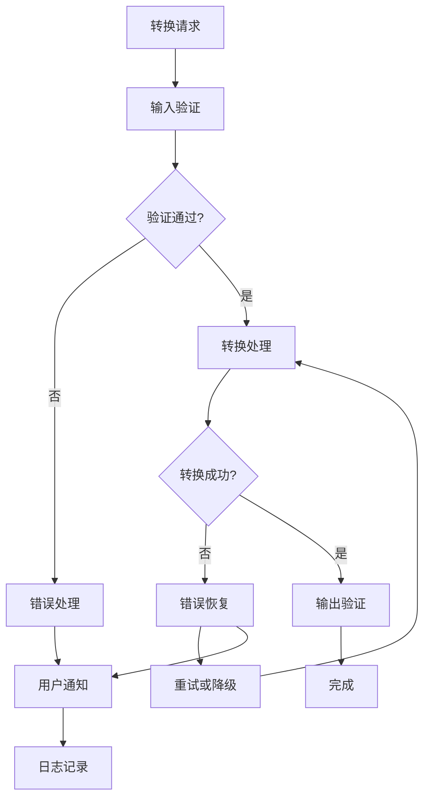
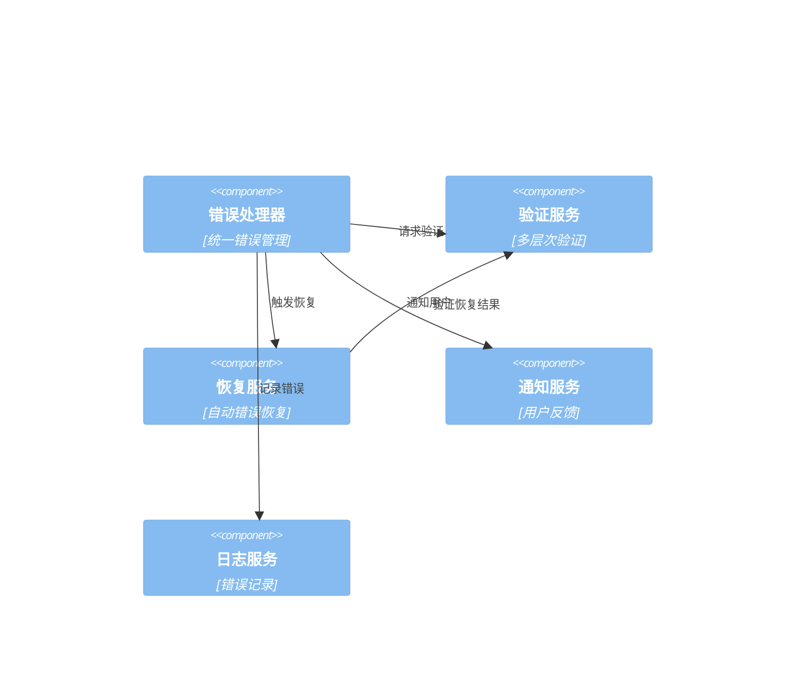

# XML-Excel互转适配系统错误处理和验证机制设计

## 系统概述

本文档详细描述了XML-Excel互转适配系统的错误处理和验证机制。该系统提供多层级的错误处理、自动恢复策略和全面的验证机制，确保转换过程的稳定性和数据完整性。

## 系统架构

### 整体架构图


### 核心组件关系


## 错误处理系统设计

### 1. 增强的错误处理器

```csharp
namespace BannerlordModEditor.TUI.Services.ErrorHandling
{
    /// <summary>
    /// 增强的错误处理器
    /// </summary>
    public class EnhancedErrorHandler : IErrorHandler
    {
        private readonly ILogger<EnhancedErrorHandler> _logger;
        private readonly IRecoveryStrategyProvider _recoveryProvider;
        private readonly INotificationService _notificationService;
        private readonly ITelemetryService _telemetryService;
        private readonly IErrorHistoryService _errorHistoryService;
        
        // 错误处理器配置
        private readonly ErrorHandlerOptions _options;
        
        // 错误事件
        public event EventHandler<ErrorEventArgs>? ErrorOccurred;
        
        public EnhancedErrorHandler(
            ILogger<EnhancedErrorHandler> logger,
            IRecoveryStrategyProvider recoveryProvider,
            INotificationService notificationService,
            ITelemetryService telemetryService,
            IErrorHistoryService errorHistoryService,
            ErrorHandlerOptions options)
        {
            _logger = logger;
            _recoveryProvider = recoveryProvider;
            _notificationService = notificationService;
            _telemetryService = telemetryService;
            _errorHistoryService = errorHistoryService;
            _options = options;
        }
        
        /// <summary>
        /// 处理错误
        /// </summary>
        public async Task<ErrorResult> HandleErrorAsync(Exception exception, ErrorContext context)
        {
            try
            {
                // 1. 创建错误结果
                var errorResult = CreateErrorResult(exception, context);
                
                // 2. 记录错误历史
                await _errorHistoryService.RecordErrorAsync(errorResult);
                
                // 3. 发送遥测数据
                await _telemetryService.TrackErrorAsync(errorResult);
                
                // 4. 记录日志
                LogError(errorResult);
                
                // 5. 通知用户
                await NotifyUserAsync(errorResult);
                
                // 6. 尝试恢复
                var recoveryResult = await AttemptRecoveryAsync(errorResult);
                errorResult.RecoveryResult = recoveryResult;
                
                // 7. 触发事件
                OnErrorOccurred(new ErrorEventArgs(errorResult));
                
                return errorResult;
            }
            catch (Exception handlerEx)
            {
                _logger.LogCritical(handlerEx, "错误处理器自身发生错误");
                return CreateFallbackErrorResult(exception, context, handlerEx);
            }
        }
        
        /// <summary>
        /// 处理转换错误
        /// </summary>
        public async Task<ErrorResult> HandleConversionErrorAsync(ConversionException exception)
        {
            var context = new ConversionErrorContext
            {
                SourcePath = exception.SourcePath,
                TargetPath = exception.TargetPath,
                ConversionType = exception.ConversionType,
                CurrentStep = exception.CurrentStep,
                Options = exception.Options
            };
            
            return await HandleErrorAsync(exception, context);
        }
        
        /// <summary>
        /// 处理验证错误
        /// </summary>
        public async Task<ErrorResult> HandleValidationErrorAsync(ValidationException exception)
        {
            var context = new ValidationErrorContext
            {
                ValidationTarget = exception.ValidationTarget,
                ValidationRules = exception.ValidationRules,
                ValidationResult = exception.ValidationResult
            };
            
            return await HandleErrorAsync(exception, context);
        }
        
        /// <summary>
        /// 尝试错误恢复
        /// </summary>
        public async Task<RecoveryResult> AttemptRecoveryAsync(ErrorResult errorResult)
        {
            if (!_options.EnableRecovery)
            {
                return new RecoveryResult
                {
                    Success = false,
                    Message = "错误恢复已禁用"
                };
            }
            
            try
            {
                var recoveryStrategy = _recoveryProvider.GetRecoveryStrategy(errorResult.Exception);
                if (recoveryStrategy == null)
                {
                    return new RecoveryResult
                    {
                        Success = false,
                        Message = "没有找到合适的恢复策略"
                    };
                }
                
                _logger.LogInformation("尝试错误恢复: {StrategyName}", recoveryStrategy.Description);
                
                var recoveryResult = await recoveryStrategy.RecoverAsync(errorResult);
                
                if (recoveryResult.Success)
                {
                    _logger.LogInformation("错误恢复成功: {StrategyName}", recoveryStrategy.Description);
                }
                else
                {
                    _logger.LogWarning("错误恢复失败: {StrategyName}, {Message}", 
                        recoveryStrategy.Description, recoveryResult.Message);
                }
                
                return recoveryResult;
            }
            catch (Exception ex)
            {
                _logger.LogError(ex, "错误恢复过程中发生错误");
                return new RecoveryResult
                {
                    Success = false,
                    Message = $"错误恢复失败: {ex.Message}"
                };
            }
        }
        
        /// <summary>
        /// 创建错误结果
        /// </summary>
        private ErrorResult CreateErrorResult(Exception exception, ErrorContext context)
        {
            var errorId = Guid.NewGuid().ToString();
            var timestamp = DateTime.UtcNow;
            var severity = DetermineSeverity(exception, context);
            
            var errorResult = new ErrorResult
            {
                ErrorId = errorId,
                Exception = exception,
                Context = context,
                Timestamp = timestamp,
                Severity = severity,
                UserMessage = GetUserMessage(exception, severity),
                TechnicalMessage = GetTechnicalMessage(exception),
                Category = GetErrorCategory(exception),
                Suggestions = GetErrorSuggestions(exception, context)
            };
            
            return errorResult;
        }
        
        /// <summary>
        /// 确定错误严重程度
        /// </summary>
        private ErrorSeverity DetermineSeverity(Exception exception, ErrorContext context)
        {
            // 基于异常类型确定严重程度
            if (exception is OutOfMemoryException || exception is StackOverflowException)
            {
                return ErrorSeverity.Critical;
            }
            
            if (exception is UnauthorizedAccessException || exception is SecurityException)
            {
                return ErrorSeverity.High;
            }
            
            if (exception is FileNotFoundException || exception is DirectoryNotFoundException)
            {
                return ErrorSeverity.Medium;
            }
            
            if (exception is IOException || exception is XmlException)
            {
                return ErrorSeverity.Medium;
            }
            
            if (exception is ArgumentException || exception is InvalidOperationException)
            {
                return ErrorSeverity.Low;
            }
            
            // 基于上下文确定严重程度
            if (context is ConversionErrorContext conversionContext)
            {
                if (conversionContext.CurrentStep == ConversionStep.FinalValidation ||
                    conversionContext.CurrentStep == ConversionStep.FileWrite)
                {
                    return ErrorSeverity.High;
                }
            }
            
            return ErrorSeverity.Medium;
        }
        
        /// <summary>
        /// 获取用户消息
        /// </summary>
        private string GetUserMessage(Exception exception, ErrorSeverity severity)
        {
            var messages = new Dictionary<Type, Func<Exception, string>>
            {
                [typeof(FileNotFoundException)] = ex => "文件未找到，请检查文件路径",
                [typeof(UnauthorizedAccessException)] = ex => "访问被拒绝，请检查文件权限",
                [typeof(IOException)] = ex => "文件I/O错误，请检查文件是否被占用",
                [typeof(XmlException)] = ex => "XML格式错误，请检查文件内容",
                [typeof(OutOfMemoryException)] = ex => "内存不足，请尝试较小的文件",
                [typeof(ArgumentException)] = ex => "参数错误，请检查输入参数",
                [typeof(InvalidOperationException)] = ex => "操作无效，请检查操作条件"
            };
            
            if (messages.TryGetValue(exception.GetType(), out var messageFunc))
            {
                return messageFunc(exception);
            }
            
            // 基于严重程度的默认消息
            return severity switch
            {
                ErrorSeverity.Critical => "发生严重错误，请重启应用程序",
                ErrorSeverity.High => "发生高级错误，请检查系统状态",
                ErrorSeverity.Medium => "发生错误，请查看详细信息",
                ErrorSeverity.Low => "发生轻微错误，可以继续操作",
                _ => "发生未知错误"
            };
        }
        
        /// <summary>
        /// 获取技术消息
        /// </summary>
        private string GetTechnicalMessage(Exception exception)
        {
            return $"{exception.GetType().Name}: {exception.Message}";
        }
        
        /// <summary>
        /// 获取错误类别
        /// </summary>
        private ErrorCategory GetErrorCategory(Exception exception)
        {
            if (exception is FileNotFoundException || exception is DirectoryNotFoundException)
            {
                return ErrorCategory.FileSystem;
            }
            
            if (exception is UnauthorizedAccessException || exception is SecurityException)
            {
                return ErrorCategory.Security;
            }
            
            if (exception is IOException)
            {
                return ErrorCategory.IO;
            }
            
            if (exception is XmlException)
            {
                return ErrorCategory.XML;
            }
            
            if (exception is OutOfMemoryException || exception is StackOverflowException)
            {
                return ErrorCategory.Memory;
            }
            
            if (exception is ArgumentException || exception is InvalidOperationException)
            {
                return ErrorCategory.Argument;
            }
            
            return ErrorCategory.Unknown;
        }
        
        /// <summary>
        /// 获取错误建议
        /// </summary>
        private List<string> GetErrorSuggestions(Exception exception, ErrorContext context)
        {
            var suggestions = new List<string>();
            
            // 基于异常类型的建议
            if (exception is FileNotFoundException)
            {
                suggestions.Add("检查文件路径是否正确");
                suggestions.Add("确认文件是否存在");
                suggestions.Add("检查文件权限");
            }
            
            if (exception is UnauthorizedAccessException)
            {
                suggestions.Add("检查文件权限设置");
                suggestions.Add("以管理员身份运行应用程序");
                suggestions.Add("检查文件是否被其他程序占用");
            }
            
            if (exception is IOException)
            {
                suggestions.Add("检查磁盘空间");
                suggestions.Add("关闭可能占用文件的其他程序");
                suggestions.Add("检查文件完整性");
            }
            
            if (exception is XmlException)
            {
                suggestions.Add("检查XML格式是否正确");
                suggestions.Add("验证XML文件编码");
                suggestions.Add("使用XML验证工具检查文件");
            }
            
            if (exception is OutOfMemoryException)
            {
                suggestions.Add("关闭其他应用程序释放内存");
                suggestions.Add("尝试处理较小的文件");
                suggestions.Add("增加虚拟内存");
            }
            
            // 基于上下文的建议
            if (context is ConversionErrorContext conversionContext)
            {
                suggestions.Add($"检查源文件: {conversionContext.SourcePath}");
                suggestions.Add($"检查目标路径: {conversionContext.TargetPath}");
                suggestions.Add($"确认转换类型: {conversionContext.ConversionType}");
            }
            
            return suggestions;
        }
        
        /// <summary>
        /// 记录错误
        /// </summary>
        private void LogError(ErrorResult errorResult)
        {
            var logLevel = errorResult.Severity switch
            {
                ErrorSeverity.Critical => LogLevel.Critical,
                ErrorSeverity.High => LogLevel.Error,
                ErrorSeverity.Medium => LogLevel.Warning,
                ErrorSeverity.Low => LogLevel.Information,
                _ => LogLevel.Warning
            };
            
            _logger.Log(logLevel, "错误发生: {ErrorId}, {Category}, {Message}", 
                errorResult.ErrorId, errorResult.Category, errorResult.UserMessage);
            
            // 记录详细错误信息
            _logger.LogDebug("错误详情: {ErrorId}, Exception: {Exception}, Context: {@Context}", 
                errorResult.ErrorId, errorResult.Exception, errorResult.Context);
        }
        
        /// <summary>
        /// 通知用户
        /// </summary>
        private async Task NotifyUserAsync(ErrorResult errorResult)
        {
            if (!_options.EnableUserNotification)
            {
                return;
            }
            
            var notificationType = errorResult.Severity switch
            {
                ErrorSeverity.Critical => NotificationType.Error,
                ErrorSeverity.High => NotificationType.Error,
                ErrorSeverity.Medium => NotificationType.Warning,
                ErrorSeverity.Low => NotificationType.Info,
                _ => NotificationType.Warning
            };
            
            var message = $"{errorResult.UserMessage}\n\n错误ID: {errorResult.ErrorId}";
            
            if (_options.ShowTechnicalDetails && !string.IsNullOrEmpty(errorResult.TechnicalMessage))
            {
                message += $"\n\n技术信息: {errorResult.TechnicalMessage}";
            }
            
            if (_options.ShowSuggestions && errorResult.Suggestions.Any())
            {
                message += $"\n\n建议:\n{string.Join("\n", errorResult.Suggestions.Select(s => $"• {s}"))}";
            }
            
            await _notificationService.SendNotificationAsync(message, notificationType);
        }
        
        /// <summary>
        /// 创建回退错误结果
        /// </summary>
        private ErrorResult CreateFallbackErrorResult(Exception originalException, ErrorContext context, Exception handlerException)
        {
            return new ErrorResult
            {
                ErrorId = Guid.NewGuid().ToString(),
                Exception = originalException,
                Context = context,
                Timestamp = DateTime.UtcNow,
                Severity = ErrorSeverity.Critical,
                UserMessage = "系统发生严重错误，请联系技术支持",
                TechnicalMessage = $"原始错误: {originalException.Message}\n处理器错误: {handlerException.Message}",
                Category = ErrorCategory.System,
                Suggestions = new List<string>
                {
                    "重启应用程序",
                    "检查系统日志",
                    "联系技术支持"
                }
            };
        }
        
        /// <summary>
        /// 触发错误事件
        /// </summary>
        protected virtual void OnErrorOccurred(ErrorEventArgs e)
        {
            ErrorOccurred?.Invoke(this, e);
        }
    }
}
```

### 2. 恢复策略提供者

```csharp
namespace BannerlordModEditor.TUI.Services.ErrorHandling.Recovery
{
    /// <summary>
    /// 恢复策略提供者
    /// </summary>
    public class RecoveryStrategyProvider : IRecoveryStrategyProvider
    {
        private readonly Dictionary<Type, List<IRecoveryStrategy>> _strategies;
        private readonly IServiceProvider _serviceProvider;
        private readonly ILogger<RecoveryStrategyProvider> _logger;
        
        public RecoveryStrategyProvider(
            IServiceProvider serviceProvider,
            ILogger<RecoveryStrategyProvider> logger)
        {
            _serviceProvider = serviceProvider;
            _logger = logger;
            _strategies = new Dictionary<Type, List<IRecoveryStrategy>>();
            
            InitializeStrategies();
        }
        
        /// <summary>
        /// 获取恢复策略
        /// </summary>
        public IRecoveryStrategy? GetRecoveryStrategy(Exception exception)
        {
            try
            {
                var exceptionType = exception.GetType();
                
                // 直接匹配异常类型
                if (_strategies.TryGetValue(exceptionType, out var strategies))
                {
                    return strategies.FirstOrDefault();
                }
                
                // 查找基类匹配
                foreach (var strategyPair in _strategies)
                {
                    if (strategyPair.Key.IsAssignableFrom(exceptionType))
                    {
                        return strategyPair.Value.FirstOrDefault();
                    }
                }
                
                return null;
            }
            catch (Exception ex)
            {
                _logger.LogError(ex, "获取恢复策略失败");
                return null;
            }
        }
        
        /// <summary>
        /// 注册恢复策略
        /// </summary>
        public void RegisterStrategy(IRecoveryStrategy strategy)
        {
            try
            {
                var supportedExceptionTypes = GetSupportedExceptionTypes(strategy);
                
                foreach (var exceptionType in supportedExceptionTypes)
                {
                    if (!_strategies.ContainsKey(exceptionType))
                    {
                        _strategies[exceptionType] = new List<IRecoveryStrategy>();
                    }
                    
                    _strategies[exceptionType].Add(strategy);
                }
                
                // 按优先级排序
                foreach (var strategyList in _strategies.Values)
                {
                    strategyList.Sort((a, b) => b.Priority.CompareTo(a.Priority));
                }
                
                _logger.LogInformation("注册恢复策略: {StrategyName}", strategy.Description);
            }
            catch (Exception ex)
            {
                _logger.LogError(ex, "注册恢复策略失败: {StrategyName}", strategy.Description);
            }
        }
        
        /// <summary>
        /// 获取所有策略
        /// </summary>
        public IEnumerable<IRecoveryStrategy> GetAllStrategies()
        {
            return _strategies.Values.SelectMany(strategies => strategies).Distinct();
        }
        
        /// <summary>
        /// 初始化恢复策略
        /// </summary>
        private void InitializeStrategies()
        {
            // 文件系统恢复策略
            RegisterStrategy(new FileLockRecoveryStrategy());
            RegisterStrategy(new FileNotFoundRecoveryStrategy());
            RegisterStrategy(new DirectoryNotFoundRecoveryStrategy());
            RegisterStrategy(new DiskSpaceRecoveryStrategy());
            
            // XML处理恢复策略
            RegisterStrategy(new XmlFormatRecoveryStrategy());
            RegisterStrategy(new XmlEncodingRecoveryStrategy());
            RegisterStrategy(new XmlSchemaRecoveryStrategy());
            
            // Excel处理恢复策略
            RegisterStrategy(new ExcelFormatRecoveryStrategy());
            RegisterStrategy(new ExcelSheetRecoveryStrategy());
            
            // 内存恢复策略
            RegisterStrategy(new MemoryRecoveryStrategy());
            RegisterStrategy(new CacheClearRecoveryStrategy());
            
            // 通用恢复策略
            RegisterStrategy(new RetryRecoveryStrategy());
            RegisterStrategy(new FallbackRecoveryStrategy());
        }
        
        /// <summary>
        /// 获取策略支持的异常类型
        /// </summary>
        private IEnumerable<Type> GetSupportedExceptionTypes(IRecoveryStrategy strategy)
        {
            // 这里可以通过反射或配置来获取支持的异常类型
            // 为了简化，我们返回一个通用的异常类型列表
            yield return typeof(Exception);
            
            // 根据策略类型返回特定的异常类型
            if (strategy is FileLockRecoveryStrategy)
            {
                yield return typeof(IOException);
                yield return typeof(UnauthorizedAccessException);
            }
            
            if (strategy is XmlFormatRecoveryStrategy)
            {
                yield return typeof(XmlException);
            }
            
            if (strategy is MemoryRecoveryStrategy)
            {
                yield return typeof(OutOfMemoryException);
                yield return typeof(InsufficientMemoryException);
            }
        }
    }
    
    /// <summary>
    /// 文件锁定恢复策略
    /// </summary>
    public class FileLockRecoveryStrategy : IRecoveryStrategy
    {
        private readonly ILogger<FileLockRecoveryStrategy> _logger;
        
        public FileLockRecoveryStrategy(ILogger<FileLockRecoveryStrategy> logger)
        {
            _logger = logger;
        }
        
        public bool CanRecover(Exception exception)
        {
            return exception is IOException ioEx && 
                   (ioEx.Message.Contains("used by another process") || 
                    ioEx.Message.Contains("locked") ||
                    ioEx.Message.Contains("being used by another process"));
        }
        
        public async Task<RecoveryResult> RecoverAsync(ErrorResult errorResult)
        {
            try
            {
                var context = errorResult.Context as ConversionErrorContext;
                if (context?.SourcePath == null)
                {
                    return new RecoveryResult
                    {
                        Success = false,
                        Message = "无法获取文件路径"
                    };
                }
                
                var filePath = context.SourcePath;
                
                // 等待文件解锁
                for (int i = 0; i < 10; i++)
                {
                    await Task.Delay(1000);
                    
                    if (await IsFileAccessibleAsync(filePath))
                    {
                        return new RecoveryResult
                        {
                            Success = true,
                            Message = "文件已解锁，可以重试转换",
                            Action = RecoveryAction.Retry
                        };
                    }
                }
                
                return new RecoveryResult
                {
                    Success = false,
                    Message = "等待文件解锁超时"
                };
            }
            catch (Exception ex)
            {
                _logger.LogError(ex, "文件锁定恢复失败");
                return new RecoveryResult
                {
                    Success = false,
                    Message = $"恢复失败: {ex.Message}"
                };
            }
        }
        
        private async Task<bool> IsFileAccessibleAsync(string filePath)
        {
            try
            {
                using var fileStream = new FileStream(filePath, FileMode.Open, FileAccess.Read, FileShare.None);
                fileStream.Dispose();
                return true;
            }
            catch
            {
                return false;
            }
        }
        
        public string Description => "文件锁定恢复策略";
        public RecoveryPriority Priority => RecoveryPriority.High;
    }
    
    /// <summary>
    /// 重试恢复策略
    /// </summary>
    public class RetryRecoveryStrategy : IRecoveryStrategy
    {
        private readonly ILogger<RetryRecoveryStrategy> _logger;
        private readonly int _maxRetryAttempts = 3;
        private readonly TimeSpan _retryDelay = TimeSpan.FromSeconds(2);
        
        public RetryRecoveryStrategy(ILogger<RetryRecoveryStrategy> logger)
        {
            _logger = logger;
        }
        
        public bool CanRecover(Exception exception)
        {
            // 对于大多数异常都可以尝试重试
            return !(exception is OutOfMemoryException || 
                     exception is StackOverflowException ||
                     exception is AccessViolationException);
        }
        
        public async Task<RecoveryResult> RecoverAsync(ErrorResult errorResult)
        {
            try
            {
                var context = errorResult.Context as ConversionErrorContext;
                if (context == null)
                {
                    return new RecoveryResult
                    {
                        Success = false,
                        Message = "无法获取转换上下文"
                    };
                }
                
                // 记录重试次数
                var retryCount = context.RetryCount + 1;
                
                if (retryCount > _maxRetryAttempts)
                {
                    return new RecoveryResult
                    {
                        Success = false,
                        Message = $"已达到最大重试次数 ({_maxRetryAttempts})"
                    };
                }
                
                _logger.LogInformation("执行重试恢复: 尝试 {RetryCount}/{MaxRetryAttempts}", 
                    retryCount, _maxRetryAttempts);
                
                // 等待一段时间后重试
                await Task.Delay(_retryDelay);
                
                return new RecoveryResult
                {
                    Success = true,
                    Message = $"准备第 {retryCount} 次重试",
                    Action = RecoveryAction.Retry,
                    RetryCount = retryCount
                };
            }
            catch (Exception ex)
            {
                _logger.LogError(ex, "重试恢复失败");
                return new RecoveryResult
                {
                    Success = false,
                    Message = $"重试恢复失败: {ex.Message}"
                };
            }
        }
        
        public string Description => "重试恢复策略";
        public RecoveryPriority Priority => RecoveryPriority.Medium;
    }
}
```

## 验证系统设计

### 1. 增强的验证服务

```csharp
namespace BannerlordModEditor.TUI.Services.Validation
{
    /// <summary>
    /// 增强的验证服务
    /// </summary>
    public class EnhancedValidationService : IEnhancedValidationService
    {
        private readonly IServiceProvider _serviceProvider;
        private readonly IXmlTypeDetectionService _typeDetectionService;
        private readonly IXmlSchemaProvider _schemaProvider;
        private readonly IBusinessRuleValidator _businessRuleValidator;
        private readonly ILogger<EnhancedValidationService> _logger;
        
        // 验证器注册表
        private readonly Dictionary<Type, List<IValidator>> _validators;
        private readonly Dictionary<Type, List<IValidationRule>> _validationRules;
        
        // 验证配置
        private readonly ValidationOptions _options;
        
        public EnhancedValidationService(
            IServiceProvider serviceProvider,
            IXmlTypeDetectionService typeDetectionService,
            IXmlSchemaProvider schemaProvider,
            IBusinessRuleValidator businessRuleValidator,
            ILogger<EnhancedValidationService> logger,
            ValidationOptions options)
        {
            _serviceProvider = serviceProvider;
            _typeDetectionService = typeDetectionService;
            _schemaProvider = schemaProvider;
            _businessRuleValidator = businessRuleValidator;
            _logger = logger;
            _options = options;
            
            _validators = new Dictionary<Type, List<IValidator>>();
            _validationRules = new Dictionary<Type, List<IValidationRule>>();
            
            InitializeValidators();
        }
        
        /// <summary>
        /// 验证XML文件
        /// </summary>
        public async Task<ValidationResult> ValidateXmlFileAsync(string xmlPath)
        {
            try
            {
                var result = new ValidationResult();
                
                // 1. 基本文件验证
                var fileValidation = await ValidateFileBasicAsync(xmlPath);
                if (!fileValidation.IsValid)
                {
                    return fileValidation;
                }
                
                // 2. XML格式验证
                var formatValidation = await ValidateXmlFormatAsync(xmlPath);
                result.Errors.AddRange(formatValidation.Errors);
                result.Warnings.AddRange(formatValidation.Warnings);
                
                // 3. XML结构验证
                var structureValidation = await ValidateXmlStructureAsync(xmlPath);
                result.Errors.AddRange(structureValidation.Errors);
                result.Warnings.AddRange(structureValidation.Warnings);
                
                // 4. 类型特定验证
                var typeValidation = await ValidateXmlTypeSpecificAsync(xmlPath);
                result.Errors.AddRange(typeValidation.Errors);
                result.Warnings.AddRange(typeValidation.Warnings);
                
                // 5. 业务规则验证
                var businessValidation = await ValidateBusinessRulesAsync(xmlPath);
                result.Errors.AddRange(businessValidation.Errors);
                result.Warnings.AddRange(businessValidation.Warnings);
                
                result.IsValid = result.Errors.Count == 0;
                result.Message = result.IsValid ? 
                    "XML文件验证通过" : 
                    $"XML文件验证失败: {result.Errors.Count} 个错误";
                
                return result;
            }
            catch (Exception ex)
            {
                _logger.LogError(ex, "XML文件验证失败: {XmlPath}", xmlPath);
                return new ValidationResult
                {
                    IsValid = false,
                    Errors = 
                    {
                        new ValidationError
                        {
                            Message = $"验证失败: {ex.Message}",
                            ErrorType = ValidationErrorType.InvalidFormat
                        }
                    }
                };
            }
        }
        
        /// <summary>
        /// 验证Excel文件
        /// </summary>
        public async Task<ValidationResult> ValidateExcelFileAsync(string excelPath)
        {
            try
            {
                var result = new ValidationResult();
                
                // 1. 基本文件验证
                var fileValidation = await ValidateFileBasicAsync(excelPath);
                if (!fileValidation.IsValid)
                {
                    return fileValidation;
                }
                
                // 2. Excel格式验证
                var formatValidation = await ValidateExcelFormatAsync(excelPath);
                result.Errors.AddRange(formatValidation.Errors);
                result.Warnings.AddRange(formatValidation.Warnings);
                
                // 3. Excel结构验证
                var structureValidation = await ValidateExcelStructureAsync(excelPath);
                result.Errors.AddRange(structureValidation.Errors);
                result.Warnings.AddRange(structureValidation.Warnings);
                
                // 4. 数据类型验证
                var dataTypeValidation = await ValidateExcelDataTypesAsync(excelPath);
                result.Errors.AddRange(dataTypeValidation.Errors);
                result.Warnings.AddRange(dataTypeValidation.Warnings);
                
                result.IsValid = result.Errors.Count == 0;
                result.Message = result.IsValid ? 
                    "Excel文件验证通过" : 
                    $"Excel文件验证失败: {result.Errors.Count} 个错误";
                
                return result;
            }
            catch (Exception ex)
            {
                _logger.LogError(ex, "Excel文件验证失败: {ExcelPath}", excelPath);
                return new ValidationResult
                {
                    IsValid = false,
                    Errors = 
                    {
                        new ValidationError
                        {
                            Message = $"验证失败: {ex.Message}",
                            ErrorType = ValidationErrorType.InvalidFormat
                        }
                    }
                };
            }
        }
        
        /// <summary>
        /// 验证类型化XML文件
        /// </summary>
        public async Task<ValidationResult> ValidateTypedXmlAsync<T>(string xmlPath) where T : class, new()
        {
            try
            {
                var result = new ValidationResult();
                
                // 1. 基本XML验证
                var basicValidation = await ValidateXmlFileAsync(xmlPath);
                if (!basicValidation.IsValid)
                {
                    return basicValidation;
                }
                
                // 2. 类型检测验证
                var typeInfo = await _typeDetectionService.DetectXmlTypeAsync(xmlPath);
                var expectedType = typeof(T).Name.Replace("DO", "");
                
                if (typeInfo.XmlType != expectedType)
                {
                    result.Errors.Add(new ValidationError
                    {
                        Message = $"XML类型不匹配: 期望 {expectedType}, 实际 {typeInfo.XmlType}",
                        ErrorType = ValidationErrorType.SchemaMismatch
                    });
                }
                
                // 3. 类型化验证
                var typedValidation = await ValidateTypedXmlInternalAsync<T>(xmlPath);
                result.Errors.AddRange(typedValidation.Errors);
                result.Warnings.AddRange(typedValidation.Warnings);
                
                // 4. 自定义验证器验证
                var customValidation = await ValidateWithCustomValidatorsAsync<T>(xmlPath);
                result.Errors.AddRange(customValidation.Errors);
                result.Warnings.AddRange(customValidation.Warnings);
                
                result.IsValid = result.Errors.Count == 0;
                result.Message = result.IsValid ? 
                    $"类型化XML验证通过: {expectedType}" : 
                    $"类型化XML验证失败: {expectedType}";
                
                return result;
            }
            catch (Exception ex)
            {
                _logger.LogError(ex, "类型化XML验证失败: {XmlPath}", xmlPath);
                return new ValidationResult
                {
                    IsValid = false,
                    Errors = 
                    {
                        new ValidationError
                        {
                            Message = $"验证失败: {ex.Message}",
                            ErrorType = ValidationErrorType.InvalidFormat
                        }
                    }
                };
            }
        }
        
        /// <summary>
        /// 验证数据完整性
        /// </summary>
        public async Task<ValidationResult> ValidateDataIntegrityAsync(
            string sourcePath, 
            string targetPath, 
            ConversionDirection direction)
        {
            try
            {
                var result = new ValidationResult();
                
                // 1. 文件存在性验证
                if (!File.Exists(sourcePath))
                {
                    result.Errors.Add(new ValidationError
                    {
                        Message = $"源文件不存在: {sourcePath}",
                        ErrorType = ValidationErrorType.InvalidFormat
                    });
                }
                
                if (!File.Exists(targetPath))
                {
                    result.Errors.Add(new ValidationError
                    {
                        Message = $"目标文件不存在: {targetPath}",
                        ErrorType = ValidationErrorType.InvalidFormat
                    });
                }
                
                if (result.Errors.Count > 0)
                {
                    result.IsValid = false;
                    return result;
                }
                
                // 2. 文件大小验证
                var sourceSize = new FileInfo(sourcePath).Length;
                var targetSize = new FileInfo(targetPath).Length;
                
                if (targetSize == 0)
                {
                    result.Errors.Add(new ValidationError
                    {
                        Message = "目标文件为空",
                        ErrorType = ValidationErrorType.StructureMismatch
                    });
                }
                
                // 3. 数据量验证
                var dataCountValidation = await ValidateDataCountAsync(sourcePath, targetPath, direction);
                result.Errors.AddRange(dataCountValidation.Errors);
                result.Warnings.AddRange(dataCountValidation.Warnings);
                
                // 4. 数据内容验证
                var dataContentValidation = await ValidateDataContentAsync(sourcePath, targetPath, direction);
                result.Errors.AddRange(dataContentValidation.Errors);
                result.Warnings.AddRange(dataContentValidation.Warnings);
                
                result.IsValid = result.Errors.Count == 0;
                result.Message = result.IsValid ? 
                    "数据完整性验证通过" : 
                    $"数据完整性验证失败: {result.Errors.Count} 个错误";
                
                return result;
            }
            catch (Exception ex)
            {
                _logger.LogError(ex, "数据完整性验证失败");
                return new ValidationResult
                {
                    IsValid = false,
                    Errors = 
                    {
                        new ValidationError
                        {
                            Message = $"验证失败: {ex.Message}",
                            ErrorType = ValidationErrorType.InvalidFormat
                        }
                    }
                };
            }
        }
        
        /// <summary>
        /// 基本文件验证
        /// </summary>
        private async Task<ValidationResult> ValidateFileBasicAsync(string filePath)
        {
            var result = new ValidationResult();
            
            // 文件存在性检查
            if (!File.Exists(filePath))
            {
                result.Errors.Add(new ValidationError
                {
                    Message = $"文件不存在: {filePath}",
                    ErrorType = ValidationErrorType.InvalidFormat
                });
                return result;
            }
            
            // 文件访问权限检查
            if (!await HasFileAccessAsync(filePath))
            {
                result.Errors.Add(new ValidationError
                {
                    Message = $"无法访问文件: {filePath}",
                    ErrorType = ValidationErrorType.InvalidFormat
                });
                return result;
            }
            
            // 文件大小检查
            var fileInfo = new FileInfo(filePath);
            if (fileInfo.Length == 0)
            {
                result.Errors.Add(new ValidationError
                {
                    Message = $"文件为空: {filePath}",
                    ErrorType = ValidationErrorType.InvalidFormat
                });
            }
            else if (fileInfo.Length > _options.MaxFileSizeBytes)
            {
                result.Warnings.Add(new ValidationWarning
                {
                    Message = $"文件较大 ({fileInfo.Length / (1024 * 1024):F1} MB)，可能会影响性能",
                    WarningType = ValidationWarningType.DataTruncation
                });
            }
            
            result.IsValid = result.Errors.Count == 0;
            return result;
        }
        
        /// <summary>
        /// XML格式验证
        /// </summary>
        private async Task<ValidationResult> ValidateXmlFormatAsync(string xmlPath)
        {
            var result = new ValidationResult();
            
            try
            {
                var settings = new XmlReaderSettings
                {
                    DtdProcessing = DtdProcessing.Ignore,
                    IgnoreWhitespace = true,
                    IgnoreComments = true,
                    MaxCharactersFromEntities = 1024,
                    MaxCharactersInDocument = _options.MaxFileSizeBytes
                };
                
                using var reader = XmlReader.Create(xmlPath, settings);
                
                // 尝试读取整个文档
                while (reader.Read())
                {
                    // 只是为了验证格式，不需要做任何处理
                }
                
                result.IsValid = true;
                result.Message = "XML格式验证通过";
            }
            catch (XmlException ex)
            {
                result.IsValid = false;
                result.Errors.Add(new ValidationError
                {
                    Message = $"XML格式错误: {ex.Message}",
                    ErrorType = ValidationErrorType.InvalidFormat,
                    LineNumber = ex.LineNumber,
                    LinePosition = ex.LinePosition
                });
            }
            catch (Exception ex)
            {
                result.IsValid = false;
                result.Errors.Add(new ValidationError
                {
                    Message = $"XML读取失败: {ex.Message}",
                    ErrorType = ValidationErrorType.InvalidFormat
                });
            }
            
            return result;
        }
        
        /// <summary>
        /// XML结构验证
        /// </summary>
        private async Task<ValidationResult> ValidateXmlStructureAsync(string xmlPath)
        {
            var result = new ValidationResult();
            
            try
            {
                var xmlDoc = XDocument.Load(xmlPath);
                var rootElement = xmlDoc.Root;
                
                if (rootElement == null)
                {
                    result.Errors.Add(new ValidationError
                    {
                        Message = "XML文件没有根元素",
                        ErrorType = ValidationErrorType.StructureMismatch
                    });
                    return result;
                }
                
                // 检查根元素名称
                if (string.IsNullOrWhiteSpace(rootElement.Name.LocalName))
                {
                    result.Errors.Add(new ValidationError
                    {
                        Message = "根元素名称为空",
                        ErrorType = ValidationErrorType.StructureMismatch
                    });
                }
                
                // 检查必需的命名空间
                var requiredNamespaces = GetRequiredNamespaces();
                foreach (var ns in requiredNamespaces)
                {
                    if (!rootElement.Attributes().Any(a => a.IsNamespaceDeclaration && a.Value == ns))
                    {
                        result.Warnings.Add(new ValidationWarning
                        {
                            Message = $"缺少命名空间: {ns}",
                            WarningType = ValidationWarningType.OptionalFieldMissing
                        });
                    }
                }
                
                // 检查元素深度
                var maxDepth = CalculateMaxDepth(rootElement);
                if (maxDepth > _options.MaxElementDepth)
                {
                    result.Warnings.Add(new ValidationWarning
                    {
                        Message = $"XML结构过深 (深度: {maxDepth})",
                        WarningType = ValidationWarningType.StructureWarning
                    });
                }
                
                result.IsValid = result.Errors.Count == 0;
                result.Message = "XML结构验证通过";
            }
            catch (Exception ex)
            {
                result.IsValid = false;
                result.Errors.Add(new ValidationError
                {
                    Message = $"XML结构验证失败: {ex.Message}",
                    ErrorType = ValidationErrorType.InvalidFormat
                });
            }
            
            return result;
        }
        
        /// <summary>
        /// 类型化XML内部验证
        /// </summary>
        private async Task<ValidationResult> ValidateTypedXmlInternalAsync<T>(string xmlPath) where T : class, new()
        {
            var result = new ValidationResult();
            
            try
            {
                // 使用类型化XML处理器加载文件
                var processor = _serviceProvider.GetRequiredService<ITypedXmlProcessor<T>>();
                var data = await processor.LoadXmlAsync(xmlPath);
                
                // 验证数据对象
                var validationResult = await ValidateDataObjectAsync(data);
                result.Errors.AddRange(validationResult.Errors);
                result.Warnings.AddRange(validationResult.Warnings);
                
                result.IsValid = result.Errors.Count == 0;
                result.Message = "类型化XML内部验证通过";
            }
            catch (Exception ex)
            {
                result.IsValid = false;
                result.Errors.Add(new ValidationError
                {
                    Message = $"类型化XML内部验证失败: {ex.Message}",
                    ErrorType = ValidationErrorType.InvalidFormat
                });
            }
            
            return result;
        }
        
        /// <summary>
        /// 使用自定义验证器验证
        /// </summary>
        private async Task<ValidationResult> ValidateWithCustomValidatorsAsync<T>(string xmlPath) where T : class, new()
        {
            var result = new ValidationResult();
            
            try
            {
                if (_validators.TryGetValue(typeof(T), out var validators))
                {
                    var processor = _serviceProvider.GetRequiredService<ITypedXmlProcessor<T>>();
                    var data = await processor.LoadXmlAsync(xmlPath);
                    
                    foreach (var validator in validators)
                    {
                        var validationResult = await validator.ValidateAsync(data);
                        result.Errors.AddRange(validationResult.Errors);
                        result.Warnings.AddRange(validationResult.Warnings);
                    }
                }
                
                result.IsValid = result.Errors.Count == 0;
                result.Message = "自定义验证器验证通过";
            }
            catch (Exception ex)
            {
                result.IsValid = false;
                result.Errors.Add(new ValidationError
                {
                    Message = $"自定义验证器验证失败: {ex.Message}",
                    ErrorType = ValidationErrorType.InvalidFormat
                });
            }
            
            return result;
        }
        
        /// <summary>
        /// 验证数据对象
        /// </summary>
        private async Task<ValidationResult> ValidateDataObjectAsync<T>(T data) where T : class, new()
        {
            var result = new ValidationResult();
            
            try
            {
                // 使用反射验证对象属性
                var properties = typeof(T).GetProperties(BindingFlags.Public | BindingFlags.Instance);
                
                foreach (var prop in properties)
                {
                    var value = prop.GetValue(data);
                    var validationResults = await ValidatePropertyValueAsync(prop, value);
                    
                    result.Errors.AddRange(validationResults.Errors);
                    result.Warnings.AddRange(validationResults.Warnings);
                }
                
                // 应用验证规则
                if (_validationRules.TryGetValue(typeof(T), out var rules))
                {
                    foreach (var rule in rules)
                    {
                        var ruleResult = await rule.ValidateAsync(data);
                        result.Errors.AddRange(ruleResult.Errors);
                        result.Warnings.AddRange(ruleResult.Warnings);
                    }
                }
                
                result.IsValid = result.Errors.Count == 0;
                result.Message = "数据对象验证通过";
            }
            catch (Exception ex)
            {
                result.IsValid = false;
                result.Errors.Add(new ValidationError
                {
                    Message = $"数据对象验证失败: {ex.Message}",
                    ErrorType = ValidationErrorType.InvalidFormat
                });
            }
            
            return result;
        }
        
        /// <summary>
        /// 验证属性值
        /// </summary>
        private async Task<ValidationResult> ValidatePropertyValueAsync(PropertyInfo property, object? value)
        {
            var result = new ValidationResult();
            
            try
            {
                // 检查必需属性
                var requiredAttribute = property.GetCustomAttribute<RequiredAttribute>();
                if (requiredAttribute != null && (value == null || string.IsNullOrWhiteSpace(value.ToString())))
                {
                    result.Errors.Add(new ValidationError
                    {
                        Message = $"必需属性 {property.Name} 为空",
                        ErrorType = ValidationErrorType.MissingRequiredField,
                        Field = property.Name
                    });
                }
                
                // 检查字符串长度
                if (value is string strValue)
                {
                    var stringLengthAttribute = property.GetCustomAttribute<StringLengthAttribute>();
                    if (stringLengthAttribute != null)
                    {
                        if (strValue.Length < stringLengthAttribute.MinimumLength)
                        {
                            result.Errors.Add(new ValidationError
                            {
                                Message = $"属性 {property.Name} 长度不足 (最少 {stringLengthAttribute.MinimumLength} 字符)",
                                ErrorType = ValidationErrorType.DataTypeMismatch,
                                Field = property.Name
                            });
                        }
                        
                        if (strValue.Length > stringLengthAttribute.MaximumLength)
                        {
                            result.Warnings.Add(new ValidationWarning
                            {
                                Message = $"属性 {property.Name} 长度超过建议值 (最多 {stringLengthAttribute.MaximumLength} 字符)",
                                WarningType = ValidationWarningType.DataTruncation,
                                Field = property.Name
                            });
                        }
                    }
                }
                
                // 检查数值范围
                if (value is IComparable comparableValue)
                {
                    var rangeAttribute = property.GetCustomAttribute<RangeAttribute>();
                    if (rangeAttribute != null)
                    {
                        if (comparableValue.CompareTo(rangeAttribute.Minimum) < 0)
                        {
                            result.Errors.Add(new ValidationError
                            {
                                Message = $"属性 {property.Name} 值小于最小值 {rangeAttribute.Minimum}",
                                ErrorType = ValidationErrorType.DataTypeMismatch,
                                Field = property.Name
                            });
                        }
                        
                        if (comparableValue.CompareTo(rangeAttribute.Maximum) > 0)
                        {
                            result.Errors.Add(new ValidationError
                            {
                                Message = $"属性 {property.Name} 值大于最大值 {rangeAttribute.Maximum}",
                                ErrorType = ValidationErrorType.DataTypeMismatch,
                                Field = property.Name
                            });
                        }
                    }
                }
                
                result.IsValid = result.Errors.Count == 0;
                result.Message = "属性值验证通过";
            }
            catch (Exception ex)
            {
                result.IsValid = false;
                result.Errors.Add(new ValidationError
                {
                    Message = $"属性值验证失败: {ex.Message}",
                    ErrorType = ValidationErrorType.InvalidFormat,
                    Field = property.Name
                });
            }
            
            return result;
        }
        
        // 辅助方法
        private async Task<bool> HasFileAccessAsync(string filePath)
        {
            try
            {
                using var fileStream = new FileStream(filePath, FileMode.Open, FileAccess.Read, FileShare.None);
                fileStream.Dispose();
                return true;
            }
            catch
            {
                return false;
            }
        }
        
        private List<string> GetRequiredNamespaces()
        {
            return new List<string>
            {
                // 添加项目特定的必需命名空间
            };
        }
        
        private int CalculateMaxDepth(XElement element)
        {
            if (!element.HasElements)
            {
                return 0;
            }
            
            return 1 + element.Elements().Max(CalculateMaxDepth);
        }
        
        private void InitializeValidators()
        {
            // 注册默认验证器
            RegisterValidator<ActionTypesDO, ActionTypesValidator>();
            RegisterValidator<CombatParametersDO, CombatParametersValidator>();
            RegisterValidator<ItemModifiersDO, ItemModifiersValidator>();
            
            // 注册验证规则
            RegisterValidationRule<ActionTypesDO, ActionTypesUniqueNameRule>();
            RegisterValidationRule<CombatParametersDO, CombatParametersRangeRule>();
        }
        
        private void RegisterValidator<T, TValidator>() 
            where T : class, new() 
            where TValidator : class, IValidator<T>
        {
            var validatorType = typeof(TValidator);
            var validator = (IValidator)_serviceProvider.GetService(validatorType) ?? 
                           Activator.CreateInstance(validatorType)!;
            
            if (!_validators.ContainsKey(typeof(T)))
            {
                _validators[typeof(T)] = new List<IValidator>();
            }
            
            _validators[typeof(T)].Add(validator);
        }
        
        private void RegisterValidationRule<T, TRule>() 
            where T : class, new() 
            where TRule : class, IValidationRule<T>
        {
            var ruleType = typeof(TRule);
            var rule = (IValidationRule)_serviceProvider.GetService(ruleType) ?? 
                       Activator.CreateInstance(ruleType)!;
            
            if (!_validationRules.ContainsKey(typeof(T)))
            {
                _validationRules[typeof(T)] = new List<IValidationRule>();
            }
            
            _validationRules[typeof(T)].Add(rule);
        }
    }
}
```

### 2. 验证规则示例

```csharp
namespace BannerlordModEditor.TUI.Services.Validation.Rules
{
    /// <summary>
    /// ActionTypes唯一名称验证规则
    /// </summary>
    public class ActionTypesUniqueNameRule : IValidationRule<ActionTypesDO>
    {
        public string RuleName => "ActionTypesUniqueNameRule";
        public string RuleDescription => "验证ActionTypes中动作名称的唯一性";
        public ValidationSeverity Severity => ValidationSeverity.Error;
        
        public async Task<RuleValidationResult> ValidateAsync(ActionTypesDO data)
        {
            var result = new RuleValidationResult();
            
            if (data.Actions == null || !data.Actions.Any())
            {
                result.Warnings.Add(new ValidationWarning
                {
                    Message = "ActionTypes中没有定义任何动作",
                    WarningType = ValidationWarningType.EmptyField
                });
                return result;
            }
            
            var duplicateNames = data.Actions
                .GroupBy(a => a.Name)
                .Where(g => g.Count() > 1)
                .Select(g => g.Key)
                .ToList();
            
            foreach (var duplicateName in duplicateNames)
            {
                result.Errors.Add(new ValidationError
                {
                    Message = $"动作名称重复: {duplicateName}",
                    ErrorType = ValidationErrorType.DuplicateValue,
                    Field = "Name"
                });
            }
            
            result.IsValid = result.Errors.Count == 0;
            return result;
        }
    }
    
    /// <summary>
    /// CombatParameters范围验证规则
    /// </summary>
    public class CombatParametersRangeRule : IValidationRule<CombatParametersDO>
    {
        public string RuleName => "CombatParametersRangeRule";
        public string RuleDescription => "验证CombatParameters中参数值的范围";
        public ValidationSeverity Severity => ValidationSeverity.Warning;
        
        public async Task<RuleValidationResult> ValidateAsync(CombatParametersDO data)
        {
            var result = new RuleValidationResult();
            
            if (data.Parameters == null || !data.Parameters.Any())
            {
                result.Warnings.Add(new ValidationWarning
                {
                    Message = "CombatParameters中没有定义任何参数",
                    WarningType = ValidationWarningType.EmptyField
                });
                return result;
            }
            
            foreach (var parameter in data.Parameters)
            {
                // 验证伤害值范围
                if (parameter.Damage < 0 || parameter.Damage > 1000)
                {
                    result.Warnings.Add(new ValidationWarning
                    {
                        Message = $"伤害值超出建议范围 (0-1000): {parameter.Damage}",
                        WarningType = ValidationWarningType.RangeWarning,
                        Field = "Damage"
                    });
                }
                
                // 验证速度值范围
                if (parameter.Speed < 0 || parameter.Speed > 100)
                {
                    result.Warnings.Add(new ValidationWarning
                    {
                        Message = $"速度值超出建议范围 (0-100): {parameter.Speed}",
                        WarningType = ValidationWarningType.RangeWarning,
                        Field = "Speed"
                    });
                }
                
                // 验证范围值范围
                if (parameter.Range < 0 || parameter.Range > 500)
                {
                    result.Warnings.Add(new ValidationWarning
                    {
                        Message = $"范围值超出建议范围 (0-500): {parameter.Range}",
                        WarningType = ValidationWarningType.RangeWarning,
                        Field = "Range"
                    });
                }
            }
            
            result.IsValid = true;
            return result;
        }
    }
}
```

## 总结

错误处理和验证机制为XML-Excel互转适配系统提供了：

### 核心功能
1. **多层次错误处理**: 异常分类、严重程度判断、自动恢复
2. **智能恢复策略**: 文件锁定、重试、降级等多种恢复方式
3. **全面验证机制**: 文件、格式、结构、数据、业务规则验证
4. **用户友好反馈**: 清晰的错误信息和恢复建议

### 技术特点
1. **高可靠性**: 完善的错误处理和恢复机制
2. **高可维护性**: 模块化设计，易于扩展和修改
3. **高性能**: 优化的验证算法和缓存机制
4. **可配置**: 灵活的验证和错误处理配置

### 架构优势
1. **分离关注点**: 错误处理、验证、恢复各自独立
2. **策略模式**: 可插拔的恢复策略和验证规则
3. **事件驱动**: 错误事件的发布和订阅机制
4. **类型安全**: 强类型的验证和错误处理

这个系统为XML-Excel转换提供了强大而可靠的错误处理和验证能力，确保数据转换过程的稳定性和完整性。