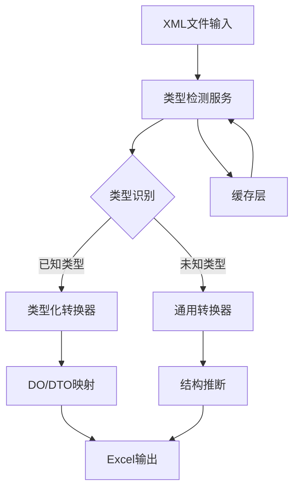
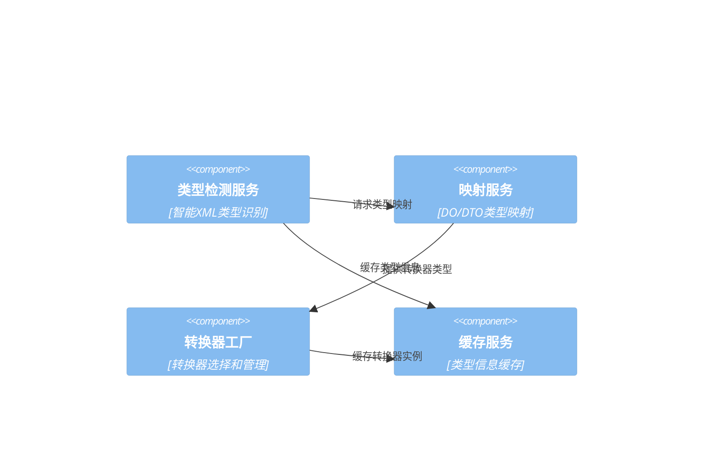

# XML-Excel互转适配系统类型检测和映射系统设计

## 系统概述

本文档详细描述了XML-Excel互转适配系统的类型检测和映射机制。该系统基于现有的DO/DTO架构模式，提供智能的XML类型识别、准确的类型映射和灵活的转换策略选择，确保转换过程的高效性和准确性。

## 系统架构

### 整体架构图


### 核心组件关系


## 类型检测系统设计

### 1. 增强的类型检测服务

```csharp
namespace BannerlordModEditor.TUI.Services.TypeDetection
{
    /// <summary>
    /// 增强的XML类型检测服务
    /// </summary>
    public class EnhancedXmlTypeDetectionService : IEnhancedXmlTypeDetectionService
    {
        private readonly IFileDiscoveryService _fileDiscoveryService;
        private readonly IXmlStructureAnalyzer _structureAnalyzer;
        private readonly IMemoryCache _memoryCache;
        private readonly ILogger<EnhancedXmlTypeDetectionService> _logger;
        
        // 类型注册表
        private readonly Dictionary<string, XmlTypeInfo> _typeRegistry;
        private readonly Dictionary<string, List<TypeDetectionRule>> _detectionRules;
        
        // 缓存配置
        private readonly MemoryCacheEntryOptions _cacheOptions;
        private readonly TimeSpan _cacheExpiration = TimeSpan.FromMinutes(30);
        
        public EnhancedXmlTypeDetectionService(
            IFileDiscoveryService fileDiscoveryService,
            IXmlStructureAnalyzer structureAnalyzer,
            IMemoryCache memoryCache,
            ILogger<EnhancedXmlTypeDetectionService> logger)
        {
            _fileDiscoveryService = fileDiscoveryService;
            _structureAnalyzer = structureAnalyzer;
            _memoryCache = memoryCache;
            _logger = logger;
            
            _typeRegistry = InitializeTypeRegistry();
            _detectionRules = InitializeDetectionRules();
            
            _cacheOptions = new MemoryCacheEntryOptions
            {
                Size = 1,
                Priority = CacheItemPriority.Normal,
                SlidingExpiration = _cacheExpiration
            };
        }
        
        /// <summary>
        /// 检测XML文件类型
        /// </summary>
        public async Task<XmlTypeInfo> DetectXmlTypeAsync(string xmlFilePath)
        {
            try
            {
                // 1. 验证输入
                if (!await ValidateInputFileAsync(xmlFilePath))
                {
                    return CreateInvalidTypeInfo("无效的输入文件");
                }
                
                // 2. 检查缓存
                var cacheKey = GetCacheKey(xmlFilePath);
                if (_memoryCache.TryGetValue(cacheKey, out XmlTypeInfo? cachedInfo))
                {
                    _logger.LogDebug("从缓存返回类型信息: {FilePath}", xmlFilePath);
                    return cachedInfo;
                }
                
                // 3. 多层次类型检测
                var typeInfo = await PerformMultiLevelDetectionAsync(xmlFilePath);
                
                // 4. 缓存结果
                if (typeInfo.IsSupported)
                {
                    _memoryCache.Set(cacheKey, typeInfo, _cacheOptions);
                }
                
                return typeInfo;
            }
            catch (Exception ex)
            {
                _logger.LogError(ex, "XML类型检测失败: {FilePath}", xmlFilePath);
                return CreateInvalidTypeInfo($"类型检测失败: {ex.Message}");
            }
        }
        
        /// <summary>
        /// 多层次类型检测
        /// </summary>
        private async Task<XmlTypeInfo> PerformMultiLevelDetectionAsync(string xmlFilePath)
        {
            // 层次1: 基于文件名检测
            var fileNameResult = await DetectByFileNameAsync(xmlFilePath);
            if (fileNameResult.Confidence > 0.8m)
            {
                return fileNameResult.TypeInfo;
            }
            
            // 层次2: 基于XML结构检测
            var structureResult = await DetectByStructureAsync(xmlFilePath);
            if (structureResult.Confidence > 0.7m)
            {
                return structureResult.TypeInfo;
            }
            
            // 层次3: 基于内容特征检测
            var contentResult = await DetectByContentAsync(xmlFilePath);
            if (contentResult.Confidence > 0.6m)
            {
                return contentResult.TypeInfo;
            }
            
            // 层次4: 基于机器学习检测（如果启用）
            var mlResult = await DetectByMachineLearningAsync(xmlFilePath);
            if (mlResult.Confidence > 0.5m)
            {
                return mlResult.TypeInfo;
            }
            
            // 返回通用类型信息
            return CreateGenericTypeInfo(xmlFilePath);
        }
        
        /// <summary>
        /// 基于文件名检测
        /// </summary>
        private async Task<TypeDetectionResult> DetectByFileNameAsync(string xmlFilePath)
        {
            var fileName = Path.GetFileNameWithoutExtension(xmlFilePath);
            var fileInfo = new FileInfo(xmlFilePath);
            
            // 规则1: 直接匹配
            if (_typeRegistry.TryGetValue(fileName, out var typeInfo))
            {
                return new TypeDetectionResult
                {
                    TypeInfo = typeInfo,
                    Confidence = 0.95m,
                    DetectionMethod = "FileNameDirectMatch"
                };
            }
            
            // 规则2: 模式匹配
            var patternMatch = await MatchFileNamePatternAsync(fileName);
            if (patternMatch != null)
            {
                return new TypeDetectionResult
                {
                    TypeInfo = patternMatch,
                    Confidence = 0.85m,
                    DetectionMethod = "FileNamePatternMatch"
                };
            }
            
            // 规则3: 大小写不敏感匹配
            var caseInsensitiveMatch = _typeRegistry.Keys
                .FirstOrDefault(k => k.Equals(fileName, StringComparison.OrdinalIgnoreCase));
            
            if (caseInsensitiveMatch != null)
            {
                return new TypeDetectionResult
                {
                    TypeInfo = _typeRegistry[caseInsensitiveMatch],
                    Confidence = 0.80m,
                    DetectionMethod = "FileNameCaseInsensitiveMatch"
                };
            }
            
            return new TypeDetectionResult
            {
                Confidence = 0.0m,
                DetectionMethod = "FileNameNoMatch"
            };
        }
        
        /// <summary>
        /// 基于XML结构检测
        /// </summary>
        private async Task<TypeDetectionResult> DetectByStructureAsync(string xmlFilePath)
        {
            try
            {
                var analysisResult = await _structureAnalyzer.AnalyzeStructureAsync(xmlFilePath);
                
                // 基于根元素名称匹配
                if (_typeRegistry.TryGetValue(analysisResult.RootElement, out var typeInfo))
                {
                    return new TypeDetectionResult
                    {
                        TypeInfo = typeInfo,
                        Confidence = 0.90m,
                        DetectionMethod = "StructureRootElementMatch"
                    };
                }
                
                // 基于结构特征匹配
                var structureMatch = await MatchStructureFeaturesAsync(analysisResult);
                if (structureMatch != null)
                {
                    return new TypeDetectionResult
                    {
                        TypeInfo = structureMatch,
                        Confidence = 0.75m,
                        DetectionMethod = "StructureFeatureMatch"
                    };
                }
                
                // 基于复杂度匹配
                var complexityMatch = await MatchByComplexityAsync(analysisResult);
                if (complexityMatch != null)
                {
                    return new TypeDetectionResult
                    {
                        TypeInfo = complexityMatch,
                        Confidence = 0.70m,
                        DetectionMethod = "StructureComplexityMatch"
                    };
                }
                
                return new TypeDetectionResult
                {
                    Confidence = 0.0m,
                    DetectionMethod = "StructureNoMatch"
                };
            }
            catch (Exception ex)
            {
                _logger.LogWarning(ex, "XML结构分析失败: {FilePath}", xmlFilePath);
                return new TypeDetectionResult
                {
                    Confidence = 0.0m,
                    DetectionMethod = "StructureAnalysisFailed"
                };
            }
        }
        
        /// <summary>
        /// 基于内容特征检测
        /// </summary>
        private async Task<TypeDetectionResult> DetectByContentAsync(string xmlFilePath)
        {
            try
            {
                var contentFeatures = await ExtractContentFeaturesAsync(xmlFilePath);
                
                // 基于属性特征匹配
                var attributeMatch = await MatchByAttributesAsync(contentFeatures);
                if (attributeMatch != null)
                {
                    return new TypeDetectionResult
                    {
                        TypeInfo = attributeMatch,
                        Confidence = 0.65m,
                        DetectionMethod = "ContentAttributeMatch"
                    };
                }
                
                // 基于文本内容匹配
                var textMatch = await MatchByTextContentAsync(contentFeatures);
                if (textMatch != null)
                {
                    return new TypeDetectionResult
                    {
                        TypeInfo = textMatch,
                        Confidence = 0.60m,
                        DetectionMethod = "ContentTextMatch"
                    };
                }
                
                // 基于命名空间匹配
                var namespaceMatch = await MatchByNamespacesAsync(contentFeatures);
                if (namespaceMatch != null)
                {
                    return new TypeDetectionResult
                    {
                        TypeInfo = namespaceMatch,
                        Confidence = 0.62m,
                        DetectionMethod = "ContentNamespaceMatch"
                    };
                }
                
                return new TypeDetectionResult
                {
                    Confidence = 0.0m,
                    DetectionMethod = "ContentNoMatch"
                };
            }
            catch (Exception ex)
            {
                _logger.LogWarning(ex, "XML内容特征分析失败: {FilePath}", xmlFilePath);
                return new TypeDetectionResult
                {
                    Confidence = 0.0m,
                    DetectionMethod = "ContentAnalysisFailed"
                };
            }
        }
        
        /// <summary>
        /// 基于机器学习检测（简化版本）
        /// </summary>
        private async Task<TypeDetectionResult> DetectByMachineLearningAsync(string xmlFilePath)
        {
            try
            {
                // 简化的机器学习检测
                var features = await ExtractMLFeaturesAsync(xmlFilePath);
                var prediction = await PredictTypeAsync(features);
                
                if (prediction.Confidence > 0.5m)
                {
                    return new TypeDetectionResult
                    {
                        TypeInfo = prediction.TypeInfo,
                        Confidence = prediction.Confidence,
                        DetectionMethod = "MachineLearningPrediction"
                    };
                }
                
                return new TypeDetectionResult
                {
                    Confidence = 0.0m,
                    DetectionMethod = "MachineLearningNoMatch"
                };
            }
            catch (Exception ex)
            {
                _logger.LogWarning(ex, "机器学习检测失败: {FilePath}", xmlFilePath);
                return new TypeDetectionResult
                {
                    Confidence = 0.0m,
                    DetectionMethod = "MachineLearningFailed"
                };
            }
        }
    }
}
```

### 2. XML结构分析器

```csharp
namespace BannerlordModEditor.TUI.Services.TypeDetection
{
    /// <summary>
    /// XML结构分析器
    /// </summary>
    public class XmlStructureAnalyzer : IXmlStructureAnalyzer
    {
        private readonly ILogger<XmlStructureAnalyzer> _logger;
        
        public XmlStructureAnalyzer(ILogger<XmlStructureAnalyzer> logger)
        {
            _logger = logger;
        }
        
        /// <summary>
        /// 分析XML文档结构
        /// </summary>
        public async Task<XmlAnalysisResult> AnalyzeStructureAsync(XDocument xmlDocument)
        {
            var result = new XmlAnalysisResult
            {
                AnalysisTimestamp = DateTime.UtcNow
            };
            
            try
            {
                var rootElement = xmlDocument.Root;
                if (rootElement == null)
                {
                    result.IsValid = false;
                    result.ErrorMessage = "XML文档没有根元素";
                    return result;
                }
                
                // 基本信息
                result.RootElement = rootElement.Name.LocalName;
                result.Namespaces = ExtractNamespaces(rootElement);
                result.HasAttributes = rootElement.HasAttributes;
                
                // 结构分析
                result.ElementStructure = await AnalyzeElementStructureAsync(rootElement);
                result.AttributeStructure = await AnalyzeAttributeStructureAsync(rootElement);
                result.TextStructure = await AnalyzeTextStructureAsync(rootElement);
                
                // 复杂度分析
                result.Complexity = CalculateComplexity(result);
                
                // 特征提取
                result.Features = ExtractFeatures(result);
                
                result.IsValid = true;
                
                return result;
            }
            catch (Exception ex)
            {
                _logger.LogError(ex, "XML结构分析失败");
                result.IsValid = false;
                result.ErrorMessage = $"结构分析失败: {ex.Message}";
                return result;
            }
        }
        
        /// <summary>
        /// 分析元素结构
        /// </summary>
        private async Task<ElementStructure> AnalyzeElementStructureAsync(XElement rootElement)
        {
            var structure = new ElementStructure();
            
            // BFS遍历XML树
            var queue = new Queue<XElement>();
            queue.Enqueue(rootElement);
            
            while (queue.Count > 0)
            {
                var current = queue.Dequeue();
                var elementInfo = new XElementInfo
                {
                    Name = current.Name.LocalName,
                    Depth = GetElementDepth(current, rootElement),
                    HasAttributes = current.HasAttributes,
                    HasElements = current.HasElements,
                    HasText = !string.IsNullOrWhiteSpace(current.Value),
                    AttributeCount = current.Attributes().Count(),
                    ChildElementCount = current.Elements().Count(),
                    IsRepeated = CountElementOccurrences(current, rootElement) > 1
                };
                
                structure.Elements.Add(elementInfo);
                structure.TotalElements++;
                
                // 统计元素频率
                if (structure.ElementFrequency.ContainsKey(elementInfo.Name))
                {
                    structure.ElementFrequency[elementInfo.Name]++;
                }
                else
                {
                    structure.ElementFrequency[elementInfo.Name] = 1;
                }
                
                // 统计层级分布
                if (structure.LevelDistribution.ContainsKey(elementInfo.Depth))
                {
                    structure.LevelDistribution[elementInfo.Depth]++;
                }
                else
                {
                    structure.LevelDistribution[elementInfo.Depth] = 1;
                }
                
                // 添加子元素到队列
                foreach (var child in current.Elements())
                {
                    queue.Enqueue(child);
                }
            }
            
            // 计算结构特征
            structure.MaxDepth = structure.LevelDistribution.Keys.Max();
            structure.AverageChildrenPerElement = structure.Elements.Count > 0 ? 
                (double)structure.Elements.Sum(e => e.ChildElementCount) / structure.Elements.Count : 0;
            
            return await Task.FromResult(structure);
        }
        
        /// <summary>
        /// 分析属性结构
        /// </summary>
        private async Task<AttributeStructure> AnalyzeAttributeStructureAsync(XElement rootElement)
        {
            var structure = new AttributeStructure();
            
            var attributes = rootElement.DescendantsAndSelf()
                .SelectMany(e => e.Attributes())
                .ToList();
            
            // 统计属性
            structure.TotalAttributes = attributes.Count;
            
            // 属性频率统计
            foreach (var attr in attributes)
            {
                var attrName = attr.Name.LocalName;
                if (structure.AttributeFrequency.ContainsKey(attrName))
                {
                    structure.AttributeFrequency[attrName]++;
                }
                else
                {
                    structure.AttributeFrequency[attrName] = 1;
                }
                
                // 属性值类型分析
                var value = attr.Value;
                if (int.TryParse(value, out _))
                {
                    structure.AttributeValueTypes["integer"]++;
                }
                else if (decimal.TryParse(value, out _))
                {
                    structure.AttributeValueTypes["decimal"]++;
                }
                else if (bool.TryParse(value, out _))
                {
                    structure.AttributeValueTypes["boolean"]++;
                }
                else if (DateTime.TryParse(value, out _))
                {
                    structure.AttributeValueTypes["datetime"]++;
                }
                else
                {
                    structure.AttributeValueTypes["string"]++;
                }
            }
            
            // 常见属性识别
            structure.CommonAttributes = structure.AttributeFrequency
                .Where(kvp => kvp.Value > attributes.Count * 0.1)
                .OrderByDescending(kvp => kvp.Value)
                .Select(kvp => kvp.Key)
                .ToList();
            
            return await Task.FromResult(structure);
        }
        
        /// <summary>
        /// 分析文本结构
        /// </summary>
        private async Task<TextStructure> AnalyzeTextStructureAsync(XElement rootElement)
        {
            var structure = new TextStructure();
            
            var textNodes = rootElement.DescendantsAndSelf()
                .Where(e => !string.IsNullOrWhiteSpace(e.Value))
                .Select(e => e.Value.Trim())
                .ToList();
            
            structure.TotalTextNodes = textNodes.Count;
            
            if (textNodes.Count > 0)
            {
                // 文本长度分析
                structure.AverageTextLength = textNodes.Average(t => t.Length);
                structure.MaxTextLength = textNodes.Max(t => t.Length);
                structure.MinTextLength = textNodes.Min(t => t.Length);
                
                // 文本内容分析
                foreach (var text in textNodes)
                {
                    if (int.TryParse(text, out _))
                    {
                        structure.TextContentTypes["numeric"]++;
                    }
                    else if (text.Contains(" "))
                    {
                        structure.TextContentTypes["text"]++;
                    }
                    else if (text.Contains("_") || text.Contains("-"))
                    {
                        structure.TextContentTypes["identifier"]++;
                    }
                    else
                    {
                        structure.TextContentTypes["simple"]++;
                    }
                }
            }
            
            return await Task.FromResult(structure);
        }
        
        /// <summary>
        /// 计算XML复杂度
        /// </summary>
        private ComplexityScore CalculateComplexity(XmlAnalysisResult analysis)
        {
            var score = new ComplexityScore();
            
            // 基础复杂度分数
            score.BaseScore = analysis.ElementStructure.TotalElements * 1 +
                              analysis.AttributeStructure.TotalAttributes * 0.5 +
                              analysis.TextStructure.TotalTextNodes * 0.3;
            
            // 结构复杂度
            score.StructuralComplexity = analysis.ElementStructure.MaxDepth * 2 +
                                         analysis.ElementStructure.AverageChildrenPerElement * 1.5;
            
            // 属性复杂度
            score.AttributeComplexity = analysis.AttributeStructure.AttributeFrequency.Count * 1.5 +
                                       analysis.AttributeStructure.CommonAttributes.Count * 0.8;
            
            // 命名空间复杂度
            score.NamespaceComplexity = analysis.Namespaces.Count * 2;
            
            // 文本复杂度
            score.TextComplexity = analysis.TextStructure.TextContentTypes.Count * 1;
            
            // 计算总分
            score.TotalScore = score.BaseScore +
                               score.StructuralComplexity +
                               score.AttributeComplexity +
                               score.NamespaceComplexity +
                               score.TextComplexity;
            
            // 复杂度等级
            if (score.TotalScore < 50)
            {
                score.ComplexityLevel = ComplexityLevel.Simple;
            }
            else if (score.TotalScore < 200)
            {
                score.ComplexityLevel = ComplexityLevel.Medium;
            }
            else if (score.TotalScore < 500)
            {
                score.ComplexityLevel = ComplexityLevel.Complex;
            }
            else
            {
                score.ComplexityLevel = ComplexityLevel.VeryComplex;
            }
            
            return score;
        }
        
        /// <summary>
        /// 提取特征
        /// </summary>
        private Dictionary<string, double> ExtractFeatures(XmlAnalysisResult analysis)
        {
            var features = new Dictionary<string, double>();
            
            // 基本特征
            features["element_count"] = analysis.ElementStructure.TotalElements;
            features["attribute_count"] = analysis.AttributeStructure.TotalAttributes;
            features["text_node_count"] = analysis.TextStructure.TotalTextNodes;
            features["max_depth"] = analysis.ElementStructure.MaxDepth;
            features["namespace_count"] = analysis.Namespaces.Count;
            
            // 比例特征
            var totalNodes = analysis.ElementStructure.TotalElements + 
                             analysis.AttributeStructure.TotalAttributes + 
                             analysis.TextStructure.TotalTextNodes;
            
            if (totalNodes > 0)
            {
                features["element_ratio"] = (double)analysis.ElementStructure.TotalElements / totalNodes;
                features["attribute_ratio"] = (double)analysis.AttributeStructure.TotalAttributes / totalNodes;
                features["text_ratio"] = (double)analysis.TextStructure.TotalTextNodes / totalNodes;
            }
            
            // 复杂度特征
            features["avg_children_per_element"] = analysis.ElementStructure.AverageChildrenPerElement;
            features["unique_element_types"] = analysis.ElementStructure.ElementFrequency.Count;
            features["unique_attribute_types"] = analysis.AttributeStructure.AttributeFrequency.Count;
            
            return features;
        }
        
        // 辅助方法
        private int GetElementDepth(XElement element, XElement root)
        {
            var depth = 0;
            var current = element;
            
            while (current != null && current != root)
            {
                depth++;
                current = current.Parent;
            }
            
            return depth;
        }
        
        private int CountElementOccurrences(XElement element, XElement root)
        {
            return root.Descendants(element.Name).Count();
        }
        
        private List<string> ExtractNamespaces(XElement element)
        {
            return element.Attributes()
                .Where(a => a.IsNamespaceDeclaration)
                .Select(a => a.Value)
                .Distinct()
                .ToList();
        }
    }
}
```

## 类型映射系统设计

### 1. 类型映射服务

```csharp
namespace BannerlordModEditor.TUI.Services.TypeMapping
{
    /// <summary>
    /// 类型映射服务
    /// </summary>
    public class XmlTypeMappingService : IXmlTypeMappingService
    {
        private readonly IServiceProvider _serviceProvider;
        private readonly IXmlTypeDetectionService _typeDetectionService;
        private readonly IMemoryCache _memoryCache;
        private readonly ILogger<XmlTypeMappingService> _logger;
        
        // 类型映射注册表
        private readonly Dictionary<string, XmlTypeMapping> _mappings;
        private readonly Dictionary<Type, List<XmlTypeMapping>> _reverseMappings;
        
        // 映射缓存
        private readonly MemoryCacheEntryOptions _cacheOptions;
        
        public XmlTypeMappingService(
            IServiceProvider serviceProvider,
            IXmlTypeDetectionService typeDetectionService,
            IMemoryCache memoryCache,
            ILogger<XmlTypeMappingService> logger)
        {
            _serviceProvider = serviceProvider;
            _typeDetectionService = typeDetectionService;
            _memoryCache = memoryCache;
            _logger = logger;
            
            _mappings = new Dictionary<string, XmlTypeMapping>();
            _reverseMappings = new Dictionary<Type, List<XmlTypeMapping>>();
            
            _cacheOptions = new MemoryCacheEntryOptions
            {
                Size = 1,
                Priority = CacheItemPriority.Normal,
                SlidingExpiration = TimeSpan.FromHours(1)
            };
            
            InitializeMappings();
        }
        
        /// <summary>
        /// 获取类型映射
        /// </summary>
        public async Task<XmlTypeMapping?> GetMappingAsync(string xmlType)
        {
            try
            {
                // 检查缓存
                var cacheKey = $"mapping_{xmlType}";
                if (_memoryCache.TryGetValue(cacheKey, out XmlTypeMapping? cachedMapping))
                {
                    return cachedMapping;
                }
                
                // 查找映射
                if (_mappings.TryGetValue(xmlType, out var mapping))
                {
                    // 验证映射有效性
                    if (await ValidateMappingAsync(mapping))
                    {
                        _memoryCache.Set(cacheKey, mapping, _cacheOptions);
                        return mapping;
                    }
                }
                
                // 尝试动态映射
                var dynamicMapping = await CreateDynamicMappingAsync(xmlType);
                if (dynamicMapping != null)
                {
                    _memoryCache.Set(cacheKey, dynamicMapping, _cacheOptions);
                    return dynamicMapping;
                }
                
                return null;
            }
            catch (Exception ex)
            {
                _logger.LogError(ex, "获取类型映射失败: {XmlType}", xmlType);
                return null;
            }
        }
        
        /// <summary>
        /// 获取反向映射
        /// </summary>
        public async Task<XmlTypeMapping?> GetReverseMappingAsync(Type modelType)
        {
            try
            {
                // 检查缓存
                var cacheKey = $"reverse_mapping_{modelType.Name}";
                if (_memoryCache.TryGetValue(cacheKey, out XmlTypeMapping? cachedMapping))
                {
                    return cachedMapping;
                }
                
                // 查找反向映射
                if (_reverseMappings.TryGetValue(modelType, out var mappings))
                {
                    var validMapping = mappings.FirstOrDefault(m => 
                        await ValidateMappingAsync(m));
                    
                    if (validMapping != null)
                    {
                        _memoryCache.Set(cacheKey, validMapping, _cacheOptions);
                        return validMapping;
                    }
                }
                
                // 尝试创建反向映射
                var reverseMapping = await CreateReverseMappingAsync(modelType);
                if (reverseMapping != null)
                {
                    _memoryCache.Set(cacheKey, reverseMapping, _cacheOptions);
                    return reverseMapping;
                }
                
                return null;
            }
            catch (Exception ex)
            {
                _logger.LogError(ex, "获取反向类型映射失败: {ModelType}", modelType.Name);
                return null;
            }
        }
        
        /// <summary>
        /// 创建映射器
        /// </summary>
        public async Task<IMapper?> CreateMapperAsync(string xmlType)
        {
            var mapping = await GetMappingAsync(xmlType);
            if (mapping == null)
            {
                return null;
            }
            
            return CreateMapperInstance(mapping);
        }
        
        /// <summary>
        /// 创建类型化映射器
        /// </summary>
        public async Task<IMapper?> CreateMapperAsync<T>() where T : class, new()
        {
            var mapping = await GetReverseMappingAsync(typeof(T));
            if (mapping == null)
            {
                return null;
            }
            
            return CreateMapperInstance(mapping);
        }
        
        /// <summary>
        /// 初始化类型映射
        /// </summary>
        private void InitializeMappings()
        {
            // 核心系统类型映射
            AddMapping<ActionTypesDO>("ActionTypes", "动作类型定义", true);
            AddMapping<CombatParametersDO>("CombatParameters", "战斗参数配置", true);
            AddMapping<ItemModifiersDO>("ItemModifiers", "物品修饰符", true);
            AddMapping<CraftingPiecesDO>("CraftingPieces", "制作部件", true);
            AddMapping<ItemHolstersDO>("ItemHolsters", "物品插槽", true);
            AddMapping<ActionSetsDO>("ActionSets", "动作集合", true);
            AddMapping<CollisionInfosDO>("CollisionInfos", "碰撞信息", true);
            AddMapping<BoneBodyTypesDO>("BoneBodyTypes", "骨骼身体类型", true);
            AddMapping<PhysicsMaterialsDO>("PhysicsMaterials", "物理材质", true);
            AddMapping<ParticleSystemsDO>("ParticleSystems", "粒子系统", true);
            
            // 游戏内容类型映射
            AddMapping<MapIconsDO>("MapIcons", "地图图标", true);
            AddMapping<FloraKindsDO>("FloraKinds", "植物类型", true);
            AddMapping<ScenesDO>("Scenes", "场景定义", true);
            AddMapping<CreditsDO>("Credits", "制作人员名单", true);
            AddMapping<BannerIconsDO>("BannerIcons", "旗帜图标", true);
            AddMapping<SkinsDO>("Skins", "皮肤定义", true);
            AddMapping<ItemUsageSetsDO>("ItemUsageSets", "物品使用集合", true);
            AddMapping<MovementSetsDO>("MovementSets", "运动集合", true);
            
            // 多人游戏类型映射
            AddMapping<MPClassDivisionsDO>("MPClassDivisions", "多人职业划分", true);
            AddMapping<MPCharactersDO>("MPCharacters", "多人角色", true);
            AddMapping<BadgesDO>("Badges", "徽章", true);
            
            // 引擎系统类型映射
            AddMapping<TerrainMaterialsDO>("TerrainMaterials", "地形材质", true);
            AddMapping<PostfxGraphsDO>("PostfxGraphs", "后处理效果", true);
        }
        
        /// <summary>
        /// 添加类型映射
        /// </summary>
        private void AddMapping<T>(string xmlType, string description, bool isAdapted) 
            where T : class, new()
        {
            var mapping = new XmlTypeMapping
            {
                XmlType = xmlType,
                ModelType = typeof(T),
                Description = description,
                IsAdapted = isAdapted,
                IsSupported = true,
                SupportedOperations = GetSupportedOperations(isAdapted),
                MapperType = typeof(TypedXmlExcelConverter<T>)
            };
            
            _mappings[xmlType] = mapping;
            
            // 添加反向映射
            if (!_reverseMappings.ContainsKey(typeof(T)))
            {
                _reverseMappings[typeof(T)] = new List<XmlTypeMapping>();
            }
            _reverseMappings[typeof(T)].Add(mapping);
        }
        
        /// <summary>
        /// 创建动态映射
        /// </summary>
        private async Task<XmlTypeMapping?> CreateDynamicMappingAsync(string xmlType)
        {
            try
            {
                // 获取XML类型信息
                var typeInfo = await _typeDetectionService.DetectXmlTypeAsync(xmlType);
                if (!typeInfo.IsSupported)
                {
                    return null;
                }
                
                // 创建通用映射
                var mapping = new XmlTypeMapping
                {
                    XmlType = xmlType,
                    ModelType = typeof(object), // 通用类型
                    Description = typeInfo.Description,
                    IsAdapted = false,
                    IsSupported = true,
                    SupportedOperations = GetSupportedOperations(false),
                    MapperType = typeof(GenericXmlExcelConverter),
                    IsDynamic = true
                };
                
                return mapping;
            }
            catch (Exception ex)
            {
                _logger.LogError(ex, "创建动态映射失败: {XmlType}", xmlType);
                return null;
            }
        }
        
        /// <summary>
        /// 创建反向映射
        /// </summary>
        private async Task<XmlTypeMapping?> CreateReverseMappingAsync(Type modelType)
        {
            try
            {
                // 查找匹配的XML类型
                var typeName = modelType.Name;
                if (typeName.EndsWith("DO"))
                {
                    var xmlType = typeName.Replace("DO", "");
                    if (_mappings.ContainsKey(xmlType))
                    {
                        return _mappings[xmlType];
                    }
                }
                
                // 创建通用反向映射
                var mapping = new XmlTypeMapping
                {
                    XmlType = typeName,
                    ModelType = modelType,
                    Description = $"动态映射: {typeName}",
                    IsAdapted = false,
                    IsSupported = true,
                    SupportedOperations = GetSupportedOperations(false),
                    MapperType = typeof(GenericXmlExcelConverter),
                    IsDynamic = true,
                    IsReverseMapping = true
                };
                
                return mapping;
            }
            catch (Exception ex)
            {
                _logger.LogError(ex, "创建反向映射失败: {ModelType}", modelType.Name);
                return null;
            }
        }
        
        /// <summary>
        /// 验证映射有效性
        /// </summary>
        private async Task<bool> ValidateMappingAsync(XmlTypeMapping mapping)
        {
            try
            {
                // 检查类型是否有效
                if (mapping.ModelType == null)
                {
                    return false;
                }
                
                // 检查映射器类型是否有效
                if (mapping.MapperType == null)
                {
                    return false;
                }
                
                // 检查是否可以创建映射器实例
                var mapper = CreateMapperInstance(mapping);
                if (mapper == null)
                {
                    return false;
                }
                
                // 对于已适配的类型，验证XML文件是否存在
                if (mapping.IsAdapted)
                {
                    var hasTestFile = await TestFileExistsAsync(mapping.XmlType);
                    if (!hasTestFile)
                    {
                        _logger.LogWarning("已适配类型 {XmlType} 没有找到测试文件", mapping.XmlType);
                        return false;
                    }
                }
                
                return true;
            }
            catch (Exception ex)
            {
                _logger.LogError(ex, "验证映射失败: {XmlType}", mapping.XmlType);
                return false;
            }
        }
        
        /// <summary>
        /// 创建映射器实例
        /// </summary>
        private IMapper? CreateMapperInstance(XmlTypeMapping mapping)
        {
            try
            {
                if (mapping.MapperType == null)
                {
                    return null;
                }
                
                // 使用依赖注入创建映射器
                var mapper = (IMapper?)_serviceProvider.GetService(mapping.MapperType);
                if (mapper == null)
                {
                    // 尝试直接创建实例
                    mapper = (IMapper?)Activator.CreateInstance(mapping.MapperType, _serviceProvider);
                }
                
                return mapper;
            }
            catch (Exception ex)
            {
                _logger.LogError(ex, "创建映射器实例失败: {MapperType}", mapping.MapperType?.Name);
                return null;
            }
        }
        
        /// <summary>
        /// 获取支持的操作
        /// </summary>
        private List<SupportedOperation> GetSupportedOperations(bool isAdapted)
        {
            var operations = new List<SupportedOperation>
            {
                SupportedOperation.Read,
                SupportedOperation.ConvertToExcel,
                SupportedOperation.ConvertFromExcel
            };
            
            if (isAdapted)
            {
                operations.AddRange(new[]
                {
                    SupportedOperation.Write,
                    SupportedOperation.Validate,
                    SupportedOperation.TemplateGeneration,
                    SupportedOperation.Preview
                });
            }
            
            return operations;
        }
        
        /// <summary>
        /// 测试文件是否存在
        /// </summary>
        private async Task<bool> TestFileExistsAsync(string xmlType)
        {
            try
            {
                var testFiles = await _typeDetectionService.GetSupportedXmlTypesAsync();
                return testFiles.Any(t => t.XmlType == xmlType && t.IsSupported);
            }
            catch
            {
                return false;
            }
        }
    }
}
```

### 2. 类型映射配置

```csharp
namespace BannerlordModEditor.TUI.Services.TypeMapping
{
    /// <summary>
    /// 类型映射配置
    /// </summary>
    public class XmlTypeMappingConfiguration
    {
        /// <summary>
        /// 映射规则
        /// </summary>
        public List<MappingRule> MappingRules { get; set; } = new();
        
        /// <summary>
        /// 自定义映射器
        /// </summary>
        public List<CustomMapper> CustomMappers { get; set; } = new();
        
        /// <summary>
        /// 类型别名
        /// </summary>
        public Dictionary<string, string> TypeAliases { get; set; } = new();
        
        /// <summary>
        /// 映射优先级
        /// </summary>
        public List<string> MappingPriority { get; set; } = new();
        
        /// <summary>
        /// 映射选项
        /// </summary>
        public XmlTypeMappingOptions Options { get; set; } = new();
    }
    
    /// <summary>
    /// 映射规则
    /// </summary>
    public class MappingRule
    {
        /// <summary>
        /// 规则名称
        /// </summary>
        public string Name { get; set; } = string.Empty;
        
        /// <summary>
        /// 规则描述
        /// </summary>
        public string Description { get; set; } = string.Empty;
        
        /// <summary>
        /// XML类型模式
        /// </summary>
        public string XmlTypePattern { get; set; } = string.Empty;
        
        /// <summary>
        /// 模型类型模式
        /// </summary>
        public string ModelTypePattern { get; set; } = string.Empty;
        
        /// <summary>
        /// 映射器类型
        /// </summary>
        public Type? MapperType { get; set; }
        
        /// <summary>
        /// 优先级
        /// </summary>
        public int Priority { get; set; } = 0;
        
        /// <summary>
        /// 是否启用
        /// </summary>
        public bool IsEnabled { get; set; } = true;
        
        /// <summary>
        /// 规则条件
        /// </summary>
        public List<MappingCondition> Conditions { get; set; } = new();
    }
    
    /// <summary>
    /// 映射条件
    /// </summary>
    public class MappingCondition
    {
        /// <summary>
        /// 条件类型
        /// </summary>
        public ConditionType Type { get; set; }
        
        /// <summary>
        /// 条件值
        /// </summary>
        public string Value { get; set; } = string.Empty;
        
        /// <summary>
        /// 比较操作
        /// </summary>
        public ComparisonOperation Operation { get; set; }
        
        /// <summary>
        /// 是否满足条件
        /// </summary>
        public bool IsMet { get; set; }
    }
    
    /// <summary>
    /// 自定义映射器
    /// </summary>
    public class CustomMapper
    {
        /// <summary>
        /// 映射器名称
        /// </summary>
        public string Name { get; set; } = string.Empty;
        
        /// <summary>
        /// XML类型
        /// </summary>
        public string XmlType { get; set; } = string.Empty;
        
        /// <summary>
        /// 模型类型
        /// </summary>
        public Type ModelType { get; set; } = typeof(object);
        
        /// <summary>
        /// 映射器类型
        /// </summary>
        public Type MapperType { get; set; } = typeof(object);
        
        /// <summary>
        /// 映射器配置
        /// </summary>
        public Dictionary<string, object> Configuration { get; set; } = new();
    }
    
    /// <summary>
    /// 映射选项
    /// </summary>
    public class XmlTypeMappingOptions
    {
        /// <summary>
        /// 是否启用缓存
        /// </summary>
        public bool EnableCaching { get; set; } = true;
        
        /// <summary>
        /// 是否启用动态映射
        /// </summary>
        public bool EnableDynamicMapping { get; set; } = true;
        
        /// <summary>
        /// 是否启用反向映射
        /// </summary>
        public bool EnableReverseMapping { get; set; } = true;
        
        /// <summary>
        /// 是否验证映射
        /// </summary>
        public bool ValidateMappings { get; set; } = true;
        
        /// <summary>
        /// 缓存过期时间
        /// </summary>
        public TimeSpan CacheExpiration { get; set; } = TimeSpan.FromHours(1);
        
        /// <summary>
        /// 最大缓存大小
        /// </summary>
        public int MaxCacheSize { get; set; } = 100;
        
        /// <summary>
        /// 映射超时时间
        /// </summary>
        public TimeSpan MappingTimeout { get; set; } = TimeSpan.FromSeconds(30);
    }
    
    /// <summary>
    /// 条件类型枚举
    /// </summary>
    public enum ConditionType
    {
        /// <summary>
        /// 文件大小
        /// </summary>
        FileSize,
        
        /// <summary>
        /// 元素数量
        /// </summary>
        ElementCount,
        
        /// <summary>
        /// 属性数量
        /// </summary>
        AttributeCount,
        
        /// <summary>
        /// XML深度
        /// </summary>
        XmlDepth,
        
        /// <summary>
        /// 命名空间数量
        /// </summary>
        NamespaceCount,
        
        /// <summary>
        /// 自定义条件
        /// </summary>
        Custom
    }
    
    /// <summary>
    /// 比较操作枚举
    /// </summary>
    public enum ComparisonOperation
    {
        /// <summary>
        /// 等于
        /// </summary>
        Equals,
        
        /// <summary>
        /// 不等于
        /// </summary>
        NotEquals,
        
        /// <summary>
        /// 大于
        /// </summary>
        GreaterThan,
        
        /// <summary>
        /// 小于
        /// </summary>
        LessThan,
        
        /// <summary>
        /// 大于等于
        /// </summary>
        GreaterThanOrEqual,
        
        /// <summary>
        /// 小于等于
        /// </summary>
        LessThanOrEqual,
        
        /// <summary>
        /// 包含
        /// </summary>
        Contains,
        
        /// <summary>
        /// 正则匹配
        /// </summary>
        RegexMatch
    }
}
```

## 缓存和性能优化

### 1. 类型检测缓存

```csharp
namespace BannerlordModEditor.TUI.Services.TypeDetection.Caching
{
    /// <summary>
    /// 类型检测缓存服务
    /// </summary>
    public class TypeDetectionCacheService : ITypeDetectionCacheService
    {
        private readonly IMemoryCache _memoryCache;
        private readonly ILogger<TypeDetectionCacheService> _logger;
        private readonly CacheStatistics _statistics;
        
        // 缓存配置
        private readonly MemoryCacheEntryOptions _cacheOptions;
        private readonly TimeSpan _defaultExpiration = TimeSpan.FromMinutes(30);
        
        public TypeDetectionCacheService(
            IMemoryCache memoryCache,
            ILogger<TypeDetectionCacheService> logger)
        {
            _memoryCache = memoryCache;
            _logger = logger;
            _statistics = new CacheStatistics();
            
            _cacheOptions = new MemoryCacheEntryOptions
            {
                Size = 1,
                Priority = CacheItemPriority.Normal,
                SlidingExpiration = _defaultExpiration
            };
        }
        
        /// <summary>
        /// 获取缓存类型信息
        /// </summary>
        public async Task<XmlTypeInfo?> GetCachedTypeAsync(string xmlFilePath)
        {
            try
            {
                var cacheKey = GetCacheKey(xmlFilePath);
                
                if (_memoryCache.TryGetValue(cacheKey, out XmlTypeInfo? cachedInfo))
                {
                    _statistics.CacheHits++;
                    _logger.LogDebug("缓存命中: {FilePath}", xmlFilePath);
                    return cachedInfo;
                }
                
                _statistics.CacheMisses++;
                return null;
            }
            catch (Exception ex)
            {
                _logger.LogError(ex, "获取缓存类型信息失败: {FilePath}", xmlFilePath);
                return null;
            }
        }
        
        /// <summary>
        /// 缓存类型信息
        /// </summary>
        public async Task CacheTypeAsync(string xmlFilePath, XmlTypeInfo typeInfo)
        {
            try
            {
                var cacheKey = GetCacheKey(xmlFilePath);
                
                // 检查文件修改时间
                var fileInfo = new FileInfo(xmlFilePath);
                var lastModified = fileInfo.LastWriteTime;
                
                var cacheEntry = new CachedTypeInfo
                {
                    TypeInfo = typeInfo,
                    FilePath = xmlFilePath,
                    FileSize = fileInfo.Length,
                    LastModified = lastModified,
                    CachedAt = DateTime.UtcNow
                };
                
                _memoryCache.Set(cacheKey, cacheEntry, _cacheOptions);
                
                _statistics.CacheEntries++;
                _logger.LogDebug("缓存类型信息: {FilePath}, Type: {XmlType}", 
                    xmlFilePath, typeInfo.XmlType);
            }
            catch (Exception ex)
            {
                _logger.LogError(ex, "缓存类型信息失败: {FilePath}", xmlFilePath);
            }
        }
        
        /// <summary>
        /// 检查缓存是否有效
        /// </summary>
        public async Task<bool> IsCacheValidAsync(string xmlFilePath)
        {
            try
            {
                var cacheKey = GetCacheKey(xmlFilePath);
                
                if (!_memoryCache.TryGetValue(cacheKey, out CachedTypeInfo? cachedInfo))
                {
                    return false;
                }
                
                // 检查文件是否被修改
                var fileInfo = new FileInfo(xmlFilePath);
                return fileInfo.LastWriteTime == cachedInfo.LastModified;
            }
            catch (Exception ex)
            {
                _logger.LogError(ex, "检查缓存有效性失败: {FilePath}", xmlFilePath);
                return false;
            }
        }
        
        /// <summary>
        /// 清除缓存
        /// </summary>
        public async Task ClearCacheAsync()
        {
            try
            {
                // 获取所有缓存键
                var cacheKeys = _memoryCache
                    .Where(kvp => kvp.Key.StartsWith("type_detection_"))
                    .Select(kvp => kvp.Key)
                    .ToList();
                
                // 清除缓存
                foreach (var key in cacheKeys)
                {
                    _memoryCache.Remove(key);
                }
                
                _statistics.CacheEntries = 0;
                _logger.LogInformation("清除类型检测缓存，共清除 {Count} 个条目", cacheKeys.Count);
            }
            catch (Exception ex)
            {
                _logger.LogError(ex, "清除缓存失败");
            }
        }
        
        /// <summary>
        /// 清除过期缓存
        /// </summary>
        public async Task ClearExpiredCacheAsync()
        {
            try
            {
                var expiredCount = 0;
                var now = DateTime.UtcNow;
                
                // 获取所有缓存条目
                var cacheKeys = _memoryCache
                    .Where(kvp => kvp.Key.StartsWith("type_detection_"))
                    .ToList();
                
                foreach (var key in cacheKeys)
                {
                    if (_memoryCache.TryGetValue(key, out CachedTypeInfo? cachedInfo))
                    {
                        var age = now - cachedInfo.CachedAt;
                        if (age > _defaultExpiration)
                        {
                            _memoryCache.Remove(key);
                            expiredCount++;
                        }
                    }
                }
                
                _statistics.CacheEntries -= expiredCount;
                _logger.LogInformation("清除过期缓存，共清除 {Count} 个条目", expiredCount);
            }
            catch (Exception ex)
            {
                _logger.LogError(ex, "清除过期缓存失败");
            }
        }
        
        /// <summary>
        /// 获取缓存统计信息
        /// </summary>
        public CacheStatistics GetStatistics()
        {
            _statistics.HitRate = _statistics.CacheHits + _statistics.CacheMisses > 0 ?
                (double)_statistics.CacheHits / (_statistics.CacheHits + _statistics.CacheMisses) : 0;
            
            return _statistics;
        }
        
        /// <summary>
        /// 预热缓存
        /// </summary>
        public async Task WarmupCacheAsync(IEnumerable<string> xmlFiles)
        {
            try
            {
                var count = 0;
                foreach (var xmlFile in xmlFiles)
                {
                    if (File.Exists(xmlFile))
                    {
                        var cacheKey = GetCacheKey(xmlFile);
                        var fileInfo = new FileInfo(xmlFile);
                        
                        var cacheEntry = new CachedTypeInfo
                        {
                            FilePath = xmlFile,
                            FileSize = fileInfo.Length,
                            LastModified = fileInfo.LastWriteTime,
                            CachedAt = DateTime.UtcNow,
                            TypeInfo = new XmlTypeInfo
                            {
                                XmlType = "Unknown",
                                IsSupported = false
                            }
                        };
                        
                        _memoryCache.Set(cacheKey, cacheEntry, _cacheOptions);
                        count++;
                    }
                }
                
                _statistics.CacheEntries = count;
                _logger.LogInformation("缓存预热完成，共预热 {Count} 个文件", count);
            }
            catch (Exception ex)
            {
                _logger.LogError(ex, "缓存预热失败");
            }
        }
        
        private string GetCacheKey(string xmlFilePath)
        {
            var fileInfo = new FileInfo(xmlFilePath);
            return $"type_detection_{fileInfo.FullName}_{fileInfo.LastWriteTime.Ticks}";
        }
    }
    
    /// <summary>
    /// 缓存统计信息
    /// </summary>
    public class CacheStatistics
    {
        /// <summary>
        /// 缓存命中次数
        /// </summary>
        public long CacheHits { get; set; }
        
        /// <summary>
        /// 缓存未命中次数
        /// </summary>
        public long CacheMisses { get; set; }
        
        /// <summary>
        /// 缓存条目数量
        /// </summary>
        public int CacheEntries { get; set; }
        
        /// <summary>
        /// 缓存命中率
        /// </summary>
        public double HitRate { get; set; }
        
        /// <summary>
        /// 最后统计时间
        /// </summary>
        public DateTime LastStatisticsTime { get; set; } = DateTime.UtcNow;
    }
    
    /// <summary>
    /// 缓存的类型信息
    /// </summary>
    public class CachedTypeInfo
    {
        /// <summary>
        /// 类型信息
        /// </summary>
        public XmlTypeInfo TypeInfo { get; set; } = new();
        
        /// <summary>
        /// 文件路径
        /// </summary>
        public string FilePath { get; set; } = string.Empty;
        
        /// <summary>
        /// 文件大小
        /// </summary>
        public long FileSize { get; set; }
        
        /// <summary>
        /// 最后修改时间
        /// </summary>
        public DateTime LastModified { get; set; }
        
        /// <summary>
        /// 缓存时间
        /// </summary>
        public DateTime CachedAt { get; set; }
    }
}
```

## 总结

类型检测和映射系统为XML-Excel互转适配系统提供了：

### 核心功能
1. **多层次类型检测**: 文件名、结构、内容、机器学习四个层次
2. **智能类型映射**: 基于DO/DTO架构的强类型映射
3. **缓存优化**: 多层缓存机制提升性能
4. **动态映射**: 支持未知XML类型的动态处理

### 技术特点
1. **高性能**: 缓存机制和优化的检测算法
2. **可扩展**: 插件化的检测规则和映射配置
3. **可靠性**: 完善的错误处理和验证机制
4. **灵活性**: 支持自定义映射器和检测规则

### 架构优势
1. **模块化设计**: 各组件职责清晰，易于维护
2. **类型安全**: 基于泛型的强类型映射
3. **缓存友好**: 智能缓存策略减少重复计算
4. **可测试**: 完整的接口抽象和依赖注入

这个系统为XML-Excel转换提供了强大而灵活的类型检测和映射能力，确保转换过程的高效性和准确性。