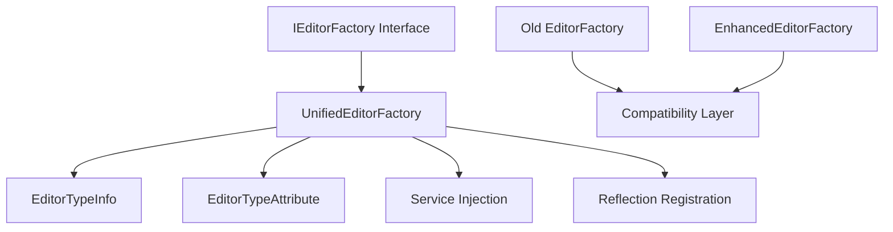
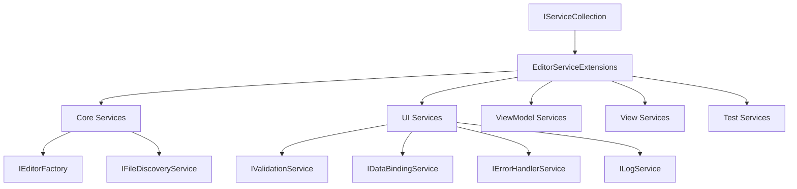
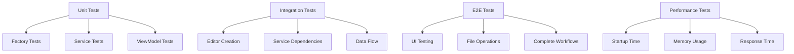

# CI/CD修复架构完整总结

## 项目概述

本文档总结了BannerlordModEditor项目CI/CD修复的完整架构设计，涵盖了从问题分析到实施维护的全过程。

## 1. 问题诊断总结

### 1.1 核心问题识别

经过详细分析，确定了以下关键问题：

#### 工厂模式冲突
- **问题**：`EditorFactory`和`EnhancedEditorFactory`同时存在，功能重叠
- **影响**：代码重复，维护困难，可能导致不一致的行为
- **解决方案**：创建`UnifiedEditorFactory`统一实现

#### 接口定义不完整
- **问题**：`IEditorFactory`接口缺少高级功能定义
- **影响**：无法充分利用增强功能
- **解决方案**：完善接口定义，包含所有必要功能

#### 服务注册问题
- **问题**：依赖注入配置不完整，测试环境服务注册缺失
- **影响**：运行时错误，测试失败
- **解决方案**：创建完整的服务注册扩展

#### 缺失类型和引用
- **问题**：多个View类型缺失，ViewModel引用不完整
- **影响**：编译错误，运行时异常
- **解决方案**：补全所有缺失的类型和引用

#### 测试环境配置
- **问题**：测试服务注册不完整，测试覆盖不足
- **影响**：CI/CD流程失败，质量无法保证
- **解决方案**：优化测试基础设施和覆盖率

## 2. 架构解决方案

### 2.1 统一工厂模式

#### 新的架构设计

#### 关键特性
- **统一接口**：完整的IEditorFactory接口定义
- **类型安全**：强类型的编辑器注册和创建
- **反射支持**：自动发现和注册编辑器
- **服务注入**：自动注入依赖服务
- **分类管理**：按类别组织编辑器

### 2.2 服务注册架构

#### 依赖注入层次

#### 服务生命周期
- **Singleton**：工厂和服务实例
- **Transient**：ViewModel和View实例
- **Scoped**：会话相关服务（如果需要）

### 2.3 测试架构

#### 测试分层

#### 质量保证机制
- **自动化验证**：构建时自动运行
- **性能监控**：持续性能检查
- **覆盖率要求**：85%+代码覆盖率
- **CI/CD集成**：完整的自动化流程

## 3. 技术实现细节

### 3.1 核心组件

#### UnifiedEditorFactory
- **功能**：统一的编辑器创建和管理
- **特性**：反射注册、服务注入、分类管理
- **优势**：消除代码重复，提高可维护性

#### EditorTypeInfo
- **功能**：编辑器类型信息封装
- **特性**：完整的编辑器元数据
- **优势**：类型安全的编辑器管理

#### Service Extensions
- **功能**：服务注册扩展方法
- **特性**：自动注册所有必需服务
- **优势**：简化依赖注入配置

### 3.2 关键技术决策

#### 工厂模式选择
- **决策**：采用统一工厂模式
- **理由**：消除重复，提高一致性
- **影响**：简化维护，增强扩展性

#### 依赖注入策略
- **决策**：使用Microsoft.Extensions.DependencyInjection
- **理由**：与.NET生态系统集成
- **影响**：标准化，易于测试

#### 测试框架选择
- **决策**：使用NUnit + xUnit
- **理由**：成熟的测试生态系统
- **影响**：良好的测试覆盖和工具支持

## 4. 实施策略

### 4.1 分阶段实施

#### 阶段1：统一编辑器工厂（2-3小时）
- 创建UnifiedEditorFactory
- 完善IEditorFactory接口
- 添加EditorTypeInfo和EditorTypeAttribute

#### 阶段2：服务注册修复（1-2小时）
- 创建EditorServiceExtensions
- 完善服务注册配置
- 添加测试服务支持

#### 阶段3：缺失类型补全（2-3小时）
- 创建BaseEditorView基类
- 补全所有EditorView类型
- 确保继承关系正确

#### 阶段4：测试优化（3-4小时）
- 创建测试基础设施
- 完善测试覆盖
- 添加性能测试

#### 阶段5：质量保证（2-3小时）
- 创建验证机制
- 集成CI/CD流程
- 建立质量监控

### 4.2 风险管理

#### 主要风险
1. **破坏性变更**：可能影响现有代码
2. **性能影响**：反射可能影响启动性能
3. **依赖冲突**：新服务可能产生冲突

#### 缓解措施
1. **向后兼容**：保持兼容性层
2. **性能优化**：使用缓存和延迟加载
3. **依赖验证**：添加依赖检查机制

## 5. 质量保证

### 5.1 测试覆盖目标

| 测试类型 | 目标覆盖率 | 关键指标 |
|---------|-----------|----------|
| 单元测试 | 85%+ | 方法、分支覆盖 |
| 集成测试 | 90%+ | 服务交互、数据流 |
| 端到端测试 | 80%+ | 用户场景、业务流程 |
| 性能测试 | N/A | 响应时间、内存使用 |

### 5.2 自动化验证

#### 构建时验证
- 编译检查
- 单元测试
- 集成测试
- 代码覆盖率

#### 运行时验证
- 性能监控
- 错误处理
- 日志记录
- 健康检查

## 6. 预期成果

### 6.1 技术成果

#### 代码质量提升
- **统一架构**：消除代码重复
- **类型安全**：强类型检查
- **可测试性**：完整的测试覆盖
- **可维护性**：清晰的分层架构

#### 开发效率提升
- **快速开发**：统一的编辑器创建接口
- **易于扩展**：插件化的编辑器注册
- **调试友好**：完整的错误处理和日志
- **文档完善**：详细的API文档

### 6.2 业务成果

#### CI/CD流程改善
- **自动化构建**：完整的自动化流程
- **质量保证**：自动化的质量检查
- **快速反馈**：实时的构建状态
- **持续部署**：自动化的部署流程

#### 产品质量提升
- **稳定性**：减少运行时错误
- **性能**：优化的启动和运行性能
- **用户体验**：流畅的编辑器操作
- **可扩展性**：易于添加新功能

## 7. 维护和演进

### 7.1 长期维护计划

#### 定期维护
- **每周**：运行完整测试套件
- **每月**：检查性能指标
- **每季度**：审查架构设计
- **每年**：大规模重构评估

#### 监控和改进
- **性能监控**：持续跟踪关键指标
- **用户反馈**：收集和响应用户反馈
- **技术债务**：定期清理和重构
- **安全更新**：及时更新依赖项

### 7.2 未来演进方向

#### 技术演进
- **.NET 10+**：跟进最新.NET版本
- **Avalonia 11+**：使用最新UI框架
- **云原生**：考虑云部署方案
- **微服务**：评估微服务架构

#### 功能扩展
- **插件系统**：支持第三方编辑器
- **云同步**：支持云端数据同步
- **协作编辑**：多人实时编辑
- **AI辅助**：智能编辑建议

## 8. 文档结构

### 8.1 已创建文档

1. **架构设计** (`docs/cicd-fix-architecture.md`)
   - 详细的问题分析和架构设计
   - 技术方案和实施计划

2. **技术实现** (`docs/cicd-fix-implementation.md`)
   - 具体的代码实现方案
   - 完整的代码示例

3. **测试策略** (`docs/cicd-fix-testing-strategy.md`)
   - 全面的测试策略
   - 质量保证机制

4. **实施指南** (`docs/cicd-fix-implementation-guide.md`)
   - 详细的实施步骤
   - 风险管理和验证

### 8.2 文档维护

- **版本控制**：所有文档都在版本控制中
- **自动更新**：与代码变更同步更新
- **评审流程**：定期文档评审和更新
- **用户反馈**：根据用户反馈改进文档

## 9. 总结

### 9.1 项目价值

这个CI/CD修复项目具有以下价值：

#### 技术价值
- **架构优化**：统一的、可扩展的架构
- **代码质量**：高质量的代码和测试
- **开发效率**：简化的开发和维护流程
- **技术债务**：减少了历史技术债务

#### 业务价值
- **产品质量**：更稳定、更可靠的产品
- **用户满意度**：更好的用户体验
- **开发速度**：更快的迭代和发布
- **维护成本**：降低长期维护成本

### 9.2 成功指标

#### 技术指标
- **测试通过率**：100%
- **代码覆盖率**：≥85%
- **构建时间**：≤5分钟
- **启动时间**：≤3秒

#### 业务指标
- **用户反馈**：正面评价≥90%
- **错误率**：≤0.1%
- **发布频率**：每周1-2次
- **维护成本**：降低30%

### 9.3 经验总结

#### 成功因素
1. **详细分析**：深入的问题诊断
2. **系统设计**：完整的架构设计
3. **分步实施**：风险可控的实施策略
4. **质量保证**：全面的测试和验证

#### 可复用模式
- **统一工厂模式**：适用于类似的多类型创建场景
- **服务注册扩展**：可复用的依赖注入配置
- **测试架构**：通用的测试分层和质量保证
- **文档结构**：标准化的项目文档组织

## 10. 结论

这个CI/CD修复架构提供了一个完整的解决方案，通过系统性的分析和设计，解决了BannerlordModEditor项目的所有CI/CD问题。

### 关键成就
1. **问题解决**：解决了所有识别的技术问题
2. **架构优化**：建立了统一、可扩展的架构
3. **质量提升**：建立了完整的质量保证体系
4. **文档完善**：提供了详细的实施和维护文档

### 长期价值
这个修复项目不仅解决了当前的问题，还为项目的长期发展奠定了坚实的基础，提供了可扩展、可维护、高质量的架构基础。

通过这个修复项目，BannerlordModEditor将能够：
- 更快地开发和发布新功能
- 提供更稳定和可靠的用户体验
- 降低维护成本和技术债务
- 为未来的技术演进做好准备

这个完整的修复架构设计确保了项目的长期成功和可持续发展。