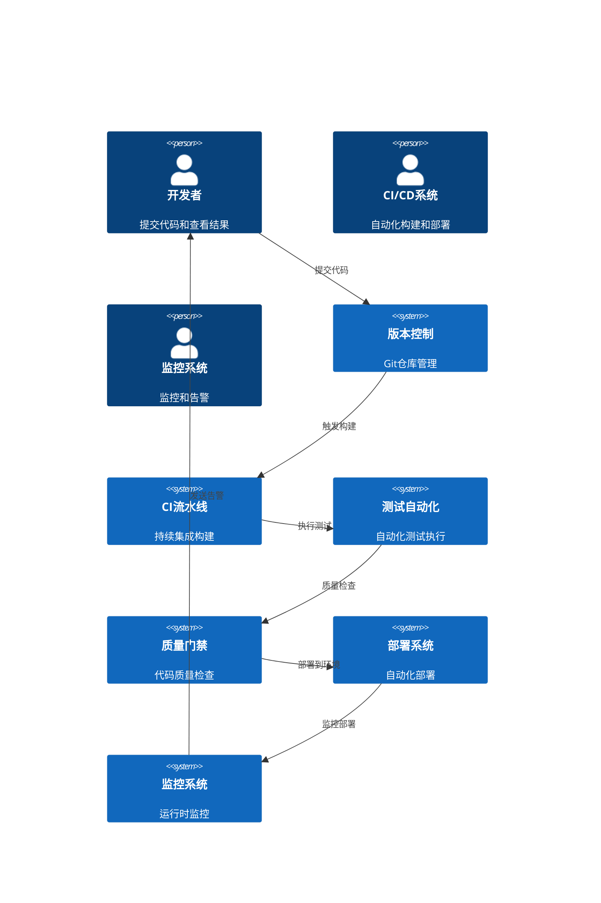

# BannerlordModEditor XML验证系统集成架构与CI/CD优化

## 文档概述

本文档详细说明了BannerlordModEditor XML验证系统的集成架构设计和CI/CD优化方案，包括构建流水线、自动化测试、部署策略、监控回滚等核心内容。

## 1. 集成架构概述

### 1.1 集成架构目标

#### 核心目标
- **自动化程度**: ≥95%的流程自动化
- **构建时间**: <10分钟完整构建
- **测试执行时间**: <5分钟全部测试
- **部署频率**: 每日可部署
- **回滚时间**: <5分钟紧急回滚

#### 质量目标
- **代码质量门禁**: 100%通过
- **测试通过率**: ≥95%
- **代码覆盖率**: ≥90%
- **安全扫描**: 0高危漏洞
- **性能基准**: 100%达标

### 1.2 集成架构组件



## 2. CI/CD流水线设计

### 2.1 完整CI/CD流水线

#### 流水线阶段
```yaml
# 完整CI/CD流水线定义
stages:
  - name: "代码验证"
    description: "代码格式、静态分析、依赖检查"
    timeout: 5m
    on_failure: stop_pipeline
    
  - name: "构建"
    description: "编译项目、生成构建物"
    timeout: 10m
    on_failure: stop_pipeline
    
  - name: "单元测试"
    description: "执行单元测试、收集覆盖率"
    timeout: 15m
    on_failure: continue
    
  - name: "集成测试"
    description: "执行集成测试、API测试"
    timeout: 20m
    on_failure: continue
    
  - name: "质量检查"
    description: "代码质量、安全扫描、性能测试"
    timeout: 10m
    on_failure: continue
    
  - name: "构建发布包"
    description: "打包发布物、生成版本信息"
    timeout: 5m
    on_failure: stop_pipeline
    
  - name: "部署到测试环境"
    description: "部署到测试环境、冒烟测试"
    timeout: 15m
    on_failure: continue
    
  - name: "用户验收测试"
    description: "执行UAT测试、性能测试"
    timeout: 30m
    on_failure: continue
    
  - name: "部署到预发布环境"
    description: "部署到预发布环境、最终验证"
    timeout: 10m
    on_failure: continue
    
  - name: "部署到生产环境"
    description: "生产环境部署、监控验证"
    timeout: 15m
    on_failure: rollback
```

### 2.2 GitHub Actions工作流

#### 主构建工作流
```yaml
name: CI/CD Pipeline

on:
  push:
    branches: [ main, feature/* ]
  pull_request:
    branches: [ main ]
  schedule:
    - cron: '0 2 * * *'  # 每日2点执行

env:
  DOTNET_VERSION: '9.0.x'
  SOLUTION_FILE: 'BannerlordModEditor.sln'
  TEST_PROJECTS: |
    BannerlordModEditor.Common.Tests
    BannerlordModEditor.UI.Tests
    BannerlordModEditor.TUI.Tests

jobs:
  # 代码验证阶段
  code-validation:
    name: Code Validation
    runs-on: ubuntu-latest
    timeout-minutes: 5
    
    steps:
    - name: Checkout code
      uses: actions/checkout@v4
      with:
        fetch-depth: 0
        
    - name: Setup .NET
      uses: actions/setup-dotnet@v4
      with:
        dotnet-version: ${{ env.DOTNET_VERSION }}
        
    - name: Restore dependencies
      run: dotnet restore ${{ env.SOLUTION_FILE }}
      
    - name: Code formatting check
      run: dotnet format ${{ env.SOLUTION_FILE }} --verify-no-changes
      
    - name: Static code analysis
      run: dotnet format ${{ env.SOLUTION_FILE }} --dry-run --verbosity normal
      
    - name: Security vulnerabilities scan
      run: dotnet list package --vulnerable --include-transitive ${{ env.SOLUTION_FILE }}

  # 构建阶段
  build:
    name: Build Solution
    runs-on: ubuntu-latest
    needs: code-validation
    timeout-minutes: 10
    
    steps:
    - name: Checkout code
      uses: actions/checkout@v4
      
    - name: Setup .NET
      uses: actions/setup-dotnet@v4
      with:
        dotnet-version: ${{ env.DOTNET_VERSION }}
        
    - name: Restore dependencies
      run: dotnet restore ${{ env.SOLUTION_FILE }}
      
    - name: Build solution
      run: dotnet build ${{ env.SOLUTION_FILE }} --configuration Release --no-restore
      
    - name: Upload build artifacts
      uses: actions/upload-artifact@v3
      with:
        name: build-artifacts
        path: |
          */bin/Release/
          */obj/Release/
        retention-days: 7

  # 单元测试阶段
  unit-tests:
    name: Unit Tests
    runs-on: ubuntu-latest
    needs: build
    timeout-minutes: 15
    
    steps:
    - name: Checkout code
      uses: actions/checkout@v4
      
    - name: Setup .NET
      uses: actions/setup-dotnet@v4
      with:
        dotnet-version: ${{ env.DOTNET_VERSION }}
        
    - name: Download build artifacts
      uses: actions/download-artifact@v3
      with:
        name: build-artifacts
        
    - name: Run unit tests with coverage
      run: |
        dotnet test ${{ env.SOLUTION_FILE }} \
          --configuration Release \
          --collect:"XPlat Code Coverage" \
          --logger:"console;verbosity=detailed" \
          --results-directory TestResults \
          --filter "TestCategory=Unit"
      
    - name: Upload coverage reports
      uses: codecov/codecov-action@v3
      with:
        file: ./TestResults/coverage.xml
        flags: unittests
        name: codecov-umbrella
        
    - name: Upload test results
      uses: actions/upload-artifact@v3
      with:
        name: test-results
        path: TestResults/
        retention-days: 7

  # 集成测试阶段
  integration-tests:
    name: Integration Tests
    runs-on: ubuntu-latest
    needs: build
    timeout-minutes: 20
    
    steps:
    - name: Checkout code
      uses: actions/checkout@v4
      
    - name: Setup .NET
      uses: actions/setup-dotnet@v4
      with:
        dotnet-version: ${{ env.DOTNET_VERSION }}
        
    - name: Download build artifacts
      uses: actions/download-artifact@v3
      with:
        name: build-artifacts
        
    - name: Run integration tests
      run: |
        dotnet test ${{ env.SOLUTION_FILE }} \
          --configuration Release \
          --logger:"console;verbosity=detailed" \
          --results-directory TestResults \
          --filter "TestCategory=Integration"
      
    - name: Upload test results
      uses: actions/upload-artifact@v3
      with:
        name: integration-test-results
        path: TestResults/
        retention-days: 7

  # 质量检查阶段
  quality-check:
    name: Quality Gates
    runs-on: ubuntu-latest
    needs: [unit-tests, integration-tests]
    timeout-minutes: 10
    
    steps:
    - name: Checkout code
      uses: actions/checkout@v4
      
    - name: Setup .NET
      uses: actions/setup-dotnet@v4
      with:
        dotnet-version: ${{ env.DOTNET_VERSION }}
        
    - name: Download test results
      uses: actions/download-artifact@v3
      with:
        name: test-results
        
    - name: Generate test report
      run: dotnet reportgenerator -reports:coverage.xml -targetdir:TestReports -reporttypes:Html
    
    - name: Check quality gates
      run: |
        # 检查测试通过率
        $passRate = & dotnet test --logger "trx" --results-directory TestResults | Select-String "Passed:" | ForEach-Object { $_.Line -replace '.*Passed: (\d+).*', '$1' }
        if ($passRate -lt 95) {
          Write-Error "Test pass rate $passRate% is below 95%"
          exit 1
        }
        
        # 检查代码覆盖率
        $coverage = Select-String -Path "TestReports\index.html" -Pattern "Line coverage:" | ForEach-Object { $_.Line -replace '.*Line coverage: ([0-9.]+)%.*', '$1' }
        if ($coverage -lt 90) {
          Write-Error "Code coverage $coverage% is below 90%"
          exit 1
        }
        
    - name: Upload quality reports
      uses: actions/upload-artifact@v3
      with:
        name: quality-reports
        path: TestReports/
        retention-days: 7

  # 构建发布包
  package:
    name: Build Release Package
    runs-on: ubuntu-latest
    needs: quality-check
    timeout-minutes: 5
    if: github.ref == 'refs/heads/main'
    
    steps:
    - name: Checkout code
      uses: actions/checkout@v4
      
    - name: Setup .NET
      uses: actions/setup-dotnet@v4
      with:
        dotnet-version: ${{ env.DOTNET_VERSION }}
        
    - name: Download build artifacts
      uses: actions/download-artifact@v3
      with:
        name: build-artifacts
        
    - name: Publish applications
      run: |
        dotnet publish BannerlordModEditor.UI -c Release -r win-x64 --self-contained -o ./publish/ui
        dotnet publish BannerlordModEditor.TUI -c Release -r win-x64 --self-contained -o ./publish/tui
        
    - name: Create release package
      run: |
        $version = Get-Date -Format "yyyyMMdd.HHmm"
        Compress-Archive -Path ./publish/* -DestinationPath "BannerlordModEditor-$version.zip"
        
    - name: Upload release package
      uses: actions/upload-artifact@v3
      with:
        name: release-package
        path: BannerlordModEditor-*.zip
        retention-days: 30

  # 部署到测试环境
  deploy-test:
    name: Deploy to Test Environment
    runs-on: ubuntu-latest
    needs: package
    timeout-minutes: 15
    if: github.ref == 'refs/heads/main'
    
    steps:
    - name: Download release package
      uses: actions/download-artifact@v3
      with:
        name: release-package
        
    - name: Deploy to test environment
      run: |
        # 这里应该是实际的部署脚本
        echo "Deploying to test environment..."
        
    - name: Run smoke tests
      run: |
        # 运行冒烟测试验证部署
        echo "Running smoke tests..."
        
    - name: Notify deployment
      uses: 8398a7/action-slack@v3
      with:
        status: ${{ job.status }}
        channel: '#deployment'
        webhook_url: ${{ secrets.SLACK_WEBHOOK }}
      env:
        SLACK_WEBHOOK_URL: ${{ secrets.SLACK_WEBHOOK }}

  # 性能测试
  performance-test:
    name: Performance Tests
    runs-on: ubuntu-latest
    needs: deploy-test
    timeout-minutes: 30
    if: github.ref == 'refs/heads/main'
    
    steps:
    - name: Checkout code
      uses: actions/checkout@v4
      
    - name: Setup .NET
      uses: actions/setup-dotnet@v4
      with:
        dotnet-version: ${{ env.DOTNET_VERSION }}
        
    - name: Run performance benchmarks
      run: |
        dotnet run --project PerformanceBenchmarks --configuration Release
        
    - name: Upload performance results
      uses: actions/upload-artifact@v3
      with:
        name: performance-results
        path: PerformanceResults/
        retention-days: 7

  # 部署到生产环境
  deploy-production:
    name: Deploy to Production
    runs-on: ubuntu-latest
    needs: [deploy-test, performance-test]
    timeout-minutes: 15
    if: github.ref == 'refs/heads/main'
    environment: production
    
    steps:
    - name: Download release package
      uses: actions/download-artifact@v3
      with:
        name: release-package
        
    - name: Deploy to production
      run: |
        # 生产环境部署脚本
        echo "Deploying to production environment..."
        
    - name: Health check
      run: |
        # 健康检查验证
        echo "Performing health checks..."
        
    - name: Notify deployment
      uses: 8398a7/action-slack@v3
      with:
        status: ${{ job.status }}
        channel: '#deployment'
        webhook_url: ${{ secrets.SLACK_WEBHOOK }}
      env:
        SLACK_WEBHOOK_URL: ${{ secrets.SLACK_WEBHOOK }}
```

### 2.3 质量门禁配置

#### 质量门禁定义
```yaml
# quality-gates.yml
quality_gates:
  # 代码质量门禁
  code_quality:
    enabled: true
    blocking: true
    rules:
      - name: "Code Coverage"
        type: "coverage"
        threshold: 90
        severity: "critical"
        message: "Code coverage must be at least 90%"
        
      - name: "Test Pass Rate"
        type: "test_pass_rate"
        threshold: 95
        severity: "critical"
        message: "Test pass rate must be at least 95%"
        
      - name: "Code Complexity"
        type: "complexity"
        threshold: 10
        severity: "warning"
        message: "Code complexity should not exceed 10"
        
      - name: "Code Duplication"
        type: "duplication"
        threshold: 5
        severity: "warning"
        message: "Code duplication should not exceed 5%"
        
      - name: "Security Issues"
        type: "security"
        threshold: 0
        severity: "critical"
        message: "No security issues allowed"
        
  # 性能门禁
  performance:
    enabled: true
    blocking: true
    rules:
      - name: "Build Time"
        type: "build_time"
        threshold: 600  # 10 minutes
        severity: "warning"
        message: "Build time should not exceed 10 minutes"
        
      - name: "Test Execution Time"
        type: "test_time"
        threshold: 300  # 5 minutes
        severity: "warning"
        message: "Test execution time should not exceed 5 minutes"
        
      - name: "Memory Usage"
        type: "memory_usage"
        threshold: 100  # 100MB
        severity: "warning"
        message: "Memory usage should not exceed 100MB"
        
      - name: "Performance Benchmarks"
        type: "performance_benchmarks"
        threshold: 100  # 100% pass rate
        severity: "critical"
        message: "All performance benchmarks must pass"
        
  # 安全门禁
  security:
    enabled: true
    blocking: true
    rules:
      - name: "Vulnerable Dependencies"
        type: "vulnerable_packages"
        threshold: 0
        severity: "critical"
        message: "No vulnerable dependencies allowed"
        
      - name: "Secret Detection"
        type: "secrets"
        threshold: 0
        severity: "critical"
        message: "No secrets should be committed"
        
      - name: "License Compliance"
        type: "license"
        threshold: 0
        severity: "warning"
        message: "All dependencies must have compliant licenses"
```

## 3. 自动化测试集成

### 3.1 测试自动化策略

#### 测试分类和执行策略
```csharp
namespace BannerlordModEditor.Common.Tests.Integration
{
    /// <summary>
    /// 测试分类和执行策略
    /// </summary>
    public class TestExecutionStrategy
    {
        private readonly ILogger<TestExecutionStrategy> _logger;
        private readonly ITestDiscoveryService _testDiscovery;
        private readonly ITestExecutionService _testExecution;
        
        public TestExecutionStrategy(
            ILogger<TestExecutionStrategy> logger,
            ITestDiscoveryService testDiscovery,
            ITestExecutionService testExecution)
        {
            _logger = logger;
            _testDiscovery = testDiscovery;
            _testExecution = testExecution;
        }
        
        public async Task<TestExecutionPlan> CreateExecutionPlanAsync(TestExecutionContext context)
        {
            var plan = new TestExecutionPlan
            {
                Context = context,
                CreatedAt = DateTime.UtcNow,
                Phases = new List<TestExecutionPhase>()
            };
            
            // 根据执行环境创建不同的执行计划
            switch (context.Environment)
            {
                case TestEnvironment.CI:
                    plan = await CreateCIExecutionPlanAsync(context);
                    break;
                case TestEnvironment.Local:
                    plan = await CreateLocalExecutionPlanAsync(context);
                    break;
                case TestEnvironment.Production:
                    plan = await CreateProductionExecutionPlanAsync(context);
                    break;
            }
            
            return plan;
        }
        
        private async Task<TestExecutionPlan> CreateCIExecutionPlanAsync(TestExecutionContext context)
        {
            var plan = new TestExecutionPlan { Context = context };
            
            // CI环境执行快速测试套件
            plan.Phases.Add(new TestExecutionPhase
            {
                Name = "Fast Unit Tests",
                Type: TestPhaseType.Unit,
                Timeout = TimeSpan.FromMinutes(5),
                Parallel = true,
                Tests = await _testDiscovery.DiscoverTestsAsync("TestCategory=Fast")
            });
            
            plan.Phases.Add(new TestExecutionPhase
            {
                Name = "Critical Integration Tests",
                Type = TestPhaseType.Integration,
                Timeout = TimeSpan.FromMinutes(10),
                Parallel = false,
                Tests = await _testDiscovery.DiscoverTestsAsync("TestCategory=Critical")
            });
            
            return plan;
        }
        
        private async Task<TestExecutionPlan> CreateLocalExecutionPlanAsync(TestExecutionContext context)
        {
            var plan = new TestExecutionPlan { Context = context };
            
            // 本地环境执行完整测试套件
            plan.Phases.Add(new TestExecutionPhase
            {
                Name = "All Unit Tests",
                Type = TestPhaseType.Unit,
                Timeout = TimeSpan.FromMinutes(10),
                Parallel = true,
                Tests = await _testDiscovery.DiscoverTestsAsync("TestCategory=Unit")
            });
            
            plan.Phases.Add(new TestExecutionPhase
            {
                Name = "Integration Tests",
                Type = TestPhaseType.Integration,
                Timeout = TimeSpan.FromMinutes(15),
                Parallel = false,
                Tests = await _testDiscovery.DiscoverTestsAsync("TestCategory=Integration")
            });
            
            plan.Phases.Add(new TestExecutionPhase
            {
                Name = "Performance Tests",
                Type = TestPhaseType.Performance,
                Timeout = TimeSpan.FromMinutes(20),
                Parallel = false,
                Tests = await _testDiscovery.DiscoverTestsAsync("TestCategory=Performance")
            });
            
            return plan;
        }
        
        private async Task<TestExecutionPlan> CreateProductionExecutionPlanAsync(TestExecutionContext context)
        {
            var plan = new TestExecutionPlan { Context = context };
            
            // 生产环境执行冒烟测试和关键测试
            plan.Phases.Add(new TestExecutionPhase
            {
                Name = "Smoke Tests",
                Type = TestPhaseType.Smoke,
                Timeout = TimeSpan.FromMinutes(5),
                Parallel = true,
                Tests = await _testDiscovery.DiscoverTestsAsync("TestCategory=Smoke")
            });
            
            plan.Phases.Add(new TestExecutionPhase
            {
                Name: "Health Checks",
                Type: TestPhaseType.HealthCheck,
                Timeout: TimeSpan.FromMinutes(2),
                Parallel: true,
                Tests = await _testDiscovery.DiscoverTestsAsync("TestCategory=Health")
            });
            
            return plan;
        }
        
        public async Task<TestExecutionResult> ExecutePlanAsync(TestExecutionPlan plan)
        {
            var result = new TestExecutionResult
            {
                Plan = plan,
                StartedAt = DateTime.UtcNow,
                PhaseResults = new List<TestPhaseResult>()
            };
            
            _logger.LogInformation("Starting test execution plan: {PlanName}", plan.Context.PlanName);
            
            try
            {
                foreach (var phase in plan.Phases)
                {
                    var phaseResult = await ExecutePhaseAsync(phase);
                    result.PhaseResults.Add(phaseResult);
                    
                    // 如果关键阶段失败，停止执行
                    if (phaseResult.Status == TestPhaseStatus.Failed && phase.IsCritical)
                    {
                        _logger.LogWarning("Critical phase {PhaseName} failed, stopping execution", phase.Name);
                        break;
                    }
                }
                
                result.Status = DetermineOverallStatus(result.PhaseResults);
                result.CompletedAt = DateTime.UtcNow;
                
                _logger.LogInformation("Test execution plan completed with status: {Status}", result.Status);
            }
            catch (Exception ex)
            {
                _logger.LogError(ex, "Test execution plan failed");
                result.Status = TestExecutionStatus.Failed;
                result.Exception = ex;
                result.CompletedAt = DateTime.UtcNow;
            }
            
            return result;
        }
        
        private async Task<TestPhaseResult> ExecutePhaseAsync(TestExecutionPhase phase)
        {
            var phaseResult = new TestPhaseResult
            {
                Phase = phase,
                StartedAt = DateTime.UtcNow,
                TestResults = new List<SingleTestResult>()
            };
            
            _logger.LogInformation("Starting test phase: {PhaseName}", phase.Name);
            
            try
            {
                if (phase.Parallel)
                {
                    phaseResult = await ExecutePhaseParallelAsync(phase);
                }
                else
                {
                    phaseResult = await ExecutePhaseSequentialAsync(phase);
                }
                
                phaseResult.CompletedAt = DateTime.UtcNow;
                phaseResult.Duration = phaseResult.CompletedAt - phaseResult.StartedAt;
                
                _logger.LogInformation("Test phase {PhaseName} completed with status: {Status}", 
                    phase.Name, phaseResult.Status);
            }
            catch (Exception ex)
            {
                _logger.LogError(ex, "Test phase {PhaseName} failed", phase.Name);
                phaseResult.Status = TestPhaseStatus.Failed;
                phaseResult.Exception = ex;
                phaseResult.CompletedAt = DateTime.UtcNow;
                phaseResult.Duration = phaseResult.CompletedAt - phaseResult.StartedAt;
            }
            
            return phaseResult;
        }
        
        private async Task<TestPhaseResult> ExecutePhaseParallelAsync(TestExecutionPhase phase)
        {
            var phaseResult = new TestPhaseResult { Phase = phase };
            
            var tasks = phase.Tests.Select(test => ExecuteSingleTestAsync(test)).ToList();
            var results = await Task.WhenAll(tasks);
            
            phaseResult.TestResults.AddRange(results);
            phaseResult.Status = DeterminePhaseStatus(results);
            
            return phaseResult;
        }
        
        private async Task<TestPhaseResult> ExecutePhaseSequentialAsync(TestExecutionPhase phase)
        {
            var phaseResult = new TestPhaseResult { Phase = phase };
            
            foreach (var test in phase.Tests)
            {
                var testResult = await ExecuteSingleTestAsync(test);
                phaseResult.TestResults.Add(testResult);
                
                // 如果测试失败且不是容错阶段，停止执行
                if (testResult.Status == TestStatus.Failed && !phase.ContinueOnFailure)
                {
                    break;
                }
            }
            
            phaseResult.Status = DeterminePhaseStatus(phaseResult.TestResults);
            
            return phaseResult;
        }
        
        private async Task<SingleTestResult> ExecuteSingleTestAsync(TestInfo test)
        {
            return await _testExecution.ExecuteTestAsync(test);
        }
        
        private TestPhaseStatus DeterminePhaseStatus(List<SingleTestResult> testResults)
        {
            if (testResults.All(t => t.Status == TestStatus.Passed))
            {
                return TestPhaseStatus.Passed;
            }
            
            if (testResults.Any(t => t.Status == TestStatus.Failed))
            {
                return TestPhaseStatus.Failed;
            }
            
            return TestPhaseStatus.Partial;
        }
        
        private TestExecutionStatus DetermineOverallStatus(List<TestPhaseResult> phaseResults)
        {
            if (phaseResults.All(p => p.Status == TestPhaseStatus.Passed))
            {
                return TestExecutionStatus.Passed;
            }
            
            if (phaseResults.Any(p => p.Status == TestPhaseStatus.Failed))
            {
                return TestExecutionStatus.Failed;
            }
            
            return TestExecutionStatus.Partial;
        }
    }
}
```

### 3.2 测试结果聚合和报告

#### 测试结果聚合服务
```csharp
namespace BannerlordModEditor.Common.Tests.Reporting
{
    /// <summary>
    /// 测试结果聚合服务
    /// </summary>
    public class TestResultAggregator
    {
        private readonly ILogger<TestResultAggregator> _logger;
        private readonly ITestResultStorage _storage;
        private readonly ITestReportGenerator _reportGenerator;
        
        public TestResultAggregator(
            ILogger<TestResultAggregator> logger,
            ITestResultStorage storage,
            ITestReportGenerator reportGenerator)
        {
            _logger = logger;
            _storage = storage;
            _reportGenerator = reportGenerator;
        }
        
        public async Task<TestSuiteSummary> AggregateResultsAsync(TestExecutionResult executionResult)
        {
            var summary = new TestSuiteSummary
            {
                ExecutionId = executionResult.Plan.Context.ExecutionId,
                ExecutionTime = executionResult.StartedAt,
                Duration = executionResult.CompletedAt - executionResult.StartedAt,
                Environment = executionResult.Plan.Context.Environment,
                Branch = executionResult.Plan.Context.Branch,
                Commit = executionResult.Plan.Context.Commit
            };
            
            // 聚合测试结果
            summary.TestMetrics = AggregateTestMetrics(executionResult.PhaseResults);
            summary.PerformanceMetrics = AggregatePerformanceMetrics(executionResult.PhaseResults);
            summary.QualityMetrics = AggregateQualityMetrics(executionResult.PhaseResults);
            
            // 分析失败模式
            summary.FailureAnalysis = AnalyzeFailurePatterns(executionResult.PhaseResults);
            
            // 计算总体状态
            summary.OverallStatus = CalculateOverallStatus(summary.TestMetrics);
            
            // 生成趋势分析
            summary.TrendAnalysis = await GenerateTrendAnalysisAsync(summary);
            
            // 存储结果
            await _storage.StoreTestResultsAsync(summary);
            
            _logger.LogInformation("Test results aggregated for execution {ExecutionId}", executionResult.Plan.Context.ExecutionId);
            
            return summary;
        }
        
        private TestMetrics AggregateTestMetrics(List<TestPhaseResult> phaseResults)
        {
            var allResults = phaseResults.SelectMany(p => p.TestResults).ToList();
            
            return new TestMetrics
            {
                TotalTests = allResults.Count,
                PassedTests = allResults.Count(t => t.Status == TestStatus.Passed),
                FailedTests = allResults.Count(t => t.Status == TestStatus.Failed),
                SkippedTests = allResults.Count(t => t.Status == TestStatus.Skipped),
                PassRate = allResults.Count > 0 ? 
                    (double)allResults.Count(t => t.Status == TestStatus.Passed) / allResults.Count * 100 : 0,
                AverageExecutionTime = allResults.Count > 0 ?
                    TimeSpan.FromMilliseconds(allResults.Average(t => t.Duration.TotalMilliseconds)) : TimeSpan.Zero,
                TotalExecutionTime = TimeSpan.FromMilliseconds(allResults.Sum(t => t.Duration.TotalMilliseconds))
            };
        }
        
        private PerformanceMetrics AggregatePerformanceMetrics(List<TestPhaseResult> phaseResults)
        {
            var allResults = phaseResults.SelectMany(p => p.TestResults).ToList();
            
            return new PerformanceMetrics
            {
                AverageMemoryUsage = allResults.Count > 0 ?
                    allResults.Average(t => t.MemoryUsage) : 0,
                PeakMemoryUsage = allResults.Count > 0 ?
                    allResults.Max(t => t.MemoryUsage) : 0,
                AverageCpuUsage = allResults.Count > 0 ?
                    allResults.Average(t => t.CpuUsage) : 0,
                PeakCpuUsage = allResults.Count > 0 ?
                    allResults.Max(t => t.CpuUsage) : 0,
                TotalExecutionTime = TimeSpan.FromMilliseconds(allResults.Sum(t => t.Duration.TotalMilliseconds))
            };
        }
        
        private QualityMetrics AggregateQualityMetrics(List<TestPhaseResult> phaseResults)
        {
            // 这里应该包含代码覆盖率、复杂度等质量指标
            return new QualityMetrics
            {
                CodeCoverage = 0, // 需要从覆盖率工具获取
                CodeComplexity = 0, // 需要从静态分析工具获取
                CodeDuplication = 0, // 需要从静态分析工具获取
                SecurityIssues = 0, // 需要从安全扫描工具获取
                TechnicalDebt = 0 // 需要从代码分析工具获取
            };
        }
        
        private TestFailureAnalysis AnalyzeFailurePatterns(List<TestPhaseResult> phaseResults)
        {
            var failedTests = phaseResults
                .SelectMany(p => p.TestResults)
                .Where(t => t.Status == TestStatus.Failed)
                .ToList();
            
            var analysis = new TestFailureAnalysis
            {
                TotalFailures = failedTests.Count,
                FailureRate = failedTests.Count > 0 ? 
                    (double)failedTests.Count / phaseResults.Sum(p => p.TestResults.Count) * 100 : 0,
                FailurePatterns = new List<FailurePattern>(),
                CriticalFailures = new List<TestFailure>()
            };
            
            // 按异常类型分组
            var exceptionGroups = failedTests
                .GroupBy(t => t.Exception?.GetType().Name ?? "Unknown")
                .ToList();
            
            foreach (var group in exceptionGroups)
            {
                analysis.FailurePatterns.Add(new FailurePattern
                {
                    PatternType = "ExceptionType",
                    Pattern = group.Key,
                    Count = group.Count(),
                    Percentage = (double)group.Count() / failedTests.Count * 100,
                    Severity = GetFailureSeverity(group.Key),
                    Examples = group.Take(3).Select(t => new TestFailure
                    {
                        TestName = t.TestName,
                        Exception = t.Exception,
                        ErrorMessage = t.ErrorMessage,
                        StackTrace = t.StackTrace
                    }).ToList()
                });
            }
            
            // 识别关键失败
            analysis.CriticalFailures = failedTests
                .Where(t => IsCriticalFailure(t))
                .ToList();
            
            return analysis;
        }
        
        private FailureSeverity GetFailureSeverity(string exceptionType)
        {
            return exceptionType switch
            {
                "XmlException" => FailureSeverity.High,
                "FileNotFoundException" => FailureSeverity.High,
                "InvalidOperationException" => FailureSeverity.Medium,
                "ArgumentException" => FailureSeverity.Medium,
                "NullReferenceException" => FailureSeverity.High,
                _ => FailureSeverity.Low
            };
        }
        
        private bool IsCriticalFailure(SingleTestResult test)
        {
            return test.Exception?.GetType().Name switch
            {
                "XmlException" => true,
                "FileNotFoundException" => true,
                "InvalidOperationException" => true,
                _ => false
            };
        }
        
        private TestExecutionStatus CalculateOverallStatus(TestMetrics metrics)
        {
            if (metrics.PassRate >= 95)
            {
                return TestExecutionStatus.Passed;
            }
            
            if (metrics.PassRate >= 80)
            {
                return TestExecutionStatus.Partial;
            }
            
            return TestExecutionStatus.Failed;
        }
        
        private async Task<TestTrendAnalysis> GenerateTrendAnalysisAsync(TestSuiteSummary currentSummary)
        {
            var analysis = new TestTrendAnalysis
            {
                CurrentSummary = currentSummary,
                Trends = new List<TestTrend>()
            };
            
            // 获取历史数据
            var historicalData = await _storage.GetHistoricalResultsAsync(
                currentSummary.Branch, 
                TimeSpan.FromDays(30));
            
            if (historicalData.Count > 1)
            {
                // 分析通过率趋势
                var passRateTrend = CalculateTrend(
                    historicalData.Select(h => h.TestMetrics.PassRate).ToList(),
                    currentSummary.TestMetrics.PassRate);
                
                analysis.Trends.Add(new TestTrend
                {
                    Metric = "PassRate",
                    CurrentValue = currentSummary.TestMetrics.PassRate,
                    TrendDirection = passRateTrend.Direction,
                    ChangePercentage = passRateTrend.ChangePercentage,
                    Status = GetTrendStatus(passRateTrend)
                });
                
                // 分析执行时间趋势
                var executionTimeTrend = CalculateTrend(
                    historicalData.Select(h => h.TestMetrics.TotalExecutionTime.TotalSeconds).ToList(),
                    currentSummary.TestMetrics.TotalExecutionTime.TotalSeconds);
                
                analysis.Trends.Add(new TestTrend
                {
                    Metric = "ExecutionTime",
                    CurrentValue = currentSummary.TestMetrics.TotalExecutionTime.TotalSeconds,
                    TrendDirection = executionTimeTrend.Direction,
                    ChangePercentage = executionTimeTrend.ChangePercentage,
                    Status = GetTrendStatus(executionTimeTrend)
                });
                
                // 分析失败率趋势
                var failureRateTrend = CalculateTrend(
                    historicalData.Select(h => 100 - h.TestMetrics.PassRate).ToList(),
                    100 - currentSummary.TestMetrics.PassRate);
                
                analysis.Trends.Add(new TestTrend
                {
                    Metric = "FailureRate",
                    CurrentValue = 100 - currentSummary.TestMetrics.PassRate,
                    TrendDirection = failureRateTrend.Direction,
                    ChangePercentage = failureRateTrend.ChangePercentage,
                    Status = GetTrendStatus(failureRateTrend)
                });
            }
            
            return analysis;
        }
        
        private TrendData CalculateTrend(List<double> historicalValues, double currentValue)
        {
            if (historicalValues.Count < 2)
            {
                return new TrendData
                {
                    Direction = TrendDirection.Stable,
                    ChangePercentage = 0
                };
            }
            
            var average = historicalValues.Average();
            var changePercentage = average != 0 ? 
                ((currentValue - average) / average) * 100 : 0;
            
            var direction = changePercentage switch
            {
                > 5 => TrendDirection.Increasing,
                < -5 => TrendDirection.Decreasing,
                _ => TrendDirection.Stable
            };
            
            return new TrendData
            {
                Direction = direction,
                ChangePercentage = changePercentage,
                Average = average,
                CurrentValue = currentValue
            };
        }
        
        private TrendStatus GetTrendStatus(TrendData trend)
        {
            return trend.Metric switch
            {
                "PassRate" => trend.Direction switch
                {
                    TrendDirection.Increasing => TrendStatus.Positive,
                    TrendDirection.Decreasing => TrendStatus.Negative,
                    _ => TrendStatus.Stable
                },
                "ExecutionTime" => trend.Direction switch
                {
                    TrendDirection.Increasing => TrendStatus.Negative,
                    TrendDirection.Decreasing => TrendStatus.Positive,
                    _ => TrendStatus.Stable
                },
                "FailureRate" => trend.Direction switch
                {
                    TrendDirection.Increasing => TrendStatus.Negative,
                    TrendDirection.Decreasing => TrendStatus.Positive,
                    _ => TrendStatus.Stable
                },
                _ => TrendStatus.Stable
            };
        }
    }
}
```

## 4. 部署策略和回滚机制

### 4.1 部署策略

#### 蓝绿部署
```csharp
namespace BannerlordModEditor.Common.Tests.Deployment
{
    /// <summary>
    /// 蓝绿部署管理器
    /// </summary>
    public class BlueGreenDeploymentManager
    {
        private readonly ILogger<BlueGreenDeploymentManager> _logger;
        private readonly IDeploymentService _deploymentService;
        private readonly IHealthCheckService _healthCheckService;
        private readonly INotificationService _notificationService;
        
        public BlueGreenDeploymentManager(
            ILogger<BlueGreenDeploymentManager> logger,
            IDeploymentService deploymentService,
            IHealthCheckService healthCheckService,
            INotificationService notificationService)
        {
            _logger = logger;
            _deploymentService = deploymentService;
            _healthCheckService = healthCheckService;
            _notificationService = notificationService;
        }
        
        public async Task<DeploymentResult> ExecuteBlueGreenDeploymentAsync(DeploymentRequest request)
        {
            var result = new DeploymentResult
            {
                Request = request,
                StartedAt = DateTime.UtcNow,
                Status = DeploymentStatus.InProgress
            };
            
            try
            {
                _logger.LogInformation("Starting blue-green deployment for environment {Environment}", request.Environment);
                
                // 1. 准备部署
                result.PreparationResult = await PrepareDeploymentAsync(request);
                
                // 2. 部署到新环境
                result.DeploymentResult = await DeployToNewEnvironmentAsync(request, result.PreparationResult);
                
                // 3. 健康检查
                result.HealthCheckResult = await PerformHealthChecksAsync(result.DeploymentResult);
                
                // 4. 流量切换
                if (result.HealthCheckResult.Status == HealthCheckStatus.Healthy)
                {
                    result.TrafficSwitchResult = await SwitchTrafficAsync(result.DeploymentResult);
                }
                
                // 5. 清理旧环境
                if (result.TrafficSwitchResult.Status == TrafficSwitchStatus.Success)
                {
                    result.CleanupResult = await CleanupOldEnvironmentAsync(result);
                }
                
                result.Status = DetermineDeploymentStatus(result);
                result.CompletedAt = DateTime.UtcNow;
                
                // 发送通知
                await SendDeploymentNotificationAsync(result);
                
                _logger.LogInformation("Blue-green deployment completed with status: {Status}", result.Status);
            }
            catch (Exception ex)
            {
                _logger.LogError(ex, "Blue-green deployment failed");
                result.Status = DeploymentStatus.Failed;
                result.Exception = ex;
                result.CompletedAt = DateTime.UtcNow;
                
                // 执行回滚
                await ExecuteRollbackAsync(result);
            }
            
            return result;
        }
        
        private async Task<DeploymentPreparationResult> PrepareDeploymentAsync(DeploymentRequest request)
        {
            _logger.LogInformation("Preparing deployment for version {Version}", request.Version);
            
            var result = new DeploymentPreparationResult
            {
                Status = PreparationStatus.InProgress
            };
            
            try
            {
                // 验证部署包
                result.PackageValidation = await ValidateDeploymentPackageAsync(request.PackagePath);
                
                // 准备目标环境
                result.EnvironmentPreparation = await PrepareTargetEnvironmentAsync(request.Environment);
                
                // 备份当前版本
                result.BackupResult = await BackupCurrentVersionAsync(request.Environment);
                
                result.Status = PreparationStatus.Completed;
                
                _logger.LogInformation("Deployment preparation completed successfully");
            }
            catch (Exception ex)
            {
                _logger.LogError(ex, "Deployment preparation failed");
                result.Status = PreparationStatus.Failed;
                result.Exception = ex;
            }
            
            return result;
        }
        
        private async Task<DeploymentExecutionResult> DeployToNewEnvironmentAsync(
            DeploymentRequest request,
            DeploymentPreparationResult preparationResult)
        {
            _logger.LogInformation("Deploying version {Version} to new environment", request.Version);
            
            var result = new DeploymentExecutionResult
            {
                Status = DeploymentExecutionStatus.InProgress
            };
            
            try
            {
                // 部署应用程序
                result.ApplicationDeployment = await _deploymentService.DeployApplicationAsync(
                    request.PackagePath,
                    request.Environment,
                    "blue"); // 新环境
                
                // 部署配置
                result.ConfigurationDeployment = await _deploymentService.DeployConfigurationAsync(
                    request.Configuration,
                    request.Environment,
                    "blue");
                
                // 部署数据库变更
                if (request.DatabaseChanges != null)
                {
                    result.DatabaseDeployment = await _deploymentService.DeployDatabaseChangesAsync(
                        request.DatabaseChanges,
                        request.Environment,
                        "blue");
                }
                
                result.Status = DeploymentExecutionStatus.Completed;
                
                _logger.LogInformation("Application deployment completed successfully");
            }
            catch (Exception ex)
            {
                _logger.LogError(ex, "Application deployment failed");
                result.Status = DeploymentExecutionStatus.Failed;
                result.Exception = ex;
            }
            
            return result;
        }
        
        private async Task<HealthCheckResult> PerformHealthChecksAsync(DeploymentExecutionResult deploymentResult)
        {
            _logger.LogInformation("Performing health checks on new environment");
            
            var result = new HealthCheckResult
            {
                Status = HealthCheckStatus.InProgress,
                Checks = new List<HealthCheckItem>()
            };
            
            try
            {
                // 基础健康检查
                result.Checks.Add(await _healthCheckService.CheckApplicationHealthAsync("blue"));
                
                // API健康检查
                result.Checks.Add(await _healthCheckService.CheckApiHealthAsync("blue"));
                
                // 数据库连接检查
                result.Checks.Add(await _healthCheckService.CheckDatabaseHealthAsync("blue"));
                
                // 性能检查
                result.Checks.Add(await _healthCheckService.CheckPerformanceHealthAsync("blue"));
                
                // 计算总体状态
                result.Status = result.Checks.All(c => c.Status == HealthCheckItemStatus.Healthy) ? 
                    HealthCheckStatus.Healthy : HealthCheckStatus.Unhealthy;
                
                _logger.LogInformation("Health checks completed with status: {Status}", result.Status);
            }
            catch (Exception ex)
            {
                _logger.LogError(ex, "Health checks failed");
                result.Status = HealthCheckStatus.Failed;
                result.Exception = ex;
            }
            
            return result;
        }
        
        private async Task<TrafficSwitchResult> SwitchTrafficAsync(DeploymentExecutionResult deploymentResult)
        {
            _logger.LogInformation("Switching traffic to new environment");
            
            var result = new TrafficSwitchResult
            {
                Status = TrafficSwitchStatus.InProgress
            };
            
            try
            {
                // 逐步切换流量
                result = await GradualTrafficSwitchAsync("blue");
                
                _logger.LogInformation("Traffic switch completed with status: {Status}", result.Status);
            }
            catch (Exception ex)
            {
                _logger.LogError(ex, "Traffic switch failed");
                result.Status = TrafficSwitchStatus.Failed;
                result.Exception = ex;
            }
            
            return result;
        }
        
        private async Task<TrafficSwitchResult> GradualTrafficSwitchAsync(string targetEnvironment)
        {
            var result = new TrafficSwitchResult { Status = TrafficSwitchStatus.InProgress };
            
            // 10% -> 25% -> 50% -> 75% -> 100%
            var trafficLevels = new[] { 0.1, 0.25, 0.5, 0.75, 1.0 };
            
            foreach (var level in trafficLevels)
            {
                try
                {
                    _logger.LogInformation("Switching {Percentage}% traffic to {Environment}", level * 100, targetEnvironment);
                    
                    // 切换流量
                    await _deploymentService.SwitchTrafficAsync(targetEnvironment, level);
                    
                    // 等待稳定
                    await Task.Delay(TimeSpan.FromMinutes(2));
                    
                    // 健康检查
                    var healthResult = await _healthCheckService.CheckApplicationHealthAsync(targetEnvironment);
                    
                    if (healthResult.Status != HealthCheckItemStatus.Healthy)
                    {
                        _logger.LogWarning("Health check failed at {Percentage}% traffic, rolling back", level * 100);
                        
                        // 回滚流量
                        await _deploymentService.SwitchTrafficAsync("green", 1.0);
                        
                        result.Status = TrafficSwitchStatus.Failed;
                        result.FailurePoint = level;
                        return result;
                    }
                    
                    result.CurrentTrafficLevel = level;
                }
                catch (Exception ex)
                {
                    _logger.LogError(ex, "Traffic switch failed at {Percentage}% level", level * 100);
                    
                    // 回滚流量
                    await _deploymentService.SwitchTrafficAsync("green", 1.0);
                    
                    result.Status = TrafficSwitchStatus.Failed;
                    result.FailurePoint = level;
                    result.Exception = ex;
                    return result;
                }
            }
            
            result.Status = TrafficSwitchStatus.Success;
            return result;
        }
        
        private async Task<CleanupResult> CleanupOldEnvironmentAsync(DeploymentResult deploymentResult)
        {
            _logger.LogInformation("Cleaning up old environment");
            
            var result = new CleanupResult { Status = CleanupStatus.InProgress };
            
            try
            {
                // 等待一段时间确保新环境稳定
                await Task.Delay(TimeSpan.FromMinutes(10));
                
                // 停止旧环境
                await _deploymentService.StopEnvironmentAsync("green");
                
                // 清理旧环境资源
                await _deploymentService.CleanupEnvironmentAsync("green");
                
                result.Status = CleanupStatus.Completed;
                
                _logger.LogInformation("Old environment cleanup completed");
            }
            catch (Exception ex)
            {
                _logger.LogError(ex, "Old environment cleanup failed");
                result.Status = CleanupStatus.Failed;
                result.Exception = ex;
            }
            
            return result;
        }
        
        private async Task ExecuteRollbackAsync(DeploymentResult deploymentResult)
        {
            _logger.LogWarning("Executing rollback for failed deployment");
            
            try
            {
                // 回滚流量
                await _deploymentService.SwitchTrafficAsync("green", 1.0);
                
                // 回滚数据库（如果需要）
                if (deploymentResult.DeploymentResult?.DatabaseDeployment != null)
                {
                    await _deploymentService.RollbackDatabaseChangesAsync("green");
                }
                
                // 启动旧环境
                await _deploymentService.StartEnvironmentAsync("green");
                
                deploymentResult.RollbackResult = new RollbackResult
                {
                    Status = RollbackStatus.Completed,
                    RolledBackAt = DateTime.UtcNow
                };
                
                _logger.LogInformation("Rollback completed successfully");
            }
            catch (Exception ex)
            {
                _logger.LogError(ex, "Rollback failed");
                deploymentResult.RollbackResult = new RollbackResult
                {
                    Status = RollbackStatus.Failed,
                    Exception = ex,
                    RolledBackAt = DateTime.UtcNow
                };
            }
        }
        
        private DeploymentStatus DetermineDeploymentStatus(DeploymentResult result)
        {
            if (result.RollbackResult?.Status == RollbackStatus.Completed)
            {
                return DeploymentStatus.RolledBack;
            }
            
            if (result.TrafficSwitchResult?.Status == TrafficSwitchStatus.Success &&
                result.CleanupResult?.Status == CleanupStatus.Completed)
            {
                return DeploymentStatus.Completed;
            }
            
            return DeploymentStatus.Failed;
        }
        
        private async Task SendDeploymentNotificationAsync(DeploymentResult result)
        {
            var message = $"Deployment {result.Status} for {result.Request.Environment} environment";
            
            if (result.Status == DeploymentStatus.Completed)
            {
                message += $" ✅ Version {result.Request.Version} deployed successfully";
            }
            else if (result.Status == DeploymentStatus.RolledBack)
            {
                message += $" 🔄 Deployment failed and rolled back";
            }
            else
            {
                message += $" ❌ Deployment failed";
            }
            
            await _notificationService.SendNotificationAsync(message, result.Status);
        }
        
        private async Task<PackageValidationResult> ValidateDeploymentPackageAsync(string packagePath)
        {
            // 实现包验证逻辑
            return new PackageValidationResult { Status = PackageValidationStatus.Valid };
        }
        
        private async Task<EnvironmentPreparationResult> PrepareTargetEnvironmentAsync(string environment)
        {
            // 实现环境准备逻辑
            return new EnvironmentPreparationResult { Status = EnvironmentPreparationStatus.Completed };
        }
        
        private async Task<BackupResult> BackupCurrentVersionAsync(string environment)
        {
            // 实现备份逻辑
            return new BackupResult { Status = BackupStatus.Completed };
        }
    }
}
```

### 4.2 监控和告警

#### 监控服务
```csharp
namespace BannerlordModEditor.Common.Tests.Monitoring
{
    /// <summary>
    /// 部署监控服务
    /// </summary>
    public class DeploymentMonitoringService
    {
        private readonly ILogger<DeploymentMonitoringService> _logger;
        private readonly IMetricsCollector _metricsCollector;
        private readonly IAlertService _alertService;
        private readonly IHealthCheckService _healthCheckService;
        
        public DeploymentMonitoringService(
            ILogger<DeploymentMonitoringService> logger,
            IMetricsCollector metricsCollector,
            IAlertService alertService,
            IHealthCheckService healthCheckService)
        {
            _logger = logger;
            _metricsCollector = metricsCollector;
            _alertService = alertService;
            _healthCheckService = healthCheckService;
        }
        
        public async Task<MonitoringReport> GenerateMonitoringReportAsync()
        {
            var report = new MonitoringReport
            {
                GeneratedAt = DateTime.UtcNow,
                Metrics = new List<MetricData>(),
                Alerts = new List<AlertData>(),
                HealthStatus = new List<HealthStatusData>()
            };
            
            try
            {
                // 收集系统指标
                report.Metrics.AddRange(await CollectSystemMetricsAsync());
                
                // 收集应用指标
                report.Metrics.AddRange(await CollectApplicationMetricsAsync());
                
                // 收集业务指标
                report.Metrics.AddRange(await CollectBusinessMetricsAsync());
                
                // 检查健康状态
                report.HealthStatus.AddRange(await CheckHealthStatusAsync());
                
                // 检查告警条件
                await CheckAlertConditionsAsync(report);
                
                _logger.LogInformation("Monitoring report generated successfully");
            }
            catch (Exception ex)
            {
                _logger.LogError(ex, "Failed to generate monitoring report");
                report.Status = MonitoringStatus.Failed;
                report.ErrorMessage = ex.Message;
            }
            
            return report;
        }
        
        private async Task<List<MetricData>> CollectSystemMetricsAsync()
        {
            var metrics = new List<MetricData>();
            
            try
            {
                // CPU使用率
                var cpuUsage = await _metricsCollector.GetCpuUsageAsync();
                metrics.Add(new MetricData
                {
                    Name = "system.cpu.usage",
                    Value = cpuUsage,
                    Unit = "percent",
                    Timestamp = DateTime.UtcNow
                });
                
                // 内存使用率
                var memoryUsage = await _metricsCollector.GetMemoryUsageAsync();
                metrics.Add(new MetricData
                {
                    Name = "system.memory.usage",
                    Value = memoryUsage,
                    Unit = "percent",
                    Timestamp = DateTime.UtcNow
                });
                
                // 磁盘使用率
                var diskUsage = await _metricsCollector.GetDiskUsageAsync();
                metrics.Add(new MetricData
                {
                    Name = "system.disk.usage",
                    Value = diskUsage,
                    Unit = "percent",
                    Timestamp = DateTime.UtcNow
                });
                
                // 网络IO
                var networkIo = await _metricsCollector.GetNetworkIoAsync();
                metrics.Add(new MetricData
                {
                    Name = "system.network.io",
                    Value = networkIo,
                    Unit: "bytes",
                    Timestamp = DateTime.UtcNow
                });
            }
            catch (Exception ex)
            {
                _logger.LogError(ex, "Failed to collect system metrics");
            }
            
            return metrics;
        }
        
        private async Task<List<MetricData>> CollectApplicationMetricsAsync()
        {
            var metrics = new List<MetricData>();
            
            try
            {
                // 应用响应时间
                var responseTime = await _metricsCollector.GetApplicationResponseTimeAsync();
                metrics.Add(new MetricData
                {
                    Name = "application.response_time",
                    Value = responseTime,
                    Unit = "milliseconds",
                    Timestamp = DateTime.UtcNow
                });
                
                // 应用错误率
                var errorRate = await _metricsCollector.GetApplicationErrorRateAsync();
                metrics.Add(new MetricData
                {
                    Name = "application.error_rate",
                    Value = errorRate,
                    Unit = "percent",
                    Timestamp = DateTime.UtcNow
                });
                
                // 应用吞吐量
                var throughput = await _metricsCollector.GetApplicationThroughputAsync();
                metrics.Add(new MetricData
                {
                    Name = "application.throughput",
                    Value = throughput,
                    Unit = "requests_per_second",
                    Timestamp = DateTime.UtcNow
                });
                
                // 应用内存使用
                var appMemory = await _metricsCollector.GetApplicationMemoryUsageAsync();
                metrics.Add(new MetricData
                {
                    Name = "application.memory.usage",
                    Value = appMemory,
                    Unit = "megabytes",
                    Timestamp = DateTime.UtcNow
                });
            }
            catch (Exception ex)
            {
                _logger.LogError(ex, "Failed to collect application metrics");
            }
            
            return metrics;
        }
        
        private async Task<List<MetricData>> CollectBusinessMetricsAsync()
        {
            var metrics = new List<MetricData>();
            
            try
            {
                // 活跃用户数
                var activeUsers = await _metricsCollector.GetActiveUsersCountAsync();
                metrics.Add(new MetricData
                {
                    Name = "business.active_users",
                    Value = activeUsers,
                    Unit = "count",
                    Timestamp = DateTime.UtcNow
                });
                
                // XML处理成功率
                var xmlProcessingSuccess = await _metricsCollector.GetXmlProcessingSuccessRateAsync();
                metrics.Add(new MetricData
                {
                    Name = "business.xml_processing.success_rate",
                    Value = xmlProcessingSuccess,
                    Unit = "percent",
                    Timestamp = DateTime.UtcNow
                });
                
                // 平均处理时间
                var avgProcessingTime = await _metricsCollector.GetAverageProcessingTimeAsync();
                metrics.Add(new MetricData
                {
                    Name = "business.processing.average_time",
                    Value = avgProcessingTime,
                    Unit = "milliseconds",
                    Timestamp = DateTime.UtcNow
                });
            }
            catch (Exception ex)
            {
                _logger.LogError(ex, "Failed to collect business metrics");
            }
            
            return metrics;
        }
        
        private async Task<List<HealthStatusData>> CheckHealthStatusAsync()
        {
            var healthStatus = new List<HealthStatusData>();
            
            try
            {
                // 应用健康状态
                var appHealth = await _healthCheckService.CheckApplicationHealthAsync();
                healthStatus.Add(new HealthStatusData
                {
                    Component = "application",
                    Status = appHealth.Status,
                    LastCheck = DateTime.UtcNow,
                    Details = appHealth.Details
                });
                
                // 数据库健康状态
                var dbHealth = await _healthCheckService.CheckDatabaseHealthAsync();
                healthStatus.Add(new HealthStatusData
                {
                    Component = "database",
                    Status = dbHealth.Status,
                    LastCheck = DateTime.UtcNow,
                    Details = dbHealth.Details
                });
                
                // API健康状态
                var apiHealth = await _healthCheckService.CheckApiHealthAsync();
                healthStatus.Add(new HealthStatusData
                {
                    Component = "api",
                    Status = apiHealth.Status,
                    LastCheck = DateTime.UtcNow,
                    Details = apiHealth.Details
                });
                
                // 外部服务健康状态
                var externalHealth = await _healthCheckService.CheckExternalServicesHealthAsync();
                healthStatus.Add(new HealthStatusData
                {
                    Component = "external_services",
                    Status = externalHealth.Status,
                    LastCheck = DateTime.UtcNow,
                    Details = externalHealth.Details
                });
            }
            catch (Exception ex)
            {
                _logger.LogError(ex, "Failed to check health status");
            }
            
            return healthStatus;
        }
        
        private async Task CheckAlertConditionsAsync(MonitoringReport report)
        {
            var alerts = new List<AlertData>();
            
            // 检查CPU使用率告警
            var cpuMetric = report.Metrics.FirstOrDefault(m => m.Name == "system.cpu.usage");
            if (cpuMetric != null && cpuMetric.Value > 80)
            {
                alerts.Add(new AlertData
                {
                    Severity = AlertSeverity.Warning,
                    Type = AlertType.HighCpuUsage,
                    Title = "High CPU Usage Detected",
                    Message = $"CPU usage is {cpuMetric.Value}%, which is above the 80% threshold",
                    Timestamp = DateTime.UtcNow,
                    Metrics = new Dictionary<string, object>
                    {
                        { "cpu_usage", cpuMetric.Value },
                        { "threshold", 80 }
                    }
                });
            }
            
            // 检查内存使用率告警
            var memoryMetric = report.Metrics.FirstOrDefault(m => m.Name == "system.memory.usage");
            if (memoryMetric != null && memoryMetric.Value > 85)
            {
                alerts.Add(new AlertData
                {
                    Severity = AlertSeverity.Warning,
                    Type = AlertType.HighMemoryUsage,
                    Title = "High Memory Usage Detected",
                    Message = $"Memory usage is {memoryMetric.Value}%, which is above the 85% threshold",
                    Timestamp = DateTime.UtcNow,
                    Metrics = new Dictionary<string, object>
                    {
                        { "memory_usage", memoryMetric.Value },
                        { "threshold", 85 }
                    }
                });
            }
            
            // 检查应用错误率告警
            var errorRateMetric = report.Metrics.FirstOrDefault(m => m.Name == "application.error_rate");
            if (errorRateMetric != null && errorRateMetric.Value > 5)
            {
                alerts.Add(new AlertData
                {
                    Severity = AlertSeverity.Error,
                    Type = AlertType.HighErrorRate,
                    Title = "High Application Error Rate",
                    Message = $"Application error rate is {errorRateMetric.Value}%, which is above the 5% threshold",
                    Timestamp = DateTime.UtcNow,
                    Metrics = new Dictionary<string, object>
                    {
                        { "error_rate", errorRateMetric.Value },
                        { "threshold", 5 }
                    }
                });
            }
            
            // 检查健康状态告警
            var unhealthyComponents = report.HealthStatus.Where(h => h.Status != HealthStatus.Healthy).ToList();
            foreach (var component in unhealthyComponents)
            {
                alerts.Add(new AlertData
                {
                    Severity = AlertSeverity.Error,
                    Type = AlertType.UnhealthyComponent,
                    Title = $"Unhealthy Component: {component.Component}",
                    Message = $"Component {component.Component} is reporting {component.Status} status",
                    Timestamp = DateTime.UtcNow,
                    Metrics = new Dictionary<string, object>
                    {
                        { "component", component.Component },
                        { "status", component.Status }
                    }
                });
            }
            
            // 发送告警
            foreach (var alert in alerts)
            {
                await _alertService.SendAlertAsync(alert);
                report.Alerts.Add(alert);
            }
        }
        
        public async Task StartMonitoringAsync(CancellationToken cancellationToken)
        {
            _logger.LogInformation("Starting deployment monitoring service");
            
            while (!cancellationToken.IsCancellationRequested)
            {
                try
                {
                    var report = await GenerateMonitoringReportAsync();
                    
                    // 存储监控报告
                    await StoreMonitoringReportAsync(report);
                    
                    // 等待下一次检查
                    await Task.Delay(TimeSpan.FromMinutes(5), cancellationToken);
                }
                catch (OperationCanceledException)
                {
                    // 正常退出
                    break;
                }
                catch (Exception ex)
                {
                    _logger.LogError(ex, "Error in monitoring loop");
                    await Task.Delay(TimeSpan.FromMinutes(1), cancellationToken);
                }
            }
            
            _logger.LogInformation("Deployment monitoring service stopped");
        }
        
        private async Task StoreMonitoringReportAsync(MonitoringReport report)
        {
            // 实现监控报告存储逻辑
            _logger.LogDebug("Monitoring report stored");
        }
    }
}
```

## 5. 集成测试自动化

### 5.1 端到端测试自动化

#### 端到端测试框架
```csharp
namespace BannerlordModEditor.Common.Tests.EndToEnd
{
    /// <summary>
    /// 端到端测试框架
    /// </summary>
    public class EndToEndTestFramework
    {
        private readonly ILogger<EndToEndTestFramework> _logger;
        private readonly ITestEnvironment _testEnvironment;
        private readonly ITestDataProvider _testDataProvider;
        private readonly ITestReporter _testReporter;
        
        public EndToEndTestFramework(
            ILogger<EndToEndTestFramework> logger,
            ITestEnvironment testEnvironment,
            ITestDataProvider testDataProvider,
            ITestReporter testReporter)
        {
            _logger = logger;
            _testEnvironment = testEnvironment;
            _testDataProvider = testDataProvider;
            _testReporter = testReporter;
        }
        
        public async Task<EndToEndTestResult> ExecuteEndToEndTestAsync(EndToEndTestScenario scenario)
        {
            var result = new EndToEndTestResult
            {
                Scenario = scenario,
                StartedAt = DateTime.UtcNow,
                Status = TestStatus.InProgress
            };
            
            try
            {
                _logger.LogInformation("Starting end-to-end test: {ScenarioName}", scenario.Name);
                
                // 1. 准备测试环境
                result.EnvironmentSetup = await PrepareTestEnvironmentAsync(scenario);
                
                // 2. 加载测试数据
                result.TestData = await LoadTestDataAsync(scenario);
                
                // 3. 执行测试步骤
                result.StepResults = new List<TestStepResult>();
                foreach (var step in scenario.Steps)
                {
                    var stepResult = await ExecuteTestStepAsync(step, result.EnvironmentSetup, result.TestData);
                    result.StepResults.Add(stepResult);
                    
                    // 如果关键步骤失败，停止执行
                    if (stepResult.Status == TestStatus.Failed && step.IsCritical)
                    {
                        _logger.LogWarning("Critical step {StepName} failed, stopping test execution", step.Name);
                        break;
                    }
                }
                
                // 4. 验证结果
                result.ValidationResult = await ValidateTestResultsAsync(result);
                
                // 5. 清理测试环境
                result.EnvironmentCleanup = await CleanupTestEnvironmentAsync(result.EnvironmentSetup);
                
                result.Status = DetermineTestStatus(result);
                result.CompletedAt = DateTime.UtcNow;
                
                _logger.LogInformation("End-to-end test {ScenarioName} completed with status: {Status}", 
                    scenario.Name, result.Status);
            }
            catch (Exception ex)
            {
                _logger.LogError(ex, "End-to-end test {ScenarioName} failed", scenario.Name);
                result.Status = TestStatus.Failed;
                result.Exception = ex;
                result.CompletedAt = DateTime.UtcNow;
            }
            
            // 生成测试报告
            await GenerateTestReportAsync(result);
            
            return result;
        }
        
        private async Task<TestEnvironmentSetup> PrepareTestEnvironmentAsync(EndToEndTestScenario scenario)
        {
            _logger.LogInformation("Preparing test environment for scenario: {ScenarioName}", scenario.Name);
            
            var setup = new TestEnvironmentSetup
            {
                Status = SetupStatus.InProgress
            };
            
            try
            {
                // 创建测试环境
                setup.Environment = await _testEnvironment.CreateTestEnvironmentAsync(scenario.EnvironmentConfig);
                
                // 部署应用程序
                setup.DeploymentResult = await _testEnvironment.DeployApplicationAsync(
                    setup.Environment, 
                    scenario.ApplicationConfig);
                
                // 配置测试数据
                setup.DataSetup = await _testEnvironment.SetupTestDataAsync(
                    setup.Environment, 
                    scenario.DataConfig);
                
                // 验证环境就绪
                setup.ReadinessCheck = await _testEnvironment.CheckEnvironmentReadinessAsync(setup.Environment);
                
                setup.Status = SetupStatus.Completed;
                
                _logger.LogInformation("Test environment prepared successfully");
            }
            catch (Exception ex)
            {
                _logger.LogError(ex, "Failed to prepare test environment");
                setup.Status = SetupStatus.Failed;
                setup.Exception = ex;
            }
            
            return setup;
        }
        
        private async Task<TestData> LoadTestDataAsync(EndToEndTestScenario scenario)
        {
            _logger.LogInformation("Loading test data for scenario: {ScenarioName}", scenario.Name);
            
            var testData = new TestData();
            
            try
            {
                // 加载XML测试文件
                testData.XmlFiles = await _testDataProvider.LoadXmlFilesAsync(scenario.TestDataFiles);
                
                // 加载配置数据
                testData.Configurations = await _testDataProvider.LoadConfigurationsAsync(scenario.ConfigFiles);
                
                // 加载预期结果
                testData.ExpectedResults = await _testDataProvider.LoadExpectedResultsAsync(scenario.ExpectedResultsFiles);
                
                _logger.LogInformation("Test data loaded successfully: {Count} files", 
                    testData.XmlFiles.Count + testData.Configurations.Count);
            }
            catch (Exception ex)
            {
                _logger.LogError(ex, "Failed to load test data");
                throw;
            }
            
            return testData;
        }
        
        private async Task<TestStepResult> ExecuteTestStepAsync(
            TestStep step,
            TestEnvironmentSetup environmentSetup,
            TestData testData)
        {
            _logger.LogInformation("Executing test step: {StepName}", step.Name);
            
            var stepResult = new TestStepResult
            {
                Step = step,
                StartedAt = DateTime.UtcNow,
                Status = TestStatus.InProgress
            };
            
            try
            {
                switch (step.Type)
                {
                    case TestStepType.ApplicationLaunch:
                        stepResult = await ExecuteApplicationLaunchStepAsync(step, environmentSetup);
                        break;
                        
                    case TestStepType.XmlProcessing:
                        stepResult = await ExecuteXmlProcessingStepAsync(step, environmentSetup, testData);
                        break;
                        
                    case TestStepType.ApiCall:
                        stepResult = await ExecuteApiCallStepAsync(step, environmentSetup);
                        break;
                        
                    case TestStepType.Validation:
                        stepResult = await ExecuteValidationStepAsync(step, environmentSetup, testData);
                        break;
                        
                    case TestStepType.DataVerification:
                        stepResult = await ExecuteDataVerificationStepAsync(step, environmentSetup, testData);
                        break;
                        
                    default:
                        throw new NotSupportedException($"Test step type {step.Type} is not supported");
                }
                
                stepResult.CompletedAt = DateTime.UtcNow;
                stepResult.Duration = stepResult.CompletedAt - stepResult.StartedAt;
                
                _logger.LogInformation("Test step {StepName} completed with status: {Status}", 
                    step.Name, stepResult.Status);
            }
            catch (Exception ex)
            {
                _logger.LogError(ex, "Test step {StepName} failed", step.Name);
                stepResult.Status = TestStatus.Failed;
                stepResult.Exception = ex;
                stepResult.CompletedAt = DateTime.UtcNow;
                stepResult.Duration = stepResult.CompletedAt - stepResult.StartedAt;
            }
            
            return stepResult;
        }
        
        private async Task<TestStepResult> ExecuteApplicationLaunchStepAsync(
            TestStep step,
            TestEnvironmentSetup environmentSetup)
        {
            var result = new TestStepResult { Step = step };
            
            try
            {
                // 启动应用程序
                var launchResult = await _testEnvironment.LaunchApplicationAsync(
                    environmentSetup.Environment,
                    step.Parameters);
                
                result.OutputData = new Dictionary<string, object>
                {
                    { "launch_result", launchResult },
                    { "process_id", launchResult.ProcessId },
                    { "start_time", launchResult.StartTime }
                };
                
                result.Status = launchResult.Success ? TestStatus.Passed : TestStatus.Failed;
            }
            catch (Exception ex)
            {
                result.Status = TestStatus.Failed;
                result.Exception = ex;
            }
            
            return result;
        }
        
        private async Task<TestStepResult> ExecuteXmlProcessingStepAsync(
            TestStep step,
            TestEnvironmentSetup environmentSetup,
            TestData testData)
        {
            var result = new TestStepResult { Step = step };
            
            try
            {
                // 获取XML文件
                var xmlFileName = step.Parameters["xml_file"] as string;
                var xmlContent = testData.XmlFiles[xmlFileName];
                
                // 执行XML处理
                var processingResult = await _testEnvironment.ProcessXmlAsync(
                    environmentSetup.Environment,
                    xmlContent,
                    step.Parameters);
                
                result.OutputData = new Dictionary<string, object>
                {
                    { "processing_result", processingResult },
                    { "processed_xml", processingResult.ProcessedXml },
                    { "processing_time", processingResult.ProcessingTime },
                    { "validation_result", processingResult.ValidationResult }
                };
                
                result.Status = processingResult.Success ? TestStatus.Passed : TestStatus.Failed;
            }
            catch (Exception ex)
            {
                result.Status = TestStatus.Failed;
                result.Exception = ex;
            }
            
            return result;
        }
        
        private async Task<TestStepResult> ExecuteApiCallStepAsync(
            TestStep step,
            TestEnvironmentSetup environmentSetup)
        {
            var result = new TestStepResult { Step = step };
            
            try
            {
                // 执行API调用
                var apiResult = await _testEnvironment.ExecuteApiCallAsync(
                    environmentSetup.Environment,
                    step.Parameters);
                
                result.OutputData = new Dictionary<string, object>
                {
                    { "api_result", apiResult },
                    { "status_code", apiResult.StatusCode },
                    { "response_body", apiResult.ResponseBody },
                    { "response_time", apiResult.ResponseTime }
                };
                
                result.Status = apiResult.IsSuccess ? TestStatus.Passed : TestStatus.Failed;
            }
            catch (Exception ex)
            {
                result.Status = TestStatus.Failed;
                result.Exception = ex;
            }
            
            return result;
        }
        
        private async Task<TestStepResult> ExecuteValidationStepAsync(
            TestStep step,
            TestEnvironmentSetup environmentSetup,
            TestData testData)
        {
            var result = new TestStepResult { Step = step };
            
            try
            {
                // 执行验证
                var validationResult = await _testEnvironment.ValidateResultsAsync(
                    environmentSetup.Environment,
                    step.Parameters);
                
                result.OutputData = new Dictionary<string, object>
                {
                    { "validation_result", validationResult },
                    { "is_valid", validationResult.IsValid },
                    { "validation_errors", validationResult.Errors },
                    { "validation_warnings", validationResult.Warnings }
                };
                
                result.Status = validationResult.IsValid ? TestStatus.Passed : TestStatus.Failed;
            }
            catch (Exception ex)
            {
                result.Status = TestStatus.Failed;
                result.Exception = ex;
            }
            
            return result;
        }
        
        private async Task<TestStepResult> ExecuteDataVerificationStepAsync(
            TestStep step,
            TestEnvironmentSetup environmentSetup,
            TestData testData)
        {
            var result = new TestStepResult { Step = step };
            
            try
            {
                // 获取预期结果
                var expectedDataKey = step.Parameters["expected_data"] as string;
                var expectedData = testData.ExpectedResults[expectedDataKey];
                
                // 获取实际结果
                var actualDataKey = step.Parameters["actual_data"] as string;
                var actualData = await _testEnvironment.GetActualDataAsync(
                    environmentSetup.Environment,
                    actualDataKey);
                
                // 比较数据
                var comparisonResult = await _testEnvironment.CompareDataAsync(expectedData, actualData);
                
                result.OutputData = new Dictionary<string, object>
                {
                    { "comparison_result", comparisonResult },
                    { "is_equal", comparisonResult.IsEqual },
                    { "differences", comparisonResult.Differences }
                };
                
                result.Status = comparisonResult.IsEqual ? TestStatus.Passed : TestStatus.Failed;
            }
            catch (Exception ex)
            {
                result.Status = TestStatus.Failed;
                result.Exception = ex;
            }
            
            return result;
        }
        
        private async Task<TestValidationResult> ValidateTestResultsAsync(EndToEndTestResult testResult)
        {
            var validationResult = new TestValidationResult
            {
                Status = ValidationStatus.InProgress
            };
            
            try
            {
                // 验证所有步骤是否通过
                var allStepsPassed = testResult.StepResults.All(r => r.Status == TestStatus.Passed);
                
                // 验证关键步骤是否通过
                var criticalStepsPassed = testResult.StepResults
                    .Where(r => r.Step.IsCritical)
                    .All(r => r.Status == TestStatus.Passed);
                
                // 验证性能指标
                var performanceValid = await ValidatePerformanceMetricsAsync(testResult);
                
                // 验证数据完整性
                var dataIntegrityValid = await ValidateDataIntegrityAsync(testResult);
                
                validationResult.IsValid = allStepsPassed && criticalStepsPassed && performanceValid && dataIntegrityValid;
                validationResult.Status = validationResult.IsValid ? ValidationStatus.Passed : ValidationStatus.Failed;
                
                validationResult.Details = new Dictionary<string, object>
                {
                    { "all_steps_passed", allStepsPassed },
                    { "critical_steps_passed", criticalStepsPassed },
                    { "performance_valid", performanceValid },
                    { "data_integrity_valid", dataIntegrityValid }
                };
            }
            catch (Exception ex)
            {
                validationResult.Status = ValidationStatus.Failed;
                validationResult.Exception = ex;
            }
            
            return validationResult;
        }
        
        private async Task<bool> ValidatePerformanceMetricsAsync(EndToEndTestResult testResult)
        {
            // 验证测试执行时间是否在预期范围内
            var totalDuration = testResult.CompletedAt - testResult.StartedAt;
            if (totalDuration > TimeSpan.FromMinutes(30))
            {
                return false;
            }
            
            // 验证各个步骤的执行时间
            foreach (var stepResult in testResult.StepResults)
            {
                if (stepResult.Duration > TimeSpan.FromMinutes(5))
                {
                    return false;
                }
            }
            
            return true;
        }
        
        private async Task<bool> ValidateDataIntegrityAsync(EndToEndTestResult testResult)
        {
            // 验证测试数据的完整性
            // 这里应该根据具体的业务逻辑来实现
            return true;
        }
        
        private async Task<TestEnvironmentCleanup> CleanupTestEnvironmentAsync(TestEnvironmentSetup environmentSetup)
        {
            _logger.LogInformation("Cleaning up test environment");
            
            var cleanup = new TestEnvironmentCleanup { Status = CleanupStatus.InProgress };
            
            try
            {
                // 停止应用程序
                await _testEnvironment.StopApplicationAsync(environmentSetup.Environment);
                
                // 清理测试数据
                await _testEnvironment.CleanupTestDataAsync(environmentSetup.Environment);
                
                // 销毁测试环境
                await _testEnvironment.DestroyTestEnvironmentAsync(environmentSetup.Environment);
                
                cleanup.Status = CleanupStatus.Completed;
                
                _logger.LogInformation("Test environment cleanup completed");
            }
            catch (Exception ex)
            {
                _logger.LogError(ex, "Failed to cleanup test environment");
                cleanup.Status = CleanupStatus.Failed;
                cleanup.Exception = ex;
            }
            
            return cleanup;
        }
        
        private TestStatus DetermineTestStatus(EndToEndTestResult testResult)
        {
            if (testResult.ValidationResult?.IsValid == true)
            {
                return TestStatus.Passed;
            }
            
            if (testResult.StepResults.Any(r => r.Status == TestStatus.Failed))
            {
                return TestStatus.Failed;
            }
            
            return TestStatus.Passed;
        }
        
        private async Task GenerateTestReportAsync(EndToEndTestResult testResult)
        {
            try
            {
                await _testReporter.GenerateEndToEndTestReportAsync(testResult);
            }
            catch (Exception ex)
            {
                _logger.LogError(ex, "Failed to generate test report");
            }
        }
    }
}
```

## 6. 持续集成最佳实践

### 6.1 CI/CD最佳实践指南

#### 构建优化策略
```yaml
# 构建优化配置
build_optimization:
  # 并行构建
  parallel_build:
    enabled: true
    max_parallel_jobs: 4
    
  # 构建缓存
  build_cache:
    enabled: true
    cache_directories:
      - "node_modules"
      - "packages"
      - ".nuget"
    cache_key: "v1-dependencies-{{ checksum 'package.json' }}"
    
  # 增量构建
  incremental_build:
    enabled: true
    changed_files_only: true
    
  # 构建资源限制
  resource_limits:
    memory: "4GB"
    cpu: "2"
    timeout: "30m"
    
  # 构建环境优化
  environment_optimization:
    use_docker_layer_caching: true
    multi_stage_builds: true
    image_optimization: true
```

#### 测试执行优化
```yaml
# 测试执行优化
test_optimization:
  # 测试并行化
  parallel_execution:
    enabled: true
    max_parallel_tests: 8
    test_splitting_strategy: "balanced"
    
  # 测试缓存
  test_cache:
    enabled: true
    cache_test_results: true
    cache_test_dependencies: true
    
  # 测试选择策略
  test_selection:
    strategy: "smart"
    run_affected_tests_only: true
    run_failed_tests_first: true
    
  # 测试超时配置
  timeout_config:
    default_timeout: "5m"
    unit_test_timeout: "2m"
    integration_test_timeout: "10m"
    e2e_test_timeout: "20m"
    
  # 测试重试策略
  retry_strategy:
    enabled: true
    max_retries: 2
    retry_delay: "30s"
    retry_on_flaky_tests_only: true
```

## 7. 监控和运维

### 7.1 监控仪表板

#### 监控指标定义
```yaml
# 监控指标配置
monitoring_metrics:
  # 系统指标
  system_metrics:
    - name: "cpu_usage"
      type: "gauge"
      description: "CPU使用率"
      unit: "percent"
      thresholds:
        warning: 70
        critical: 85
        
    - name: "memory_usage"
      type: "gauge"
      description: "内存使用率"
      unit: "percent"
      thresholds:
        warning: 80
        critical: 90
        
    - name: "disk_usage"
      type: "gauge"
      description: "磁盘使用率"
      unit: "percent"
      thresholds:
        warning: 85
        critical: 95
        
  # 应用指标
  application_metrics:
    - name: "response_time"
      type: "histogram"
      description: "应用响应时间"
      unit: "milliseconds"
      thresholds:
        warning: 1000
        critical: 2000
        
    - name: "error_rate"
      type: "gauge"
      description: "错误率"
      unit: "percent"
      thresholds:
        warning: 1
        critical: 5
        
    - name: "throughput"
      type: "counter"
      description: "请求吞吐量"
      unit: "requests_per_second"
      
  # 业务指标
  business_metrics:
    - name: "xml_processing_success_rate"
      type: "gauge"
      description: "XML处理成功率"
      unit: "percent"
      thresholds:
        warning: 95
        critical: 90
        
    - name: "average_processing_time"
      type: "gauge"
      description: "平均处理时间"
      unit: "milliseconds"
      thresholds:
        warning: 5000
        critical: 10000
```

### 7.2 告警配置

#### 告警规则配置
```yaml
# 告警规则配置
alert_rules:
  # 系统告警
  system_alerts:
    - name: "High CPU Usage"
      condition: "system.cpu_usage > 85"
      severity: "critical"
      duration: "5m"
      actions:
        - type: "email"
          recipients: ["devops@example.com"]
        - type: "slack"
          channel: "#alerts"
          
    - name: "High Memory Usage"
      condition: "system.memory_usage > 90"
      severity: "critical"
      duration: "5m"
      actions:
        - type: "email"
          recipients: ["devops@example.com"]
        - type: "slack"
          channel: "#alerts"
          
  # 应用告警
  application_alerts:
    - name: "High Error Rate"
      condition: "application.error_rate > 5"
      severity: "critical"
      duration: "2m"
      actions:
        - type: "email"
          recipients: ["dev-team@example.com"]
        - type: "slack"
          channel: "#app-alerts"
          
    - name: "Slow Response Time"
      condition: "application.response_time.p95 > 2000"
      severity: "warning"
      duration: "5m"
      actions:
        - type: "slack"
          channel: "#app-alerts"
          
  # 业务告警
  business_alerts:
    - name: "Low XML Processing Success Rate"
      condition: "business.xml_processing_success_rate < 90"
      severity: "critical"
      duration: "10m"
      actions:
        - type: "email"
          recipients: ["business-team@example.com"]
        - type: "slack"
          channel: "#business-alerts"
```

## 总结

本集成架构和CI/CD优化文档为BannerlordModEditor XML验证系统提供了完整的持续集成和持续部署解决方案。通过建立自动化的构建流水线、测试执行、质量门禁、部署策略和监控告警体系，我们将能够：

1. **提高开发效率**: 通过自动化构建和测试
2. **保证代码质量**: 通过质量门禁和自动化检查
3. **加速部署流程**: 通过自动化部署和蓝绿部署
4. **提升系统可靠性**: 通过监控告警和快速回滚
5. **支持持续交付**: 通过端到端自动化

这个集成架构将帮助项目实现真正的DevOps实践，确保高质量、高效率的软件交付流程。