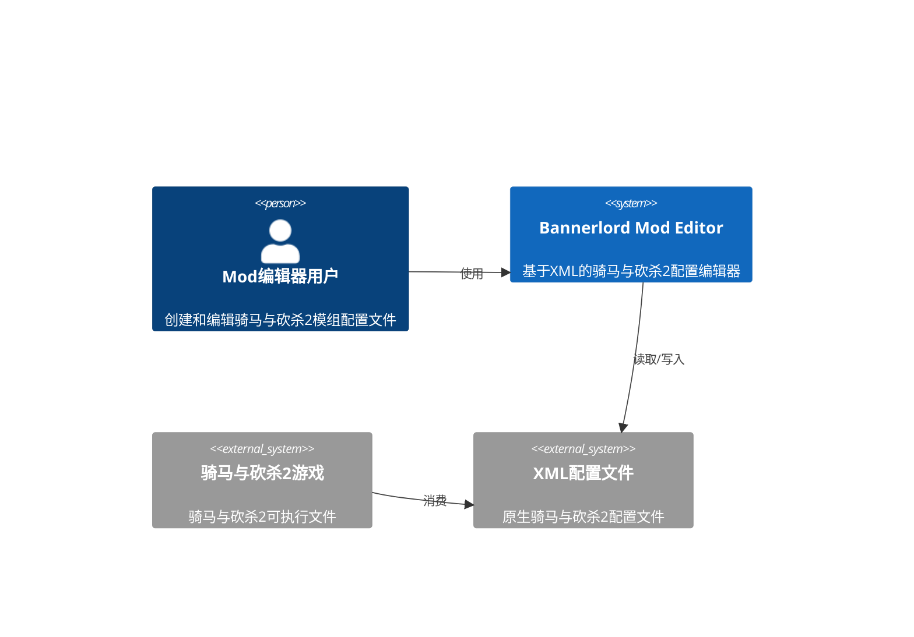
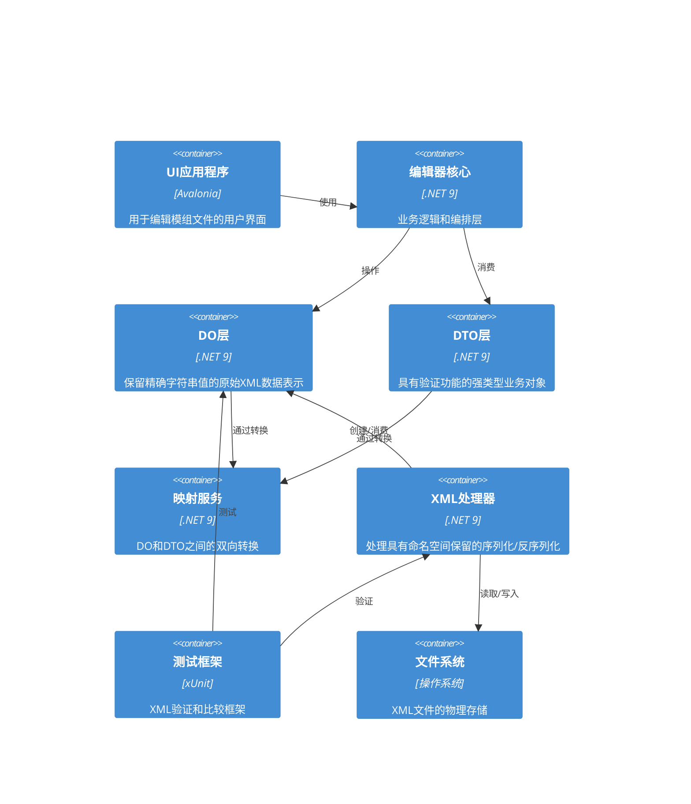
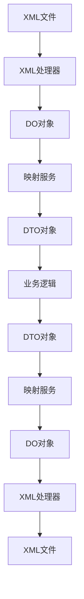

# 系统架构

## 执行摘要

本文档描述了Bannerlord Mod Editor项目的增强系统设计，用于解决剩余的XML测试失败问题。该方案实现了稳健的DO/DTO分层架构，具有改进的XML序列化/反序列化功能，能够保留精确的XML格式，同时提供类型安全的业务逻辑接口。

## 架构概述

### 系统上下文


### 容器图


## 技术栈

### 前端
- **框架**: Avalonia UI 11.3
- **状态管理**: CommunityToolkit.Mvvm 8.2
- **UI库**: Fluent主题
- **构建工具**: .NET SDK

### 后端  
- **运行时**: .NET 9.0
- **框架**: 核心.NET库
- **XML处理**: 带有自定义扩展的System.Xml.Serialization
- **测试**: xUnit 2.5

### 基础设施
- **构建系统**: dotnet CLI
- **包管理**: NuGet
- **CI/CD**: GitHub Actions
- **测试**: 带有自定义XML验证助手的xUnit

## 组件设计

### DO (数据对象) 层
**目的**: 精确表示文件中存在的原始XML数据，保留精确的字符串表示
**技术**: 带有自定义XML序列化属性的.NET 9
**接口**: 
- 输入: 来自文件的原始XML字符串
- 输出: 保留字符串的数据对象
**依赖项**: System.Xml.Serialization

### DTO (数据传输对象) 层
**目的**: 提供具有验证功能的强类型、业务逻辑友好的表示
**技术**: 带有数据注释的.NET 9
**接口**: 
- 输入: 通过映射服务的DO对象
- 输出: 用于UI/消费的验证业务对象
**依赖项**: DO层，映射服务

### 映射服务
**目的**: 提供DO和DTO表示之间的双向转换
**技术**: 带有反射的自定义映射逻辑
**接口**: 
- 输入: DO/DTO对象
- 输出: 保留数据完整性的转换对象
**依赖项**: DO层，DTO层

### XML处理器
**目的**: 处理具有命名空间和格式保留的序列化/反序列化
**技术**: 带有自定义扩展的System.Xml
**接口**: 
- 输入: 文件路径，DO/DTO对象
- 输出: XML字符串，反序列化对象
**依赖项**: DO层，System.Xml

### 测试框架
**目的**: 提供全面的XML验证和比较功能
**技术**: 带有自定义XML处理扩展的xUnit
**接口**: 
- 输入: XML字符串，DO/DTO对象
- 输出: 测试结果，验证报告
**依赖项**: DO层，XML处理器

## 数据架构

### 数据流


### 数据模型

#### DO层示例（原始XML表示）
```csharp
[XmlRoot("Item")]
public class ItemDo
{
    [XmlAttribute("id")]
    public string Id { get; set; } = string.Empty;
    
    [XmlAttribute("multiplayer_item")]
    public string MultiplayerItem { get; set; } = string.Empty; // 保留精确字符串如 "true", "True", "1"
    
    [XmlAttribute("weight")]
    public string Weight { get; set; } = string.Empty; // 保留精确字符串如 "1.1", "1.100"
    
    [XmlElement("ItemComponent")]
    public ItemComponentDo? ItemComponent { get; set; }
}

public class ItemComponentDo
{
    [XmlElement("Armor")]
    public ArmorDo? Armor { get; set; }
}
```

#### DTO层示例（强类型业务对象）
```csharp
public class ItemDto
{
    [Required]
    public string Id { get; set; } = string.Empty;
    
    public BooleanProperty MultiplayerItem { get; set; } = new BooleanProperty();
    
    public decimal Weight { get; set; }
    
    public ItemComponentDto? ItemComponent { get; set; }
}

public class ItemComponentDto
{
    public ArmorDto? Armor { get; set; }
}
```

## 安全架构

### 认证与授权
- 认证方式：基于本地文件的访问
- 授权模型：文件系统权限
- 令牌生命周期：基于会话的应用程序生命周期

### 安全措施
- [x] 输入验证和清理
- [x] XML注入防护
- [x] 文件路径验证
- [ ] 速率限制（不适用于本地桌面应用）
- [ ] 密钥管理（本地应用最少需要）

## 可扩展性策略

### 水平扩展
- 负载均衡方法：不适用（桌面应用程序）
- 会话管理：内存中的应用程序状态
- 数据库复制：不适用（基于文件的存储）
- 缓存策略：内存对象缓存

### 性能优化
- 使用异步操作进行文件I/O优化
- 频繁使用对象的对象池化
- 大型XML结构的延迟加载
- 内存高效的XML处理

## 部署架构

### 环境
- 开发：本地开发机器
- 测试：带有单元测试的CI/CD管道
- 生产：最终用户桌面安装

### 部署策略
- 使用Velopack进行应用程序打包
- 单文件部署
- 通过Velopack基础设施自动更新
- 通过Velopack进行回滚程序

## 监控与可观测性

### 指标
- 应用程序启动时间
- XML处理性能
- 内存使用模式
- 错误率和类型

### 日志记录
- 基于文件的时间戳条目日志记录
- 带有堆栈跟踪的错误日志记录
- XML操作的性能日志记录
- 结构化日志格式

### 告警
- 带有用户通知的异常处理
- 性能下降告警
- 文件操作失败通知
- 验证错误报告

## 架构决策 (ADRs)

### ADR-001: DO/DTO分层架构
**状态**: 已接受
**上下文**: Bannerlord Mod Editor需要保留精确的XML字符串表示，同时为业务逻辑提供强类型接口。现有的XML序列化程序无法正确处理区分大小写的布尔值，并且需要区分缺失属性和空值。
**决策**: 实现DO/DTO分层架构，其中DO保留精确的字符串表示，DTO提供强类型接口。
**后果**: 
- 正面：精确的XML保留，正确的布尔处理，清晰的关注点分离
- 负面：映射层增加复杂性，潜在的性能开销
**考虑的替代方案**: 
- 在整个过程中使用带有字符串属性的DO - 会使业务逻辑复杂化
- 仅使用带有自定义序列化程序的DTO - 无法保留精确的XML表示

### ADR-002: 布尔值处理
**状态**: 已接受
**上下文**: Bannerlord XML文件包含各种格式的布尔值（true, True, TRUE, 1, false, False, FALSE, 0），这些值在保存时必须精确保留，但在比较时需要标准化。
**决策**: 创建BooleanProperty包装类，保留原始字符串表示，同时提供标准化的布尔值访问。
**后果**: 
- 正面：原始值的精确保留，不区分大小写的解析，一致的比较逻辑
- 负面：额外的包装对象开销
**考虑的替代方案**: 
- 带有布尔转换的自定义XmlSerializer - 复杂且容易出错
- 带有辅助方法的字符串属性 - 会失去类型安全性

### ADR-003: Namespace Preservation Strategy
**Status**: Accepted
**Context**: Bannerlord XML files may contain namespace declarations that must be preserved during serialization to prevent game crashes.
**Decision**: Implement enhanced XML loader that extracts namespace declarations from original XML and applies them during serialization.
**Consequences**: 
- Positive: Namespace preservation without modification, backward compatibility
- Negative: Slight complexity in XML processing pipeline
**Alternatives Considered**: 
- Hard-coding namespace declarations - inflexible and error-prone
- Modifying DO models to include namespace attributes - breaks clean separation of concerns

### ADR-004: Enhanced XML Comparison Framework
**Status**: Accepted
**Context**: The existing XML comparison logic was insufficient to handle the variety of XML format differences encountered in Bannerlord files.
**Decision**: Implement a comprehensive XML comparison framework with multiple comparison modes and detailed reporting capabilities.
**Consequences**: 
- Positive: Detailed failure analysis, multiple comparison strategies, improved debugging capabilities
- Negative: Increased test execution time, complexity in comparison logic
**Alternatives Considered**: 
- Simple string comparison - insufficient for structural validation
- Basic XML comparison - lacks detailed reporting capabilities

### ADR-005: Conditional Serialization Implementation
**Status**: Accepted
**Context**: Many XML attributes in Bannerlord files are optional and should not be serialized when empty or null.
**Decision**: Implement ShouldSerialize{PropertyName}() methods in DO models to control conditional serialization.
**Consequences**: 
- Positive: Clean XML output, exact preservation of original structure
- Negative: Additional boilerplate code in models
**Alternatives Considered**: 
- Custom XmlSerializer - complex and error-prone
- Post-processing serialized XML - inefficient and fragile

## Enhanced XML Processing Architecture

### Boolean Value Normalization
The system implements intelligent boolean value handling that:
1. Preserves exact original string representations in DO layer
2. Provides normalized boolean access in DTO layer
3. Handles case-insensitive comparison during testing
4. Supports multiple boolean formats (true/True/TRUE/1, false/False/FALSE/0)

### Namespace Declaration Preservation
The enhanced XML processor:
1. Extracts namespace declarations from original XML files
2. Preserves these declarations during serialization
3. Handles both default and prefixed namespace declarations
4. Prevents unwanted namespace additions or removals

### Attribute Existence Tracking
To distinguish between missing attributes and empty attributes:
1. DO models implement ShouldSerialize{PropertyName}() methods
2. Conditional serialization ensures only present attributes are serialized
3. Property existence is tracked during deserialization
4. Empty vs. missing attributes are properly handled

### Numerical Value Handling
The system provides consistent numerical value processing:
1. Preserves original formatting in DO layer
2. Normalizes values for comparison in test framework
3. Handles precision differences appropriately
4. Supports tolerance-based comparison for floating-point values

## Test Framework Enhancements

### Multi-Mode Comparison
The test framework supports three comparison modes:
1. **Strict**: Exact string matching
2. **Logical**: Normalized value comparison with tolerance
3. **Loose**: Lenient comparison for structural validation

### Detailed Reporting
Enhanced test framework provides:
1. Comprehensive difference reports
2. Node and attribute count comparisons
3. Detailed path-based difference identification
4. Debug output with original vs. serialized XML files

### Performance Optimizations
Test framework includes optimizations for:
1. Large XML file processing
2. Memory-efficient comparison algorithms
3. Parallel test execution
4. Caching of parsed XML structures

## Integration Patterns

### DO/DTO Mapping
The mapping service provides:
1. Bidirectional conversion between DO and DTO models
2. Reflection-based property mapping
3. Custom conversion logic for special types
4. Validation during mapping operations

### XML Processing Pipeline
The XML processing pipeline ensures:
1. Namespace preservation throughout serialization
2. Consistent formatting and encoding
3. Proper handling of self-closing tags
4. Attribute ordering normalization

### Error Handling
Robust error handling includes:
1. Graceful degradation for malformed XML
2. Detailed error reporting with context
3. Recovery mechanisms for partial failures
4. Logging and diagnostics for debugging

## Future Extensibility

### Plugin Architecture
The system supports extensibility through:
1. Modular XML processors for different file types
2. Pluggable comparison strategies
3. Extensible mapping services
4. Custom validation rules

### Performance Scaling
Future performance improvements can include:
1. Asynchronous processing for large files
2. Streaming XML processing
3. Incremental serialization/deserialization
4. Advanced caching mechanisms

### Feature Expansion
The architecture supports adding:
1. New XML file types with minimal changes
2. Additional data validation rules
3. Enhanced UI integration
4. Advanced editing capabilities

## Implementation Roadmap

### Phase 1: Core Infrastructure
1. Enhanced XML processing components
2. Improved test framework
3. DO/DTO mapping services
4. Namespace preservation implementation

### Phase 2: Model Implementation
1. Complete DO/DTO models for all XML types
2. Conditional serialization implementation
3. Boolean property handling
4. Numerical value processing

### Phase 3: Testing and Validation
1. Comprehensive test coverage
2. Performance optimization
3. Edge case handling
4. Validation against original XML files

### Phase 4: Integration and Deployment
1. UI integration
2. Packaging and deployment
3. Documentation
4. Final validation and testing

This architecture provides a robust foundation for resolving the remaining XML test failures while maintaining backward compatibility and enabling future enhancements.