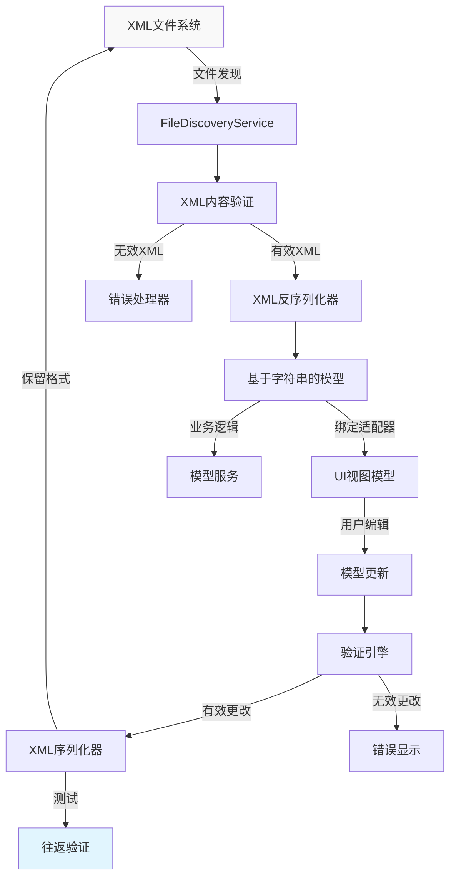
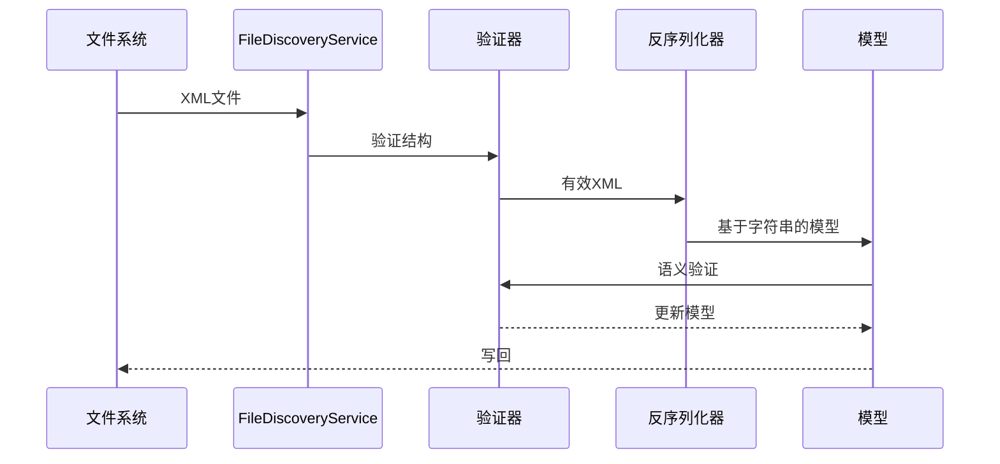
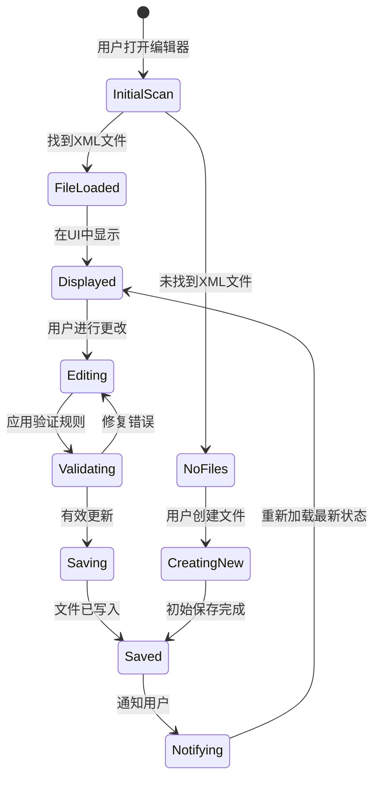

# 数据流架构 - XML到C#模型映射

## 概述

Bannerlord Mod Editor实现了一个全面的数据流架构，用于在XML配置文件和强类型C#模型之间无缝转换，同时保持精确的XML格式保真度。该架构处理游戏XML处理的独特要求，包括属性存在控制、格式保留和往返验证。

## 系统架构

### 高级数据流



## 数据流组件

### 1. 文件发现和加载

#### FileDiscoveryService
- **目的**: 扫描和识别Bannerlord目录中的XML文件
- **输出**: 包含元数据的有效模型文件列表
- **验证**: 文件类型、结构验证和完整性检查

```csharp
public class FileDiscoveryResult
{
    public string FilePath { get; set; } = string.Empty;
    public string ModelType { get; set; } = string.Empty;
    public bool IsValid { get; set; }
    public List<string> ValidationErrors { get; } = new();
}
```

#### XML内容管道


### 2. 反序列化管道

#### XML读取过程
1. **文件访问**: 使用UTF-8编码进行流式读取
2. **架构验证**: 可选的XML架构检查
3. **字符串处理**: 保留精确的文本内容
4. **类型映射**: 将XML属性转换为字符串属性
5. **条件处理**: 跳过缺失的可选属性

```csharp
public T DeserializeModel<T>(string xmlContent) where T : class, new()
{
    var serializer = new XmlSerializer(typeof(T));
    using var reader = new StringReader(xmlContent);
    
    return (T)serializer.Deserialize(reader)!;
}
```

#### 反序列化验证
- **结构验证**: XML元素存在性和层次结构
- **属性验证**: 必需与可选属性处理
- **类型安全**: 带验证的字符串转换
- **数据完整性**: 检查损坏或不完整的数据

### 3. 模型绑定和处理

#### 字符串到值转换
对于需要验证或业务逻辑处理的属性：

```csharp
public class PhysicsMaterial
{
    [XmlAttribute("id")]
    public string Id { get; set; } = string.Empty;
    
    [XmlAttribute("static_friction")]
    public string? StaticFrictionText { get; set; }
    
    [XmlIgnore]
    public float? StaticFriction => 
        float.TryParse(StaticFrictionText, out var value) ? value : null;
        
    public bool ShouldSerializeStaticFrictionText() => 
        !string.IsNullOrWhiteSpace(StaticFrictionText);
}
```

#### 业务逻辑层
- **验证规则**: 检查模型完整性和业务约束
- **格式保留**: 确保XML格式与原始游戏匹配
- **跨模型引用**: 处理模型依赖关系
- **性能优化**: 最小化大文件的内存使用

### 4. 用户界面集成

#### ViewModel数据绑定
```csharp
public class PhysicsMaterialViewModel : ViewModelBase
{
    private readonly PhysicsMaterial _model;
    
    public string DisplayName => _model.Id;
    public string StaticFrictionDisplay => _model.StaticFrictionText ?? "Default";
    public float? StaticFrictionValue => _model.StaticFriction;
    
    public void UpdateModel(string id, string? staticFriction)
    {
        _model.Id = id;
        _model.StaticFrictionText = string.IsNullOrWhiteSpace(staticFriction) ? null : staticFriction;
        
        // 触发重新验证
        ValidateModel();
    }
}
```

#### 实时验证
- **即时反馈**: 输入时验证用户输入
- **错误预防**: 在保存前防止无效数据
- **撤销支持**: 维护更改历史以支持回滚
- **性能**: 异步验证以实现非阻塞UI

### 5. 序列化和输出

#### XML生成过程
1. **模型状态捕获**: 收集所有模型更改
2. **序列化控制**: 应用ShouldSerialize模式
3. **格式保留**: 确保精确的XML结构
4. **文件写入**: 原子文件操作以防止损坏
5. **验证**: 验证生成的XML完整性

#### 原子写入操作
```csharp
public void SaveModel<T>(T model, string filePath) where T : class
{
    var tempFilePath = filePath + ".tmp";
    
    try
    {
        var serializer = new XmlSerializer(typeof(T));
        using var writer = new StreamWriter(tempFilePath, false, new UTF8Encoding(false));
        
        serializer.Serialize(writer, model);
        
        // 原子文件替换
        File.Move(tempFilePath, filePath, true);
    }
    catch (Exception)
    {
        File.Delete(tempFilePath);
        throw;
    }
}
```

### 6. 测试和验证管道

#### 往返测试
- **结构保留**: XML层次结构和属性顺序
- **内容准确性**: 精确的字符串内容保留
- **属性处理**: 可选与必需属性行为
- **性能**: 确保合理的处理时间

#### 自动化测试
```csharp
[Test]
public void PhysicsMaterials_RoundTripMaintainsExactStructure()
{
    // 准备
    var originalXml = LoadXmlFromFile("physics_materials.xml");
    
    // 执行
    var model = XmlModelFactory.CreateFromXml<PhysicsMaterials>(originalXml);
    var regeneratedXml = XmlModelFactory.SerializeToString(model);
    
    // 断言
    AssertXmlStructuralEquality(originalXml, regeneratedXml);
}
```

#### 性能测试
- **负载测试**: 高效处理大型XML文件
- **内存分析**: 确保没有内存泄漏或过度使用
- **并发性**: 安全处理多个文件操作
- **错误恢复**: 优雅处理损坏的文件

## 集成点

### 文件系统集成
- **目录扫描**: 带缓存的 efficient 文件发现
- **文件监控**: 监视外部更改
- **版本控制**: Git集成用于更改跟踪
- **备份系统**: 修改前自动备份

### 游戏集成
- **Mod目录支持**: 处理mod和游戏目录
- **验证规则**: 防止破坏游戏XML结构
- **兼容性检查**: 确保更改与游戏兼容
- **冲突解决**: 处理影响同一文件的多个mod

### UI工作流集成

#### 用户交互流


## 高级功能

### 更改跟踪系统
```csharp
public class XmlChangeTracker
{
    private readonly Dictionary<string, XmlChangeInfo> _changes = new();
    
    public void TrackChange<T>(string filePath, T original, T modified)
    {
        var changeInfo = new XmlChangeInfo
        {
            FilePath = filePath,
            OriginalHash = ComputeHash(original),
            ModifiedHash = ComputeHash(modified),
            Timestamp = DateTime.UtcNow
        };
        
        _changes[filePath] = changeInfo;
    }
}
```

### 批处理支持
- **多文件操作**: 处理整个目录
- **批量更改**: 跨多个模型应用更改
- **回滚功能**: 撤销整个操作
- **进度跟踪**: 实时进度指示

### 冲突检测
- **文件比较**: 检测外部更改
- **合并功能**: 处理并发修改
- **警告系统**: 警告用户潜在冲突
- **解决方案选项**: 提供手动或自动解决方案

## 安全性和安全性

### 安全文件操作
- **只读处理**: 初始文件扫描
- **写保护**: 防止意外覆盖
- **备份创建**: 为所有更改自动备份
- **验证门**: 确保更改不会破坏游戏

### 错误处理策略
- **优雅降级**: 继续处理无效文件
- **详细错误报告**: 清晰、可操作的错误消息
- **恢复机制**: 自动从备份恢复
- **日志记录**: 更改的全面审计跟踪

这个数据流架构确保了强大、安全和高效的XML模型处理，同时保持与Bannerlord XML格式要求的完全兼容性。