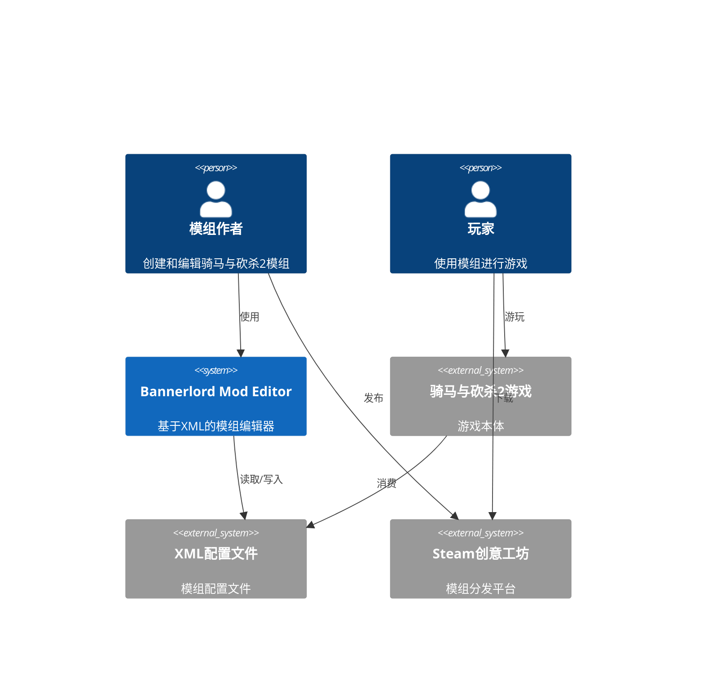
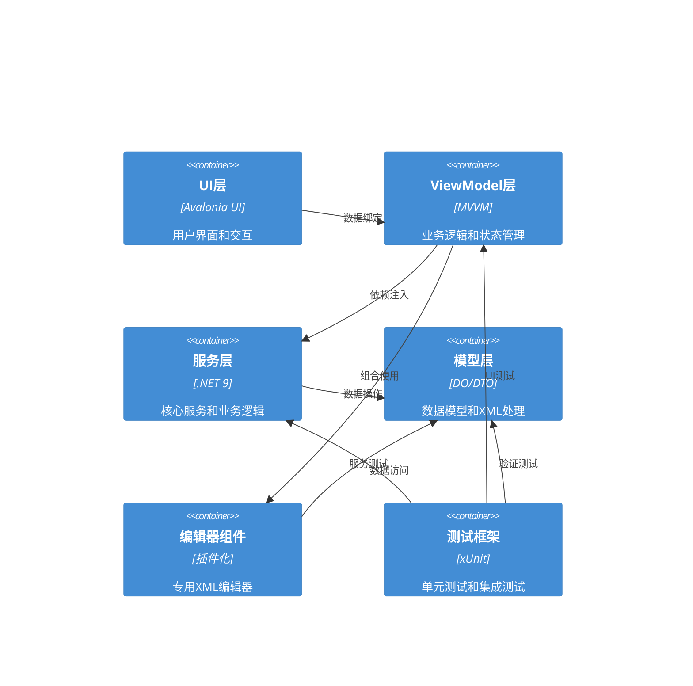
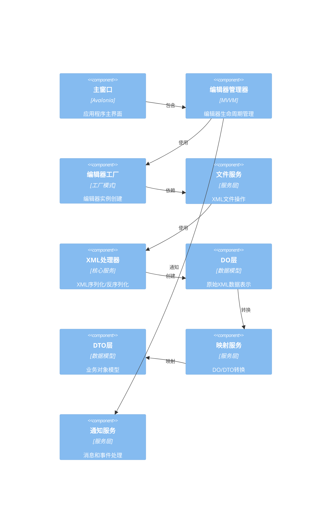
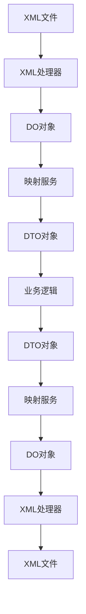
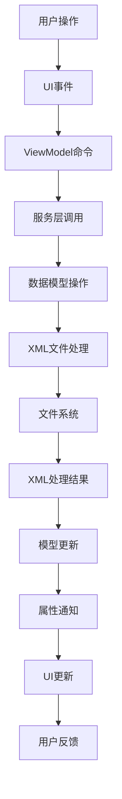

# 系统架构设计

## 执行摘要

本文档描述了Bannerlord Mod Editor项目的完整系统架构设计。该系统采用现代化的分层架构，结合Avalonia UI和MVVM模式，实现了一个可扩展、可维护的骑马与砍杀2模组编辑器。系统通过DO/DTO分层架构确保XML数据的精确处理，同时提供强大的编辑器组件框架和插件化扩展能力。

## 架构概述

### 系统上下文


### 容器图


### 组件图


## 分层架构设计

### 1. UI层 (Presentation Layer)
**职责**: 用户界面展示和交互
**技术栈**: Avalonia UI 11.3, Fluent主题

#### 核心组件
- **MainWindow.axaml**: 主窗口界面
- **Views/Editors/**: 专用编辑器视图
- **Controls/**: 可复用UI控件
- **Styles/**: 主题和样式定义

#### 设计模式
- MVVM模式分离关注点
- 数据绑定实现自动更新
- 命令模式处理用户交互
- 依赖注入管理服务

### 2. ViewModel层 (Business Logic Layer)
**职责**: 业务逻辑和状态管理
**技术栈**: CommunityToolkit.Mvvm 8.2, .NET 9

#### 核心组件
- **MainWindowViewModel**: 主窗口逻辑
- **EditorManagerViewModel**: 编辑器管理
- **EditorCategoryViewModel**: 编辑器分类
- **BaseEditorViewModel**: 编辑器基类

#### 设计原则
- 单一职责原则
- 观察者模式实现通知
- 命令模式封装操作
- 工厂模式创建实例

### 3. 服务层 (Service Layer)
**职责**: 核心服务和业务逻辑
**技术栈**: .NET 9, 依赖注入

#### 核心服务
- **IFileDiscoveryService**: XML文件发现
- **IXmlProcessor**: XML处理
- **IMapperFactory**: 映射服务
- **INotificationService**: 通知服务
- **IEditorFactory**: 编辑器工厂

#### 服务注册
```csharp
// 依赖注入配置
services.AddSingleton<IFileDiscoveryService, FileDiscoveryService>();
services.AddSingleton<IXmlProcessor, XmlProcessor>();
services.AddSingleton<IMapperFactory, MapperFactory>();
services.AddSingleton<INotificationService, NotificationService>();
services.AddSingleton<IEditorFactory, EditorFactory>();
```

### 4. 模型层 (Data Layer)
**职责**: 数据模型和XML处理
**技术栈**: DO/DTO架构, System.Xml.Serialization

#### DO层 (Data Objects)
- 精确保留原始XML数据
- 字符串类型保持格式
- 条件序列化控制
- 命名空间保留

#### DTO层 (Data Transfer Objects)
- 强类型业务对象
- 数据验证和转换
- 业务逻辑封装
- 类型安全接口

#### 映射服务
- 双向转换DO/DTO
- 反射-based属性映射
- 自定义转换逻辑
- 性能优化

## DO/DTO架构集成方案

### 架构原理


### DO层设计
```csharp
[XmlRoot("Item")]
public class ItemDO
{
    [XmlAttribute("id")]
    public string Id { get; set; } = string.Empty;
    
    [XmlAttribute("multiplayer_item")]
    public string MultiplayerItem { get; set; } = string.Empty;
    
    [XmlIgnore]
    public bool HasMultiplayerItem { get; set; }
    
    public bool ShouldSerializeMultiplayerItem() => HasMultiplayerItem;
}
```

### DTO层设计
```csharp
public class ItemDTO
{
    [Required]
    public string Id { get; set; } = string.Empty;
    
    public BooleanProperty MultiplayerItem { get; set; } = new();
    
    public bool IsValid() => !string.IsNullOrEmpty(Id);
}
```

### 映射服务设计
```csharp
public static class ItemMapper
{
    public static ItemDTO ToDTO(ItemDO source)
    {
        if (source == null) return null;
        
        return new ItemDTO
        {
            Id = source.Id,
            MultiplayerItem = BooleanProperty.Parse(source.MultiplayerItem)
        };
    }
    
    public static ItemDO ToDO(ItemDTO source)
    {
        if (source == null) return null;
        
        return new ItemDO
        {
            Id = source.Id,
            MultiplayerItem = source.MultiplayerItem.ToString(),
            HasMultiplayerItem = source.MultiplayerItem.HasValue
        };
    }
}
```

## 编辑器组件设计模式

### 编辑器基类架构
```csharp
public abstract class BaseEditorViewModel : ViewModelBase
{
    [ObservableProperty]
    private string xmlFileName = string.Empty;
    
    [ObservableProperty]
    private bool isLoading = false;
    
    [ObservableProperty]
    private bool hasUnsavedChanges = false;
    
    [ObservableProperty]
    private string statusMessage = string.Empty;
    
    // 抽象方法，子类必须实现
    public abstract Task LoadDataAsync();
    public abstract Task SaveDataAsync();
    public abstract bool ValidateData();
    
    // 通用功能
    public async Task LoadXmlFile(string fileName)
    {
        IsLoading = true;
        StatusMessage = "正在加载...";
        
        try
        {
            await LoadDataAsync();
            HasUnsavedChanges = false;
            StatusMessage = "加载完成";
        }
        catch (Exception ex)
        {
            StatusMessage = $"加载失败: {ex.Message}";
        }
        finally
        {
            IsLoading = false;
        }
    }
}
```

### 专用编辑器实现
```csharp
public partial class AttributeEditorViewModel : BaseEditorViewModel
{
    private readonly IXmlProcessor<AttributesDO> _xmlProcessor;
    private readonly IMapper<AttributesDO, AttributesDTO> _mapper;
    
    [ObservableProperty]
    private ObservableCollection<AttributeDTO> attributes = new();
    
    public AttributeEditorViewModel(
        IXmlProcessor<AttributesDO> xmlProcessor,
        IMapper<AttributesDO, AttributesDTO> mapper)
    {
        _xmlProcessor = xmlProcessor;
        _mapper = mapper;
    }
    
    public override async Task LoadDataAsync()
    {
        var doObject = await _xmlProcessor.LoadAsync(XmlFileName);
        var dtoObject = _mapper.ToDTO(doObject);
        
        Attributes.Clear();
        foreach (var attr in dtoObject.Attributes)
        {
            Attributes.Add(attr);
        }
    }
    
    public override async Task SaveDataAsync()
    {
        var dtoObject = new AttributesDTO
        {
            Attributes = Attributes.ToList()
        };
        
        var doObject = _mapper.ToDO(dtoObject);
        await _xmlProcessor.SaveAsync(doObject, XmlFileName);
        
        HasUnsavedChanges = false;
    }
    
    public override bool ValidateData()
    {
        return Attributes.All(a => !string.IsNullOrEmpty(a.Id));
    }
}
```

### 编辑器工厂模式
```csharp
public class EditorFactory : IEditorFactory
{
    private readonly Dictionary<string, Type> _editorTypes = new();
    private readonly IServiceProvider _serviceProvider;
    
    public EditorFactory(IServiceProvider serviceProvider)
    {
        _serviceProvider = serviceProvider;
        RegisterEditors();
    }
    
    private void RegisterEditors()
    {
        RegisterEditor<AttributeEditorViewModel>("AttributeEditor");
        RegisterEditor<SkillEditorViewModel>("SkillEditor");
        RegisterEditor<ItemEditorViewModel>("ItemEditor");
        // 注册更多编辑器...
    }
    
    public ViewModelBase? CreateEditorViewModel(string editorType, string xmlFileName)
    {
        if (!_editorTypes.TryGetValue(editorType, out var viewModelType))
        {
            return null;
        }
        
        var viewModel = _serviceProvider.GetService(viewModelType) as ViewModelBase;
        if (viewModel is BaseEditorViewModel baseEditor)
        {
            baseEditor.XmlFileName = xmlFileName;
        }
        
        return viewModel;
    }
}
```

## 数据流和状态管理

### 数据流架构


### 状态管理模式
```csharp
public class EditorStateManager
{
    private readonly Dictionary<string, object> _state = new();
    private readonly List<Action> _subscribers = new();
    
    public void SetState<T>(string key, T value)
    {
        _state[key] = value;
        NotifyStateChanged();
    }
    
    public T? GetState<T>(string key)
    {
        return _state.TryGetValue(key, out var value) ? (T)value : default;
    }
    
    public void Subscribe(Action callback)
    {
        _subscribers.Add(callback);
    }
    
    private void NotifyStateChanged()
    {
        foreach (var subscriber in _subscribers)
        {
            subscriber();
        }
    }
}
```

### 事件和消息系统
```csharp
public class EditorEventBus
{
    private readonly Dictionary<string, List<Action<object>>> _handlers = new();
    
    public void Subscribe<T>(string eventType, Action<T> handler)
    {
        if (!_handlers.ContainsKey(eventType))
        {
            _handlers[eventType] = new List<Action<object>>();
        }
        
        _handlers[eventType].Add(obj => handler((T)obj));
    }
    
    public void Publish<T>(string eventType, T payload)
    {
        if (_handlers.TryGetValue(eventType, out var handlers))
        {
            foreach (var handler in handlers)
            {
                handler(payload);
            }
        }
    }
}
```

## 技术栈配置

### 核心技术
| 层级 | 技术 | 版本 | 用途 |
|------|------|------|------|
| UI层 | Avalonia UI | 11.3 | 跨平台桌面UI |
| UI层 | Fluent主题 | 11.3 | 现代化UI主题 |
| MVVM | CommunityToolkit.Mvvm | 8.2 | MVVM框架 |
| 运行时 | .NET | 9.0 | 应用程序运行时 |
| XML | System.Xml.Serialization | 内置 | XML序列化 |
| 测试 | xUnit | 2.5 | 单元测试 |
| DI | Microsoft.Extensions.DependencyInjection | 8.0 | 依赖注入 |

### 项目结构
```
BannerlordModEditor.sln
├── BannerlordModEditor.UI/               # UI层
│   ├── ViewModels/                      # ViewModel实现
│   ├── Views/                           # 视图定义
│   ├── Controls/                        # 自定义控件
│   ├── Factories/                       # 工厂类
│   └── Services/                        # UI服务
├── BannerlordModEditor.Common/           # 公共层
│   ├── Models/                          # 数据模型
│   │   ├── DO/                          # 数据对象
│   │   ├── DTO/                         # 数据传输对象
│   │   └── Data/                        # 原始数据模型
│   ├── Services/                        # 核心服务
│   ├── Mappers/                         # 映射服务
│   └── Loaders/                         # XML加载器
├── BannerlordModEditor.Common.Tests/     # 公共层测试
└── BannerlordModEditor.UI.Tests/         # UI层测试
```

## 性能优化策略

### 内存管理
- **对象池化**: 频繁创建的对象使用对象池
- **延迟加载**: 大型XML文件按需加载
- **内存监控**: 实时监控内存使用情况
- **垃圾回收**: 优化GC压力

### 异步处理
- **文件I/O**: 所有文件操作使用异步API
- **XML处理**: 大型XML文件异步处理
- **UI响应**: 长时间操作不阻塞UI线程
- **并行处理**: 多个文件并行处理

### 缓存策略
- **XML缓存**: 已解析的XML对象缓存
- **映射缓存**: 映射结果缓存
- **UI缓存**: 视图模型缓存
- **磁盘缓存**: 临时文件缓存

## 安全架构

### 数据安全
- **输入验证**: 所有用户输入验证
- **XML安全**: 防止XXE攻击
- **文件路径**: 路径遍历防护
- **权限控制**: 文件访问权限

### 错误处理
- **异常捕获**: 全面的异常处理
- **日志记录**: 详细的错误日志
- **用户反馈**: 友好的错误提示
- **恢复机制**: 自动恢复功能

## 部署架构

### 构建配置
```xml
<!-- Release配置 -->
<PropertyGroup>
  <OutputType>Exe</OutputType>
  <TargetFramework>net9.0</TargetFramework>
  <PublishSingleFile>true</PublishSingleFile>
  <SelfContained>true</SelfContained>
  <PublishTrimmed>true</PublishTrimmed>
  <IncludeNativeLibrariesForSelfExtract>true</IncludeNativeLibrariesForSelfExtract>
</PropertyGroup>
```

### 打包和分发
- **Velopack**: 应用程序打包和更新
- **单文件部署**: 简化分发
- **自动更新**: 内置更新机制
- **跨平台**: 支持Windows、macOS、Linux

## 监控和诊断

### 性能监控
- **启动时间**: 应用程序启动性能
- **内存使用**: 内存占用监控
- **XML处理**: XML操作性能
- **UI响应**: 用户界面响应性

### 错误监控
- **异常统计**: 异常类型和频率
- **错误报告**: 详细错误信息
- **用户反馈**: 用户问题反馈
- **诊断信息**: 系统诊断数据

## 扩展性设计

### 插件架构
```csharp
public interface IEditorPlugin
{
    string Name { get; }
    string Version { get; }
    string Description { get; }
    
    void Initialize(IServiceProvider services);
    IEnumerable<string> SupportedFileTypes { get; }
    BaseEditorViewModel CreateEditor(string fileName);
}
```

### 自定义编辑器
- **插件注册**: 运行时注册编辑器
- **配置文件**: 编辑器配置管理
- **主题支持**: 自定义主题支持
- **本地化**: 多语言支持

### API扩展
- **REST API**: 可选的Web API
- **脚本支持**: 自动化脚本
- **批量处理**: 批量操作支持
- **集成接口**: 第三方集成

## 质量保证

### 测试策略
- **单元测试**: 核心逻辑测试
- **集成测试**: 组件集成测试
- **UI测试**: 用户界面测试
- **性能测试**: 性能基准测试

### 代码质量
- **代码分析**: 静态代码分析
- **代码审查**: 人工代码审查
- **文档生成**: 自动文档生成
- **持续集成**: 自动化构建和测试

## 总结

本架构设计提供了一个完整的、可扩展的、可维护的Bannerlord Mod Editor系统。通过分层架构、DO/DTO模式、MVVM模式和插件化设计，系统能够满足当前需求并支持未来的扩展。架构注重性能、安全性和用户体验，为骑马与砍杀2模组开发提供了强大的编辑工具。