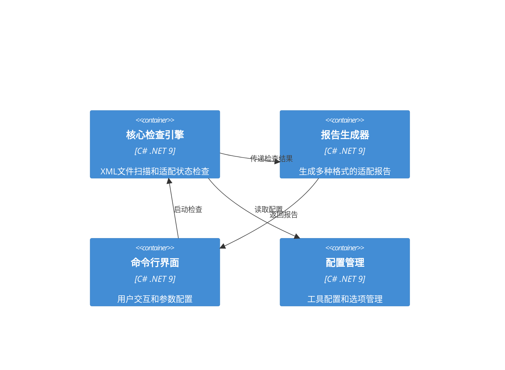
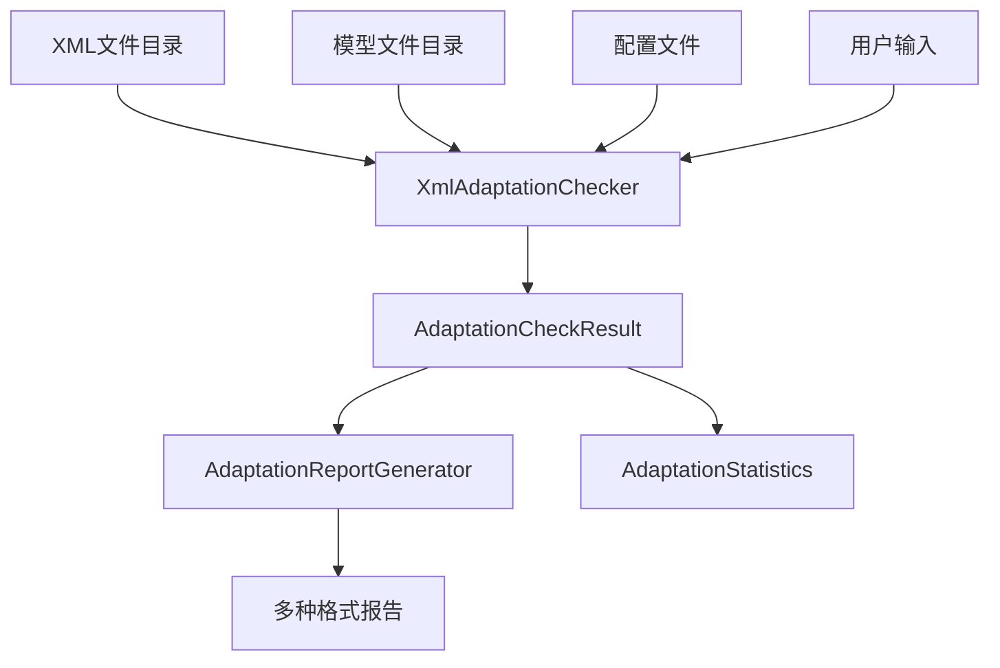

# XML适配状态检查工具系统架构

## 执行摘要

本文档描述了骑马与砍杀2（Bannerlord）Mod编辑器XML适配状态检查工具的系统架构。该工具旨在自动化扫描XML文件并检查其适配状态，生成详细的未适配文件报告，帮助开发团队了解XML适配进度并优先处理高优先级文件。

## 架构概述

### 系统上下文


### 容器图



## 技术栈

### 核心技术
| 技术 | 选择 | 理由 |
|------|------|------|
| **框架** | .NET 9.0 | 与现有项目保持一致，支持现代C#特性 |
| **语言** | C# 9.0 | 类型安全，强类型支持，与现有代码集成 |
| **序列化** | System.Xml.Serialization | 现有项目已使用，兼容性好 |
| **测试** | xUnit 2.5 | 现有项目测试框架，团队熟悉 |
| **CLI** | System.CommandLine | 现代命令行处理，支持复杂参数 |

### 依赖库
| 库 | 版本 | 用途 |
|------|------|------|
| System.CommandLine | 2.0.0-beta4 | 命令行参数解析 |
| Spectre.Console | 0.49.1 | 美化控制台输出 |
| CsvHelper | 30.0.1 | CSV格式报告生成 |
| Newtonsoft.Json | 13.0.3 | JSON格式报告生成 |
| Markdig | 0.31.0 | Markdown格式报告生成 |

## 组件设计

### 1. XmlAdaptationChecker (核心检查引擎)

**职责**: XML文件扫描和适配状态检查的核心逻辑

**技术**: C# .NET 9

**接口**:
```csharp
public interface IXmlAdaptationChecker
{
    Task<AdaptationCheckResult> CheckAdaptationStatusAsync(AdaptationCheckOptions options);
    Task<List<UnadaptedFile>> FindUnadaptedFilesAsync(string xmlDirectory);
    Task<AdaptationStatistics> GenerateStatisticsAsync(AdaptationCheckResult result);
}
```

**依赖**:
- `IFileDiscoveryService` - 现有文件发现服务
- `NamingConventionMapper` - 现有命名约定映射器
- `IModelValidator` - 模型验证服务
- `IProgressReporter` - 进度报告服务

**工作流程**:
1. 扫描指定目录中的XML文件
2. 对每个XML文件调用`FileDiscoveryService.IsFileAdapted()`
3. 收集未适配文件信息
4. 分析文件复杂度和优先级
5. 生成检查结果

### 2. AdaptationReportGenerator (报告生成器)

**职责**: 生成多种格式的适配状态报告

**技术**: C# .NET 9

**接口**:
```csharp
public interface IAdaptationReportGenerator
{
    Task GenerateReportAsync(AdaptationCheckResult result, ReportFormat format, string outputPath);
    Task<string> GenerateReportStringAsync(AdaptationCheckResult result, ReportFormat format);
}
```

**支持的报告格式**:
- **控制台输出**: 彩色表格，实时进度显示
- **Markdown**: 结构化文档，适合项目文档
- **CSV**: 数据分析，支持Excel导入
- **JSON**: 程序化处理，API集成
- **HTML**: 可视化报告，Web展示

### 3. AdaptationCheckerCLI (命令行界面)

**职责**: 提供用户友好的命令行界面

**技术**: C# .NET 9 + System.CommandLine

**命令结构**:
```bash
# 基本检查
dotnet run -- check --xml-dir "path/to/xml" --models-dir "path/to/models"

# 生成报告
dotnet run -- check --xml-dir "path/to/xml" --output report.md --format markdown

# 详细模式
dotnet run -- check --xml-dir "path/to/xml" --verbose --progress

# 按优先级过滤
dotnet run -- check --xml-dir "path/to/xml" --min-priority Medium
```

### 4. AdaptationConfiguration (配置管理)

**职责**: 管理工具配置和选项

**技术**: C# .NET 9

**配置选项**:
```csharp
public class AdaptationCheckOptions
{
    public string XmlDirectory { get; set; } = string.Empty;
    public string ModelsDirectory { get; set; } = string.Empty;
    public ReportFormat OutputFormat { get; set; } = ReportFormat.Console;
    public string OutputPath { get; set; } = string.Empty;
    public AdaptationComplexity MinimumComplexity { get; set; } = AdaptationComplexity.Simple;
    public bool Verbose { get; set; } = false;
    public bool ShowProgress { get; set; } = true;
    public int MaxParallelFiles { get; set; } = Environment.ProcessorCount;
}
```

### 5. AdaptationAnalyzer (适配分析器)

**职责**: 分析XML文件复杂度和适配优先级

**技术**: C# .NET 9

**分析维度**:
- **文件大小**: 基于字节大小判断复杂度
- **XML结构**: 嵌套深度、元素数量、属性复杂度
- **依赖关系**: 对其他XML文件的依赖
- **业务重要性**: 基于文件名和内容的业务重要性评估

## 数据架构

### 数据流图



### 核心数据模型

```csharp
public class AdaptationCheckResult
{
    public DateTime CheckTimestamp { get; set; }
    public string XmlDirectory { get; set; } = string.Empty;
    public string ModelsDirectory { get; set; } = string.Empty;
    public List<AdaptedFileInfo> AdaptedFiles { get; set; } = new();
    public List<UnadaptedFile> UnadaptedFiles { get; set; } = new();
    public List<string> ErrorFiles { get; set; } = new();
    public AdaptationStatistics Statistics { get; set; } = new();
}

public class AdaptedFileInfo
{
    public string FileName { get; set; } = string.Empty;
    public string FullPath { get; set; } = string.Empty;
    public string ModelName { get; set; } = string.Empty;
    public string ModelPath { get; set; } = string.Empty;
    public long FileSize { get; set; }
    public DateTime LastModified { get; set; }
    public AdaptationStatus Status { get; set; }
}

public class AdaptationStatistics
{
    public int TotalXmlFiles { get; set; }
    public int AdaptedFilesCount { get; set; }
    public int UnadaptedFilesCount { get; set; }
    public int ErrorFilesCount { get; set; }
    public double AdaptationRate { get; set; }
    public Dictionary<AdaptationComplexity, int> ComplexityDistribution { get; set; } = new();
    public Dictionary<string, int> NamespaceDistribution { get; set; } = new();
}
```

## 性能优化策略

### 1. 并行处理
- 使用`Parallel.ForEach`并行处理XML文件
- 配置最大并行度避免资源竞争
- 基于`SemaphoreSlim`的并发控制

### 2. 内存优化
- 流式XML处理避免大文件内存占用
- 分批处理大量文件
- 及时释放文件句柄和资源

### 3. 缓存机制
- 缓存文件系统访问结果
- 缓存命名映射结果
- 配置和元数据缓存

### 4. 进度反馈
- 实时进度显示
- 分阶段进度报告
- 可取消操作支持

## 错误处理机制

### 1. 文件访问错误
- 文件不存在处理
- 权限不足处理
- 文件锁定处理

### 2. XML解析错误
- 格式错误处理
- 编码问题处理
- 损坏文件处理

### 3. 模型匹配错误
- 命名约定冲突
- 模型结构不匹配
- 依赖关系错误

### 4. 错误恢复
- 跳过错误文件继续处理
- 错误文件标记和报告
- 部分结果保存

## 扩展性设计

### 1. 插件架构
- 自定义分析器接口
- 自定义报告格式器
- 自定义命名映射器

### 2. 配置驱动
- 可配置的复杂度阈值
- 可配置的优先级规则
- 可配置的输出格式

### 3. API扩展
- RESTful API支持
- 事件驱动架构
- 异步处理管道

## 安全考虑

### 1. 文件系统安全
- 路径遍历防护
- 文件访问权限验证
- 输入路径验证

### 2. XML安全
- XML外部实体(XXE)防护
- XML注入防护
- 文件大小限制

### 3. 数据安全
- 敏感信息过滤
- 错误信息安全
- 日志数据保护

## 部署架构

### 1. 独立工具部署
```bash
# 发布为独立工具
dotnet publish -c Release -r win-x64 --self-contained true
dotnet publish -c Release -r linux-x64 --self-contained true
dotnet publish -c Release -r osx-x64 --self-contained true
```

### 2. 集成到现有项目
- 作为`BannerlordModEditor.Common`的附加组件
- 通过依赖注入集成
- 共享现有服务和配置

### 3. CI/CD集成
- 自动化测试
- 构建和发布
- 版本管理

## 监控和日志

### 1. 性能监控
- 执行时间统计
- 内存使用监控
- 文件处理速度

### 2. 日志记录
- 结构化日志
- 多级别日志
- 日志文件轮转

### 3. 错误追踪
- 异常详细信息
- 堆栈跟踪
- 环境信息

## 测试策略

### 1. 单元测试
- 核心逻辑测试
- 边界条件测试
- 错误处理测试

### 2. 集成测试
- 端到端流程测试
- 真实XML文件测试
- 报告生成测试

### 3. 性能测试
- 大文件处理测试
- 并发处理测试
- 内存使用测试

## 未来扩展

### 1. 功能扩展
- 自动模型生成
- 智能优先级推荐
- 可视化界面

### 2. 集成扩展
- IDE插件
- CI/CD工具集成
- 项目管理系统集成

### 3. 分析扩展
- 趋势分析
- 质量度量
- 团队协作支持

## 结论

XML适配状态检查工具采用现代化、可扩展的架构设计，能够高效地扫描和分析XML文件的适配状态。通过充分利用现有的`FileDiscoveryService`和`NamingConventionMapper`组件，确保了与现有系统的无缝集成。该工具不仅提供了基本的检查功能，还支持多种报告格式、性能优化和扩展机制，能够满足不同用户的需求。

该架构设计考虑了性能、可靠性、可维护性和安全性等多个维度，为工具的长期发展奠定了坚实的基础。