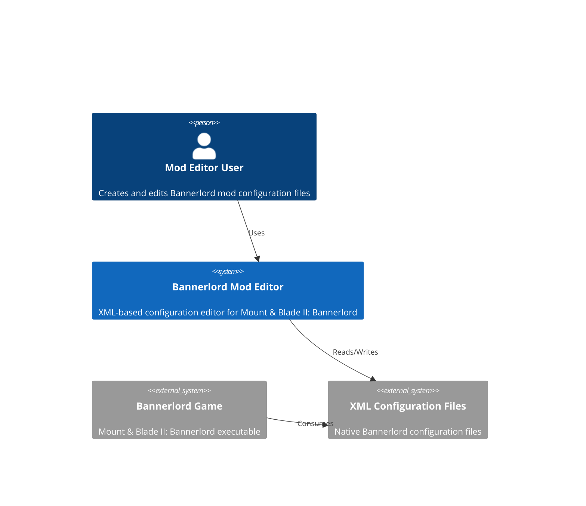
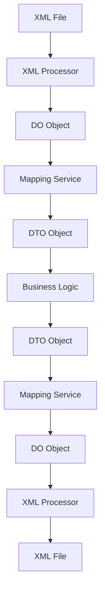

# System Architecture

## Executive Summary

This architecture document describes the enhanced system design for the Bannerlord Mod Editor project to resolve the remaining XML test failures. The solution implements a robust DO/DTO layered architecture with improved XML serialization/deserialization capabilities that preserve exact XML formatting while providing type-safe business logic interfaces.

## Architecture Overview

### System Context


### Container Diagram
```mermaid
C4Container
    Container(ui, "UI Application", "Avalonia", "User interface for editing mod files")
    Container(editorCore, "Editor Core", ".NET 9", "Business logic and orchestration layer")
    Container_Do(doLayer, "DO Layer", ".NET 9", "Raw XML data representation preserving exact string values")
    Container_Do(dtoLayer, "DTO Layer", ".NET 9", "Strongly-typed business objects with validation")
    Container_Services(mapping, "Mapping Services", ".NET 9", "Bidirectional conversion between DO and DTO")
    Container(xmlProcessor, "XML Processor", ".NET 9", "Handles serialization/deserialization with namespace preservation")
    Container(testFramework, "Test Framework", "xUnit", "XML validation and comparison framework")
    Container(fileSystem, "File System", "OS", "Physical storage of XML files")
    
    Rel(ui, editorCore, "Uses")
    Rel(editorCore, doLayer, "Manipulates")
    Rel(editorCore, dtoLayer, "Consumes")
    Rel(dtoLayer, mapping, "Converted via")
    Rel(doLayer, mapping, "Converted via")
    Rel(xmlProcessor, doLayer, "Creates/Consumes")
    Rel(xmlProcessor, fileSystem, "Reads/Writes")
    Rel(testFramework, xmlProcessor, "Validates")
    Rel(testFramework, doLayer, "Tests")
```

## Technology Stack

### Frontend
- **Framework**: Avalonia UI 11.3
- **State Management**: CommunityToolkit.Mvvm 8.2
- **UI Library**: Fluent theme
- **Build Tool**: .NET SDK

### Backend  
- **Runtime**: .NET 9.0
- **Framework**: Core .NET libraries
- **XML Processing**: System.Xml.Serialization with custom extensions
- **Testing**: xUnit 2.5

### Infrastructure
- **Build System**: dotnet CLI
- **Package Management**: NuGet
- **CI/CD**: GitHub Actions
- **Testing**: xUnit with custom XML validation helpers

## Component Design

### DO (Data Object) Layer
**Purpose**: Represent raw XML data exactly as it exists in files, preserving exact string representations
**Technology**: .NET 9 with custom XML serialization attributes
**Interfaces**: 
- Input: Raw XML strings from files
- Output: String-preserving data objects
**Dependencies**: System.Xml.Serialization

### DTO (Data Transfer Object) Layer
**Purpose**: Provide strongly-typed, business-logic-friendly representations with validation
**Technology**: .NET 9 with data annotations
**Interfaces**: 
- Input: DO objects via mapping services
- Output: Validated business objects for UI/consumption
**Dependencies**: DO Layer, Mapping Services

### Mapping Services
**Purpose**: Provide bidirectional conversion between DO and DTO representations
**Technology**: Custom mapping logic with reflection
**Interfaces**: 
- Input: DO/DTO objects
- Output: Converted objects preserving data integrity
**Dependencies**: DO Layer, DTO Layer

### XML Processor
**Purpose**: Handle serialization/deserialization with namespace and formatting preservation
**Technology**: System.Xml with custom extensions
**Interfaces**: 
- Input: File paths, DO/DTO objects
- Output: XML strings, deserialized objects
**Dependencies**: DO Layer, System.Xml

### Test Framework
**Purpose**: Provide comprehensive XML validation and comparison capabilities
**Technology**: xUnit with custom XML processing extensions
**Interfaces**: 
- Input: XML strings, DO/DTO objects
- Output: Test results, validation reports
**Dependencies**: DO Layer, XML Processor

## Data Architecture

### Data Flow


### Data Models

#### DO Layer Example (Raw XML Representation)
```csharp
[XmlRoot("Item")]
public class ItemDo
{
    [XmlAttribute("id")]
    public string Id { get; set; } = string.Empty;
    
    [XmlAttribute("multiplayer_item")]
    public string MultiplayerItem { get; set; } = string.Empty; // Preserves exact string like "true", "True", "1"
    
    [XmlAttribute("weight")]
    public string Weight { get; set; } = string.Empty; // Preserves exact string like "1.1", "1.100"
    
    [XmlElement("ItemComponent")]
    public ItemComponentDo? ItemComponent { get; set; }
}

public class ItemComponentDo
{
    [XmlElement("Armor")]
    public ArmorDo? Armor { get; set; }
}
```

#### DTO Layer Example (Strongly-Typed Business Object)
```csharp
public class ItemDto
{
    [Required]
    public string Id { get; set; } = string.Empty;
    
    public BooleanProperty MultiplayerItem { get; set; } = new BooleanProperty();
    
    public decimal Weight { get; set; }
    
    public ItemComponentDto? ItemComponent { get; set; }
}

public class ItemComponentDto
{
    public ArmorDto? Armor { get; set; }
}
```

## Security Architecture

### Authentication & Authorization
- Authentication method: Local file-based access
- Authorization model: File system permissions
- Token lifecycle: Session-based with application lifetime

### Security Measures
- [x] Input validation and sanitization
- [x] XML injection prevention
- [x] File path validation
- [ ] Rate limiting (not applicable for local desktop app)
- [ ] Secrets management (minimal for local app)

## Scalability Strategy

### Horizontal Scaling
- Load balancing approach: Not applicable (desktop application)
- Session management: In-memory application state
- Database replication: Not applicable (file-based storage)
- Caching strategy: In-memory object caching

### Performance Optimization
- File I/O optimization with async operations
- Object pooling for frequently used objects
- Lazy loading of large XML structures
- Memory-efficient XML processing

## Deployment Architecture

### Environments
- Development: Local developer machines
- Testing: CI/CD pipeline with unit tests
- Production: End-user desktop installations

### Deployment Strategy
- Application packaging with Velopack
- Single-file deployment
- Automatic updates via Velopack infrastructure
- Rollback procedures via Velopack

## Monitoring & Observability

### Metrics
- Application startup time
- XML processing performance
- Memory usage patterns
- Error rates and types

### Logging
- File-based logging with timestamped entries
- Error logging with stack traces
- Performance logging for XML operations
- Structured logging format

### Alerting
- Exception handling with user notifications
- Performance degradation alerts
- File operation failure notifications
- Validation error reporting

## Architectural Decisions (ADRs)

### ADR-001: DO/DTO Layered Architecture
**Status**: Accepted
**Context**: The Bannerlord Mod Editor needs to preserve exact XML string representations while providing strongly-typed interfaces for business logic. Existing XML serializers don't handle case-sensitive boolean values correctly, and there's a need to distinguish between missing attributes and empty values.
**Decision**: Implement a DO/DTO layered architecture where DOs preserve exact string representations and DTOs provide strongly-typed interfaces.
**Consequences**: 
- Positive: Exact XML preservation, proper boolean handling, clear separation of concerns
- Negative: Additional complexity in mapping layer, potential performance overhead
**Alternatives Considered**: 
- Using only DOs with string properties throughout - would complicate business logic
- Using only DTOs with custom serializers - wouldn't preserve exact XML representation

### ADR-002: Boolean Value Handling
**Status**: Accepted
**Context**: Bannerlord XML files contain boolean values in various formats (true, True, TRUE, 1, false, False, FALSE, 0) that must be preserved exactly when saving but normalized for comparison.
**Decision**: Create BooleanProperty wrapper class that preserves original string representation while providing normalized boolean value access.
**Consequences**: 
- Positive: Exact preservation of original values, case-insensitive parsing, consistent comparison logic
- Negative: Additional wrapper object overhead
**Alternatives Considered**: 
- Custom XmlSerializer with boolean conversion - complex and error-prone
- String properties with helper methods - would lose type safety

### ADR-003: Namespace Preservation Strategy
**Status**: Accepted
**Context**: Bannerlord XML files may contain namespace declarations that must be preserved during serialization to prevent game crashes.
**Decision**: Implement enhanced XML loader that extracts namespace declarations from original XML and applies them during serialization.
**Consequences**: 
- Positive: Namespace preservation without modification, backward compatibility
- Negative: Slight complexity in XML processing pipeline
**Alternatives Considered**: 
- Hard-coding namespace declarations - inflexible and error-prone
- Modifying DO models to include namespace attributes - breaks clean separation of concerns

### ADR-004: Enhanced XML Comparison Framework
**Status**: Accepted
**Context**: The existing XML comparison logic was insufficient to handle the variety of XML format differences encountered in Bannerlord files.
**Decision**: Implement a comprehensive XML comparison framework with multiple comparison modes and detailed reporting capabilities.
**Consequences**: 
- Positive: Detailed failure analysis, multiple comparison strategies, improved debugging capabilities
- Negative: Increased test execution time, complexity in comparison logic
**Alternatives Considered**: 
- Simple string comparison - insufficient for structural validation
- Basic XML comparison - lacks detailed reporting capabilities

### ADR-005: Conditional Serialization Implementation
**Status**: Accepted
**Context**: Many XML attributes in Bannerlord files are optional and should not be serialized when empty or null.
**Decision**: Implement ShouldSerialize{PropertyName}() methods in DO models to control conditional serialization.
**Consequences**: 
- Positive: Clean XML output, exact preservation of original structure
- Negative: Additional boilerplate code in models
**Alternatives Considered**: 
- Custom XmlSerializer - complex and error-prone
- Post-processing serialized XML - inefficient and fragile

## Enhanced XML Processing Architecture

### Boolean Value Normalization
The system implements intelligent boolean value handling that:
1. Preserves exact original string representations in DO layer
2. Provides normalized boolean access in DTO layer
3. Handles case-insensitive comparison during testing
4. Supports multiple boolean formats (true/True/TRUE/1, false/False/FALSE/0)

### Namespace Declaration Preservation
The enhanced XML processor:
1. Extracts namespace declarations from original XML files
2. Preserves these declarations during serialization
3. Handles both default and prefixed namespace declarations
4. Prevents unwanted namespace additions or removals

### Attribute Existence Tracking
To distinguish between missing attributes and empty attributes:
1. DO models implement ShouldSerialize{PropertyName}() methods
2. Conditional serialization ensures only present attributes are serialized
3. Property existence is tracked during deserialization
4. Empty vs. missing attributes are properly handled

### Numerical Value Handling
The system provides consistent numerical value processing:
1. Preserves original formatting in DO layer
2. Normalizes values for comparison in test framework
3. Handles precision differences appropriately
4. Supports tolerance-based comparison for floating-point values

## Test Framework Enhancements

### Multi-Mode Comparison
The test framework supports three comparison modes:
1. **Strict**: Exact string matching
2. **Logical**: Normalized value comparison with tolerance
3. **Loose**: Lenient comparison for structural validation

### Detailed Reporting
Enhanced test framework provides:
1. Comprehensive difference reports
2. Node and attribute count comparisons
3. Detailed path-based difference identification
4. Debug output with original vs. serialized XML files

### Performance Optimizations
Test framework includes optimizations for:
1. Large XML file processing
2. Memory-efficient comparison algorithms
3. Parallel test execution
4. Caching of parsed XML structures

## Integration Patterns

### DO/DTO Mapping
The mapping service provides:
1. Bidirectional conversion between DO and DTO models
2. Reflection-based property mapping
3. Custom conversion logic for special types
4. Validation during mapping operations

### XML Processing Pipeline
The XML processing pipeline ensures:
1. Namespace preservation throughout serialization
2. Consistent formatting and encoding
3. Proper handling of self-closing tags
4. Attribute ordering normalization

### Error Handling
Robust error handling includes:
1. Graceful degradation for malformed XML
2. Detailed error reporting with context
3. Recovery mechanisms for partial failures
4. Logging and diagnostics for debugging

## Future Extensibility

### Plugin Architecture
The system supports extensibility through:
1. Modular XML processors for different file types
2. Pluggable comparison strategies
3. Extensible mapping services
4. Custom validation rules

### Performance Scaling
Future performance improvements can include:
1. Asynchronous processing for large files
2. Streaming XML processing
3. Incremental serialization/deserialization
4. Advanced caching mechanisms

### Feature Expansion
The architecture supports adding:
1. New XML file types with minimal changes
2. Additional data validation rules
3. Enhanced UI integration
4. Advanced editing capabilities

## Implementation Roadmap

### Phase 1: Core Infrastructure
1. Enhanced XML processing components
2. Improved test framework
3. DO/DTO mapping services
4. Namespace preservation implementation

### Phase 2: Model Implementation
1. Complete DO/DTO models for all XML types
2. Conditional serialization implementation
3. Boolean property handling
4. Numerical value processing

### Phase 3: Testing and Validation
1. Comprehensive test coverage
2. Performance optimization
3. Edge case handling
4. Validation against original XML files

### Phase 4: Integration and Deployment
1. UI integration
2. Packaging and deployment
3. Documentation
4. Final validation and testing

This architecture provides a robust foundation for resolving the remaining XML test failures while maintaining backward compatibility and enabling future enhancements.