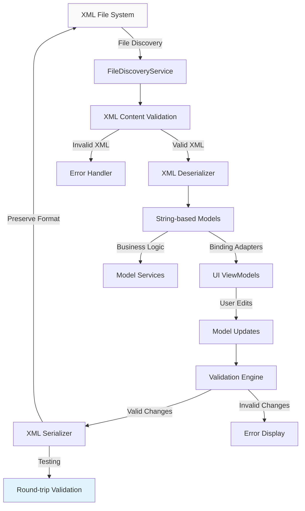
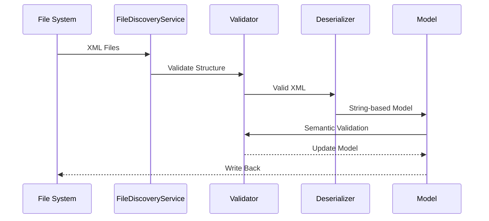
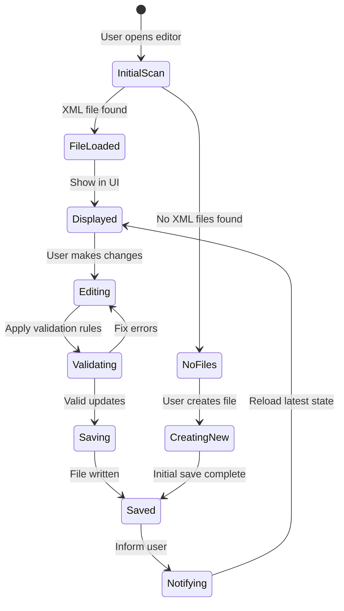

# Data Flow Architecture - XML to C# Model Mapping

## Overview

The Bannerlord Mod Editor implements a comprehensive data flow architecture for seamlessly converting between XML configuration files and strongly-typed C# models while preserving exact XML format fidelity. This architecture handles the unique requirements of game XML processing including attribute presence control, format preservation, and round-trip validation.

## System Architecture

### High-Level Data Flow



## Data Flow Components

### 1. File Discovery and Loading

#### FileDiscoveryService
- **Purpose**: Scans and identifies XML files in Bannerlord directories
- **Output**: List of valid model files with metadata
- **Validation**: File type, structure validation, and integrity checks

```csharp
public class FileDiscoveryResult
{
    public string FilePath { get; set; } = string.Empty;
    public string ModelType { get; set; } = string.Empty;
    public bool IsValid { get; set; }
    public List<string> ValidationErrors { get; } = new();
}
```

#### XML Content Pipeline


### 2. Deserialization Pipeline

#### XML Reading Process
1. **File Access**: Stream reading with UTF-8 encoding
2. **Schema Validation**: Optional XML schema checking
3. **String Processing**: Preserve exact text content
4. **Type Mapping**: Convert XML attributes to string properties
5. **Condition Handling**: Skip missing optional attributes

```csharp
public T DeserializeModel<T>(string xmlContent) where T : class, new()
{
    var serializer = new XmlSerializer(typeof(T));
    using var reader = new StringReader(xmlContent);
    
    return (T)serializer.Deserialize(reader)!;
}
```

#### Deserialization Validation
- **Structural Validation**: XML element presence and hierarchy
- **Attribute Validation**: Required vs optional attribute handling
- **Type Safety**: String conversion with validation
- **Data Integrity**: Check for corrupted or incomplete data

### 3. Model Binding and Processing

#### String-to-Value Conversion
For properties that require validation or business logic processing:

```csharp
public class PhysicsMaterial
{
    [XmlAttribute("id")]
    public string Id { get; set; } = string.Empty;
    
    [XmlAttribute("static_friction")]
    public string? StaticFrictionText { get; set; }
    
    [XmlIgnore]
    public float? StaticFriction => 
        float.TryParse(StaticFrictionText, out var value) ? value : null;
        
    public bool ShouldSerializeStaticFrictionText() => 
        !string.IsNullOrWhiteSpace(StaticFrictionText);
}
```

#### Business Logic Layer
- **Validation Rules**: Check model integrity and business constraints
- **Format Preservation**: Ensure XML format matches original game
- **Cross-Model References**: Handle model dependencies and relationships
- **Performance Optimization**: Minimize memory usage for large files

### 4. User Interface Integration

#### ViewModel Data Binding
```csharp
public class PhysicsMaterialViewModel : ViewModelBase
{
    private readonly PhysicsMaterial _model;
    
    public string DisplayName => _model.Id;
    public string StaticFrictionDisplay => _model.StaticFrictionText ?? "Default";
    public float? StaticFrictionValue => _model.StaticFriction;
    
    public void UpdateModel(string id, string? staticFriction)
    {
        _model.Id = id;
        _model.StaticFrictionText = string.IsNullOrWhiteSpace(staticFriction) ? null : staticFriction;
        
        // Trigger re-validation
        ValidateModel();
    }
}
```

#### Real-time Validation
- **Immediate Feedback**: Validate user input as it's entered
- **Error Prevention**: Prevent invalid data before saving
- **Undo Support**: Maintain change history for rollback
- **Performance**: Asynchronous validation for non-blocking UI

### 5. Serialization and Output

#### XML Generation Process
1. **Model State Capture**: Collect all model changes
2. **Serialization Control**: Apply ShouldSerialize patterns
3. **Format Preservation**: Ensure exact XML structure
4. **File Writing**: Atomic file operations to prevent corruption
5. **Validation**: Verify generated XML integrity

#### Atomic Write Operations
```csharp
public void SaveModel<T>(T model, string filePath) where T : class
{
    var tempFilePath = filePath + ".tmp";
    
    try
    {
        var serializer = new XmlSerializer(typeof(T));
        using var writer = new StreamWriter(tempFilePath, false, new UTF8Encoding(false));
        
        serializer.Serialize(writer, model);
        
        // Atomic file replacement
        File.Move(tempFilePath, filePath, true);
    }
    catch (Exception)
    {
        File.Delete(tempFilePath);
        throw;
    }
}
```

### 6. Testing and Validation Pipeline

#### Round-trip Testing
- **Structure Preservation**: XML hierarchy and attribute order
- **Content Accuracy**: Exact string content preservation
- **Attribute Handling**: Optional vs required attribute behavior
- **Performance**: Ensure reasonable processing time

#### Automated Testing
```csharp
[Test]
public void PhysicsMaterials_RoundTripMaintainsExactStructure()
{
    // Arrange
    var originalXml = LoadXmlFromFile("physics_materials.xml");
    
    // Act
    var model = XmlModelFactory.CreateFromXml<PhysicsMaterials>(originalXml);
    var regeneratedXml = XmlModelFactory.SerializeToString(model);
    
    // Assert
    AssertXmlStructuralEquality(originalXml, regeneratedXml);
}
```

#### Performance Testing
- **Load Testing**: Process large XML files efficiently
- **Memory Profiling**: Ensure no memory leaks or excessive usage
- **Concurrency**: Handle multiple file operations safely
- **Error Recovery**: Graceful handling of corrupted files

## Integration Points

### File System Integration
- **Directory Scanning**: Efficient file discovery with caching
- **File Monitoring**: Watch for external changes
- **Version Control**: Git integration for change tracking
- **Backup System**: Automatic backup before modifications

### Game Integration
- **Mod Directory Support**: Handle both mod and game directories
- **Validation Rules**: Prevent breaking game XML structure
- **Compatibility Checks**: Ensure changes work with the game
- **Conflict Resolution**: Handle multiple mods affecting same files

### UI Workflow Integration

#### User Interaction Flow


## Advanced Features

### Change Tracking System
```csharp
public class XmlChangeTracker
{
    private readonly Dictionary<string, XmlChangeInfo> _changes = new();
    
    public void TrackChange<T>(string filePath, T original, T modified)
    {
        var changeInfo = new XmlChangeInfo
        {
            FilePath = filePath,
            OriginalHash = ComputeHash(original),
            ModifiedHash = ComputeHash(modified),
            Timestamp = DateTime.UtcNow
        };
        
        _changes[filePath] = changeInfo;
    }
}
```

### Batch Processing Support
- **Multiple File Operations**: Process entire directories
- **Bulk Changes**: Apply changes across multiple models
- **Rollback Capabilities**: Undo entire operations
- **Progress Tracking**: Real-time progress indication

### Conflict Detection
- **File Comparison**: Detect external changes
- **Merge Capabilities**: Handle concurrent modifications
- **Warning System**: Alert users to potential conflicts
- **Resolution Options**: Provide manual or automatic resolution

## Security and Safety

### Safe File Operations
- **Read-Only Processing**: Initial file scanning
- **Write Protection**: Prevent accidental overwrites
- **Backup Creation**: Automatic backup for all changes
- **Validation Gates**: Ensure changes won't break the game

### Error Handling Strategy
- **Graceful Degradation**: Continue working with invalid files
- **Detailed Error Reporting**: Clear, actionable error messages
- **Recovery Mechanisms**: Restore from backups automatically
- **Logging**: Comprehensive audit trail of changes

This data flow architecture ensures robust, secure, and performant XML model processing while maintaining complete compatibility with Bannerlord's XML format requirements.