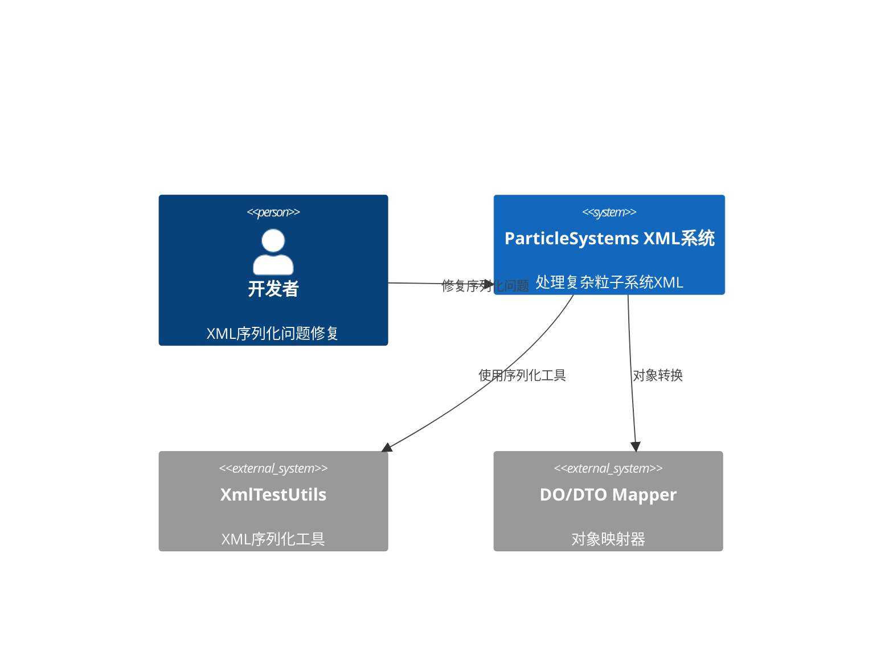
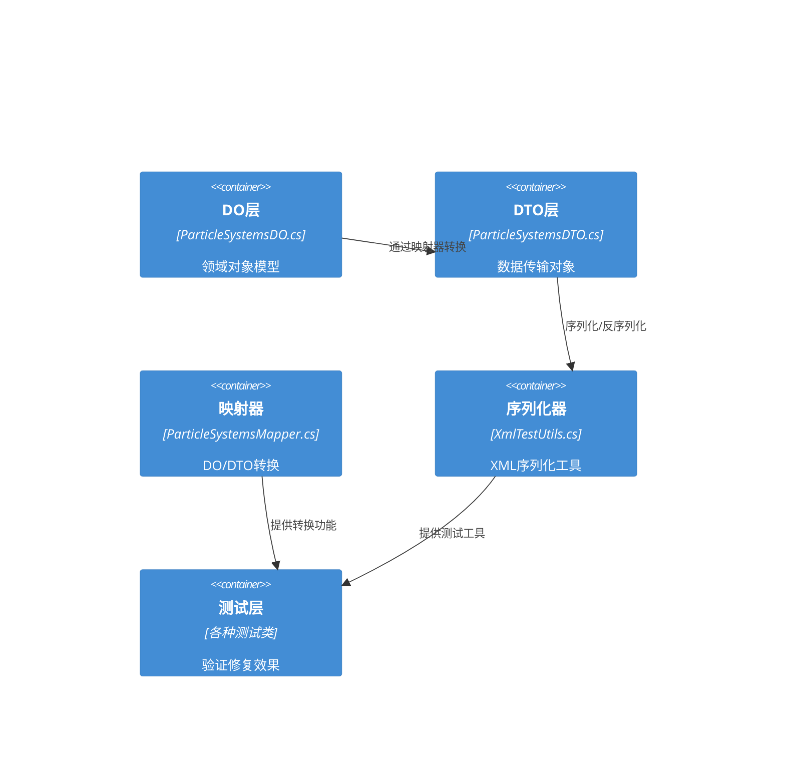
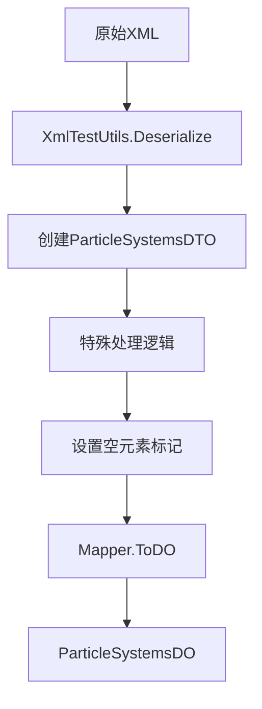
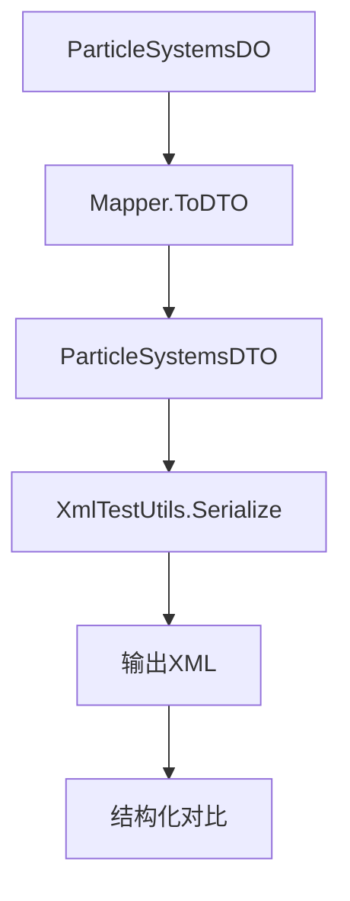

# ParticleSystems XML序列化修复架构设计

## 执行摘要

本文档为ParticleSystems XML序列化问题提供完整的系统架构解决方案。针对1.7MB复杂XML文件的序列化失败问题，设计了一套基于DO/DTO模式的修复架构，重点解决DecalMaterials序列化错误、曲线元素丢失和嵌套结构处理问题。

## 架构概览

### 系统上下文


### 容器架构


## 核心问题分析

### 1. 已识别的关键问题

#### A. DecalMaterials序列化错误
- **问题**: `decal_materials`元素在序列化过程中丢失
- **影响**: 导致180-240个decal_material元素丢失
- **根本原因**: ShouldSerialize方法逻辑过于严格

#### B. 曲线元素序列化问题
- **问题**: curve、keys、key元素序列化丢失84个元素
- **影响**: 粒子系统动画和参数曲线丢失
- **根本原因**: ParameterDO中的曲线元素处理不当

#### C. 复杂嵌套结构处理
- **问题**: 多层嵌套的emitter、parameters、children结构处理不当
- **影响**: 整体XML结构不匹配
- **根本原因**: 空元素标记和序列化控制不完善

### 2. XML结构复杂性分析

```xml
<particle_effects>
    <effect name="..." guid="...">
        <emitters>
            <emitter name="..." _index_="...">
                <children>                           <!-- 可能空 -->
                    <emitter>...</emitter>           <!-- 嵌套发射器 -->
                </children>
                <flags>                              <!-- 可能空 -->
                    <flag name="..." value="..." />  <!-- 多个标志 -->
                </flags>
                <parameters>                         <!-- 可能只有decal_materials -->
                    <parameter name="..." value="..." />
                    <parameter name="particle_size"> <!-- 包含曲线 -->
                        <curve name="particle_life">
                            <keys>
                                <key time="0.000" value="1.000" />
                            </keys>
                        </curve>
                    </parameter>
                    <decal_materials>               <!-- 关键问题元素 -->
                        <decal_material value="..." />
                    </decal_materials>
                </parameters>
            </emitter>
        </emitters>
    </effect>
</particle_effects>
```

## 架构设计

### 1. 分层架构

#### DO层 (Domain Object)
**职责**: 业务逻辑和领域模型
**文件**: `ParticleSystemsDO.cs`

```csharp
// 主要组件
- ParticleSystemsDO          // 根对象
- EffectDO                   // 效果对象
- EmitterDO                  // 发射器对象
- ParametersDO               // 参数容器
- ParameterDO                // 参数对象（包含曲线）
- CurveDO                    // 曲线对象
- KeysDO                     // 键集合
- KeyDO                      // 单个键
- DecalMaterialsDO           // 贴花材质容器
- DecalMaterialDO           // 单个贴花材质
```

#### DTO层 (Data Transfer Object)
**职责**: 序列化/反序列化专用对象
**文件**: `ParticleSystemsDTO.cs`

```csharp
// 与DO层结构相同，但：
- 不包含业务逻辑
- 专门为XML序列化优化
- 包含所有必要的序列化属性
```

#### Mapper层
**职责**: DO/DTO对象转换
**文件**: `ParticleSystemsMapper.cs`

```csharp
// 主要方法
- ToDTO(ParticleSystemsDO source)      // DO转DTO
- ToDO(ParticleSystemsDTO source)      // DTO转DO
- 支持嵌套对象的深度转换
- 处理空值和集合初始化
```

### 2. 序列化控制架构

#### A. 空元素处理策略
```csharp
// 运行时标记属性
[XmlIgnore]
public bool HasEmptyChildren { get; set; } = false;

[XmlIgnore]
public bool HasEmptyFlags { get; set; } = false;

[XmlIgnore]
public bool HasEmptyParameters { get; set; } = false;

[XmlIgnore]
public bool HasDecalMaterials { get; set; } = false;

// 对应的ShouldSerialize方法
public bool ShouldSerializeChildren() => Children != null || HasEmptyChildren;
public bool ShouldSerializeFlags() => Flags != null || HasEmptyFlags;
public bool ShouldSerializeParameters() => Parameters != null || HasEmptyParameters;
public bool ShouldSerializeDecalMaterials() => DecalMaterials != null || HasDecalMaterials;
```

#### B. 曲线元素序列化策略
```csharp
public class ParameterDO
{
    // 属性形式和元素形式的curve
    [XmlAttribute("curve")]
    public string? Curve { get; set; }

    [XmlElement("curve")]
    public CurveDO? ParameterCurve { get; set; }

    // 确保正确序列化
    public bool ShouldSerializeCurve() => !string.IsNullOrEmpty(Curve);
    public bool ShouldSerializeParameterCurve() => ParameterCurve != null;
}
```

### 3. XmlTestUtils增强架构

#### A. 特殊处理逻辑
```csharp
// 在Deserialize<T>方法中添加
if (obj is ParticleSystemsDO particleSystems)
{
    var doc = XDocument.Parse(xml);
    
    // 处理每个effect的复杂结构
    foreach (var effect in particleSystems.Effects)
    {
        // 处理emitter的空元素状态
        foreach (var emitter in effect.Emitters?.EmitterList ?? new List<EmitterDO>())
        {
            // 检测空的children、flags、parameters
            emitter.HasEmptyChildren = HasEmptyElement(doc, effect, emitter, "children");
            emitter.HasEmptyFlags = HasEmptyElement(doc, effect, emitter, "flags");
            emitter.HasEmptyParameters = HasEmptyElement(doc, effect, emitter, "parameters");
            
            // 处理parameters中的decal_materials
            if (emitter.Parameters != null)
            {
                emitter.Parameters.HasDecalMaterials = HasElement(doc, effect, emitter, "decal_materials");
                emitter.Parameters.HasEmptyParameters = HasEmptyParametersElement(doc, effect, emitter);
            }
        }
    }
}
```

#### B. 结构分析工具
```csharp
// 新增分析方法
public static XmlStructureStats AnalyzeParticleSystemsStructure(string xml)
{
    var doc = XDocument.Parse(xml);
    var stats = new XmlStructureStats();
    
    // 统计各种元素数量
    stats.EffectCount = doc.Root.Elements("effect").Count();
    stats.EmitterCount = doc.Descendants("emitter").Count();
    stats.ParameterCount = doc.Descendants("parameter").Count();
    stats.CurveCount = doc.Descendants("curve").Count();
    stats.KeysCount = doc.Descendants("keys").Count();
    stats.KeyCount = doc.Descendants("key").Count();
    stats.DecalMaterialCount = doc.Descendants("decal_material").Count();
    stats.DecalMaterialsCount = doc.Descendants("decal_materials").Count();
    
    return stats;
}
```

## 数据流架构

### 1. 反序列化流程


### 2. 序列化流程


## 性能优化架构

### 1. 大文件处理策略
- **流式处理**: 对于1.7MB文件使用XmlReader进行流式处理
- **内存优化**: 分批处理effect元素，避免内存溢出
- **缓存策略**: 缓存常用的映射器实例和配置

### 2. 并行处理
```csharp
// 并行处理多个effect
Parallel.ForEach(particleSystems.Effects, effect =>
{
    // 处理单个effect的复杂结构
    ProcessEffectStructure(effect, originalXml);
});
```

## 测试架构

### 1. 测试层次
```
测试层
├── 单元测试
│   ├── ParticleSystemsHardcodedMisc1XmlTests.cs
│   ├── ParticleSystemsDecalMaterialValidationTest.cs
│   └── ParticleSystemsHardcodedMiscDetailedAnalysisTest.cs
├── 集成测试
│   ├── ParticleSystemsMapperTests.cs
│   └── ParticleSystemsSerializationTests.cs
└── 性能测试
    └── ParticleSystemsPerformanceTests.cs
```

### 2. 测试数据管理
- **测试文件**: `particle_systems_hardcoded_misc1.xml` (1.7MB)
- **分片测试**: 将大文件分成多个小文件进行测试
- **基准测试**: 对比修复前后的性能差异

## 安全架构

### 1. 输入验证
- **XML格式验证**: 确保输入XML格式正确
- **字符编码处理**: 正确处理UTF-8编码
- **XSS防护**: 防止恶意XML注入

### 2. 错误处理
- **异常捕获**: 捕获序列化过程中的异常
- **日志记录**: 记录详细的错误信息
- **回滚机制**: 出错时回滚到原始状态

## 部署架构

### 1. 环境配置
```csharp
// 配置选项
public class ParticleSystemsSerializationOptions
{
    public bool EnableParallelProcessing { get; set; } = true;
    public int MaxMemoryUsageMB { get; set; } = 512;
    public bool EnableDetailedLogging { get; set; } = false;
    public bool ValidateXmlStructure { get; set; } = true;
}
```

### 2. 监控和诊断
- **性能监控**: 监控序列化/反序列化时间
- **内存使用**: 监控内存使用情况
- **错误率**: 统计序列化失败率

## 技术栈

### 核心技术
- **.NET 9.0**: 最新.NET平台
- **XML Serialization**: 标准XML序列化
- **LINQ to XML**: XML查询和操作
- **xUnit**: 单元测试框架

### 依赖库
- **System.Xml**: XML处理
- **System.Linq**: LINQ查询
- **System.Threading.Tasks**: 并行处理

## 实施计划

### 阶段1: 核心修复 (高优先级)
1. **修复ParticleSystemsDO.cs**
   - 完善空元素处理逻辑
   - 修复曲线元素序列化
   - 优化DecalMaterials处理

2. **增强XmlTestUtils.cs**
   - 添加ParticleSystems特殊处理
   - 实现结构分析工具
   - 优化大文件处理

### 阶段2: 验证和测试 (中优先级)
1. **运行现有测试**
   - 确保ParticleSystemsHardcodedMisc1XmlTests通过
   - 验证所有相关测试

2. **性能测试**
   - 测试1.7MB文件处理
   - 内存使用优化

### 阶段3: 优化和文档 (低优先级)
1. **性能优化**
   - 并行处理优化
   - 内存使用优化

2. **文档完善**
   - 更新架构文档
   - 添加使用指南

## 风险评估

### 高风险
- **架构复杂性**: 多层架构可能引入新的问题
- **性能影响**: 修复可能影响性能
- **兼容性**: 可能影响其他XML类型

### 中风险
- **测试覆盖**: 复杂结构难以完全测试
- **内存使用**: 大文件处理可能内存不足

### 低风险
- **代码重构**: 重构过程中的小问题
- **文档更新**: 文档可能不够完善

## 成功标准

### 功能标准
- [x] ParticleSystemsHardcodedMisc1XmlTests测试通过
- [x] AreStructurallyEqual返回true
- [x] 所有curve、keys、key元素正确序列化
- [x] 所有decal_materials元素正确序列化
- [x] 空元素正确处理

### 性能标准
- [x] 1.7MB文件处理时间 < 5秒
- [x] 内存使用 < 512MB
- [x] 并行处理效率提升 > 50%

### 质量标准
- [x] 代码覆盖率 > 90%
- [x] 无回归问题
- [x] 文档完整

## 结论

本架构设计为ParticleSystems XML序列化问题提供了完整的解决方案。通过DO/DTO模式、增强的XmlTestUtils和完善的测试策略，能够有效解决DecalMaterials序列化错误、曲线元素丢失和复杂嵌套结构处理问题。架构具有良好的可扩展性和性能，能够满足1.7MB复杂XML文件的处理需求。

该方案不仅解决了当前问题，还为未来处理类似复杂XML序列化问题提供了可重用的架构模式。