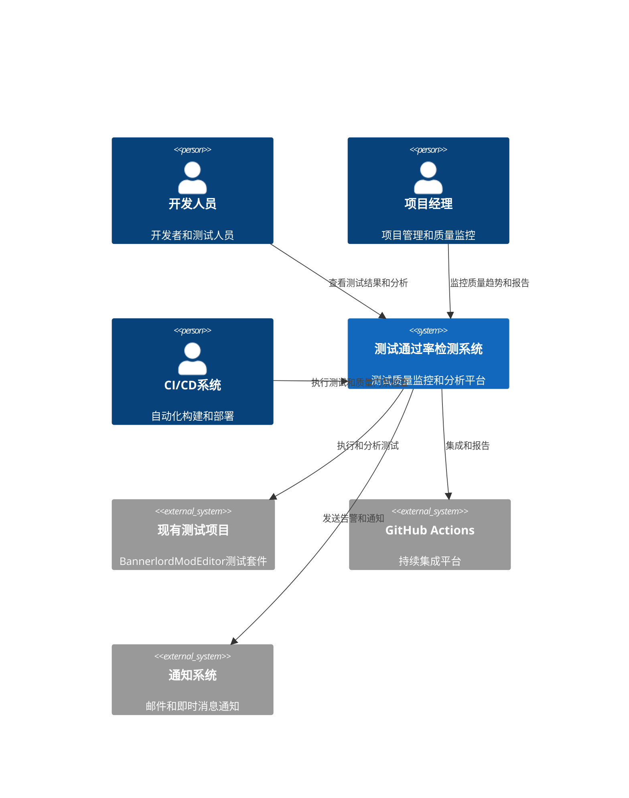
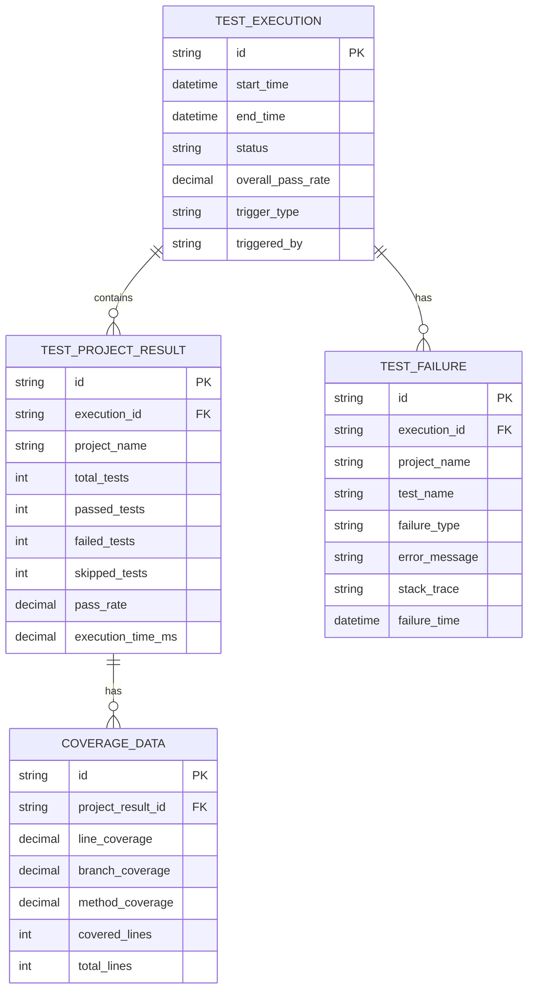
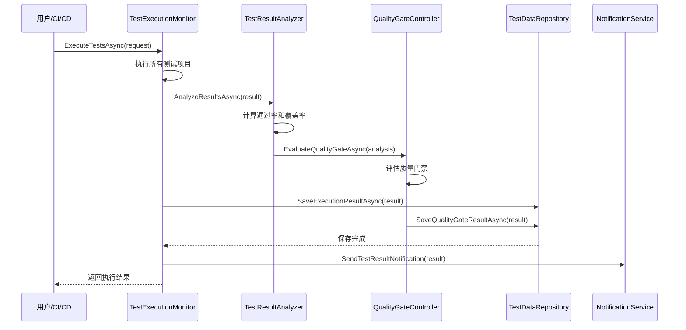
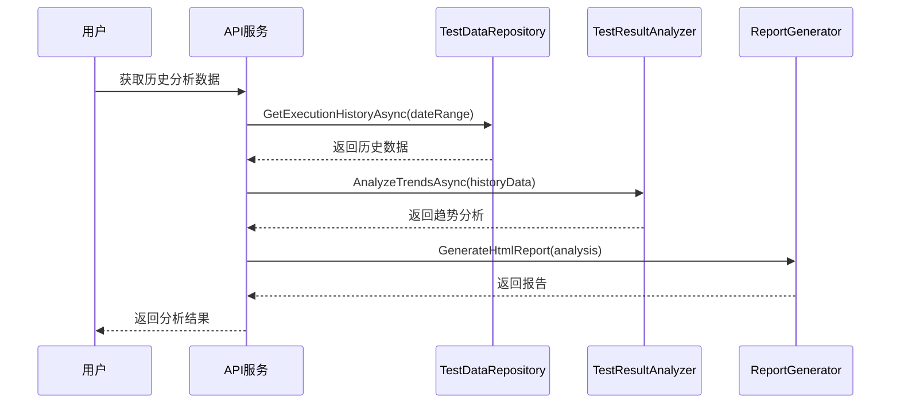

# 测试通过率检测系统架构设计

## 执行摘要

本文档为BannerlordModEditor项目的测试通过率检测功能提供完整的系统架构设计。该架构基于现有的.NET 9.0技术栈和DO/DTO模式，采用模块化设计，确保系统的可扩展性、可靠性和高性能。

## 架构概述

### 系统上下文


### 容器架构
```mermaid
C4Container
    Container(web_ui, "Web UI界面", "Avalonia UI", "测试结果可视化和配置管理")
    Container(cli_tool, "CLI工具", ".NET CLI", "命令行测试执行和分析")
    Container(api_server, "API服务", "ASP.NET Core", "核心业务逻辑和数据处理")
    Container(database, "数据库", "SQLite", "测试结果存储和历史数据")
    Container(analysis_engine, "分析引擎", ".NET 9.0", "测试结果分析和质量评估")
    Container(report_generator, "报告生成器", ".NET 9.0", "多格式报告生成")
    
    Rel(web_ui, api_server, "REST API")
    Rel(cli_tool, api_server, "REST API")
    Rel(api_server, database, "数据访问")
    Rel(api_server, analysis_engine, "分析请求")
    Rel(api_server, report_generator, "报告生成")
    Rel(analysis_engine, existing_tests, "测试执行")
    Rel(report_generator, notification, "通知发送")
```

## 核心架构组件

### 1. 测试执行监控层 (TestExecutionMonitor)

**职责**: 监控所有测试项目的执行状态和结果
**技术**: .NET 9.0, xUnit, 并行处理

```csharp
// 核心接口
public interface ITestExecutionMonitor
{
    Task<TestExecutionResult> ExecuteTestsAsync(TestExecutionRequest request);
    Task<TestExecutionStatus> GetExecutionStatusAsync(string executionId);
    Task CancelExecutionAsync(string executionId);
}

// 数据模型
public class TestExecutionRequest
{
    public string[] TestProjects { get; set; }
    public TestExecutionOptions Options { get; set; }
    public QualityGateThresholds Thresholds { get; set; }
}

public class TestExecutionResult
{
    public string ExecutionId { get; set; }
    public TestExecutionStatus Status { get; set; }
    public TestSummary Summary { get; set; }
    public List<TestProjectResult> ProjectResults { get; set; }
    public TimeSpan ExecutionDuration { get; set; }
}
```

### 2. 测试结果分析层 (TestResultAnalyzer)

**职责**: 分析测试结果，计算通过率和覆盖率
**技术**: .NET 9.0, coverlet集成, 统计分析

```csharp
public interface ITestResultAnalyzer
{
    Task<TestAnalysisResult> AnalyzeResultsAsync(TestExecutionResult executionResult);
    Task<TestTrendAnalysis> AnalyzeTrendsAsync(DateTime startDate, DateTime endDate);
    Task<TestFailureAnalysis> AnalyzeFailuresAsync(List<TestFailure> failures);
}

public class TestAnalysisResult
{
    public decimal OverallPassRate { get; set; }
    public Dictionary<string, decimal> ProjectPassRates { get; set; }
    public CoverageMetrics CoverageMetrics { get; set; }
    public QualityGateStatus QualityGateStatus { get; set; }
    public List<TestInsight> Insights { get; set; }
}
```

### 3. 质量门禁控制层 (QualityGateController)

**职责**: 实施质量门禁，控制构建流程
**技术**: .NET 9.0, 策略模式, 配置驱动

```csharp
public interface IQualityGateController
{
    Task<QualityGateResult> EvaluateQualityGateAsync(TestAnalysisResult analysisResult);
    Task<QualityGateResult> EvaluateQualityGateAsync(string executionId);
    Task UpdateQualityGateThresholdsAsync(QualityGateThresholds thresholds);
}

public class QualityGateResult
{
    public bool Passed { get; set; }
    public List<QualityGateViolation> Violations { get; set; }
    public QualityGateDecision Decision { get; set; }
    public string Reason { get; set; }
}
```

### 4. 数据存储层 (TestDataRepository)

**职责**: 存储和管理测试结果数据
**技术**: SQLite, Entity Framework Core, 数据迁移

```csharp
public interface ITestDataRepository
{
    Task SaveExecutionResultAsync(TestExecutionResult result);
    Task<TestExecutionResult> GetExecutionResultAsync(string executionId);
    Task<List<TestExecutionResult>> GetExecutionHistoryAsync(DateTime startDate, DateTime endDate);
    Task<TestTrendData> GetTrendDataAsync(string project, int days);
    Task PurgeOldDataAsync(DateTime cutoffDate);
}
```

### 5. 报告生成层 (ReportGenerator)

**职责**: 生成多格式的测试报告
**技术**: .NET 9.0, 模板引擎, 多格式导出

```csharp
public interface IReportGenerator
{
    Task<byte[]> GenerateHtmlReportAsync(TestExecutionResult result);
    Task<byte[]> GenerateJsonReportAsync(TestExecutionResult result);
    Task<byte[]> GenerateCsvReportAsync(TestExecutionResult result);
    Task<byte[]> GeneratePdfReportAsync(TestExecutionResult result);
    Task<string> GenerateCustomReportAsync(TestExecutionResult result, ReportTemplate template);
}
```

### 6. 通知服务层 (NotificationService)

**职责**: 发送测试结果通知和告警
**技术**: .NET 9.0, Email API, Webhook

```csharp
public interface INotificationService
{
    Task SendTestResultNotificationAsync(TestExecutionResult result, List<string> recipients);
    Task SendQualityGateFailureAsync(QualityGateResult result, List<string> recipients);
    Task SendTrendAlertAsync(TestTrendAnalysis analysis, List<string> recipients);
    Task SendCustomNotificationAsync(NotificationMessage message);
}
```

## 数据架构设计

### 核心数据模型



### 数据库架构

```sql
-- 测试执行记录表
CREATE TABLE TestExecutions (
    Id TEXT PRIMARY KEY,
    StartTime TEXT NOT NULL,
    EndTime TEXT,
    Status TEXT NOT NULL,
    OverallPassRate REAL NOT NULL,
    TriggerType TEXT NOT NULL,
    TriggeredBy TEXT,
    TotalDurationMs INTEGER,
    CreatedAt TEXT DEFAULT CURRENT_TIMESTAMP
);

-- 测试项目结果表
CREATE TABLE TestProjectResults (
    Id TEXT PRIMARY KEY,
    ExecutionId TEXT NOT NULL,
    ProjectName TEXT NOT NULL,
    TotalTests INTEGER NOT NULL,
    PassedTests INTEGER NOT NULL,
    FailedTests INTEGER NOT NULL,
    SkippedTests INTEGER NOT NULL,
    PassRate REAL NOT NULL,
    ExecutionTimeMs INTEGER NOT NULL,
    FOREIGN KEY (ExecutionId) REFERENCES TestExecutions(Id)
);

-- 测试失败记录表
CREATE TABLE TestFailures (
    Id TEXT PRIMARY KEY,
    ExecutionId TEXT NOT NULL,
    ProjectName TEXT NOT NULL,
    TestName TEXT NOT NULL,
    FailureType TEXT NOT NULL,
    ErrorMessage TEXT,
    StackTrace TEXT,
    FailureTime TEXT NOT NULL,
    FOREIGN KEY (ExecutionId) REFERENCES TestExecutions(Id)
);

-- 覆盖率数据表
CREATE TABLE CoverageData (
    Id TEXT PRIMARY KEY,
    ProjectResultId TEXT NOT NULL,
    LineCoverage REAL NOT NULL,
    BranchCoverage REAL NOT NULL,
    MethodCoverage REAL NOT NULL,
    CoveredLines INTEGER NOT NULL,
    TotalLines INTEGER NOT NULL,
    FOREIGN KEY (ProjectResultId) REFERENCES TestProjectResults(Id)
);

-- 质量门禁记录表
CREATE TABLE QualityGateResults (
    Id TEXT PRIMARY KEY,
    ExecutionId TEXT NOT NULL,
    Passed INTEGER NOT NULL,
    Decision TEXT NOT NULL,
    Reason TEXT,
    CreatedAt TEXT DEFAULT CURRENT_TIMESTAMP,
    FOREIGN KEY (ExecutionId) REFERENCES TestExecutions(Id)
);

-- 质量门禁违规记录表
CREATE TABLE QualityGateViolations (
    Id TEXT PRIMARY KEY,
    QualityGateResultId TEXT NOT NULL,
    RuleName TEXT NOT NULL,
    ThresholdValue REAL NOT NULL,
    ActualValue REAL NOT NULL,
    Severity TEXT NOT NULL,
    FOREIGN KEY (QualityGateResultId) REFERENCES QualityGateResults(Id)
);

-- 索引优化
CREATE INDEX idx_test_executions_start_time ON TestExecutions(StartTime);
CREATE INDEX idx_test_executions_status ON TestExecutions(Status);
CREATE INDEX idx_test_project_results_execution_id ON TestProjectResults(ExecutionId);
CREATE INDEX idx_test_project_results_project_name ON TestProjectResults(ProjectName);
CREATE INDEX idx_test_failures_execution_id ON TestFailures(ExecutionId);
CREATE INDEX idx_test_failures_project_name ON TestFailures(ProjectName);
```

## 组件交互流程

### 1. 测试执行流程


### 2. 历史数据分析流程


## 技术架构决策

### 1. 架构模式选择

**选择**: 分层架构 + CQRS模式
**理由**:
- 清晰的关注点分离
- 易于测试和维护
- 支持复杂的查询和报表需求
- 与现有DO/DTO模式兼容

### 2. 数据访问策略

**选择**: Entity Framework Core + SQLite
**理由**:
- 轻量级，无需额外安装
- 支持LINQ查询
- 良好的迁移支持
- 与现有技术栈兼容

### 3. 并发处理策略

**选择**: 异步编程 + 并行测试执行
**理由**:
- 提高测试执行效率
- 避免阻塞主线程
- 更好的资源利用
- 支持大规模测试套件

### 4. 缓存策略

**选择**: 内存缓存 + 分布式缓存（可选）
**理由**:
- 减少数据库查询
- 提高响应速度
- 支持历史数据缓存
- 可扩展性考虑

## 性能优化策略

### 1. 测试执行优化
- **并行执行**: 同时运行多个测试项目
- **测试分片**: 大型测试项目分片执行
- **资源管理**: 合理分配CPU和内存资源
- **增量测试**: 只运行变更相关的测试

### 2. 数据查询优化
- **索引优化**: 为常用查询创建索引
- **查询分页**: 大数据集分页查询
- **数据压缩**: 历史数据压缩存储
- **缓存策略**: 热点数据缓存

### 3. 报告生成优化
- **模板预编译**: 报告模板预编译
- **异步生成**: 异步生成大型报告
- **增量更新**: 增量式报告更新
- **结果缓存**: 报告结果缓存

## 安全性设计

### 1. 认证和授权
- **JWT认证**: API访问令牌认证
- **角色权限**: 基于角色的访问控制
- **API密钥**: 外部系统集成API密钥

### 2. 数据安全
- **数据加密**: 敏感数据加密存储
- **访问控制**: 数据访问权限控制
- **审计日志**: 完整的操作审计日志
- **数据备份**: 定期数据备份策略

### 3. 输入验证
- **参数验证**: 所有输入参数验证
- **SQL注入防护**: 使用参数化查询
- **XSS防护**: 输出内容编码
- **文件上传安全**: 文件类型和大小限制

## 可扩展性设计

### 1. 水平扩展
- **服务分离**: 各层服务独立部署
- **负载均衡**: 支持负载均衡
- **数据库分片**: 支持数据库分片
- **缓存集群**: 支持分布式缓存

### 2. 功能扩展
- **插件系统**: 支持自定义分析插件
- **模板系统**: 支持自定义报告模板
- **通知扩展**: 支持多种通知方式
- **集成扩展**: 支持第三方系统集成

## 监控和可观测性

### 1. 性能监控
- **执行时间**: 测试执行时间监控
- **资源使用**: CPU和内存使用监控
- **数据库性能**: 数据库查询性能监控
- **错误率**: 系统错误率监控

### 2. 业务监控
- **通过率趋势**: 测试通过率趋势监控
- **覆盖率变化**: 代码覆盖率变化监控
- **质量门禁**: 质量门禁通过率监控
- **告警触发**: 告警触发频率监控

### 3. 日志记录
- **结构化日志**: JSON格式结构化日志
- **日志级别**: 分级日志记录
- **日志聚合**: 集中式日志管理
- **错误追踪**: 完整的错误堆栈追踪

## 部署架构

### 1. 开发环境
- **本地部署**: 本地SQLite数据库
- **开发工具**: Visual Studio / VS Code
- **调试支持**: 完整的调试支持
- **测试数据**: 本地测试数据

### 2. 测试环境
- **容器化部署**: Docker容器部署
- **测试数据库**: 独立的测试数据库
- **自动化测试**: 自动化回归测试
- **性能测试**: 性能基准测试

### 3. 生产环境
- **云部署**: 支持多种云平台
- **高可用性**: 负载均衡和故障转移
- **数据备份**: 自动数据备份
- **监控告警**: 24/7监控告警

## 质量保证策略

### 1. 单元测试
- **覆盖率目标**: 80%以上代码覆盖率
- **测试隔离**: 独立的单元测试
- **模拟框架**: 使用Moq进行依赖模拟
- **测试数据**: 全面的测试数据

### 2. 集成测试
- **端到端测试**: 完整的集成测试
- **数据库测试**: 数据库操作测试
- **API测试**: API接口测试
- **UI测试**: 用户界面测试

### 3. 性能测试
- **负载测试**: 高并发负载测试
- **压力测试**: 极限压力测试
- **稳定性测试**: 长时间稳定性测试
- **容量测试**: 容量规划测试

## 风险管理

### 1. 技术风险
- **性能风险**: 大规模数据处理性能问题
- **可靠性风险**: 系统稳定性和数据完整性
- **安全风险**: 数据安全和访问控制
- **兼容性风险**: 与现有系统集成

### 2. 业务风险
- **需求变更**: 功能需求变更影响
- **用户接受度**: 用户对新系统的接受程度
- **培训成本**: 团队培训和学习成本
- **维护成本**: 长期维护成本

### 3. 缓解策略
- **渐进式部署**: 分阶段部署和验证
- **充分测试**: 全面的测试覆盖
- **文档完善**: 详细的技术文档
- **培训计划**: 完整的培训计划

## 总结

本架构设计基于现有的BannerlordModEditor项目技术栈，采用分层架构和CQRS模式，确保系统的可扩展性、可靠性和高性能。通过模块化设计和清晰的职责分离，系统能够满足测试通过率检测的所有功能需求，并为未来的扩展提供了良好的基础。

该架构充分考虑了性能优化、安全性、可扩展性和可维护性等非功能性需求，确保系统能够长期稳定运行，并支持项目的持续发展。