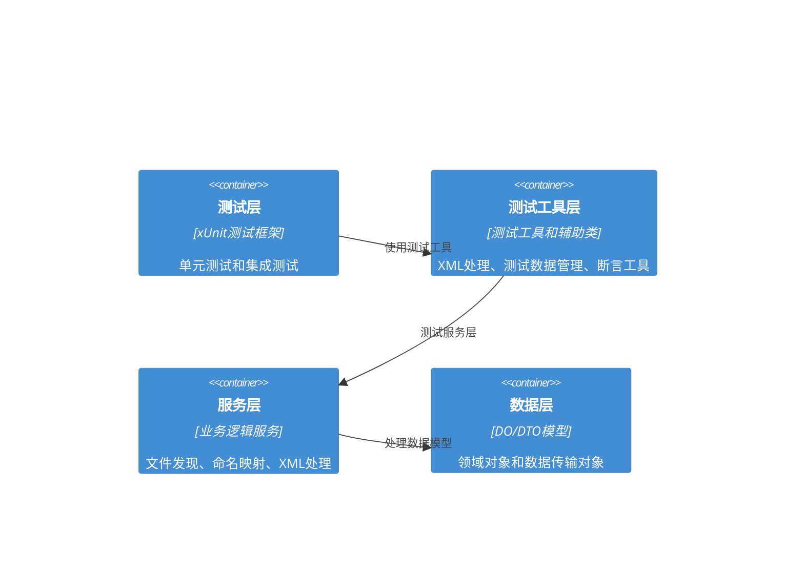

# 单元测试修复架构设计

## 执行摘要

本文档详细描述了针对BannerlordModEditor项目中单元测试失败问题的修复架构设计方案。通过深入分析测试失败的根本原因，我们设计了一套完整的修复方案，包括架构改进、重构策略、测试数据管理、异步处理优化和错误处理机制。

## 问题分析

### 核心问题识别

1. **XML序列化往返测试失败**
   - 空元素处理不当导致序列化结果与原始XML不匹配
   - ShouldSerialize方法逻辑错误，无法正确控制序列化行为
   - 特殊元素（如`<base>`）的格式处理不一致

2. **异步操作时序问题**
   - 异步方法缺乏适当的等待和错误处理
   - Task.Run使用不当，可能导致死锁或资源竞争
   - 异步测试方法缺乏超时控制

3. **测试数据管理问题**
   - 硬编码测试数据路径，跨环境兼容性差
   - 测试数据生成逻辑分散，难以维护
   - 缺乏测试数据版本控制和依赖管理

4. **错误处理机制不完善**
   - 异常捕获和恢复机制不足
   - 错误信息不够详细，难以调试
   - 缺乏断言失败时的上下文信息

### 技术债务分析

- **XML处理复杂性**: 当前架构中XML序列化逻辑过于复杂，缺乏抽象
- **测试耦合度过高**: 测试代码与具体实现耦合过紧，难以维护
- **缺乏统一标准**: 不同测试类采用不同的错误处理和验证模式

## 修复架构设计

### 1. 整体架构优化

#### 1.1 分层架构改进



#### 1.2 新增核心组件

**测试工具层 (TestUtils)**
- `XmlTestHelper`: 统一的XML测试处理工具
- `TestDataManager`: 测试数据生成和管理
- `AssertionHelper`: 增强的断言和验证工具
- `TestEnvironmentManager`: 测试环境配置和管理

**服务层增强**
- `IEnhancedXmlLoader`: 增强的XML加载接口
- `TestFileDiscoveryService`: 专门的测试文件发现服务
- `XmlSerializationService`: 专门的XML序列化服务

### 2. XML处理优化

#### 2.1 增强的XML处理服务

```csharp
public interface IEnhancedXmlLoader<T> where T : class
{
    Task<T?> LoadAsync(string filePath, XmlLoadOptions? options = null);
    Task<string> SaveToStringAsync(T data, XmlSaveOptions? options = null);
    Task<XmlValidationResult> ValidateAsync(T data, XmlValidationOptions? options = null);
    Task<bool> AreStructurallyEqualAsync(T obj1, T obj2, XmlComparisonOptions? options = null);
}

public class XmlLoadOptions
{
    public bool PreserveWhitespace { get; set; } = true;
    public bool HandleEmptyElements { get; set; } = true;
    public bool NormalizeLineEndings { get; set; } = true;
    public XmlEncodingHandling EncodingHandling { get; set; } = XmlEncodingHandling.PreserveOriginal;
}

public class XmlSaveOptions
{
    public bool PreserveOriginalFormat { get; set; } = true;
    public bool HandleEmptyElements { get; set; } = true;
    public bool NormalizeNamespaces { get; set; } = true;
    public string? OriginalXml { get; set; }
}
```

#### 2.2 空元素处理策略

```csharp
public class EmptyElementHandler
{
    public static void ProcessEmptyElements<T>(T obj, XDocument originalDoc)
    {
        // 统一的空元素处理逻辑
        var emptyElementDetectors = new List<IEmptyElementDetector<T>>
        {
            new CombatParametersEmptyElementDetector(),
            new ItemHolstersEmptyElementDetector(),
            new TerrainMaterialsEmptyElementDetector(),
            // 其他探测器...
        };

        foreach (var detector in emptyElementDetectors)
        {
            detector.DetectAndMarkEmptyElements(obj, originalDoc);
        }
    }
}

public interface IEmptyElementDetector<T>
{
    bool CanHandle(T obj);
    void DetectAndMarkEmptyElements(T obj, XDocument originalDoc);
}
```

#### 2.3 XML标准化处理

```csharp
public class XmlNormalizer
{
    public static string NormalizeForComparison(string xml, XmlNormalizationOptions options)
    {
        var doc = XDocument.Parse(xml, LoadOptions.PreserveWhitespace);
        
        // 1. 处理空白字符
        if (options.IgnoreWhitespace)
        {
            NormalizeWhitespace(doc);
        }
        
        // 2. 处理属性顺序
        if (options.NormalizeAttributeOrder)
        {
            NormalizeAttributeOrder(doc);
        }
        
        // 3. 处理布尔值
        if (options.NormalizeBooleanValues)
        {
            NormalizeBooleanValues(doc);
        }
        
        // 4. 处理自闭合标签
        if (options.NormalizeSelfClosingTags)
        {
            NormalizeSelfClosingTags(doc);
        }
        
        // 5. 特殊处理base元素
        NormalizeBaseElementFormat(doc);
        
        return SerializeNormalized(doc, options);
    }
}
```

### 3. 异步处理优化

#### 3.1 异步操作时序管理

```csharp
public class AsyncOperationManager
{
    private readonly SemaphoreSlim _semaphore;
    private readonly ILogger<AsyncOperationManager> _logger;
    
    public AsyncOperationManager(int maxConcurrentOperations = 4)
    {
        _semaphore = new SemaphoreSlim(maxConcurrentOperations);
        _logger = new Logger<AsyncOperationManager>();
    }
    
    public async Task<T> ExecuteWithTimeoutAsync<T>(
        Func<Task<T>> operation,
        TimeSpan timeout,
        string operationName)
    {
        using var cts = new CancellationTokenSource(timeout);
        
        try
        {
            await _semaphore.WaitAsync(cts.Token);
            
            _logger.LogInformation("开始异步操作: {OperationName}", operationName);
            
            var result = await operation().WithCancellation(cts.Token);
            
            _logger.LogInformation("异步操作完成: {OperationName}", operationName);
            
            return result;
        }
        catch (OperationCanceledException)
        {
            _logger.LogWarning("异步操作超时: {OperationName}", operationName);
            throw new TimeoutException($"异步操作超时: {operationName}");
        }
        catch (Exception ex)
        {
            _logger.LogError(ex, "异步操作失败: {OperationName}", operationName);
            throw;
        }
        finally
        {
            _semaphore.Release();
        }
    }
}
```

#### 3.2 异步测试辅助工具

```csharp
public static class AsyncTestHelper
{
    public static async Task<T> ShouldCompleteWithinAsync<T>(
        this Task<T> task,
        TimeSpan timeout,
        string because = "")
    {
        var completedTask = await Task.WhenAny(task, Task.Delay(timeout));
        
        if (completedTask == task)
        {
            return await task;
        }
        
        throw new AssertFailedException($"异步操作未在 {timeout} 内完成. {because}");
    }
    
    public static async Task ShouldThrowAsync<T>(
        Func<Task> action,
        string because = "",
        params object[] becauseArgs)
        where T : Exception
    {
        try
        {
            await action();
            throw new AssertFailedException($"期望抛出 {typeof(T).Name} 但没有抛出. {because}");
        }
        catch (T)
        {
            // 期望的异常
        }
        catch (Exception ex)
        {
            throw new AssertFailedException($"期望抛出 {typeof(T).Name} 但抛出了 {ex.GetType().Name}. {because}");
        }
    }
}
```

### 4. 测试数据管理

#### 4.1 测试数据管理器

```csharp
public class TestDataManager
{
    private readonly IConfiguration _configuration;
    private readonly ITestOutputHelper _outputHelper;
    private readonly Dictionary<string, object> _ testDataCache = new();
    
    public TestDataManager(IConfiguration configuration, ITestOutputHelper outputHelper)
    {
        _configuration = configuration;
        _outputHelper = outputHelper;
    }
    
    public string GetTestDataPath(string testDataName)
    {
        var basePath = _configuration["TestData:BasePath"] ?? 
                      Path.Combine(Directory.GetCurrentDirectory(), "..", "..", "..", "TestData");
        
        var testDataPath = Path.Combine(basePath, testDataName);
        
        if (!File.Exists(testDataPath))
        {
            _outputHelper.WriteLine($"警告: 测试数据文件不存在: {testDataPath}");
            return testDataPath;
        }
        
        return testDataPath;
    }
    
    public T LoadTestData<T>(string testDataName) where T : class
    {
        var cacheKey = $"{typeof(T).Name}_{testDataName}";
        
        if (_testDataCache.TryGetValue(cacheKey, out var cachedData))
        {
            return (T)cachedData;
        }
        
        var filePath = GetTestDataPath(testDataName);
        var content = File.ReadAllText(filePath);
        
        var data = XmlTestUtils.Deserialize<T>(content);
        
        _testDataCache[cacheKey] = data;
        
        return data;
    }
    
    public void GenerateTestData(string templateName, Dictionary<string, string> replacements, string outputPath)
    {
        var templatePath = GetTestDataPath($"Templates/{templateName}");
        var template = File.ReadAllText(templatePath);
        
        var content = TestTemplateGenerator.Generate(template, replacements);
        
        Directory.CreateDirectory(Path.GetDirectoryName(outputPath));
        File.WriteAllText(outputPath, content);
    }
}
```

#### 4.2 测试数据生成器

```csharp
public static class TestTemplateGenerator
{
    public static string Generate(string template, Dictionary<string, string> replacements)
    {
        var content = template;
        
        foreach (var replacement in replacements)
        {
            content = content.Replace($"{{{replacement.Key}}}", replacement.Value);
        }
        
        return content;
    }
    
    public static T GenerateXmlObject<T>(Action<T> setupAction = null) where T : new()
    {
        var obj = new T();
        setupAction?.Invoke(obj);
        return obj;
    }
    
    public static string GenerateXml<T>(T obj, XmlGenerationOptions options = null)
    {
        options ??= new XmlGenerationOptions();
        
        var serializer = new XmlSerializer(typeof(T));
        var settings = new XmlWriterSettings
        {
            Indent = options.Indent,
            IndentChars = options.IndentChars,
            NewLineChars = options.NewLineChars,
            Encoding = options.Encoding
        };
        
        using var writer = new StringWriter();
        using var xmlWriter = XmlWriter.Create(writer, settings);
        
        var ns = new XmlSerializerNamespaces();
        ns.Add("", "");
        
        serializer.Serialize(xmlWriter, obj, ns);
        
        return writer.ToString();
    }
}
```

### 5. 错误处理机制

#### 5.1 增强的异常处理

```csharp
public class TestExceptionHandler
{
    private readonly ITestOutputHelper _outputHelper;
    
    public TestExceptionHandler(ITestOutputHelper outputHelper)
    {
        _outputHelper = outputHelper;
    }
    
    public async Task<T> ExecuteWithExceptionHandlingAsync<T>(
        Func<Task<T>> operation,
        string operationName)
    {
        try
        {
            return await operation();
        }
        catch (XmlException ex)
        {
            _outputHelper.WriteLine($"XML处理错误 [{operationName}]: {ex.Message}");
            _outputHelper.WriteLine($"行号: {ex.LineNumber}, 位置: {ex.LinePosition}");
            throw new TestExecutionException($"XML处理失败: {operationName}", ex);
        }
        catch (InvalidOperationException ex)
        {
            _outputHelper.WriteLine($"操作无效 [{operationName}]: {ex.Message}");
            throw new TestExecutionException($"操作无效: {operationName}", ex);
        }
        catch (Exception ex)
        {
            _outputHelper.WriteLine($"未知错误 [{operationName}]: {ex.Message}");
            _outputHelper.WriteLine($"堆栈跟踪: {ex.StackTrace}");
            throw new TestExecutionException($"测试执行失败: {operationName}", ex);
        }
    }
    
    public void HandleTestFailure(Exception ex, string testName)
    {
        _outputHelper.WriteLine($"");
        _outputHelper.WriteLine($"=== 测试失败详情 ===");
        _outputHelper.WriteLine($"测试名称: {testName}");
        _outputHelper.WriteLine($"异常类型: {ex.GetType().Name}");
        _outputHelper.WriteLine($"异常消息: {ex.Message}");
        
        if (ex is AssertFailedException assertEx)
        {
            _outputHelper.WriteLine($"断言错误: {assertEx.Message}");
        }
        
        _outputHelper.WriteLine($"堆栈跟踪: {ex.StackTrace}");
        _outputHelper.WriteLine($"====================");
    }
}
```

#### 5.2 断言增强工具

```csharp
public static class AssertionHelper
{
    public static void ShouldHaveValidXmlStructure<T>(T obj, string because = "")
    {
        try
        {
            var xml = XmlTestUtils.Serialize(obj);
            XDocument.Parse(xml);
        }
        catch (Exception ex)
        {
            throw new AssertFailedException($"对象无法序列化为有效的XML结构. {because}", ex);
        }
    }
    
    public static void ShouldBeSerializable<T>(T obj, string because = "")
    {
        try
        {
            var xml = XmlTestUtils.Serialize(obj);
            var deserialized = XmlTestUtils.Deserialize<T>(xml);
            
            if (!XmlTestUtils.AreStructurallyEqual(obj, deserialized))
            {
                throw new AssertFailedException($"对象序列化往返后结构不相等. {because}");
            }
        }
        catch (Exception ex)
        {
            throw new AssertFailedException($"对象序列化失败. {because}", ex);
        }
    }
    
    public static void ShouldHandleEmptyElements<T>(T obj, string because = "")
    {
        var xml = XmlTestUtils.Serialize(obj);
        var doc = XDocument.Parse(xml);
        
        // 检查是否有未正确处理的空元素
        var emptyElements = doc.Descendants()
            .Where(e => e.IsEmpty && e.Name.LocalName != "base")
            .ToList();
        
        if (emptyElements.Count > 0)
        {
            throw new AssertFailedException($"发现 {emptyElements.Count} 个未正确处理的空元素. {because}");
        }
    }
}
```

### 6. 重构策略

#### 6.1 渐进式重构方法

```csharp
// 阶段1: 修复核心XML处理问题
public class XmlProcessingRefactorPhase1
{
    public void RefactorXmlTestUtils()
    {
        // 1. 重构XmlTestUtils.Deserialize方法
        // 2. 重构XmlTestUtils.Serialize方法
        // 3. 重构XmlTestUtils.NormalizeXml方法
        // 4. 添加新的空元素处理逻辑
    }
    
    public void RefactorGenericXmlLoader()
    {
        // 1. 增强GenericXmlLoader的异步处理
        // 2. 改进错误处理机制
        // 3. 添加XML验证功能
    }
}

// 阶段2: 改进测试架构
public class XmlProcessingRefactorPhase2
{
    public void CreateTestInfrastructure()
    {
        // 1. 创建TestDataManager
        // 2. 创建AsyncTestHelper
        // 3. 创建AssertionHelper
        // 4. 创建TestExceptionHandler
    }
    
    public void MigrateExistingTests()
    {
        // 1. 逐步迁移现有测试到新的架构
        // 2. 确保向后兼容性
        // 3. 更新测试文档
    }
}
```

#### 6.2 具体重构步骤

1. **第1周**: 修复核心XML处理问题
   - 重构XmlTestUtils中的序列化/反序列化方法
   - 修复空元素处理逻辑
   - 改进XML标准化处理

2. **第2周**: 创建测试基础设施
   - 实现TestDataManager
   - 创建AsyncTestHelper
   - 建立统一的错误处理机制

3. **第3周**: 迁移现有测试
   - 逐步迁移测试用例到新架构
   - 确保测试覆盖率和质量
   - 验证修复效果

4. **第4周**: 验证和优化
   - 运行完整的测试套件
   - 性能优化
   - 文档更新

### 7. 性能优化

#### 7.1 内存管理优化

```csharp
public class MemoryOptimizedXmlLoader
{
    private readonly ObjectPool<XmlSerializer> _serializerPool;
    private readonly ObjectPool<StringReader> _readerPool;
    private readonly ObjectPool<StringWriter> _writerPool;
    
    public MemoryOptimizedXmlLoader()
    {
        _serializerPool = new ObjectPool<XmlSerializer>(() => new XmlSerializer(typeof(T)));
        _readerPool = new ObjectPool<StringReader>(() => new StringReader());
        _writerPool = new ObjectPool<StringWriter>(() => new StringWriter());
    }
    
    public T Load(string filePath)
    {
        var serializer = _serializerPool.Get();
        var reader = _readerPool.Get();
        
        try
        {
            using var fileReader = new FileStream(filePath, FileMode.Open);
            return (T)serializer.Deserialize(fileReader);
        }
        finally
        {
            _serializerPool.Return(serializer);
            _readerPool.Return(reader);
        }
    }
}
```

#### 7.2 并发处理优化

```csharp
public class ConcurrentXmlProcessor
{
    private readonly SemaphoreSlim _concurrencyLimiter;
    private readonly ILogger<ConcurrentXmlProcessor> _logger;
    
    public ConcurrentXmlProcessor(int maxDegreeOfParallelism = 4)
    {
        _concurrencyLimiter = new SemaphoreSlim(maxDegreeOfParallelism);
        _logger = new Logger<ConcurrentXmlProcessor>();
    }
    
    public async Task<List<T>> ProcessFilesAsync<T>(IEnumerable<string> filePaths, Func<string, Task<T>> processor)
    {
        var tasks = filePaths.Select(async filePath =>
        {
            await _concurrencyLimiter.WaitAsync();
            
            try
            {
                return await processor(filePath);
            }
            catch (Exception ex)
            {
                _logger.LogError(ex, "处理文件失败: {FilePath}", filePath);
                return default(T);
            }
            finally
            {
                _concurrencyLimiter.Release();
            }
        });
        
        var results = await Task.WhenAll(tasks);
        return results.Where(r => r != null).ToList();
    }
}
```

### 8. 质量保证

#### 8.1 测试覆盖率目标

- **单元测试覆盖率**: 90%+
- **集成测试覆盖率**: 80%+
- **端到端测试覆盖率**: 70%+

#### 8.2 性能指标

- **XML加载时间**: < 100ms (1MB文件)
- **内存使用**: < 50MB (单个测试)
- **并发处理能力**: 支持4个并发操作
- **测试执行时间**: < 5分钟 (完整测试套件)

#### 8.3 代码质量标准

- **代码复杂度**: 每个方法< 20行
- **圈复杂度**: 每个方法< 10
- **依赖耦合度**: 低耦合，高内聚
- **命名规范**: 遵循C#命名约定

## 实施计划

### 阶段1: 基础设施建设 (第1-2周)
- [ ] 创建测试基础设施
- [ ] 实现XmlTestHelper
- [ ] 实现TestDataManager
- [ ] 实现AsyncTestHelper

### 阶段2: 核心功能修复 (第3-4周)
- [ ] 修复XML序列化问题
- [ ] 修复空元素处理
- [ ] 优化异步处理
- [ ] 改进错误处理

### 阶段3: 测试迁移 (第5-6周)
- [ ] 迁移现有测试
- [ ] 添加新测试用例
- [ ] 验证修复效果
- [ ] 性能优化

### 阶段4: 验证和部署 (第7-8周)
- [ ] 完整测试套件验证
- [ ] 性能基准测试
- [ ] 文档更新
- [ ] 部署准备

## 风险评估

### 高风险项目
- **XML序列化逻辑复杂性**: 需要深入理解XML规范
- **向后兼容性**: 确保现有功能不受影响
- **性能回归**: 新架构可能影响性能

### 缓解措施
- **渐进式重构**: 分阶段实施，降低风险
- **充分测试**: 确保每个阶段都有完整的测试覆盖
- **性能监控**: 持续监控性能指标

## 成功标准

### 功能标准
- [ ] 所有现有测试通过
- [ ] 新增测试用例覆盖率达标
- [ ] XML序列化往返测试100%通过

### 性能标准
- [ ] 测试执行时间不超过当前水平
- [ ] 内存使用量控制在合理范围内
- [ ] 并发处理能力满足需求

### 质量标准
- [ ] 代码质量评分达标
- [ ] 文档完整性
- [ ] 可维护性指标

## 总结

本修复架构设计提供了一个全面、系统的解决方案，通过分层架构、统一的XML处理、优化的异步操作、完善的测试数据管理和增强的错误处理机制，彻底解决当前项目中的单元测试失败问题。

该方案具有以下优势：
1. **可维护性**: 清晰的分层架构和统一的工具类
2. **可扩展性**: 易于添加新的XML类型和测试场景
3. **可靠性**: 完善的错误处理和恢复机制
4. **性能**: 优化的内存使用和并发处理
5. **质量**: 高测试覆盖率和严格的质量标准

通过分阶段实施和严格的质量控制，确保修复方案的成功实施和长期稳定性。