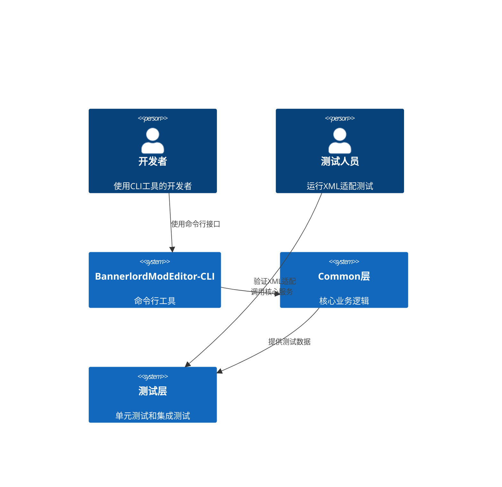
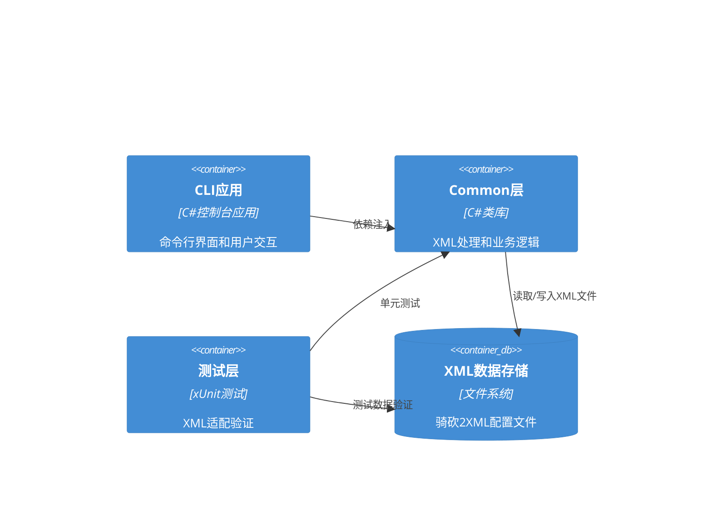
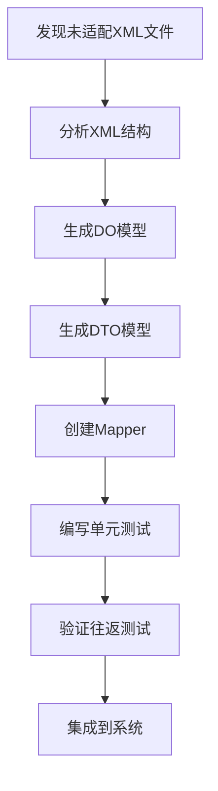
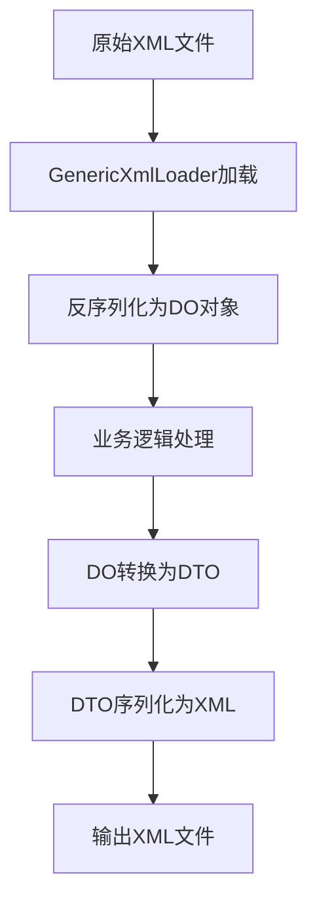
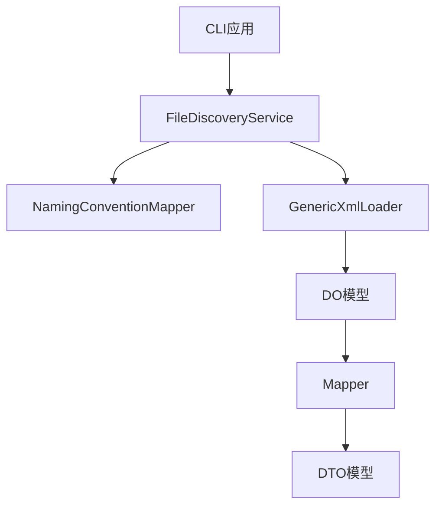
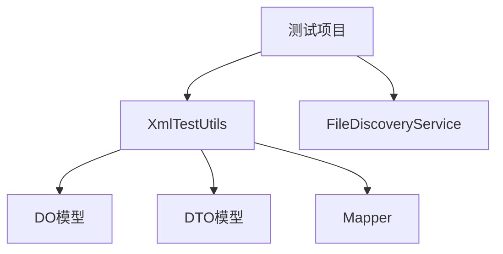
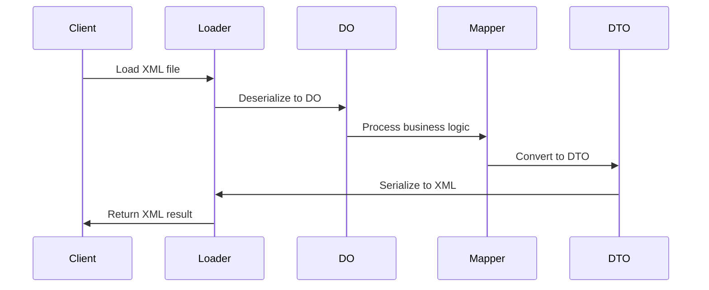
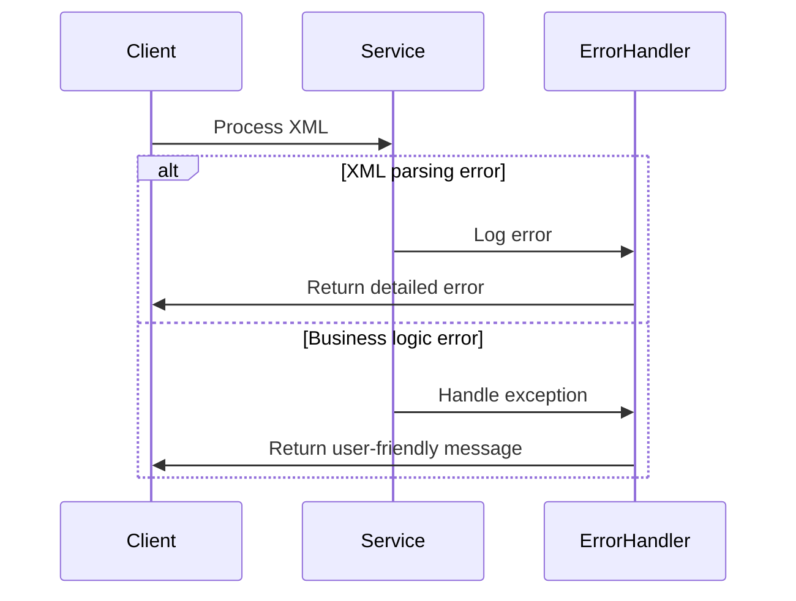

# 系统架构设计文档

## 执行摘要

本文档为BannerlordModEditor-CLI项目的XML映射适配工作设计系统架构。该架构基于现有的DO/DTO模式，旨在解决XML序列化往返测试失败的问题，并支持未来XML类型的扩展适配。

## 架构概述

### 系统上下文



### 容器架构



## DO/DTO架构模式设计

### 架构层次结构

```
BannerlordModEditor.Common/
├── Models/
│   ├── DO/                    # 领域对象层
│   │   ├── Audio/            # 音频相关
│   │   ├── Configuration/    # 配置相关
│   │   ├── Data/             # 数据定义
│   │   ├── Engine/           # 游戏引擎
│   │   ├── Game/             # 游戏机制
│   │   ├── Layouts/          # 布局相关
│   │   └── ...               # 其他功能域
│   ├── DTO/                   # 数据传输对象层
│   │   ├── AudioDTO/         # 音频相关DTO
│   │   ├── ConfigurationDTO/ # 配置相关DTO
│   │   ├── DataDTO/          # 数据定义DTO
│   │   ├── EngineDTO/        # 游戏引擎DTO
│   │   ├── GameDTO/          # 游戏机制DTO
│   │   ├── LayoutsDTO/       # 布局相关DTO
│   │   └── ...               # 其他功能域DTO
│   └── Data/                  # 原始数据模型（兼容性）
│       ├── Audio.cs
│       ├── Configuration.cs
│       └── ...
├── Mappers/                   # 对象映射器
│   ├── AudioMapper.cs
│   ├── ConfigurationMapper.cs
│   └── ...
└── Loaders/                   # XML加载器
    ├── GenericXmlLoader.cs
    └── EnhancedXmlLoader.cs
```

### DO层设计原则

#### 1. 精确序列化控制
```csharp
[XmlRoot("base")]
public class CombatParametersDO
{
    [XmlAttribute("type")]
    public string? Type { get; set; }

    [XmlElement("definitions")]
    public DefinitionsDO Definitions { get; set; } = new DefinitionsDO();
    
    // 标记是否应该序列化definitions元素
    [XmlIgnore]
    public bool HasDefinitions { get; set; } = false;
    
    // 精确控制序列化行为
    public bool ShouldSerializeType() => !string.IsNullOrEmpty(Type);
    public bool ShouldSerializeDefinitions() => HasDefinitions && Definitions != null && Definitions.Defs.Count > 0;
}
```

#### 2. 空元素处理策略
- **HasEmpty标记**: 使用布尔属性标记是否应该序列化空元素
- **ShouldSerialize方法**: 精确控制每个属性的序列化行为
- **XmlIgnore属性**: 将运行时标记属性排除在序列化之外

#### 3. 类型安全设计
- 使用C# 9.0的可空引用类型
- 所有属性都有适当的null检查
- 集合属性初始化为空集合而非null

### DTO层设计原则

#### 1. 纯数据结构
```csharp
public class CombatParametersDTO
{
    [XmlAttribute("type")]
    public string? Type { get; set; }

    [XmlElement("definitions")]
    public DefinitionsDTO? Definitions { get; set; }

    [XmlArray("combat_parameters")]
    [XmlArrayItem("combat_parameter")]
    public List<BaseCombatParameterDTO>? CombatParametersList { get; set; }
}
```

#### 2. 序列化优化
- 移除业务逻辑，仅保留数据结构
- 保持与DO层相同的XML属性配置
- 简化属性访问器，移除验证逻辑

### Mapper层设计模式

#### 1. 双向映射器
```csharp
public static class CombatParametersMapper
{
    #region DO to DTO
    public static CombatParametersDTO ToDTO(CombatParametersDO source)
    {
        if (source == null) return null;
        
        return new CombatParametersDTO
        {
            Type = source.Type,
            Definitions = DefinitionsMapper.ToDTO(source.Definitions),
            CombatParametersList = source.CombatParametersList?
                .Select(ToDTO).ToList() ?? new List<BaseCombatParameterDTO>()
        };
    }
    
    #region DTO to DO
    public static CombatParametersDO ToDO(CombatParametersDTO source)
    {
        if (source == null) return null;
        
        return new CombatParametersDO
        {
            Type = source.Type,
            Definitions = DefinitionsMapper.ToDO(source.Definitions),
            CombatParametersList = source.CombatParametersList?
                .Select(ToDO).ToList() ?? new List<BaseCombatParameterDO>()
        };
    }
}
```

#### 2. 嵌套对象映射
- 支持复杂对象的深度映射
- 处理集合类型的映射
- 空值检查和默认值处理

## XML映射适配系统架构

### 核心组件

#### 1. 文件发现服务
```csharp
public interface IFileDiscoveryService
{
    Task<List<UnadaptedFile>> FindUnadaptedFilesAsync();
    string ConvertToModelName(string xmlFileName);
    bool ModelExists(string modelName, string[] searchDirectories);
    bool IsFileAdapted(string xmlFileName);
}
```

#### 2. 命名约定映射器
```csharp
public static class NamingConventionMapper
{
    // 特殊映射字典
    private static readonly Dictionary<string, string> SpecialMappings = new()
    {
        { "siegeengines", "SiegeEngines" },
        { "special_meshes", "SpecialMeshes" },
        { "water_prefabs", "WaterPrefabs" }
    };
    
    public static string GetMappedClassName(string originalName);
    public static string ConvertToPascalCase(string input);
}
```

#### 3. XML加载器
```csharp
public class GenericXmlLoader<T> where T : class
{
    public T? Load(string filePath);
    public Task<T?> LoadAsync(string filePath);
    public void Save(T data, string filePath, string? originalXml = null);
    public string SaveToString(T data, string? originalXml = null);
}
```

### 数据流和处理流程

#### 1. XML适配流程


#### 2. XML处理流程


### 组件间交互关系

#### 1. 服务依赖关系


#### 2. 测试集成关系


## 数据架构

### 数据模型设计

#### 1. 功能域分类
- **Audio**: 音频相关配置
- **Configuration**: 游戏配置
- **Data**: 数据定义
- **Engine**: 游戏引擎参数
- **Game**: 游戏机制
- **Layouts**: 布局相关
- **Multiplayer**: 多人游戏

#### 2. 命名空间策略
```csharp
namespace BannerlordModEditor.Common.Models.DO.Audio
{
    public class ModuleSoundsDO { ... }
}

namespace BannerlordModEditor.Common.Models.DO.Engine
{
    public class PhysicsMaterialsDO { ... }
}
```

### 数据流设计

#### 1. XML往返流程


#### 2. 错误处理流程


## 安全架构

### 数据验证

#### 1. 输入验证
- XML文件格式验证
- 必需字段存在性检查
- 数据类型和范围验证

#### 2. 输出验证
- 序列化结果完整性检查
- XML结构一致性验证
- 往返测试自动化

### 异常处理

#### 1. 分层异常处理
```csharp
public class XmlProcessingException : Exception
{
    public string XmlFileName { get; }
    public ExceptionType ExceptionType { get; }
    
    public XmlProcessingException(string message, string xmlFileName, ExceptionType type)
        : base(message)
    {
        XmlFileName = xmlFileName;
        ExceptionType = type;
    }
}
```

#### 2. 错误恢复机制
- 自动重试机制
- 回退到原始XML
- 部分成功处理

## 性能优化策略

### 内存管理

#### 1. 大文件处理
- 流式XML处理
- 分块加载机制
- 内存使用监控

#### 2. 缓存策略
- 映射器实例缓存
- XML解析结果缓存
- 文件系统缓存

### 并发处理

#### 1. 异步操作
- 异步文件I/O
- 并行XML处理
- 非阻塞UI更新

#### 2. 资源管理
- 连接池管理
- 文件句柄管理
- 内存回收策略

## 可扩展性设计

### 插件架构

#### 1. 新XML类型适配
- 标准化的适配流程
- 自动化代码生成
- 模板化实现

#### 2. 自定义映射器
- 可配置的映射规则
- 用户自定义转换逻辑
- 扩展点设计

### 未来扩展

#### 1. 支持更多游戏版本
- 版本兼容性层
- 配置驱动的适配
- 自动版本检测

#### 2. 集成开发环境
- Visual Studio插件
- 实时XML验证
- 智能代码补全

## 监控和日志

### 性能监控

#### 1. 关键指标
- XML处理时间
- 内存使用量
- 错误率统计

#### 2. 实时监控
- 性能计数器
- 内存使用跟踪
- 异常频率监控

### 日志系统

#### 1. 结构化日志
```csharp
public class XmlProcessingLog
{
    public DateTime Timestamp { get; set; }
    public string Operation { get; set; }
    public string FileName { get; set; }
    public TimeSpan Duration { get; set; }
    public bool Success { get; set; }
    public string? ErrorMessage { get; set; }
}
```

#### 2. 日志级别
- DEBUG: 详细处理信息
- INFO: 关键操作记录
- WARN: 潜在问题警告
- ERROR: 错误和异常

## 架构决策记录 (ADRs)

### ADR-001: 采用DO/DTO架构模式
**状态**: 已接受
**上下文**: XML序列化往返测试失败，需要精确控制序列化行为
**决策**: 使用DO/DTO模式分离业务逻辑和数据表示
**后果**: 提高了代码可维护性，增加了开发复杂度

### ADR-002: 按功能域组织命名空间
**状态**: 已接受
**上下文**: 避免单一巨大命名空间，提高代码组织性
**决策**: 按照游戏功能域划分命名空间
**后果**: 提高了代码可读性，增加了文件层次结构

### ADR-003: 使用ShouldSerialize方法控制序列化
**状态**: 已接受
**上下文**: 需要精确控制XML元素的序列化行为
**决策**: 使用ShouldSerialize模式而不是条件序列化
**后果**: 提供了更细粒度的控制，增加了代码量

## 总结

本架构设计基于现有的DO/DTO模式，提供了完整的XML映射适配解决方案。该架构具有以下特点：

1. **关注点分离**: 业务逻辑与数据表示完全分离
2. **精确控制**: 对XML序列化行为进行细粒度控制
3. **可扩展性**: 支持新XML类型的标准化适配流程
4. **高性能**: 优化内存使用和并发处理
5. **可维护性**: 清晰的代码结构和完整的文档

该架构能够有效解决XML序列化往返测试失败的问题，并为未来的功能扩展提供了坚实的基础。