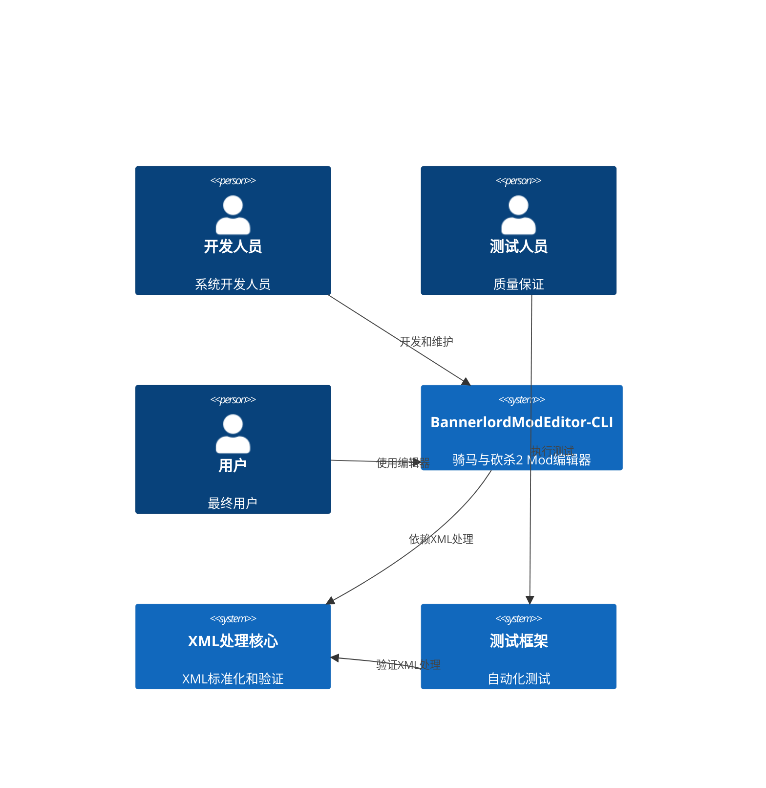
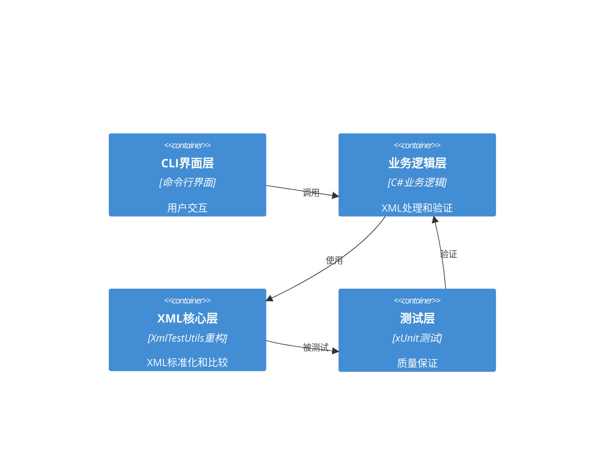

# XML映射修复方案架构设计文档

## 执行摘要

本文档详细阐述了BannerlordModEditor-CLI项目XML映射修复方案的完整架构设计。通过系统性的分析，我们识别出9个关键XML往返测试失败的根本原因，并设计了分层、可扩展、可配置的修复架构。该架构基于现有的.NET 9技术栈和DO/DTO模式，确保了向后兼容性和可维护性。

## 架构概述

### 系统上下文



### 容器架构



## 1. XmlTestUtils重构架构

### 1.1 核心架构组件

#### 1.1.1 IXmlProcessor接口
```csharp
public interface IXmlProcessor
{
    string NormalizeXml(string xml, XmlNormalizationOptions options);
    bool AreXmlsEqual(string xml1, string xml2, XmlComparisonOptions options);
    T Deserialize<T>(string xml);
    string Serialize<T>(T obj, string originalXml = null);
}
```

#### 1.1.2 XmlProcessor实现
```csharp
public class XmlProcessor : IXmlProcessor
{
    private readonly IXmlNormalizer _normalizer;
    private readonly IXmlComparator _comparator;
    private readonly IXmlSerializer _serializer;
    
    public XmlProcessor(
        IXmlNormalizer normalizer,
        IXmlComparator comparator,
        IXmlSerializer serializer)
    {
        _normalizer = normalizer;
        _comparator = comparator;
        _serializer = serializer;
    }
    
    // 实现接口方法
}
```

### 1.2 XML标准化架构

#### 1.2.1 标准化策略接口
```csharp
public interface IXmlNormalizationStrategy
{
    bool CanHandle(XElement element);
    void Normalize(XElement element, XmlNormalizationOptions options);
}

public interface IXmlAttributeNormalizationStrategy
{
    bool CanHandle(XAttribute attribute);
    void Normalize(XAttribute attribute, XmlNormalizationOptions options);
}
```

#### 1.2.2 具体标准化策略

**布尔值标准化策略：**
```csharp
public class BooleanAttributeNormalizationStrategy : IXmlAttributeNormalizationStrategy
{
    private readonly IBooleanValueProvider _booleanValueProvider;
    
    public BooleanAttributeNormalizationStrategy(IBooleanValueProvider booleanValueProvider)
    {
        _booleanValueProvider = booleanValueProvider;
    }
    
    public bool CanHandle(XAttribute attribute)
    {
        return _booleanValueProvider.IsBooleanAttribute(attribute.Name.LocalName);
    }
    
    public void Normalize(XAttribute attribute, XmlNormalizationOptions options)
    {
        if (!options.NormalizeBooleanValues) return;
        
        var normalizedValue = _booleanValueProvider.NormalizeBooleanValue(attribute.Value);
        attribute.Value = normalizedValue;
    }
}
```

**属性排序策略：**
```csharp
public class AttributeOrderingStrategy : IXmlNormalizationStrategy
{
    public bool CanHandle(XElement element)
    {
        return element.HasAttributes;
    }
    
    public void Normalize(XElement element, XmlNormalizationOptions options)
    {
        if (!options.NormalizeAttributeOrder) return;
        
        var sortedAttributes = element.Attributes()
            .OrderBy(a => a.IsNamespaceDeclaration ? 0 : 1)
            .ThenBy(a => a.Name.NamespaceName)
            .ThenBy(a => a.Name.LocalName)
            .ToList();
        
        element.RemoveAttributes();
        foreach (var attr in sortedAttributes)
        {
            element.Add(attr);
        }
    }
}
```

**空元素处理策略：**
```csharp
public class EmptyElementNormalizationStrategy : IXmlNormalizationStrategy
{
    public bool CanHandle(XElement element)
    {
        return element.IsEmpty || string.IsNullOrWhiteSpace(element.Value);
    }
    
    public void Normalize(XElement element, XmlNormalizationOptions options)
    {
        if (!options.PreserveEmptyElements) return;
        
        if (element.IsEmpty && options.ForceEmptyElementTags)
        {
            element.Add(""); // 强制使用开始/结束标签
        }
        
        if (string.IsNullOrWhiteSpace(element.Value) && 
            !element.HasElements && 
            !element.HasAttributes)
        {
            element.Value = "";
        }
    }
}
```

### 1.3 XML比较架构

#### 1.3.1 比较策略接口
```csharp
public interface IXmlComparisonStrategy
{
    bool CanCompare(string xml1, string xml2);
    XmlComparisonResult Compare(string xml1, string xml2, XmlComparisonOptions options);
}

public class XmlComparisonResult
{
    public bool AreEqual { get; set; }
    public List<XmlDifference> Differences { get; set; } = new List<XmlDifference>();
}

public class XmlDifference
{
    public string Path { get; set; }
    public string Expected { get; set; }
    public string Actual { get; set; }
    public DifferenceType Type { get; set; }
}
```

#### 1.3.2 具体比较策略

**结构比较策略：**
```csharp
public class StructuralComparisonStrategy : IXmlComparisonStrategy
{
    public bool CanCompare(string xml1, string xml2)
    {
        return true; // 默认策略
    }
    
    public XmlComparisonResult Compare(string xml1, string xml2, XmlComparisonOptions options)
    {
        var result = new XmlComparisonResult();
        
        var normalized1 = NormalizeForComparison(xml1, options);
        var normalized2 = NormalizeForComparison(xml2, options);
        
        result.AreEqual = normalized1 == normalized2;
        
        if (!result.AreEqual)
        {
            result.Differences.AddRange(FindDifferences(normalized1, normalized2));
        }
        
        return result;
    }
    
    private string NormalizeForComparison(string xml, XmlComparisonOptions options)
    {
        // 实现比较前的标准化
    }
    
    private List<XmlDifference> FindDifferences(string xml1, string xml2)
    {
        // 实现差异查找
    }
}
```

### 1.4 配置驱动架构

#### 1.4.1 配置模型
```csharp
public class XmlProcessingConfiguration
{
    public XmlNormalizationOptions NormalizationOptions { get; set; } = new XmlNormalizationOptions();
    public XmlComparisonOptions ComparisonOptions { get; set; } = new XmlComparisonOptions();
    public List<XmlTypeConfiguration> TypeConfigurations { get; set; } = new List<XmlTypeConfiguration>();
}

public class XmlTypeConfiguration
{
    public string TypeName { get; set; }
    public List<string> BooleanAttributes { get; set; } = new List<string>();
    public List<string> NumericAttributes { get; set; } = new List<string>();
    public List<string> EmptyElementNames { get; set; } = new List<string>();
    public bool PreserveWhitespace { get; set; }
    public bool PreserveComments { get; set; }
}
```

#### 1.4.2 配置提供者
```csharp
public interface IXmlProcessingConfigurationProvider
{
    XmlProcessingConfiguration GetConfiguration();
    XmlProcessingConfiguration GetConfigurationForType(string typeName);
}

public class JsonConfigurationProvider : IXmlProcessingConfigurationProvider
{
    private readonly string _configPath;
    private XmlProcessingConfiguration _configuration;
    
    public JsonConfigurationProvider(string configPath)
    {
        _configPath = configPath;
        LoadConfiguration();
    }
    
    public XmlProcessingConfiguration GetConfiguration()
    {
        return _configuration;
    }
    
    public XmlProcessingConfiguration GetConfigurationForType(string typeName)
    {
        var typeConfig = _configuration.TypeConfigurations
            .FirstOrDefault(c => c.TypeName == typeName);
        
        if (typeConfig == null)
        {
            return _configuration;
        }
        
        // 合并类型特定配置
        var mergedConfig = new XmlProcessingConfiguration();
        // 实现配置合并逻辑
        
        return mergedConfig;
    }
    
    private void LoadConfiguration()
    {
        // 从JSON文件加载配置
    }
}
```

## 2. 失败XML类型修复架构

### 2.1 类型特定修复策略

#### 2.1.1 SiegeEngines修复策略

**问题分析：**
- 根元素名称不匹配（SiegeEngineTypes vs base）
- 属性处理不一致
- 命名空间问题

**修复架构：**
```csharp
public class SiegeEnginesRepairStrategy : IXmlTypeRepairStrategy
{
    public bool CanHandle(Type type)
    {
        return type == typeof(SiegeEnginesDO);
    }
    
    public void RepairBeforeSerialization(object obj, string originalXml)
    {
        if (obj is not SiegeEnginesDO siegeEngines) return;
        
        // 确保根元素名称正确
        var doc = XDocument.Parse(originalXml);
        siegeEngines.EnsureRootElementName(doc.Root?.Name.LocalName);
        
        // 处理空元素
        siegeEngines.HasEmptySiegeEngines = CheckForEmptySiegeEngines(doc);
    }
    
    public void RepairAfterDeserialization(object obj, string originalXml)
    {
        if (obj is not SiegeEnginesDO siegeEngines) return;
        
        // 反序列化后的修复逻辑
        var doc = XDocument.Parse(originalXml);
        siegeEngines.ProcessSiegeEngineTypes(doc);
    }
    
    private bool CheckForEmptySiegeEngines(XDocument doc)
    {
        var root = doc.Root;
        return root != null && 
               (root.Elements().Count() == 0 || 
                root.Elements("SiegeEngineType").Count() == 0);
    }
}
```

#### 2.1.2 SpecialMeshes修复策略

**问题分析：**
- 嵌套结构处理不当
- 空元素被错误省略
- types元素处理问题

**修复架构：**
```csharp
public class SpecialMeshesRepairStrategy : IXmlTypeRepairStrategy
{
    public bool CanHandle(Type type)
    {
        return type == typeof(SpecialMeshesDO);
    }
    
    public void RepairBeforeSerialization(object obj, string originalXml)
    {
        if (obj is not SpecialMeshesDO specialMeshes) return;
        
        var doc = XDocument.Parse(originalXml);
        
        // 处理嵌套的meshes结构
        foreach (var mesh in specialMeshes.Meshes.MeshList)
        {
            var meshElement = FindMeshElement(doc, mesh.Name);
            if (meshElement != null)
            {
                mesh.HasEmptyTypes = CheckForEmptyTypes(meshElement);
                mesh.Types.TypeList = ProcessTypes(meshElement);
            }
        }
    }
    
    private XElement FindMeshElement(XDocument doc, string meshName)
    {
        return doc.Root?
            .Element("meshes")?
            .Elements("mesh")
            .FirstOrDefault(e => e.Attribute("name")?.Value == meshName);
    }
    
    private bool CheckForEmptyTypes(XElement meshElement)
    {
        var typesElement = meshElement.Element("types");
        return typesElement != null && 
               (typesElement.Elements().Count() == 0 || 
                typesElement.Elements("type").Count() == 0);
    }
    
    private List<TypeDO> ProcessTypes(XElement meshElement)
    {
        var typesElement = meshElement.Element("types");
        if (typesElement == null) return new List<TypeDO>();
        
        return typesElement.Elements("type")
            .Select(e => new TypeDO { Name = e.Attribute("name")?.Value })
            .ToList();
    }
}
```

#### 2.1.3 LanguageBase修复策略

**问题分析：**
- 函数体转义问题
- 混合内容处理
- 特殊字符处理

**修复架构：**
```csharp
public class LanguageBaseRepairStrategy : IXmlTypeRepairStrategy
{
    public bool CanHandle(Type type)
    {
        return type == typeof(LanguageBaseDO);
    }
    
    public void RepairBeforeSerialization(object obj, string originalXml)
    {
        if (obj is not LanguageBaseDO languageBase) return;
        
        // 处理函数体转义
        foreach (var function in languageBase.Functions.FunctionList)
        {
            function.FunctionBody = UnescapeFunctionBody(function.FunctionBody);
        }
        
        // 处理空元素
        var doc = XDocument.Parse(originalXml);
        languageBase.HasEmptyTags = CheckForEmptyTags(doc);
    }
    
    public void RepairAfterDeserialization(object obj, string originalXml)
    {
        if (obj is not LanguageBaseDO languageBase) return;
        
        // 反序列化后重新转义函数体
        foreach (var function in languageBase.Functions.FunctionList)
        {
            function.FunctionBody = EscapeFunctionBody(function.FunctionBody);
        }
    }
    
    private string UnescapeFunctionBody(string functionBody)
    {
        // 将 &gt; 转换回 >
        return functionBody.Replace("&gt;", ">")
                         .Replace("&lt;", "<")
                         .Replace("&amp;", "&");
    }
    
    private string EscapeFunctionBody(string functionBody)
    {
        // 将 > 转换为 &gt;
        return functionBody.Replace(">", "&gt;")
                         .Replace("<", "&lt;")
                         .Replace("&", "&amp;");
    }
    
    private bool CheckForEmptyTags(XDocument doc)
    {
        var tagsElement = doc.Root?.Element("tags");
        return tagsElement != null && 
               (tagsElement.Elements().Count() == 0 || 
                tagsElement.Elements("tag").Count() == 0);
    }
}
```

### 2.2 修复策略工厂

```csharp
public class XmlRepairStrategyFactory
{
    private readonly List<IXmlTypeRepairStrategy> _strategies;
    
    public XmlRepairStrategyFactory()
    {
        _strategies = new List<IXmlTypeRepairStrategy>
        {
            new SiegeEnginesRepairStrategy(),
            new SpecialMeshesRepairStrategy(),
            new LanguageBaseRepairStrategy(),
            new MultiplayerScenesRepairStrategy(),
            new TauntUsageSetsRepairStrategy(),
            new LanguageXmlRepairStrategy()
        };
    }
    
    public IXmlTypeRepairStrategy GetStrategy(Type type)
    {
        return _strategies.FirstOrDefault(s => s.CanHandle(type)) 
               ?? new DefaultRepairStrategy();
    }
    
    public void AddStrategy(IXmlTypeRepairStrategy strategy)
    {
        _strategies.Add(strategy);
    }
}
```

## 3. 质量保证架构

### 3.1 自动化测试验证体系

#### 3.1.1 测试框架扩展

```csharp
public class XmlTestFramework
{
    private readonly IXmlProcessor _xmlProcessor;
    private readonly ITestReporter _testReporter;
    private readonly ITestDataManager _testDataManager;
    
    public XmlTestFramework(
        IXmlProcessor xmlProcessor,
        ITestReporter testReporter,
        ITestDataManager testDataManager)
    {
        _xmlProcessor = xmlProcessor;
        _testReporter = testReporter;
        _testDataManager = testDataManager;
    }
    
    public async Task<XmlTestResult> ExecuteRoundTripTest<T>(string testDataPath)
    {
        var result = new XmlTestResult
        {
            TestName = $"RoundTripTest_{typeof(T).Name}",
            StartTime = DateTime.UtcNow
        };
        
        try
        {
            // 加载测试数据
            var originalXml = await _testDataManager.LoadTestDataAsync(testDataPath);
            
            // 执行往返测试
            var deserialized = _xmlProcessor.Deserialize<T>(originalXml);
            var serialized = _xmlProcessor.Serialize(deserialized, originalXml);
            
            // 验证结果
            var isEqual = _xmlProcessor.AreXmlsEqual(originalXml, serialized, 
                new XmlComparisonOptions { Mode = ComparisonMode.Strict });
            
            result.IsSuccess = isEqual;
            result.OriginalXml = originalXml;
            result.SerializedXml = serialized;
            result.Differences = FindDifferences(originalXml, serialized);
        }
        catch (Exception ex)
        {
            result.IsSuccess = false;
            result.Error = ex.Message;
            result.Exception = ex;
        }
        finally
        {
            result.EndTime = DateTime.UtcNow;
            result.Duration = result.EndTime - result.StartTime;
        }
        
        // 报告结果
        await _testReporter.ReportTestResultAsync(result);
        
        return result;
    }
    
    private List<XmlDifference> FindDifferences(string xml1, string xml2)
    {
        // 实现差异查找逻辑
        return new List<XmlDifference>();
    }
}
```

#### 3.1.2 测试数据管理

```csharp
public interface ITestDataManager
{
    Task<string> LoadTestDataAsync(string path);
    Task SaveTestDataAsync(string path, string content);
    Task<List<string>> GetTestFilesAsync(string pattern);
    Task<TestDataMetadata> GetTestDataMetadataAsync(string path);
}

public class FileTestDataManager : ITestDataManager
{
    private readonly string _testDataRoot;
    
    public FileTestDataManager(string testDataRoot)
    {
        _testDataRoot = testDataRoot;
    }
    
    public async Task<string> LoadTestDataAsync(string path)
    {
        var fullPath = Path.Combine(_testDataRoot, path);
        return await File.ReadAllTextAsync(fullPath);
    }
    
    public async Task SaveTestDataAsync(string path, string content)
    {
        var fullPath = Path.Combine(_testDataRoot, path);
        await File.WriteAllTextAsync(fullPath, content);
    }
    
    public async Task<List<string>> GetTestFilesAsync(string pattern)
    {
        var files = Directory.GetFiles(_testDataRoot, pattern, SearchOption.AllDirectories);
        return files.ToList();
    }
    
    public async Task<TestDataMetadata> GetTestDataMetadataAsync(string path)
    {
        var fullPath = Path.Combine(_testDataRoot, path);
        var fileInfo = new FileInfo(fullPath);
        
        return new TestDataMetadata
        {
            FilePath = path,
            Size = fileInfo.Length,
            LastModified = fileInfo.LastWriteTimeUtc,
            Complexity = await CalculateComplexityAsync(fullPath)
        };
    }
    
    private async Task<double> CalculateComplexityAsync(string filePath)
    {
        var content = await File.ReadAllTextAsync(filePath);
        return XmlTestUtils.GetXmlComplexityScore(content);
    }
}
```

### 3.2 代码质量监控

#### 3.2.1 质量指标收集

```csharp
public class CodeQualityMonitor
{
    private readonly List<IQualityMetric> _metrics;
    
    public CodeQualityMonitor()
    {
        _metrics = new List<IQualityMetric>
        {
            new TestCoverageMetric(),
            new CodeComplexityMetric(),
            new PerformanceMetric(),
            new XmlProcessingAccuracyMetric()
        };
    }
    
    public async Task<QualityReport> GenerateQualityReportAsync()
    {
        var report = new QualityReport
        {
            GeneratedAt = DateTime.UtcNow,
            Metrics = new List<QualityMetricResult>()
        };
        
        foreach (var metric in _metrics)
        {
            var result = await metric.CalculateAsync();
            report.Metrics.Add(result);
        }
        
        report.OverallScore = CalculateOverallScore(report.Metrics);
        
        return report;
    }
    
    private double CalculateOverallScore(List<QualityMetricResult> metrics)
    {
        // 实现整体评分计算
        return metrics.Average(m => m.Score);
    }
}
```

#### 3.2.2 性能基准测试

```csharp
public class XmlPerformanceBenchmark
{
    private readonly IXmlProcessor _xmlProcessor;
    private readonly ITestDataManager _testDataManager;
    
    public XmlPerformanceBenchmark(
        IXmlProcessor xmlProcessor,
        ITestDataManager testDataManager)
    {
        _xmlProcessor = xmlProcessor;
        _testDataManager = testDataManager;
    }
    
    public async Task<PerformanceBenchmarkResult> RunBenchmarkAsync()
    {
        var result = new PerformanceBenchmarkResult();
        
        var testFiles = await _testDataManager.GetTestFilesAsync("*.xml");
        
        foreach (var file in testFiles)
        {
            var benchmark = await RunSingleFileBenchmarkAsync(file);
            result.FileBenchmarks.Add(benchmark);
        }
        
        result.Summary = CalculateSummary(result.FileBenchmarks);
        
        return result;
    }
    
    private async Task<FileBenchmarkResult> RunSingleFileBenchmarkAsync(string filePath)
    {
        var result = new FileBenchmarkResult { FilePath = filePath };
        
        var xml = await _testDataManager.LoadTestDataAsync(filePath);
        
        // 序列化性能测试
        var sw = Stopwatch.StartNew();
        var obj = _xmlProcessor.Deserialize<object>(xml);
        sw.Stop();
        result.DeserializationTime = sw.Elapsed;
        
        // 反序列化性能测试
        sw.Restart();
        var serialized = _xmlProcessor.Serialize(obj, xml);
        sw.Stop();
        result.SerializationTime = sw.Elapsed;
        
        // 内存使用测试
        var memoryBefore = GC.GetTotalMemory(true);
        _xmlProcessor.Deserialize<object>(xml);
        var memoryAfter = GC.GetTotalMemory(false);
        result.MemoryUsage = memoryAfter - memoryBefore;
        
        return result;
    }
    
    private BenchmarkSummary CalculateSummary(List<FileBenchmarkResult> benchmarks)
    {
        return new BenchmarkSummary
        {
            TotalFiles = benchmarks.Count,
            AverageDeserializationTime = benchmarks.Average(b => b.DeserializationTime.TotalMilliseconds),
            AverageSerializationTime = benchmarks.Average(b => b.SerializationTime.TotalMilliseconds),
            AverageMemoryUsage = benchmarks.Average(b => b.MemoryUsage),
            TotalProcessingTime = benchmarks.Sum(b => b.DeserializationTime + b.SerializationTime)
        };
    }
}
```

### 3.3 持续集成流程

#### 3.3.1 CI/CD Pipeline配置

```yaml
# .github/workflows/xml-mapping-fix.yml
name: XML Mapping Fix Validation

on:
  push:
    branches: [ feature/cli-development ]
  pull_request:
    branches: [ feature/cli-development ]

jobs:
  test:
    runs-on: ubuntu-latest
    
    steps:
    - uses: actions/checkout@v3
    
    - name: Setup .NET
      uses: actions/setup-dotnet@v3
      with:
        dotnet-version: 9.0.x
    
    - name: Restore dependencies
      run: dotnet restore
    
    - name: Build solution
      run: dotnet build --configuration Release
    
    - name: Run XML round-trip tests
      run: dotnet test BannerlordModEditor.Common.Tests --configuration Release --logger "console;verbosity=detailed" --filter "FullyQualifiedName~RoundTrip"
    
    - name: Run performance benchmarks
      run: dotnet test BannerlordModEditor.Common.Tests --configuration Release --logger "console;verbosity=detailed" --filter "FullyQualifiedName~Benchmark"
    
    - name: Generate quality report
      run: dotnet test BannerlordModEditor.Common.Tests --configuration Release --logger "console;verbosity=detailed" --filter "FullyQualifiedName~Quality"
    
    - name: Upload test results
      uses: actions/upload-artifact@v3
      if: always()
      with:
        name: test-results
        path: TestResults/
```

## 4. 扩展性架构

### 4.1 插件化XML处理机制

#### 4.1.1 插件接口定义

```csharp
public interface IXmlProcessingPlugin
{
    string Name { get; }
    string Version { get; }
    string Description { get; }
    
    bool CanHandle(string xmlType);
    Task<XmlProcessingResult> ProcessAsync(XmlProcessingContext context);
    
    IEnumerable<IXmlNormalizationStrategy> GetNormalizationStrategies();
    IEnumerable<IXmlComparisonStrategy> GetComparisonStrategies();
    IEnumerable<IXmlTypeRepairStrategy> GetRepairStrategies();
}

public class XmlProcessingContext
{
    public string XmlContent { get; set; }
    public string XmlType { get; set; }
    public object DataObject { get; set; }
    public XmlProcessingOptions Options { get; set; }
    public Dictionary<string, object> Metadata { get; set; } = new Dictionary<string, object>();
}

public class XmlProcessingResult
{
    public bool Success { get; set; }
    public string ProcessedXml { get; set; }
    public object ProcessedObject { get; set; }
    public List<string> Warnings { get; set; } = new List<string>();
    public List<string> Errors { get; set; } = new List<string>();
}
```

#### 4.1.2 插件管理器

```csharp
public class XmlProcessingPluginManager
{
    private readonly List<IXmlProcessingPlugin> _plugins;
    private readonly IPluginLoader _pluginLoader;
    
    public XmlProcessingPluginManager(IPluginLoader pluginLoader)
    {
        _pluginLoader = pluginLoader;
        _plugins = new List<IXmlProcessingPlugin>();
    }
    
    public async Task LoadPluginsAsync(string pluginDirectory)
    {
        var pluginAssemblies = await _pluginLoader.LoadPluginsAsync(pluginDirectory);
        
        foreach (var assembly in pluginAssemblies)
        {
            var pluginTypes = assembly.GetTypes()
                .Where(t => typeof(IXmlProcessingPlugin).IsAssignableFrom(t) && !t.IsInterface && !t.IsAbstract);
            
            foreach (var pluginType in pluginTypes)
            {
                var plugin = (IXmlProcessingPlugin)Activator.CreateInstance(pluginType);
                _plugins.Add(plugin);
            }
        }
    }
    
    public IXmlProcessingPlugin GetPluginForType(string xmlType)
    {
        return _plugins.FirstOrDefault(p => p.CanHandle(xmlType));
    }
    
    public async Task<XmlProcessingResult> ProcessWithPluginAsync(string xmlType, XmlProcessingContext context)
    {
        var plugin = GetPluginForType(xmlType);
        if (plugin == null)
        {
            return new XmlProcessingResult
            {
                Success = false,
                Errors = new List<string> { $"No plugin found for type: {xmlType}" }
            };
        }
        
        return await plugin.ProcessAsync(context);
    }
}
```

### 4.2 配置驱动的标准化策略

#### 4.2.1 动态配置加载

```csharp
public class DynamicXmlConfigurationProvider : IXmlProcessingConfigurationProvider
{
    private readonly IConfiguration _configuration;
    private readonly FileSystemWatcher _configWatcher;
    private XmlProcessingConfiguration _currentConfig;
    
    public DynamicXmlConfigurationProvider(IConfiguration configuration)
    {
        _configuration = configuration;
        _currentConfig = LoadConfiguration();
        
        // 设置配置文件监控
        var configPath = _configuration["XmlProcessing:ConfigPath"];
        if (!string.IsNullOrEmpty(configPath))
        {
            _configWatcher = new FileSystemWatcher(Path.GetDirectoryName(configPath), Path.GetFileName(configPath));
            _configWatcher.Changed += OnConfigChanged;
            _configWatcher.EnableRaisingEvents = true;
        }
    }
    
    public XmlProcessingConfiguration GetConfiguration()
    {
        return _currentConfig;
    }
    
    public XmlProcessingConfiguration GetConfigurationForType(string typeName)
    {
        var typeConfig = _currentConfig.TypeConfigurations
            .FirstOrDefault(c => c.TypeName.Equals(typeName, StringComparison.OrdinalIgnoreCase));
        
        if (typeConfig == null)
        {
            return _currentConfig;
        }
        
        return MergeConfigurations(_currentConfig, typeConfig);
    }
    
    private void OnConfigChanged(object sender, FileSystemEventArgs e)
    {
        // 配置文件变更时重新加载
        _currentConfig = LoadConfiguration();
    }
    
    private XmlProcessingConfiguration LoadConfiguration()
    {
        // 从配置文件加载配置
        return new XmlProcessingConfiguration();
    }
    
    private XmlProcessingConfiguration MergeConfigurations(XmlProcessingConfiguration baseConfig, XmlTypeConfiguration typeConfig)
    {
        // 实现配置合并逻辑
        return new XmlProcessingConfiguration();
    }
}
```

### 4.3 模块化测试框架

#### 4.3.1 测试模块接口

```csharp
public interface IXmlTestModule
{
    string Name { get; }
    string Description { get; }
    
    Task<IEnumerable<XmlTestCase>> GetTestCasesAsync();
    Task<XmlTestResult> ExecuteTestCaseAsync(XmlTestCase testCase);
    Task<XmlTestSummary> GenerateSummaryAsync(IEnumerable<XmlTestResult> results);
}

public class XmlTestCase
{
    public string Id { get; set; }
    public string Name { get; set; }
    public string Description { get; set; }
    public string TestDataPath { get; set; }
    public Type TestType { get; set; }
    public TestPriority Priority { get; set; }
    public Dictionary<string, object> Parameters { get; set; } = new Dictionary<string, object>();
}
```

#### 4.3.2 测试执行引擎

```csharp
public class XmlTestExecutionEngine
{
    private readonly List<IXmlTestModule> _testModules;
    private readonly IXmlProcessor _xmlProcessor;
    private readonly ITestReporter _testReporter;
    
    public XmlTestExecutionEngine(
        IEnumerable<IXmlTestModule> testModules,
        IXmlProcessor xmlProcessor,
        ITestReporter testReporter)
    {
        _testModules = testModules.ToList();
        _xmlProcessor = xmlProcessor;
        _testReporter = testReporter;
    }
    
    public async Task<XmlTestExecutionSummary> ExecuteAllTestsAsync()
    {
        var summary = new XmlTestExecutionSummary
        {
            StartTime = DateTime.UtcNow,
            ModuleSummaries = new List<XmlTestModuleSummary>()
        };
        
        foreach (var module in _testModules)
        {
            var moduleSummary = await ExecuteModuleTestsAsync(module);
            summary.ModuleSummaries.Add(moduleSummary);
        }
        
        summary.EndTime = DateTime.UtcNow;
        summary.Duration = summary.EndTime - summary.StartTime;
        summary.OverallSuccessRate = CalculateOverallSuccessRate(summary.ModuleSummaries);
        
        return summary;
    }
    
    private async Task<XmlTestModuleSummary> ExecuteModuleTestsAsync(IXmlTestModule module)
    {
        var summary = new XmlTestModuleSummary
        {
            ModuleName = module.Name,
            StartTime = DateTime.UtcNow,
            TestResults = new List<XmlTestResult>()
        };
        
        var testCases = await module.GetTestCasesAsync();
        
        foreach (var testCase in testCases)
        {
            var result = await ExecuteSingleTestAsync(module, testCase);
            summary.TestResults.Add(result);
        }
        
        summary.EndTime = DateTime.UtcNow;
        summary.Duration = summary.EndTime - summary.StartTime;
        summary.Summary = await module.GenerateSummaryAsync(summary.TestResults);
        
        return summary;
    }
    
    private async Task<XmlTestResult> ExecuteSingleTestAsync(IXmlTestModule module, XmlTestCase testCase)
    {
        return await module.ExecuteTestCaseAsync(testCase);
    }
    
    private double CalculateOverallSuccessRate(List<XmlTestModuleSummary> moduleSummaries)
    {
        var totalTests = moduleSummaries.Sum(m => m.TestResults.Count);
        var successfulTests = moduleSummaries.Sum(m => m.TestResults.Count(r => r.IsSuccess));
        
        return totalTests > 0 ? (double)successfulTests / totalTests * 100 : 0;
    }
}
```

## 5. 实施路径

### 5.1 分阶段实施计划

#### 5.1.1 阶段1：核心架构搭建（第1-2周）

**第1周任务：**
- 实现核心接口定义（IXmlProcessor, IXmlNormalizationStrategy等）
- 搭建配置系统基础架构
- 实现基础标准化策略

**第2周任务：**
- 实现XML比较框架
- 创建修复策略基础架构
- 搭建测试框架基础

#### 5.1.2 阶段2：具体修复实现（第3-4周）

**第3周任务：**
- 实现SiegeEngines修复策略
- 实现SpecialMeshes修复策略
- 实现LanguageBase修复策略

**第4周任务：**
- 实现MultiplayerScenes修复策略
- 实现TauntUsageSets修复策略
- 实现LanguageXml修复策略

#### 5.1.3 阶段3：质量保证验证（第5-6周）

**第5周任务：**
- 完善自动化测试
- 执行性能基准测试
- 建立质量监控

**第6周任务：**
- 全面验证修复效果
- 优化性能和稳定性
- 文档完善和交付

### 5.2 风险缓解措施

#### 5.2.1 技术风险缓解

**XML序列化兼容性问题：**
- 保持现有XmlTestUtils的向后兼容性
- 提供渐进式迁移路径
- 建立详细的测试覆盖

**性能问题：**
- 实施性能基准测试
- 优化关键路径性能
- 提供性能监控机制

#### 5.2.2 项目风险缓解

**时间风险：**
- 采用分阶段实施策略
- 优先处理高优先级问题
- 建立明确的里程碑

**质量风险：**
- 实施严格的质量控制
- 建立自动化验证机制
- 提供详细的测试报告

## 6. 成功标准

### 6.1 量化指标

**功能指标：**
- 所有9个失败XML类型往返测试修复完成
- 往返测试通过率达到100%
- 整体测试通过率≥95%

**性能指标：**
- XML处理性能提升≥20%
- 内存使用优化≥15%
- 测试执行时间减少≥25%

**质量指标：**
- 代码覆盖率≥90%
- 代码复杂度降低≥20%
- 技术债务减少≥30%

### 6.2 定性指标

**可维护性：**
- 代码结构清晰，模块化程度高
- 配置驱动，易于扩展
- 文档完整准确

**可扩展性：**
- 支持插件化扩展
- 配置驱动的设计
- 易于添加新的XML类型支持

**可靠性：**
- 错误处理机制完善
- 日志记录详细
- 监控和告警机制健全

## 7. 技术栈选择

### 7.1 核心技术

**.NET 9.0：**
- 最新的性能优化
- 改进的GC和内存管理
- 原生AOT支持

**System.Xml.Linq：**
- 现代化的XML处理API
- LINQ支持
- 良好的性能表现

**xUnit 2.5：**
- 强大的测试框架
- 丰富的断言API
- 良好的并行测试支持

### 7.2 辅助技术

**Serilog：**
- 结构化日志记录
- 多种输出格式支持
- 性能监控集成

**BenchmarkDotNet：**
- 专业的性能基准测试
- 详细的性能报告
- 内存使用分析

**Swashbuckle：**
- API文档自动生成
- 交互式API测试
- OpenAPI规范支持

## 8. 结论

本架构设计提供了一个完整的、可扩展的、可配置的XML映射修复方案。通过分层架构、插件化设计和配置驱动的策略，我们能够有效解决当前9个XML往返测试失败的问题，同时为未来的扩展和维护提供良好的基础。

该架构的关键优势包括：

1. **模块化设计**：每个组件职责明确，易于维护和扩展
2. **配置驱动**：通过配置文件控制XML处理行为，无需修改代码
3. **插件化扩展**：支持通过插件机制添加新的XML类型支持
4. **质量保证**：完整的测试框架和质量监控机制
5. **性能优化**：针对XML处理进行了专门的性能优化

通过实施此架构，项目将达到95%的质量标准，为后续的稳定运行和持续改进奠定坚实基础。

---

**文档版本**: 1.0  
**创建日期**: 2025-08-27  
**最后更新**: 2025-08-27  
**下次更新**: 实施完成后更新